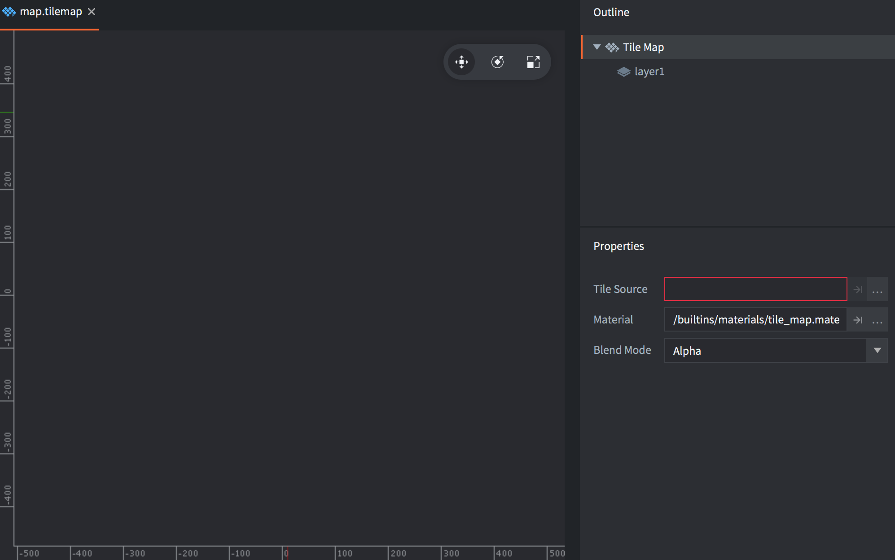
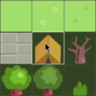
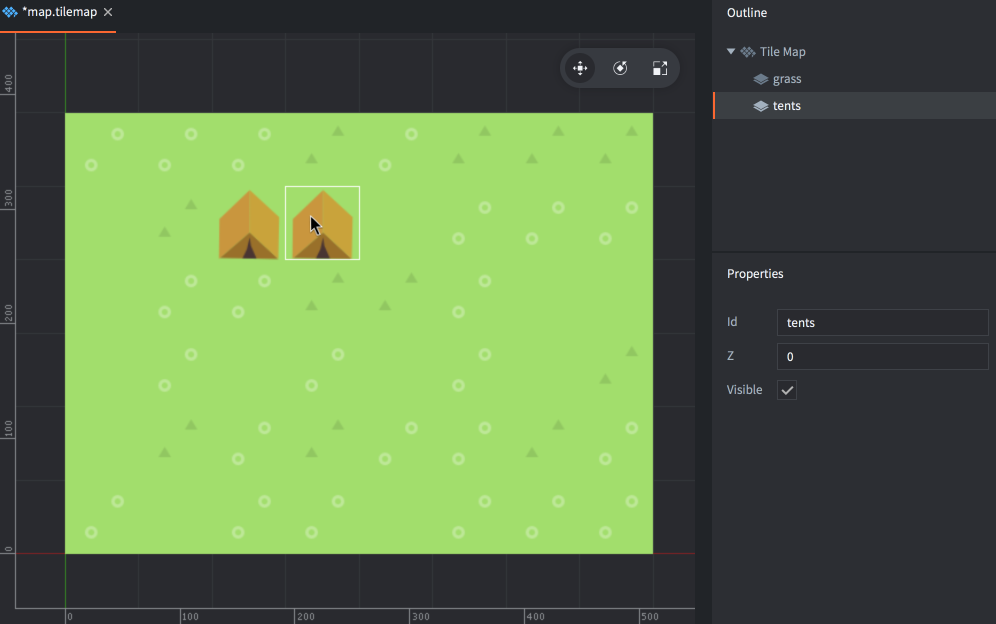
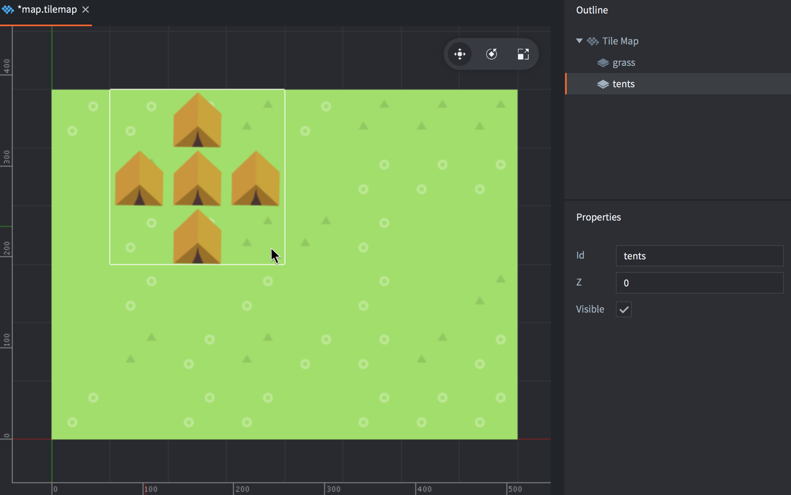
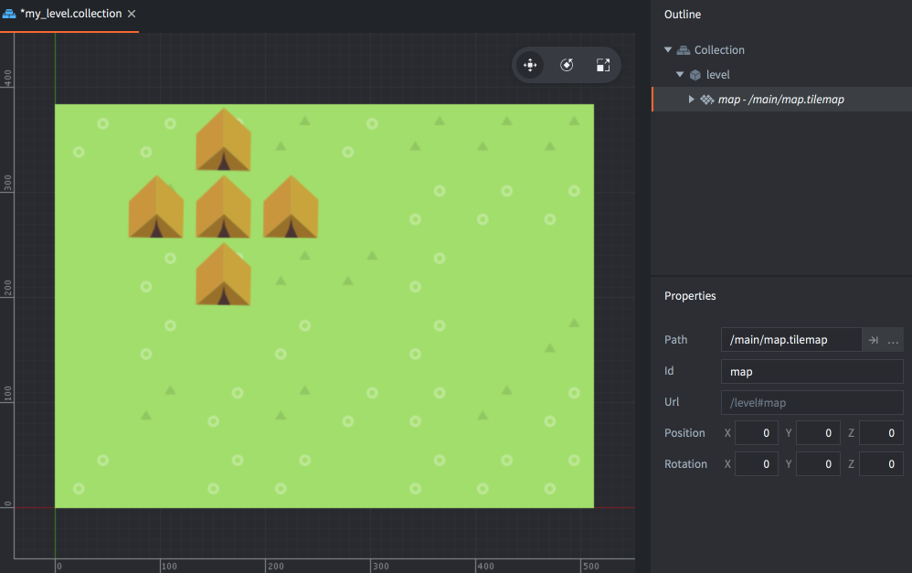

# Mapa kafelków

Mapa kafelków, czyli *Tile Map*, to komponent pozwalający układać albo malować kafelki z *Tile Source* na dużym obszarze siatki. Mapy kafelków są często używane do budowy poziomów w grach. Możesz też korzystać z *Collision Shapes* ze źródła kafelków w swoich mapach do wykrywania kolizji i symulacji fizyki ([przykład](/examples/tilemap/collisions/)).

Zanim utworzysz mapę kafelków, musisz najpierw utworzyć Tile Source. Zajrzyj do [podręcznika Tile Source](/manuals/tilesource), aby dowiedzieć się, jak utworzyć takie źródło.

## Tworzenie mapy kafelków

Aby utworzyć nową mapę kafelków:

- <kbd>Right click</kbd> w wybranym miejscu w przeglądarce *Assets*, a następnie wybierz <kbd>New... ▸ Tile Map</kbd>.
- Nadaj plikowi nazwę.
- Nowa mapa kafelków automatycznie otworzy się w edytorze map kafelków.

  

- Ustaw właściwość *Tile Source* na plik źródła kafelków, który przygotowałeś.

Aby malować kafelki na mapie:

1. Wybierz lub utwórz *Layer* do malowania w widoku *Outline*.
2. Wybierz kafelek, który ma służyć jako pędzel (naciśnij <kbd>Space</kbd>, aby wyświetlić paletę kafelków), albo zaznacz kilka kafelków, przeciągając po palecie, aby utworzyć prostokątny pędzel z wieloma kafelkami.

   

3. Maluj wybranym pędzlem. Aby usunąć kafelek, możesz wybrać pusty kafelek i użyć go jako pędzla albo wybrać gumkę (<kbd>Edit ▸ Select Eraser</kbd>).

   

Możesz też pobierać kafelki bezpośrednio z warstwy i używać zaznaczenia jako pędzla. Przytrzymaj <kbd>Shift</kbd> i kliknij kafelek, aby przejąć go jako aktualny pędzel. Trzymając <kbd>Shift</kbd>, możesz też kliknąć i przeciągnąć, aby zaznaczyć blok kafelków i użyć go jako większego pędzla. Możesz również wycinać kafelki w podobny sposób, przytrzymując <kbd>Shift+Ctrl</kbd>, albo usuwać je, przytrzymując <kbd>Shift+Alt</kbd>.

Aby obrócić pędzel zgodnie z ruchem wskazówek zegara, użyj <kbd>Z</kbd>. <kbd>X</kbd> służy do poziomego odbicia pędzla, a <kbd>Y</kbd> do odbicia pionowego.



## Dodawanie mapy kafelków do gry

Aby dodać mapę kafelków do gry:

1. Utwórz obiekt gry, który będzie zawierał komponent mapy kafelków. Obiekt gry może być zapisany w pliku albo utworzony bezpośrednio w kolekcji.
2. Kliknij prawym przyciskiem myszy główny element obiektu gry i wybierz <kbd>Add Component File</kbd>.
3. Wybierz plik mapy kafelków.



## Modyfikowanie w czasie działania

Możesz modyfikować mapy kafelków w czasie działania programu za pomocą kilku różnych funkcji i właściwości (zobacz [dokumentację API](/ref/tilemap/) po przykłady użycia).

### Zmiana kafelków ze skryptu

Możesz dynamicznie odczytywać i zapisywać zawartość mapy kafelków, gdy gra działa. W tym celu użyj funkcji [`tilemap.get_tile()`](/ref/tilemap/#tilemap.get_tile) i [`tilemap.set_tile()`](/ref/tilemap/#tilemap.set_tile):

```lua
local tile = tilemap.get_tile("/level#map", "ground", x, y)

if tile == 2 then
    -- Zamień kafelek trawy (2) na niebezpieczną dziurę (liczba 4).
    tilemap.set_tile("/level#map", "ground", x, y, 4)
end
```

## Właściwości mapy kafelków

Oprócz właściwości *Id*, *Position*, *Rotation* i *Scale* istnieją też następujące właściwości specyficzne dla tego komponentu:

*Tile Source*
: Zasób Tile Source używany przez mapę kafelków.

*Material*
: Materiał używany do renderowania mapy kafelków.

*Blend Mode*
: Tryb mieszania używany podczas renderowania mapy kafelków.

### Tryby mieszania
:[blend-modes](../shared/blend-modes.md)

### Zmiana właściwości

Mapa kafelków ma kilka właściwości, którymi można sterować za pomocą `go.get()` i `go.set()`:

`tile_source`
: Źródło kafelków mapy kafelków (`hash`). Możesz zmienić tę wartość za pomocą właściwości zasobu źródła kafelków i `go.set()`. Zobacz [przykład w dokumentacji API](/ref/tilemap/#tile_source).

`material`
: Materiał mapy kafelków (`hash`). Możesz zmienić tę wartość za pomocą właściwości zasobu materiału i `go.set()`. Zobacz [przykład w dokumentacji API](/ref/tilemap/#material).

### Stałe materiału



`tint`
: Kolor zabarwienia mapy kafelków (`vector4`). Wartość vector4 reprezentuje zabarwienie za pomocą składowych x, y, z i w, odpowiadających kolejno czerwieni, zieleni, niebieskiemu i alfie.

## Konfiguracja projektu

Plik *game.project* zawiera kilka [ustawień projektu](/manuals/project-settings#tilemap) związanych z mapami kafelków.

## Narzędzia zewnętrzne

Istnieją zewnętrzne edytory map i poziomów, które mogą eksportować dane bezpośrednio do map kafelków Defold:

### Tiled

[Tiled](https://www.mapeditor.org/) to dobrze znany i szeroko używany edytor map dla map ortogonalnych, izometrycznych i heksagonalnych. Tiled obsługuje wiele różnych funkcji i może [eksportować bezpośrednio do Defold](https://doc.mapeditor.org/en/stable/manual/export-defold/). Więcej informacji o eksportowaniu danych map kafelków i dodatkowych metadanych znajdziesz w [tym wpisie na blogu użytkownika Defold o nazwie "goeshard"](https://goeshard.org/2025/01/01/using-tiled-object-layers-with-defold-tilemaps/).

### Tilesetter

[Tilesetter](https://www.tilesetter.org/docs/exporting#defold) może automatycznie tworzyć kompletne zestawy kafelków z prostych kafelków bazowych i ma edytor map, który może eksportować bezpośrednio do Defold.
