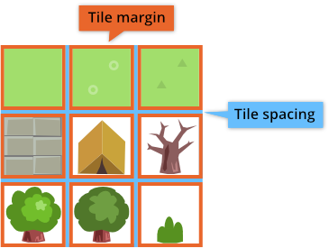
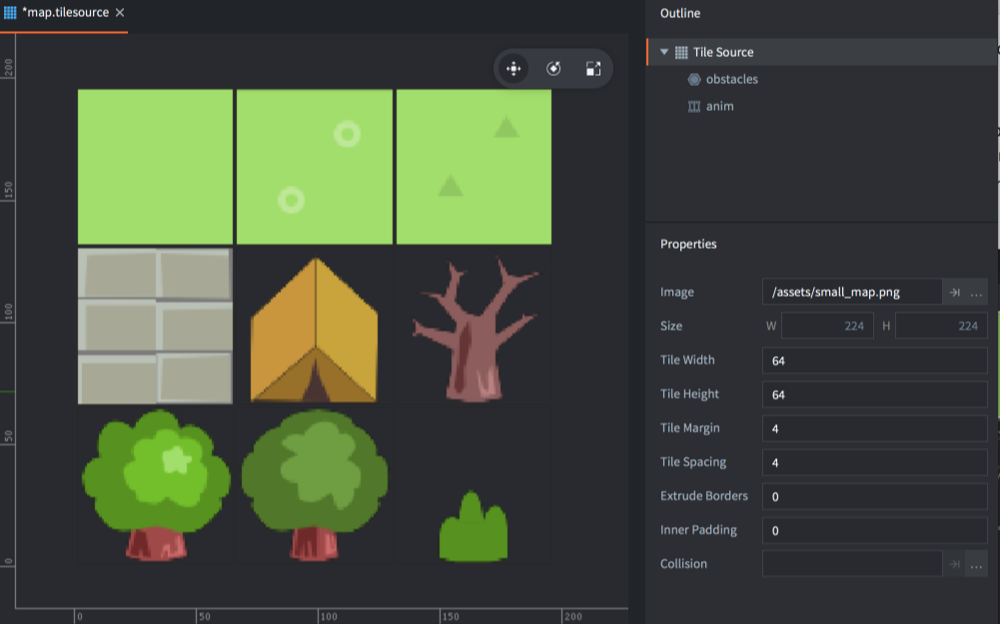

# Źródła Kafelków (tile source)

Źródła Kafelków - *Tile Source* może być używane przez komponent typu [Mapa kafelków - Tilemap](/manuals/tilemap), aby rysować kafelki na obszarze siatki lub może być używane jako źródło grafiki dla komponentu typu [Sprite](/manuals/sprite) lub Efektu cząsteczkowego - [Particle Effect](/manuals/particlefx).. Możesz również użyć Kształtów Kolizji - *Collision Shapes* ze Źródła Kafelków w Mapie Kafelków do [wykrywania kolizji i symulacji fizycznej](/manuals/physics) ([tutaj przykład](/examples/tilemap/collisions/))).

## Tworzenie Źródła Kafelków

Potrzebujesz obrazu zawierającego wszystkie kafelki. Każdy kafelek musi mieć dokładnie te same wymiary i być umieszczony w siatce. Defold obsługuje odstępy (_spacing_) między kafelkami oraz margines ( _margin_) wokół każdego kafelka.

Gdy już masz utworzony obraz źródłowy, możesz stworzyć Źródło Kafelków (Tile Source):

- Zaimportuj obraz do projektu, przeciągając go do lokalizacji projektu w panelu *Assets*.
- Utwórz nowy plik Źródła Kafelków (<kbd>klikając prawym przyciskiem myszy</kbd> lokalizację w panelu *Assets*, a następnie wybierając <kbd>New... ▸ Tile Source</kbd>).
- Nazwij nowy plik.
- Plik zostanie teraz otwarty w edytorze Źródło Kafelków.
- Kliknij przycisk przeglądania obok właściwości *Image* (Obraz) i wybierz swój obraz. Teraz powinieneś widzieć obraz wyświetlony w edytorze.
- Dostosuj Properties* (Właściwości) do obrazu źródłowego. Gdy wszystko jest poprawnie, kafelki będą idealnie do siebie pasować.

Size
: Rozmiar obrazu źródłowego.

Tile Width
: Szerokość każdego kafelka.

Tile Height
: Wysokość każdego kafelka.

Tile Margin
: Liczba pikseli otaczająca każdy kafelek (pomarańczowy kolor na obrazku powyżej).

Tile Spacing
: Liczba pikseli między każdym kafelkiem (niebieski kolor na obrazku powyżej).

Inner Padding
: Wewnętrzny margines - określa, ile pustych pikseli ma być automatycznie dodawane dookoła kafelka podczas działania gry.

Extrude Border
: Obramowanie ekstrudera - określa, ile razy krawędzie pikseli mają być automatycznie powielane wokół kafelka podczas działania gry.

Collision
: Określa obraz do automatycznego generowania kształtów kolizji dla kafelków.

## Animacje poklatkowe (flip-book) Źródła Kafelków

Aby zdefiniować animację poklatkową w Źródle Kafelków, kafelki animacji klatek muszą leżeć obok siebie w sekwencji od lewej do prawej. Sekwencja może zawijać się z jednego wiersza na kolejny. Wszystkie nowo utworzone Źródła Kafelków mają domyślną animację o nazwie "anim". Możesz dodać nowe animacje, <kbd>klikając prawym przyciskiem myszy</kbd> na korzeń (root) Źródła Kafelków w *Outline* i wybierając <kbd>Add ▸ Animation</kbd>.

Wybierając animację, wyświetlane są *Properties* (Właściwości) animacji.

Id
: Identyfikator animacji. Nazwa musi być unikalna w Źródle Kafelków.

Start Tile
: Pierwszy kafelek animacji. Numeracja zaczyna się od 1 w lewym górnym rogu i idzie w prawo, wiersz po wierszu, w dół do prawego dolnego rogu.

End Tile
: Ostatni kafelek animacji.

Playback
: Określa, w jaki sposób ma być odtwarzana animacja:

  - `None` - w ogóle nie jest odtwarzany, wyświetlany jest pierwszy obraz.
  - `Once Forward` - odtwarza animację raz od pierwszego do ostatniego obrazu.
  - `Once Backward` - odtwarza animację raz od ostatniego do pierwszego obrazu.
  - `Once Ping Pong` - odtwarza animację raz od pierwszego do ostatniego obrazu, a następnie z powrotem do pierwszego obrazu.
  - `Loop Forward` - odtwarza animację powtarzalnie (w pętli) od pierwszego do ostatniego obrazu.
  - `Loop Backward` - odtwarza animację powtarzalnie (w pętli) od ostatniego do pierwszego obrazu.
  - `Loop Ping Pong` - odtwarza animację powtarzalnie (w pętli) od pierwszego do ostatniego obrazu, a następnie z powrotem do pierwszego obrazu.

Fps
: Prędkość odtwarzania animacji, wyrażona w klatkach na sekundę (Frames per second - FPS).

Flip horizontal
: Odbija animację poziomo.

Flip vertical
: Odbija animację pionowo.

## Kształty kolizji źródła kafelków

Defold używa obrazu określonego w właściwości *Collision* (Kolizja), aby generować kształt wypukły (_convex_) dla każdego kafelka. Kształt będą wyznaczać piksele kafelka, które zawierają informacje o kolorze, czyli nie są w 100% przezroczyste.

Często sensowne jest używanie tego samego obrazu do kolizji, co do obrazu zawierającego grafikę, ale możesz wybrać oddzielny obraz, jeśli chcesz kształty kolizji różniące się od wyglądu. Gdy określisz obraz kolizji, podgląd zostaje zaktualizowany z zarysem na każdym kafelku, co wskazuje na wygenerowane kształty kolizji.

W zarysie źródła kafelków są wymieniane grupy kolizji, które dodano do źródła kafelków. Nowe pliki źródła kafelków otrzymają dodaną jedną grupę kolizji "default" ("domyślna"). Możesz dodać nowe grupy, <kbd>klikając prawym przyciskiem myszy</kbd> na korzeń (root) Źródła Kafelków w *Outline* i wybierając <kbd>Add ▸ Collision Group</kbd>.

Aby wybrać kształty kafelków, które powinny należeć do określonej grupy, wybierz grupę w *Outline*, a następnie kliknij każdy kafelek, który chcesz przypisać do wybranej grupy. Kształt kafelka i kształt są wtedy zaznaczane kolorem grupy. Kolor jest automatycznie przypisywany do grupy w Edytorze.

Aby usunąć kafelek z grupy kolizji, wybierz element główny (root) Źródła Kafelków w *Outline*, a następnie kliknij kafelek odznaczając tym samym dotychczas wybraną grupę.
