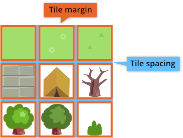
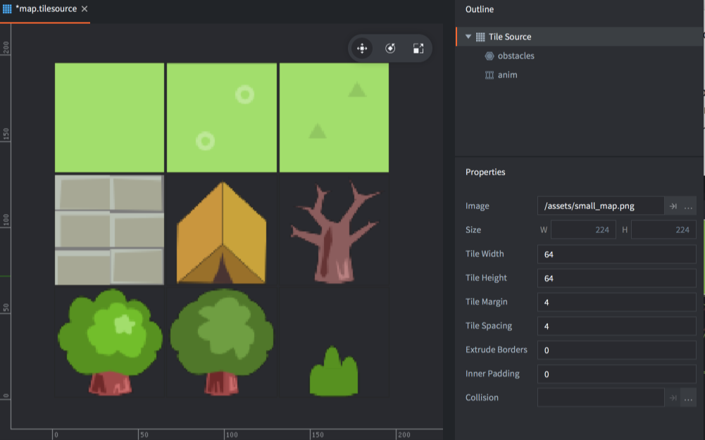
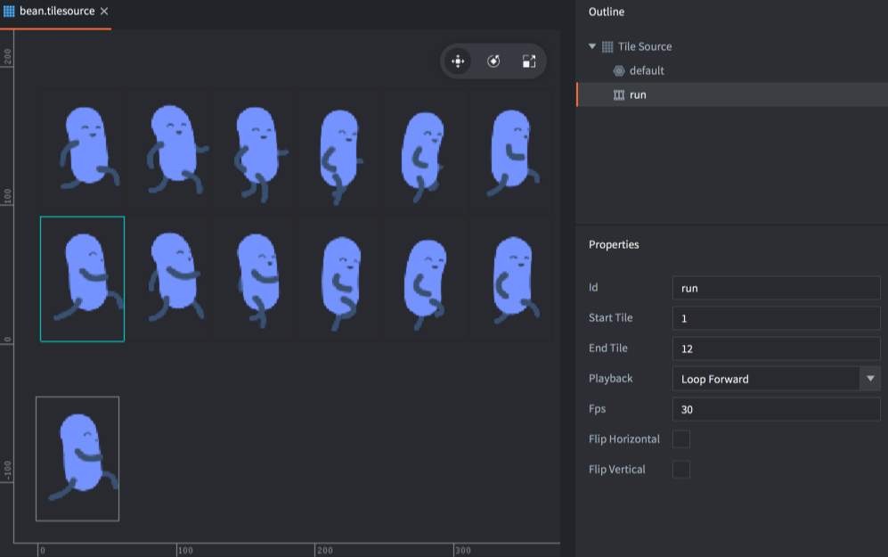
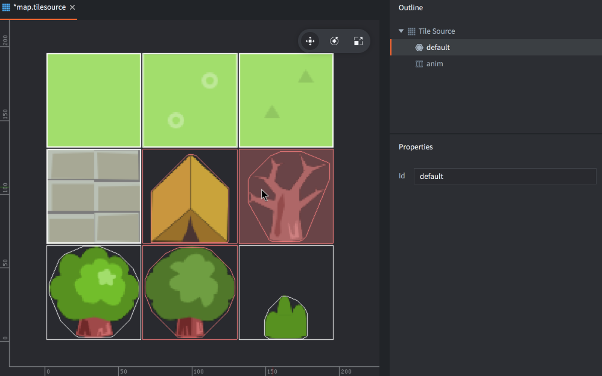

# Źródło kafelków

Źródło kafelków, *Tile Source*, może być używane przez [Tilemap component](/manuals/tilemap) do rysowania kafelków na obszarze siatki albo jako źródło grafiki dla [Sprite](/manuals/sprite) lub [Particle Effect component](/manuals/particlefx). Możesz też użyć *Collision Shapes* ze źródła kafelków w Tilemap do [wykrywania kolizji i symulacji fizycznej](/manuals/physics) ([przykład](/examples/tilemap/collisions/)).

## Tworzenie źródła kafelków

Potrzebujesz obrazu zawierającego wszystkie kafelki. Każdy kafelek musi mieć dokładnie takie same wymiary i być ułożony w siatce. Defold obsługuje odstępy (_spacing_) między kafelkami oraz margines (_margin_) wokół każdego kafelka.

Gdy masz już przygotowany obraz źródłowy, możesz utworzyć źródło kafelków:

- Zaimportuj obraz do projektu, przeciągając go do lokalizacji projektu w panelu *Assets*.
- Utwórz nowy plik źródła kafelków (<kbd>kliknij prawym przyciskiem myszy</kbd> lokalizację w panelu *Assets*, a następnie wybierz <kbd>New... ▸ Tile Source</kbd>).
- Nadaj nowemu plikowi nazwę.
- Plik zostanie otwarty w edytorze źródła kafelków.
- Kliknij przycisk przeglądania obok właściwości *Image* i wybierz obraz. Powinien pojawić się w edytorze.
- Dopasuj *Properties* do obrazu źródłowego. Gdy wszystko jest poprawne, kafelki będą idealnie wyrównane.

Size
: Rozmiar obrazu źródłowego.

Tile Width
: Szerokość każdego kafelka.

Tile Height
: Wysokość każdego kafelka.

Tile Margin
: Liczba pikseli otaczających każdy kafelek (pomarańczowe na ilustracji powyżej).

Tile Spacing
: Liczba pikseli między każdym kafelkiem (niebieskie na ilustracji powyżej).

Inner Padding
: Określa, ile pustych pikseli ma zostać automatycznie dodanych wokół kafelka w wynikowej teksturze używanej podczas uruchamiania gry.

Extrude Border
: Określa, ile razy krawędziowe piksele mają zostać automatycznie powielone wokół kafelka w wynikowej teksturze używanej podczas uruchamiania gry.

Collision
: Określa obraz używany do automatycznego generowania kształtów kolizji dla kafelków.

## Animacje poklatkowe źródła kafelków

Aby zdefiniować animację w źródle kafelków, kafelki klatek animacji muszą leżeć obok siebie w sekwencji od lewej do prawej. Sekwencja może zawijać się z jednego wiersza do następnego. Wszystkie nowo utworzone źródła kafelków mają domyślną animację o nazwie `anim`. Możesz dodać nowe animacje, <kbd>klikając prawym przyciskiem myszy</kbd> korzeń źródła kafelków w *Outline* i wybierając <kbd>Add ▸ Animation</kbd>.

Wybranie animacji wyświetla jej *Properties*.

Id
: Identyfikator animacji. Musi być unikalny dla źródła kafelków.

Start Tile
: Pierwszy kafelek animacji. Numeracja zaczyna się od 1 w lewym górnym rogu i biegnie w prawo, wiersz po wierszu, aż do prawego dolnego rogu.

End Tile
: Ostatni kafelek animacji.

Playback
: Określa sposób odtwarzania animacji:

  - `None` nie odtwarza animacji, wyświetlany jest pierwszy obraz.
  - `Once Forward` odtwarza animację jeden raz od pierwszego do ostatniego obrazu.
  - `Once Backward` odtwarza animację jeden raz od ostatniego do pierwszego obrazu.
  - `Once Ping Pong` odtwarza animację jeden raz od pierwszego do ostatniego obrazu, a następnie z powrotem do pierwszego obrazu.
  - `Loop Forward` odtwarza animację wielokrotnie od pierwszego do ostatniego obrazu.
  - `Loop Backward` odtwarza animację wielokrotnie od ostatniego do pierwszego obrazu.
  - `Loop Ping Pong` odtwarza animację wielokrotnie od pierwszego do ostatniego obrazu, a następnie z powrotem do pierwszego obrazu.

Fps
: Prędkość odtwarzania animacji, wyrażona w klatkach na sekundę (FPS).

Flip horizontal
: Odbija animację w poziomie.

Flip vertical
: Odbija animację w pionie.

## Kształty kolizji źródła kafelków

Defold używa obrazu wskazanego we właściwości *Collision*, aby wygenerować wypukły kształt dla każdego kafelka. Kształt obrysowuje tę część kafelka, która zawiera informacje o kolorze, czyli nie jest w 100% przezroczysta.

Często sensownie jest użyć do kolizji tego samego obrazu, który zawiera właściwą grafikę, ale możesz też wskazać osobny obraz, jeśli chcesz, aby kształty kolizji różniły się od wyglądu. Gdy wskażesz obraz kolizji, podgląd zostanie zaktualizowany i na każdym kafelku pojawi się obrys pokazujący wygenerowane kształty kolizji.

W zarysie źródła kafelków widoczne są grupy kolizji dodane do tego źródła. Nowe pliki źródła kafelków mają dodaną jedną grupę kolizji o nazwie "default". Możesz dodać nowe grupy, <kbd>klikając prawym przyciskiem myszy</kbd> korzeń źródła kafelków w *Outline* i wybierając <kbd>Add ▸ Collision Group</kbd>.

Aby wybrać kształty kafelków, które mają należeć do danej grupy, zaznacz grupę w *Outline*, a następnie kliknij każdy kafelek, który chcesz do niej przypisać. Obrys kafelka i kształtu jest wtedy kolorowany kolorem grupy. Kolor jest automatycznie przypisywany do grupy w edytorze.

Aby usunąć kafelek z jego grupy kolizji, zaznacz główny element źródła kafelków w *Outline*, a następnie kliknij kafelek.
