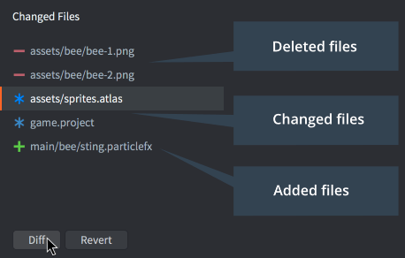

# Kontrola wersji

Defold został zaprojektowany z myślą o małych zespołach, które intensywnie współpracują przy tworzeniu gier. Członkowie zespołu mogą równolegle pracować nad tymi samymi zasobami przy bardzo małym tarciu. Defold ma wbudowaną obsługę kontroli wersji z użyciem [Git](https://git-scm.com). Git jest przeznaczony do rozproszonej, zespołowej pracy i jest niezwykle potężnym narzędziem, które umożliwia szeroki zakres przepływów pracy.

## Zmodyfikowane pliki

Gdy zapisujesz zmiany w lokalnej kopii roboczej, Defold śledzi je w panelu edytora *Changed Files*, wyświetlając każdy plik, który został dodany, usunięty albo zmodyfikowany.

Zaznacz plik na liście i kliknij <kbd>Diff</kbd>, aby zobaczyć wprowadzone w nim zmiany, albo <kbd>Revert</kbd>, aby cofnąć wszystkie zmiany i przywrócić plik do stanu sprzed ostatniej synchronizacji.

## Git

Git został zaprojektowany przede wszystkim do obsługi kodu źródłowego i plików tekstowych, dlatego przechowuje tego typu pliki bardzo oszczędnie. Zachowywane są tylko różnice między kolejnymi wersjami, co pozwala utrzymać rozbudowaną historię zmian wszystkich plików projektu przy stosunkowo niewielkim koszcie zajętości miejsca. Pliki binarne, takie jak obrazy i pliki dźwiękowe, nie korzystają jednak z takiego sposobu przechowywania. Każda nowa wersja, którą commitujesz i synchronizujesz, zajmuje mniej więcej tyle samo miejsca. Zwykle nie stanowi to dużego problemu w przypadku końcowych zasobów projektu, takich jak obrazy JPEG lub PNG czy pliki dźwiękowe OGG, ale może szybko stać się problemem w przypadku roboczych plików projektu, takich jak pliki PSD czy projekty Pro Tools. Tego typu pliki często bardzo się powiększają, ponieważ zwykle pracujesz w znacznie wyższej rozdzielczości niż docelowe zasoby. Za najlepszą praktykę uznaje się unikanie umieszczania dużych roboczych plików pod kontrolą Git i korzystanie zamiast tego z osobnego rozwiązania do przechowywania i tworzenia kopii zapasowych.

Istnieje wiele sposobów użycia Git w zespołowym przepływie pracy. Ten stosowany w Defold wygląda następująco. Gdy synchronizujesz projekt, dzieje się to w taki sposób:

1. Wszystkie lokalne zmiany są tymczasowo odkładane do stasha, aby można je było przywrócić, jeśli później coś się nie powiedzie w procesie synchronizacji.
2. Zmiany z serwera są pobierane.
3. Stash jest stosowany, a lokalne zmiany zostają przywrócone. Może to spowodować konflikty scalania, które trzeba rozwiązać.
4. Użytkownik dostaje możliwość zatwierdzenia lokalnych zmian plików.
5. Jeśli istnieją lokalne commity, użytkownik może wybrać, czy wypchnąć je na serwer. Również w tym przypadku mogą wystąpić konflikty, które trzeba rozwiązać.

Jeśli wolisz inny przepływ pracy, możesz używać Git z wiersza poleceń albo przez aplikację firm trzecich do wykonywania pull, push, commit i merge, pracy na kilku gałęziach i tak dalej.
