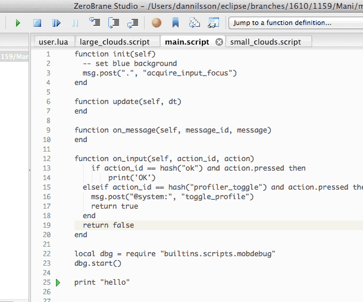
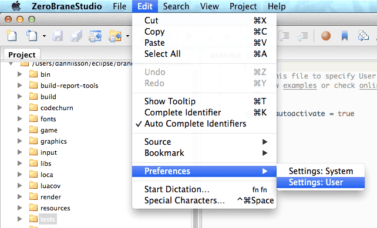

# Debugowanie skryptów Lua za pomocą ZeroBrane Studio

Defold zawiera wbudowany debuger, ale można też uruchomić darmowe i otwarte środowisko IDE do Lua _ZeroBrane Studio_ jako zewnętrzny debuger. Aby korzystać z funkcji debugowania, trzeba zainstalować ZeroBrane Studio. Program jest wieloplatformowy i działa zarówno na macOS, jak i na Windows.

Pobierz „ZeroBrane Studio” z http://studio.zerobrane.com

## Konfiguracja ZeroBrane

Aby ZeroBrane mógł odnaleźć pliki w twoim projekcie, musisz wskazać mu lokalizację katalogu projektu Defold. Wygodnym sposobem, aby to sprawdzić, jest użycie opcji <kbd>Show in Desktop</kbd> na pliku w katalogu głównym projektu Defold.

1. Kliknij prawym przyciskiem myszy *game.project*
2. Wybierz <kbd>Show in Desktop</kbd>


## Jak skonfigurować ZeroBrane

Aby skonfigurować ZeroBrane, wybierz <kbd>Project ▸ Project Directory ▸ Choose...</kbd>:


Po skonfigurowaniu ZeroBrane tak, aby odpowiadał bieżącemu katalogowi projektu Defold, w ZeroBrane powinno być widoczne drzewo katalogów projektu Defold, a także będzie można przeglądać i otwierać pliki.

Dodatkowe zalecane, ale nieobowiązkowe zmiany konfiguracji można znaleźć dalej w tym dokumencie.

## Uruchamianie serwera debugowania

Przed rozpoczęciem sesji debugowania trzeba uruchomić wbudowany serwer debugowania ZeroBrane. Opcję menu służącą do jego uruchomienia znajdziesz w menu <kbd>Project</kbd>. Wybierz po prostu <kbd>Project ▸ Start Debugger Server</kbd>:


## Łączenie aplikacji z debugerem

Debugowanie można rozpocząć w dowolnym momencie działania aplikacji Defold, ale trzeba je jawnie zainicjować ze skryptu Lua. Kod Lua rozpoczynający sesję debugowania wygląda tak:

::: sidenote
Jeśli gra kończy działanie po wywołaniu `dbg.start()`, może to oznaczać, że ZeroBrane wykrył problem i wysyła do gry polecenie zakończenia. Z jakiegoś powodu ZeroBrane potrzebuje otwartego pliku, aby rozpocząć sesję debugowania. W przeciwnym razie wyświetli:
"Can't start debugging without an opened file or with the current file not being saved 'untitled.lua')."
W ZeroBrane otwórz plik, w którym dodałeś `dbg.start()`, aby naprawić ten błąd.
:::

```lua
dbg = require "builtins.scripts.mobdebug"
dbg.start()
```

Po dodaniu powyższego kodu aplikacja połączy się z serwerem debugowania ZeroBrane, domyślnie przez "localhost", i zatrzyma się na następnej instrukcji do wykonania.

```txt
Debugger server started at localhost:8172.
Mapped remote request for '/' to '/Users/my_user/Documents/Projects/Defold_project/'.
Debugging session started in '/Users/my_user/Documents/Projects/Defold_project'.
```

Teraz można korzystać z funkcji debugowania dostępnych w ZeroBrane: wykonywać kod krok po kroku, analizować go oraz dodawać i usuwać punkty przerwania itp.

::: sidenote
Debugowanie będzie włączone tylko dla kontekstu Lua, z którego zostało zainicjowane. Włączenie "shared_state" w *game.project* oznacza, że możesz debugować całą aplikację niezależnie od miejsca, z którego rozpoczęto debugowanie.
:::



Jeśli próba połączenia się nie powiedzie, na przykład dlatego, że serwer debugowania nie działa, aplikacja będzie działać dalej normalnie po zakończeniu próby połączenia.

## Zdalne debugowanie

Ponieważ debugowanie odbywa się przez zwykłe połączenia sieciowe (TCP), umożliwia to debugowanie zdalne. Oznacza to, że można debugować aplikację podczas jej działania na urządzeniu mobilnym.

Jedyną potrzebną zmianą jest polecenie uruchamiające debugowanie. Domyślnie `start()` spróbuje połączyć się z "localhost", ale do zdalnego debugowania trzeba ręcznie podać adres serwera debugowania ZeroBrane, na przykład tak:

```lua
dbg = require "builtins.scripts.mobdebug"
dbg.start("192.168.5.101")
```

Oznacza to również, że trzeba upewnić się, iż urządzenie zdalne ma łączność sieciową oraz że zapory sieciowe lub podobne oprogramowanie zezwalają na połączenia TCP przez port 8172. W przeciwnym razie aplikacja może zawiesić się podczas uruchamiania, gdy spróbuje połączyć się z serwerem debugowania.

## Inne zalecane ustawienie ZeroBrane

Można sprawić, że ZeroBrane będzie automatycznie otwierać pliki skryptów Lua podczas debugowania. Umożliwia to wchodzenie krok po kroku do funkcji w innych plikach źródłowych bez konieczności ręcznego ich otwierania.

Pierwszym krokiem jest otwarcie pliku konfiguracyjnego edytora. Zaleca się zmienić wersję użytkownika tego pliku.

- Wybierz <kbd>Edit ▸ Preferences ▸ Settings: User</kbd>
- Dodaj do pliku konfiguracyjnego następujący fragment:

  ```txt
  - aby pliki żądane podczas debugowania otwierały się automatycznie
  editor.autoactivate = true
  ```

- Uruchom ponownie ZeroBrane


