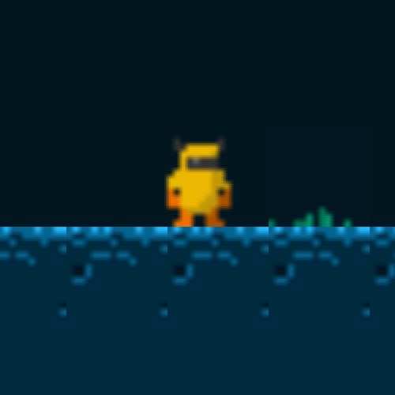
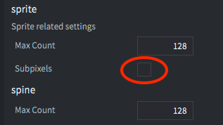

# Introduction

There are several things to consider when adapting your game and graphics to different screen sizes:

* Is this a retro game with low resolution pixel perfect graphics or a modern game with HD quality graphics?
* How should the game behave when played in full screen on different screen sizes?
  * Should the player see more of the game content on a high resolution screen or should the graphics adaptively zoom to always show the same content?
* How should the game deal with aspect ratios other than the one you have set in game.project?
  * Should the player see more of the game content? Or maybe there should be black bars? Or maybe resized GUI elements?
* What kind of menus and on-screen gui components do you need and how should they adapt to different screen sizes and screen orientations?
  * Should menus and other gui components change layout when the orientation changes or should they keep the same layout regardless of orientation?

This manual will address some of these things and suggest best practices.


## How to change how your content is rendered

The Defold render script give you total control over the entire rendering pipeline. The render script decides the order as well as what and how to draw things. The default behavior of the render script is to always draw the same area of pixels, defined by the width and height in the *game.project* file, regardless if the window is resized or the actual screen resolution doesn't match. This will result in the content being stretched if the aspect ratio changes and zoomed in or out if the window size changes. In some games this might be acceptable, but it is more likely that you want to show more or less game content if the screen resolution or aspect ratio is different, or at least make sure to zoom the content without changing the aspect ratio. The default stretch behavior can easily be changed and you can read more about how to do this in the [Render manual](https://www.defold.com/manuals/render/#default-view-projection).


## Retro/8-bit graphics

Retro/8-bit graphics often refer to games emulating the graphical style of old game consoles or computers with their low resolution and limited color palette. As an example the Nintendo Entertainment System (NES) had a screen resolution of 256x240, the Commodore 64 had 320x200 and the Gameboy had 160x144, all of which are only a fraction of the size of modern screens. In order to make games emulating this graphical style and screen resolution playable on a modern high resolution screen the graphics has to be upscaled or zoomed several times. One simple way of doing this is to draw all of your graphics in the low resolution and style that you wish to emulate and zoom the graphics when it is rendered. This can easily be achieved in Defold using the render script and the [Fixed Projection](/manuals/render/#fixed-projection) set to a suitable zoom value.

Let's take this tileset and player character ([source](https://ansimuz.itch.io/grotto-escape-game-art-pack)) and use them for an 8-bit retro game with a resolution of 320x200:


Setting 320x200 in the *game.project* file and launching the game would look like this:


The window is absolutely tiny on a modern high resolution screen! Increasing the window size four times to 1280x800 makes it more suitable for a modern screen:


Now that the window size is more reasonable we also need to do something about the graphics. It's so small it's very hard to see what is going on in the game. We can use the render script to set a fixed and zoomed projection:

```Lua
msg.post("@render:", "use_fixed_projection", { zoom = 4 })
```

This will give the following result:


This is better. The window and graphics both have a good size, but if we look closer there is an obvious problem:



The graphics look blurred! This is caused by the way the zoomed in graphics is sampled from the texture when rendered by the GPU. The default setting in the *game.project* file under the Graphics section is *linear*:


Changing this to *nearest* will give the result we are after:


Now we have crisp pixel-perfect graphics for our retro game. There are even more things to consider, such as disabling sub-pixels for sprites in *game.project*:



When the Subpixels option is disabled sprites will never get rendered on half pixels and instead always snap to the nearest full pixel.

## High resolution graphics

When dealing with high resolution graphics we need to approach project and content setup in a different way than for retro/8-bit graphics. With bitmap graphics you need to create your content in such a way that it looks good on a high resolution screen when shown at a 1:1 scale.

Just like for retro/8-bit graphics you need to change the render script. In this case you want the graphics to scale with the screen size while maintaining the original aspect ratio:

```Lua
msg.post("@render:", "use_fixed_fit_projection")
```

This will make sure that the screen will resize to always show the same amount of content as specified in the *game.project* file, possibly with additional content shown above and below or to the sides, depending on if the aspect ratio differs or not.

You should configure the width and height in the *game.project* file to a size that allows you to show your game content unscaled.

### High DPI setting and retina screens

If you also wish to support high resolution retina screens you can enable this in the *game.project* file in the Display section:


This will create a high dpi back buffer on displays that support it. The game will render in double the resolution than what is set in the Width and Height settings, which will still be the logical resolution used in scripts and properties. This means that all measurements stay the same and any content that is rendered at 1x scale will look the same. But if you import high res images and scale them to 0.5x they will be high dpi on screen.


## Creating an adaptive GUI

The system for creating GUI components is built around a number of basic building blocks, or [nodes](/manuals/gui/#node-types), and while it may seem overly simple it can be used to create anything from buttons to complex menus and popups. The GUIs that you create can be configured to automatically adapt to screen size and orientation changes. You can for instance keep nodes anchored to the top, bottom or sides of the screen and nodes can either keep their size or stretch. The relationship between nodes as well as their size and appearance can also be configured to change when the screen size or orientation changes.

### Node properties

Each node in a gui has a pivot point, a horizontal and vertical anchor as well as an adjust mode.

* The pivot point defines the center point of a node.
* The anchor mode controls how the node’s vertical and horizontal position is altered when the scene boundaries, or the parent node’s boundaries are stretched to fit the physical screen size.
* The adjust mode setting controls what happens to a node when the scene boundaries, or the parent node’s boundaries, are adjusted to fit the physical screen size.

You can learn more about these properties [in the GUI manual](/manuals/gui/#node-properties).

### Layouts

Defold supports GUIs that automatically adapt to screen orientation changes on mobile devices. By using this feature you can design a GUI that can adapt to the orientation and aspect ratio of a range of screen sizes. It is also possible to create layouts that match particular device models. You can learn more about this system in the [GUI Layouts manual](/manuals/gui-layouts/)


## Testing different screen sizes

The Debug menu contains an option to simulate the resolution of either a certain device model resolution or a custom resolution. While the application is running you can select <kbd>Debug->Simulate Resolution</kbd> and pick one of the device models from the list. The running application window will resize and you'll be able to see how your game looks in a different resolution or with a different aspect ratio.


