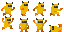
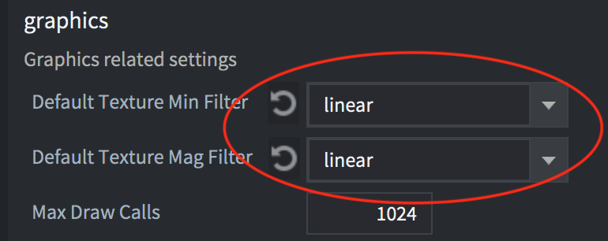
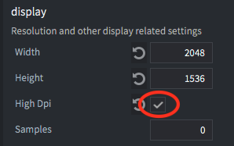

# Введение

При адаптации игры и графики к разным размерам экрана необходимо учесть несколько моментов:

* Это будет ретро-игра с pixel-perfect графикой низкого разрешения или современная игра с графикой HD-качества?
* Как должна вести себя игра в полноэкранном режиме на экранах разных размеров?
  * Должен ли игрок видеть больше игрового контента на экране с высоким разрешением или графику следует адаптивно масштабировать, чтобы всегда отображать один и тот же контент? 
* Как игра должна работать с соотношением сторон экрана, отличным от того, что установили в *game.project* ?
  * Должен ли игрок видеть больше игрового контента? А может быть там  должны быть чёрные полосы? Или, может быть, элементы графического интерфейса с измененными размерами? 
* Какие меню и экранные компоненты графического интерфейса вам нужны и как они должны адаптироваться к разным размерам экрана и ориентации экрана?
  * Должны ли меню и другие компоненты графического интерфейса менять свою компоновку при изменении ориентации или они должны сохранять такую же компоновку независимо от ориентации? 

В этом руководстве будут рассмотрены некоторые из этих вопросов и предложены наилучшие практики.


## Как изменить способ отображения вашего контента 

Рендер скрипт в Defold дает вам полный контроль над всем конвейером рендеринга. Рендер скрипт определяет порядок, а также что и как рисовать. Поведение рендер скрипта по умолчанию - всегда рисовать одну и ту же область пикселей, определяемую шириной и высотой в файле *game.project*, независимо от того, изменяется ли размер окна или фактическое разрешение экрана не совпадает. Это приведет к растягиванию содержимого при изменении соотношения сторон и увеличению или уменьшению масштаба при изменении размера окна. В некоторых играх это может быть приемлемо, но более вероятно то, что вы захотите показать большую или меньшую область игрового контента, если разрешение экрана или соотношение сторон отличается, или, по крайней мере, хотели бы убедиться, что произошло масштабирование контента без изменения соотношения сторон. Поведение при растягивании по умолчанию можно легко изменить, и вы можете узнать больше о том, как это сделать, в [Руководство по рендерингу](/manuals/render/#проекция-вида-по-умолчанию). 

## Ретро/8-битная графика

Под ретро / 8-битной графикой часто подразумевают игры, имитирующие графический стиль старых игровых консолей или компьютеров с их низким разрешением и ограниченной цветовой палитрой. Например, Nintendo Entertainment System (NES) имела разрешение экрана 256x240, Commodore 64 - 320x200, а Gameboy - 160x144, и все это лишь небольшая доля от размеров современных экранов. Чтобы игры, имитирующие этот графический стиль и разрешение экрана, можно было воспроизводить на современном экране с высоким разрешением, графику необходимо масштабировать или увеличивать в несколько раз. Один из простых способов сделать это - нарисовать всю графику в низком разрешении и в стиле, который вы хотите имитировать, и масштабировать графику во время рендеринга. Этого легко добиться в Defold с помощью скрипта рендеринга и параметра [Fixed Projection](/manuals/render/#fixed-projection), установленного в подходящее значение для масштабирования. 

Давайте возьмем этот набор тайлов и персонажа игрока ([источник](https://ansimuz.itch.io/grotto-escape-game-art-pack)) и воспользуемся ими для 8-битной ретро-игры с разрешением 320x200: 




При установке разрешения в 320x200 в файле *game.project* и запуске игра будет выглядеть так: 


Окно совершенно крошечное на современном экране высокого разрешения! Увеличение размера окна в четыре раза до 1280x800 делает его более подходящим для современного экрана: 


Теперь, когда размер окна стал более подходящим, нам также нужно что-то сделать с графикой. Графика настолько мизерная, что очень сложно понять, что происходит в игре. Мы можем использовать скрипт рендеринга, чтобы установить проекцию с фиксированным соотношением сторон и масштабированную: 

```Lua
msg.post("@render:", "use_fixed_projection", { zoom = 4 })
```

::: sidenote
Тот же результат можно получить, прикрепив [компонент Камера](/manuals/camera/) к игровому объекту, установив *Ортографическая проекция* и задав *Ортографическое увеличение* со значением 4.0:


:::

Это даст нам следующий результат:


Это уже лучше. И окно, и графика имеют хорошие размеры, но если мы присмотримся, то обнаружим очевидную проблему: 


Графика выглядит замыленной! Это обусловлено тем, каким способом увеличенная графика семплируется из текстуры при рендеринге графическим процессором. По умолчанию в файле *game.project* в разделе «Графика» установлено значение *linear*: 



Изменение этого параметра на *nearest* даст результат, который нам нужен: 


Теперь у нас есть четкая pixel-perfect графика для нашей ретро-игры. Есть еще кое-что, что нужно учитывать, например, отключение субпикселей для спрайтов в *game.project*: 


Когда параметр «Subpixels» отключен, спрайты никогда не будут отображаться на половинных пикселях, а вместо этого всегда будут привязываться к ближайшему целому пикселю. 

## Графика высокого разрешения 

При работе с графикой высокого разрешения нам нужно подходить к настройке проекта и контента иначе, чем к ретро / 8-битной графике. С растровой графикой вам необходимо создать свой контент таким образом, чтобы он хорошо смотрелся на экране с высоким разрешением при отображении в масштабе 1: 1.

Как и для ретро / 8-битной графики, вам нужно изменить скрипт рендеринга. В этом случае вы хотели бы, чтобы графика масштабировалась в соответствии с размером экрана при сохранении исходного соотношения сторон: 

```Lua
msg.post("@render:", "use_fixed_fit_projection")
```

Это гарантирует, что размер экрана будет изменяться, чтобы всегда отображать то же количество контента, что указано в файле *game.project*, возможно, с дополнительным контентом, показываемым сверху и снизу или по бокам, в зависимости от того, отличается соотношение сторон или нет.

Вы должны настроить ширину и высоту в файле *game.project* на размер, позволяющий отображать содержимое игры в немасштабированном виде. 

### Настройка высокого разрешения и Retina экраны 

Если вы также хотите поддерживать экраны Retina с высоким разрешением, вы можете включить это в файле *game.project* в разделе Display:



Это создаст вторичный буфер высокого разрешения (high dpi back buffer) для поддерживающих его дисплеев. Игра будет отображаться в двойном разрешении от того, что установлено в настройках ширины и высоты, что по-прежнему будет логическим разрешением, используемым в скриптах и свойствах. Это означает, что все измерения останутся прежними, и любой контент, отображаемый в масштабе 1x, будет выглядеть так же. Но если вы импортируете изображения с высоким разрешением и масштабируете их до 0,5x, они будут иметь высокое разрешение на экране. 


## Создание адаптивного графического интерфейса

Система для создания компонентов графического интерфейса основана на нескольких базовых строительных блоках, или [нодах](/manuals/gui/#node-types), и, хотя она может показаться слишком простой, ее можно использовать для создания чего угодно, от кнопок до сложных меню и всплывающих окон. Создаваемые вами графические интерфейсы пользователя можно настроить для автоматической адаптации к изменениям размера и ориентации экрана. Вы можете, например, удерживать узлы привязанными к верхней, нижней или боковым сторонам экрана, а узлы могут либо сохранять свой размер, либо растягиваться. Взаимодействие между узлами, а также их размер и внешний вид также можно настроить для изменения при изменении размера или ориентации экрана. 

### Свойства нод

Каждая нода в графическом интерфейсе имеет точку поворота (pivot point), горизонтальную и вертикальную привязку, а также режим настройки.

* Точка поворота определяет центральную точку узла.
* Режим привязки контролирует, как поменяется вертикальное и горизонтальное положение узла, когда границы сцены или границы родительского узла растягиваются, чтобы соответствовать физическому размеру экрана.
* Настройка Adjust mode контролирует, что происходит с узлом, когда границы сцены или границы родительского узла настраиваются в соответствии с физическим размером экрана. 

Вы можете узнать больше об этих свойствах [в руководстве по графическому интерфейсу](/manuals/gui/#node-properties). 

### Компоновки

Defold поддерживает графические интерфейсы пользователя, которые автоматически адаптируются к изменениям ориентации экрана на мобильных устройствах. Используя эту функцию, вы можете спроектировать графический интерфейс, который может адаптироваться к ориентации и соотношению сторон из диапазона различных экранов. Также можно создавать компоновки, соответствующие конкретным моделям устройств. Вы можете узнать больше об этой системе в [Руководстве по GUI-компоновкам](/manuals/gui-layouts/) 

## Тестирование экранов разных размеров

В меню «Debug» есть возможность имитировать разрешение либо определенной модели устройства, либо настраиваемое разрешение. Пока приложение работает, вы можете выбрать <kbd>Debug->Simulate Resolution</kbd> и выбрать одну из моделей устройства из списка. Размер окна запущенного приложения изменится, и вы сможете увидеть, как ваша игра выглядит в другом разрешении или с другим соотношением сторон. 


