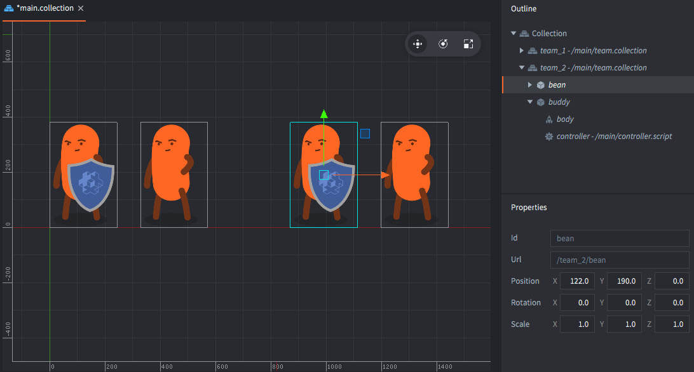
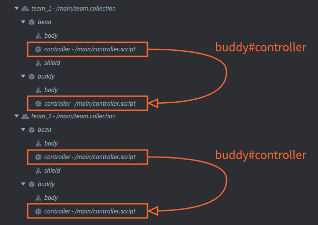
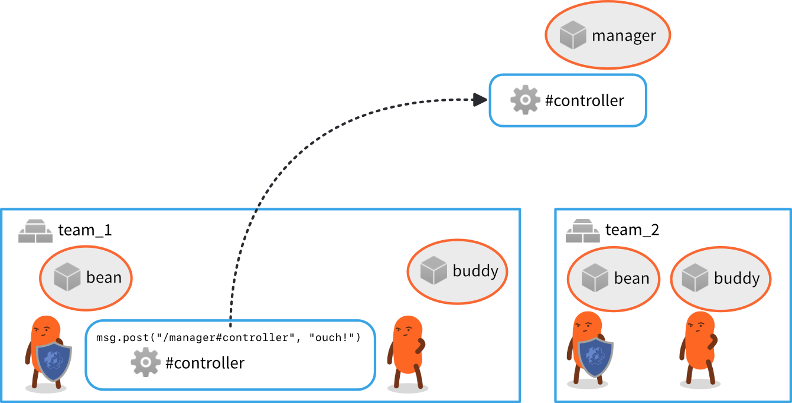
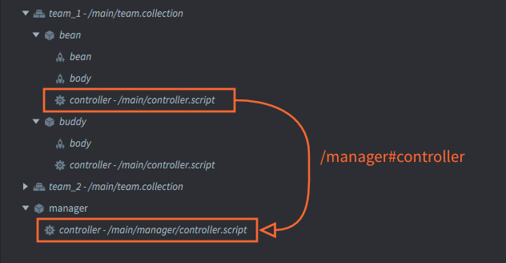

# Адресация

Код, управляющий запущенной игрой, должен иметь возможность достигнуть каждый объект и компонент с целью перемещения, масштабирования, анимирования, удаления и прочих видов манипуляций с видимым и слышимым для игрока контентом. Механизм адресации Defold делает такую возможность доступной.

## Идентификаторы

Defold ссылается на игровые объекты и компоненты используя адреса (или URL, об этом позже). Эти адреса состоят из идентификаторов. Ниже приведены все примеры использования адресов в Defold. В этом руководстве мы подробно рассмотрим принцип их работы:

```lua
local id = factory.create("#enemy_factory")
label.set_text("my_gameobject#my_label", "Hello World!")

local pos = go.get_position("my_gameobject")
go.set_position(pos, "/level/stuff/other_gameobject")

msg.post("#", "hello_there")
local id = go.get_id(".")
```

Начнем с очень простого примера. Предположим, что есть игровой объект с одним спрайтом. Также имеется скрипт для управления этим игровым объектом. В редакторе такая структура будет выглядеть примерно следующим образом:


Допустим, требуется, чтобы спрайт отключился в начале игры, и чтобы была возможность включить его позже. Это несложно сделать, поместив следующий код в "controller.script":

```lua
function init(self)
    msg.post("#body", "disable") -- <1>
end
```
1. Не стоит переживать по поводу символа '#'. Мы скоро дойдем до него.

Это сработает, как и ожидалось. При запуске игры компонент Script *обратится* к компоненту Sprite посредством его идентификатора "body" и, воспользовавшись этим адресом, отправит ему *сообщение* с пометкой "disable". В результате этого специального сообщения движка компонент Sprite скроет свое графическое изображение. Схематически структура выглядит следующим образом:


Идентификаторы в структуре произвольны. В данном примере для игрового объекта был выбран идентификатор --- "bean", для компонента Sprite --- "body", а для скрипта, управляющего персонажем --- "controller".

::: sidenote
В случае, если имя не выбрано, это сделает редактор. При создании нового игрового объекта или компонента в редакторе уникальное свойство *Id* устанавливается автоматически.

- Игровые объекты автоматически получают идентификатор "go" с добавлением нумерации ("go2", "go3" и т.д.).
- Компоненты получают идентификатор в соответствии с типом этого компонента ("sprite", "sprite2" и т.д.).

При желании можно придерживаться этих автоматически назначаемых имен, но рекомендуется изменять идентификаторы на читабельные и описательные имена.
:::

Теперь добавим еще один спрайт и дадим персонажу "bean" щит:


Новый компонент необходимо однозначно идентифицировать внутри игрового объекта. Если дать ему имя "body", то код скрипта станет двусмысленным относительно того, какому спрайту необходимо посылать сообщение "disable". Поэтому выбираем уникальный (и описательный) идентификатор "shield". Теперь спрайты "body" и "shield" можно произвольно включать и выключать.


::: sidenote
Если попытаться использовать идентификатор более одного раза, редактор оповестит об ошибке, так что на практике проблем с этим не будет никогда:


:::

Теперь посмотрим, что произойдет, если добавить еще игровых объектов. Предположим, необходимо объединить двух "bean" в небольшую команду. Один из игровых объектов назовем "bean", а другой --- "buddy". Кроме того, когда "bean" некоторое время простаивает, он должен сказать: "buddy", танцуй. Это делается посредством отправки пользовательского сообщения "dance" из скрипта "controller" объекта "bean" в скрипт "controller" объекта "buddy":


::: sidenote
Существует два отдельных компонента с именем "controller", по одному в каждом игровом объекте, но это абсолютно допустимо, так как каждый игровой объект создает новый контекст именования.
:::

Поскольку адресат сообщения находится вне игрового объекта, отправляющего сообщение ("bean"), в коде необходимо указать, какой именно "controller" должен это сообщение получить. Необходимо указать как идентификатор целевого игрового объекта, так и идентификатор компонента. Полным адресом к компоненту будет `"buddy#controller"`, и этот адрес состоит из двух отдельных частей.

- В первую очередь идет идентификация целевого игрового объекта ("buddy"),
- затем следует символ-разделитель игрового объекта/компонента ("#"),
- и, наконец, указывается идентификатор целевого компонента ("controller").

Вернувшись к предыдущему примеру с одним игровым объектом, можно заметить, что пропустив идентификатор игрового объекта как часть целевого адреса, код может обращаться к компонентам в *текущем игровом объекте*.

Например, `"#body"` обозначает адрес к компоненту "body" в текущем игровом объекте. Это очень удобно, поскольку такой код будет работать в *любом* игровом объекте, если в нем имеется компонент "body".

## Коллекции

Коллекции позволяют создавать группы, или иерархии, игровых объектов и многократно использовать их контролируемым образом. Файлы коллекций используются в качестве шаблонов (или "прототипов", "префабов") в редакторе при наполнении игры контентом.

Предположим, требуется создать несколько команд "bean/buddy". Хорошим подходом будет создание шаблона в новом *файле коллекции* (с именем "team.collection"). Далее необходимо собрать игровые объекты команды в файле коллекции и сохранить. Затем поместить экземпляр содержимого этого файла коллекции в основную загрузочную коллекцию и назначить этому экземпляру идентификатор (назвать его "team_1"):


При такой структуре игровой объект "bean" все также может ссылаться на компонент "controller" в объекте "buddy" по адресу `"buddy#controller"`.


Если добавить второй экземпляр "team.collection" (с именем "team_2"), то код, запущенный внутри скрипта экземпляра коллекции "team_2", также будет успешно работать. Экземпляр игрового объекта "bean" из коллекции "team_2" по-прежнему может обращаться к компоненту "controller" в объекте "buddy" по адресу `"buddy#controller"`.



## Относительная адресация

Адрес `"buddy#controller"` работает для игровых объектов в обеих коллекциях, потому что это *относительный* адрес. Каждая из коллекций, "team_1" и "team_2", задает новый контекст именования, или, если хотите, "пространство имен". Defold позволяет избежать конфликтов при именовании, учитывая контекст, создаваемый коллекцией для адресации:



- В контексте именования коллекции "team_1" однозначно идентифицируются игровые объекты "bean" и "buddy".
- Аналогичным образом, в контексте именования коллекции "team_2", игровые объекты "bean" и "buddy" также имеют уникальную идентификацию.

Относительная адресация работает путем автоматического добавления текущего контекста именования при определении целевого адреса. Это опять-таки чрезвычайно удобно, поскольку появляется возможность создавать группы игровых объектов с кодом и эффективно использовать их на всех этапах разработки игры.

### Сокращения

Defold предлагает два полезных сокращения, которые можно использовать для отправки сообщений без указания полного URL:

:[Shorthands](../shared/url-shorthands.md)

## Пути игровых объектов

Чтобы правильно понять принцип именования, посмотрим, что происходит при сборке и запуске проекта:

1. Редактор считывает загрузочную коллекцию ("main.collection") и все ее содержимое (игровые объекты и другие коллекции).
2. Для каждого статичного игрового объекта компилятор создает идентификатор. Они формируются в виде "путей", начинающихся от загрузочной коллекции, далее по иерархии коллекции к объекту. На каждом уровне добавляется символ '/'.

В приведенном выше примере игра будет работать со следующими 4 игровыми объектами:

- /team_1/bean
- /team_1/buddy
- /team_2/bean
- /team_2/buddy

::: sidenote
Идентификаторы хранятся в виде хэшированных значений. В среде выполнения сохраняется хэш-состояние каждой идентификации коллекции. Затем это хэш-состояние включается в полный абсолютный адрес игрового объекта, преобразованного из строки относительного адреса в хешированый абсолютный идентификатор.
:::

Во время выполнения не существует такой категории, как коллекции. Нет способа узнать, к какой коллекции принадлежал тот или иной игровой объект до компиляции. Также невозможно манипулировать всеми объектами коллекции одновременно. Если есть необходимость в таких операциях, можно легко отследить их самостоятельно в коде. Идентификатор каждого объекта статичен, он гарантированно остается неизменным на протяжении всего времени существования объекта. Это означает, что можно хранить идентификатор объекта без риска потери и использовать его позже.

## Абсолютная адресация

При указании адресов можно использовать полные идентификаторы, описанные выше. В большинстве случаев предпочтительна относительная адресация, так как она позволяет повторно использовать контент, но бывают случаи, когда абсолютная адресация становится необходимой.

Например, предположим, что требуется создать AI-менеджер, который отслеживает состояние каждого объекта "bean". Необходимо, чтобы "bean" сообщали менеджеру о своем активном состоянии, а менеджер принимал тактические решения и отдавал приказы объектам "bean", учитывая их статус. В этом случае имеет смысл создать единый игровой объект-менеджер с компонентом Script и поместить его вместе с коллекциями "team" в коллекцию начальной загрузки.


Тогда каждый объект "bean" отвечает за отправку менеджеру сообщений о состоянии: "contact", если обнаружен враг, или "ouch!", если получен урон. Чтобы это работало, скрипты "controller" объектов "bean" используют абсолютную адресацию для отправки сообщений компоненту "controller" объекта "manager".

Любой адрес, начинающийся с символа '/' будет вычисляться исходя из корня игрового мира, что соответствует корню *коллекции начальной загрузки*, которая загружается при старте игры.

Абсолютный адрес скрипта менеджера --- `"/manager#controller"` и этот абсолютный адрес будет актуальным для компонента вне зависимости от того, где он используется.





## Хэшированные идентификаторы

Движок хранит все идентификаторы в виде хэш-значений. Все функции, которым в качестве аргумента необходимо передать компонент или игровой объект, принимают строку, хэш или же URL-объект. Выше мы рассматривали, как использовать строки при адресации.

При получении идентификатора игрового объекта движок всегда возвращает абсолютный идентификатор пути в хэшированном виде:

```lua
local my_id = go.get_id()
print(my_id) --> hash: [/path/to/the/object]

local spawned_id = factory.create("#some_factory")
print(spawned_id) --> hash: [/instance42]
```

Такой идентификатор можно использовать взамен строкового идентификатора, или сформировать его самостоятельно. При этом следует иметь в виду, что хэшированный идентификатор соответствует пути к объекту, то есть абсолютному адресу:

::: sidenote
Причина, по которой относительные адреса должны быть указаны в виде строк, заключается в том, что движок вычисляет новый хэш идентификатора, основанный на хэш-состоянии текущего контекста именования (коллекции) с добавлением в хэш данной строки.
:::

```lua
local spawned_id = factory.create("#some_factory")
local pos = vmath.vector3(100, 100, 0)
go.set_position(pos, spawned_id)

local other_id = hash("/path/to/the/object")
go.set_position(pos, other_id)

-- Это не сработает! Относительные адреса должны быть указаны в виде строк.
local relative_id = hash("my_object")
go.set_position(pos, relative_id)
```

## URL

Для полноты картины, давайте посмотрим на полный формат адресов Defold: URL.

URL --- это объект, записанный, как правило, в виде строк специального формата. Типовой URL состоит из трех частей:

`[socket:][path][#fragment]`

socket
: Идентифицирует игровое пространство игры. Имеет важное значение при работе с [прокси-коллекциями](/manuals/collection-proxy), а также используется для идентификации _динамически загружаемых коллекций_.

path
: Эта часть URL содержит полный идентификатор целевого игрового объекта.

fragment
: Идентификация целевого компонента в пределах указанного игрового объекта.

Как было показано выше, в большинстве случаев можно пропустить некоторую или большую часть этой информации. Почти никогда не требуется указывать сокет, и часто, но не всегда необходимо указывать путь. В тех случаях, когда все-таки нужно обратиться к чему-либо в другом игровом мире, потребуется указать сокетную часть URL. Например, полная строка URL для скрипта "controller" в игровом объекте "manager":

`"main:/manager#controller"`

и "controller" объекта "buddy" в team_2:

`"main:/team_2/buddy#controller"`

Мы можем отправить им сообщения следующим образом:

```lua
-- Отправить "hello" скрипту менеджера и команде buddy и bean
msg.post("main:/manager#controller", "hello_manager")
msg.post("main:/team_2/buddy#controller", "hello_buddy")
```

## Получение URL-объектов

URL-объекты также могут быть созданы программно в Lua-коде:

```lua
-- Сформировать URL-объект из строки:
local my_url = msg.url("main:/manager#controller")
print(my_url) --> url: [main:/manager#controller]
print(my_url.socket) --> 786443 (internal numeric value)
print(my_url.path) --> hash: [/manager]
print(my_url.fragment) --> hash: [controller]

-- Сформировать URL по параметрам:
local my_url = msg.url("main", "/manager", "controller")
print(my_url) --> url: [main:/manager#controller]

-- Сформировать URL-объект из ничего:
local my_url = msg.url()
my_url.socket = "main" -- specify by valid name
my_url.path = hash("/manager") -- specify as string or hash
my_url.fragment = "controller" -- specify as string or hash

-- Отправить сообщение целевому объекту, указанному в URL
msg.post(my_url, "hello_manager!")
```
