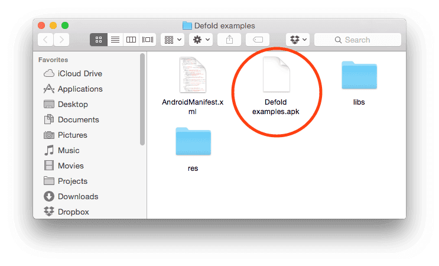
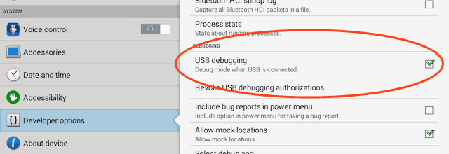

# Разработка для Android

Устройства Android позволяют свободно запускать на них собственные приложения. Очень легко создать версию вашей игры и скопировать ее на устройство Android. В этом руководстве описаны шаги, связанные с созданием вашей игры для Android. В процессе разработки  рекомендуется запускать игру через [development app](/manuals/dev-app), так как оно позволяет осуществлять горячую перезагрузку контента и кода по беспроводной связи прямо на устройство.

## Android и процесс подписания Google Play

Android требует, чтобы все APK были подписаны цифровым сертификатом перед установкой на устройство или обновлением. Если вы используете Android App Bundles, вам нужно подписать только ваш пакет приложений перед загрузкой в Play Console, а [Play App Signing](https://developer.android.com/studio/publish/app-signing#app-signing-google-play) позаботится обо всем остальном. Однако вы также можете вручную подписать свое приложение для загрузки в Google Play, других магазинов приложений и для распространения вне магазинов.

При создании пакета Android-приложений в редакторе Defold или с помощью [development app](/manuals/dev-app), вы можете указать файл keystore (содержащий ваш сертификат и ключ) и пароль keystore, который будет использоваться при подписании вашего приложения. Если вы этого не сделаете, Defold создаст отладочное keystore и будет использовать его при подписании пакета приложений.

::: important
Вы **никогда** не загружайте свое приложение в Google Play, если оно было подписано с использованием отладочного хранилища ключей. Всегда используйте специальное хранилище ключей, которое вы создали сами.
:::

## Создание хранилища ключей

::: sidenote
Процесс подписи Android в Defold изменился в версии 1.2.173 с использования отдельного ключа и сертификата на keystore. [Дополнительная информация в сообщении форума](https://forum.defold.com/t/upcoming-change-to-the-android-build-pipeline/66084).
:::

Вы можете создать хранилище ключей с помощью [Android Studio](https://developer.android.com/studio/publish/app-signing#generate-key) или из терминала/командной строки:

```bash
keytool -genkey -v -noprompt -dname "CN=John Smith, OU=Area 51, O=US Air Force, L=Unknown, ST=Nevada, C=US" -keystore mykeystore.keystore -storepass 5Up3r_53cR3t -alias myAlias -keyalg RSA -validity 9125
```

В результате будет создан файл keystore с именем `mykeystore.keystore`, содержащий ключ и сертификат. Доступ к ключу и сертификату будет защищен паролем `5Up3r_53cR3t`. Ключ и сертификат будут действительны в течение 25 лет (9125 дней). Сгенерированные ключ и сертификат будут идентифицированы псевдонимом `myAlias`.

::: important
Обязательно храните хранилище ключей и связанный с ним пароль в безопасном месте. Если вы подписываете и загружаете свои приложения в Google Play самостоятельно, а keystore или пароль keystore утерян, вы не сможете обновить приложение в Google Play. Вы можете избежать этого, используя Google Play App Signing и позволяя Google подписывать ваши приложения за вас.
:::


## Создание пакета приложений для Android

Редактор позволяет легко создать отдельный пакет приложений для вашей игры. Перед созданием пакета вы можете указать, какую иконку (иконки) использовать для приложения, установить код версии и т.д. в *game.project* [файл настроек проекта](/manuals/project-settings/#android).

Для создания пакета выберите в меню <kbd>Project ▸ Bundle... ▸ Android Application...</kbd>.

Если вы хотите, чтобы редактор автоматически создавал случайные отладочные сертификаты, оставьте поля *Keystore* и *Keystore password* пустыми:


Если вы хотите подписать свой пакет определенным хранилищем ключей, укажите *Keystore* и *Keystore password*. Ожидается, что *Keystore* будет иметь расширение файла `.keystore`, а пароль будет храниться в текстовом файле с расширением `.txt`:


Defold поддерживает создание файлов APK и AAB. Выберите APK или AAB из выпадающего списка Bundle Format.

Нажмите <kbd>Create Bundle</kbd>, когда вы настроите параметры пакета приложений. Затем вам будет предложено указать, где на вашем компьютере будет создан пакет.



:[Build Variants](../shared/build-variants.md)

### Установка пакета приложений для Android

### Установка APK

Файл *.apk* можно скопировать на устройство с помощью инструмента `adb` (см. ниже) или в Google Play через [консоль разработчика Google Play](https://play.google.com/apps/publish/).

```
$ adb install Defold\ examples.apk
4826 КБ/с (18774344 байта за 3,798 с)
  pkg: /data/local/tmp/my_app.apk
Успех
```

#### Установка AAB

Файл *.aab* можно загрузить в Google Play через [консоль разработчика Google Play](https://play.google.com/apps/publish/). Также можно сгенерировать *.apk* файл из *.aab* файла для локальной установки с помощью [Android bundletool](https://developer.android.com/studio/command-line/bundletool).

## Разрешения

Движок Defold требует ряд различных разрешений для работы всех функций движка. Разрешения определяются в `AndroidManifest.xml`, указанном в *game.project* [файл настроек проекта](/manuals/project-settings/#android). Подробнее о разрешениях Android можно прочитать в [официальных документах](https://developer.android.com/guide/topics/permissions/overview). В манифесте по умолчанию запрашиваются следующие разрешения:

### android.permission.INTERNET и android.permission.ACCESS_NETWORK_STATE (Уровень защиты: нормальный)
Позволяет приложениям открывать сетевые сокеты и получать доступ к информации о сетях. Эти разрешения необходимы для доступа в Интернет. ([Android official docs](https://developer.android.com/reference/android/Manifest.permission#INTERNET)) и ([Android official docs](https://developer.android.com/reference/android/Manifest.permission#ACCESS_NETWORK_STATE)).

### android.permission.WRITE_EXTERNAL_STORAGE (Уровень защиты: опасный)
Позволяет приложению записывать данные во внешнее хранилище. Начиная с уровня API 19, это разрешение не требуется для чтения/записи файлов в специфических для вашего приложения каталогах, возвращаемых Context.getExternalFilesDir(String) и Context.getExternalCacheDir(). Это разрешение необходимо, если вы собираетесь сохранять/загружать файлы с диска (используя io.* или sys.save/load) за пределами папки, указанной [sys.get_save_file()](/ref/sys/#sys.get_save_file:application_id-file_name) и имеете `android:minSdkVersion`, установленный уровень менее 19 в манифесте Android. ([Официальные документы Android](https://developer.android.com/reference/android/Manifest.permission#WRITE_EXTERNAL_STORAGE)).

### android.permission.WAKE_LOCK (Уровень защиты: нормальный)
Позволяет использовать блокировку PowerManager WakeLocks для предотвращения засыпания процессора или затемнения экрана. Это разрешение необходимо для временного предотвращения засыпания устройства при получении push-уведомления. ([Официальные документы Android](https://developer.android.com/reference/android/Manifest.permission#WAKE_LOCK))

## Android Debug Bridge

Инструмент командной строки `adb` - это простая в использовании и универсальная программа, которая используется для взаимодействия с устройствами Android. Вы можете загрузить и установить `adb` как часть Android SDK Platform-Tools, для Mac, Linux или Windows.

Загрузите Android SDK Platform-Tools с сайта: https://developer.android.com/studio/releases/platform-tools. Вы найдете инструмент *adb* в */platform-tools/*. Также, пакеты для конкретной платформы можно установить через соответствующие менеджеры пакетов.

Ubuntu Linux:

```
$ sudo apt-get install android-tools-adb
```

Fedora 18/19:

```
$ sudo yum install android-tools
```

macOS (Homebrew)

```
$ brew cask install android-platform-tools
```

Вы можете убедиться, что `adb` работает, подключив устройство Android к компьютеру через USB и выполнив следующую команду:

```
$ adb devices
List of devices attached
31002535c90ef000    device
```

Если устройство не отображается, убедитесь, что на устройстве Android включена *USB-отладка*. Откройте *Настройки* устройства и найдите *Опции разработчика* (или *Разработка*).



## Отладка пакета приложений

Пакет, собранный в режиме отладки (т.е. "Debug" выбран в качестве варианта при сборке), будет отправлять весь свой консольный вывод в системный журнал Android. Получите доступ к журналу с помощью инструмента `adb` и дайте команду `logcat`. Возможно, вы захотите отфильтровать вывод по тегу (`-s [tagname]`):

```
$ adb logcat -s "defold"
--------- beginning of /dev/log/system
--------- beginning of /dev/log/main
I/defold  ( 6210): INFO:DLIB: SSDP started (ssdp://192.168.0.97:58089, http://0.0.0.0:38637)
I/defold  ( 6210): INFO:ENGINE: Defold Engine 1.2.50 (8d1b912)
I/defold  ( 6210): INFO:ENGINE: Loading data from:
I/defold  ( 6210): INFO:ENGINE: Initialised sound device 'default'
I/defold  ( 6210):
D/defold  ( 6210): DEBUG:SCRIPT: Hello there, log!
...
```


## Использование AndroidX
AndroidX - это значительное улучшение оригинальной библиотеки поддержки Android, которая больше не поддерживается. Пакеты AndroidX полностью заменяют библиотеку поддержки, предоставляя паритет возможностей и новые библиотеки. Большинство расширений Android на [портале ассетов](/assets) поддерживают AndroidX. Если вы не хотите использовать AndroidX, вы можете отключить его в пользу старой библиотеки поддержки Android:

1. Если у вас уже есть манифест приложения, добавьте `jetifier: false` в `armv7-android` и `arm64-android`.

2. Если у вас нет файла манифеста приложения, перейдите по ссылке [Defold App Manifest generator](https://britzl.github.io/manifestation/) и установите флажок "Use Android Support lib".


## FAQ
:[Android FAQ](../shared/android-faq.md)
