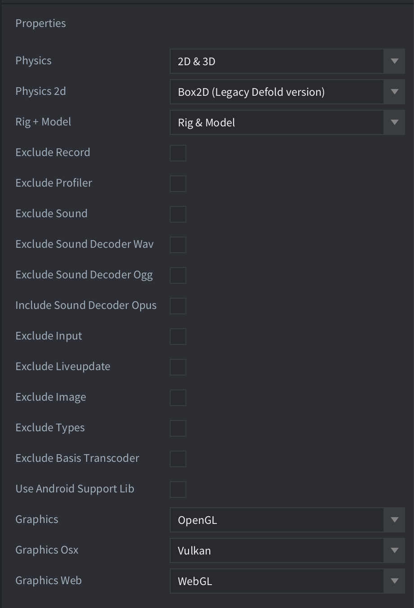

# App Manifest

Манифест приложения используется для исключения возможностей движка или управления тем, какие функции должны быть включены в движок. Исключение неиспользуемых возможностей движка является рекомендуемой практикой, поскольку это уменьшает итоговый размер бинарного файла вашей игры.
Кроме того, манифест приложения содержит ряд параметров для управления компиляцией кода для платформы HTML5, например минимально поддерживаемые версии браузеров и настройки памяти, что также может влиять на итоговый размер бинарного файла.

# Применение манифеста

В `game.project` назначьте манифест в разделе `Native Extensions` -> `App Manifest`.

## Physics

Позволяет выбрать, какой физический движок использовать, либо выбрать `None`, чтобы полностью исключить физику.

## Physics 2d

Позволяет выбрать, какую версию Box2D использовать.

## Rig + Model

Позволяет управлять функциональностью rig и model, либо выбрать `None`, чтобы полностью исключить модели и риги. См. [документацию по `Model`](https://defold.com/manuals/model/#model-component).

## Exclude Record

Исключает из движка возможность записи видео. См. документацию по сообщению [`start_record`](https://defold.com/ref/stable/sys/#start_record).

## Exclude Profiler

Исключает профилировщик из движка. Профилировщик используется для сбора счётчиков производительности и использования ресурсов. Подробнее см. в [руководстве по профилированию](/manuals/profiling/).

## Exclude Sound

Исключает из движка всю функциональность воспроизведения звука.

## Exclude Input

Исключает из движка всю обработку ввода.

## Exclude Live Update

Исключает из движка [функциональность Live Update](/manuals/live-update).

## Exclude Image

Исключает из движка скриптовый модуль `image`: [документация](https://defold.com/ref/stable/image/).

## Exclude Types

Исключает из движка скриптовый модуль `types`: [документация](https://defold.com/ref/stable/types/).

## Exclude Basis Universal

Исключает из движка библиотеку сжатия текстур Basis Universal. Подробнее см. в [руководстве по профилям текстур](/manuals/texture-profiles).

## Use Android Support Lib

Использует устаревшую Android Support Library вместо Android X. [Подробнее](https://defold.com/manuals/android/#using-androidx).

## Graphics

Позволяет выбрать, какой графический backend использовать.

* OpenGL - включать только OpenGL.
* Vulkan - включать только Vulkan.
* OpenGL and Vulkan - включать одновременно OpenGL и Vulkan. Vulkan будет использоваться по умолчанию, а при его недоступности произойдёт откат на OpenGL.

## Use full text layout system

Если включено (`true`), это позволит использовать генерацию во время выполнения для шрифтов типа SDF при использовании в проекте шрифтов True Type (`.ttf`). Подробнее см. в [руководстве по шрифтам](https://defold.com/manuals/font/#enabling-runtime-fonts).

## Minimum Safari version (только для js-web и wasm-web)

Имя поля в YAML: **`minSafariVersion`**
Значение по умолчанию: **90000**

Минимально поддерживаемая версия Safari. Не может быть меньше `90000`. Подробнее см. в параметрах компилятора Emscripten: [ссылка](https://emscripten.org/docs/tools_reference/settings_reference.html?highlight=environment#min-safari-version).

## Minimum Firefox version (только для js-web и wasm-web)

Имя поля в YAML: **`minFirefoxVersion`**
Значение по умолчанию: **34**

Минимально поддерживаемая версия Firefox. Не может быть меньше `34`. Подробнее см. в параметрах компилятора Emscripten: [ссылка](https://emscripten.org/docs/tools_reference/settings_reference.html?highlight=environment#min-firefox-version).

## Minimum Chrome version (только для js-web и wasm-web)

Имя поля в YAML: **`minChromeVersion`**
Значение по умолчанию: **32**

Минимально поддерживаемая версия Chrome. Не может быть меньше `32`. Подробнее см. в параметрах компилятора Emscripten: [ссылка](https://emscripten.org/docs/tools_reference/settings_reference.html?highlight=environment#min-chrome-version).

## Initial memory (только для js-web и wasm-web)

Имя поля в YAML: **`initialMemory`**
Значение по умолчанию: **33554432**

Размер памяти, выделяемой для веб-приложения. Если `ALLOW_MEMORY_GROWTH=0` (js-web), это общий объём памяти, который может использовать веб-приложение. Подробнее см. [здесь](https://emscripten.org/docs/tools_reference/settings_reference.html?highlight=environment#initial-memory). Значение задаётся в байтах. Обратите внимание, что оно должно быть кратно размеру страницы WebAssembly (`64KiB`).

Этот параметр связан с `html5.heap_size` в *game.project*: [ссылка](https://defold.com/manuals/html5/#heap-size). Значение, настроенное через манифест приложения, задаётся во время компиляции и используется как значение по умолчанию для параметра `INITIAL_MEMORY`. Значение из *game.project* переопределяет значение из манифеста приложения и используется во время выполнения.

## Stack size (только для js-web и wasm-web)

Имя поля в YAML: **`stackSize`**
Значение по умолчанию: **5242880**

Размер стека приложения. Подробнее см. [здесь](https://emscripten.org/docs/tools_reference/settings_reference.html?highlight=environment#stack-size). Значение задаётся в байтах.
