# Жизненный цикл приложения

Жизненный цикл приложения или игры на Defold в целом прост. Движок проходит через три стадии выполнения: инициализацию, цикл обновления (в котором приложение или игра проводит большую часть времени) и финализацию.

::: sidenote
Это руководство описывает поведение Defold начиная с версии 1.12.0. В версии 1.12.0 были внесены изменения в жизненный цикл и добавлена новая функция `late_update()`.
:::

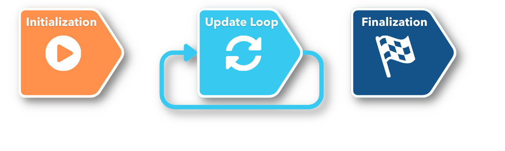

Во многих случаях достаточно лишь базового понимания того, как работает Defold внутри. Однако иногда встречаются пограничные случаи, где точный порядок выполнения задач движком становится критически важным. В этом документе описано, как движок запускает приложение от начала до конца.

Приложение начинает работу с инициализации всего, что нужно для запуска движка. Затем загружается главная коллекция и у всех загруженных компонентов, имеющих Lua-функцию `init()` (script-компоненты и GUI-компоненты с GUI-скриптами), вызывается [`init()`](/ref/go#init). Это позволяет выполнить пользовательскую инициализацию.

После этого приложение входит в цикл обновления, в котором и проводит большую часть времени. В каждом кадре обновляются игровые объекты и содержащиеся в них компоненты. Вызываются все функции [`update()`](/ref/go#update) в script- и GUI-скриптах. Во время цикла обновления сообщения доставляются адресатам, воспроизводятся звуки и отрисовывается графика.

В какой-то момент жизненный цикл приложения заканчивается. Перед завершением работы движок выходит из цикла обновления и переходит к стадии финализации. Он подготавливает все загруженные игровые объекты к удалению. Затем у всех компонентов объекта вызываются функции [`final()`](/ref/go#final), что позволяет выполнить пользовательскую очистку. После этого объекты удаляются, а главная коллекция выгружается.

Шаги, входящие в проход ["диспетчеризации сообщений"](#dispatching-messages), для наглядности показаны отдельной диаграммой в конце этого руководства и отмечены на схемах маленькой иконкой "конверт со стрелкой" 📩.

## Инициализация

Именно здесь запускается ваша игра. Это первый этап работающего приложения, и его можно разделить на 3 фазы:

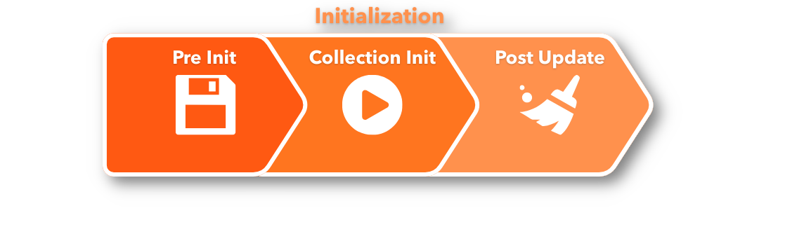

### Предварительная инициализация

Во время фазы `Preinitialization`, до загрузки главной (bootstrap) коллекции, движок выполняет множество шагов. Настраиваются профилировщик памяти, сокеты, графика, HID (устройства ввода), звук, физика и многое другое. Также загружается и настраивается конфигурация приложения (*game.project*).

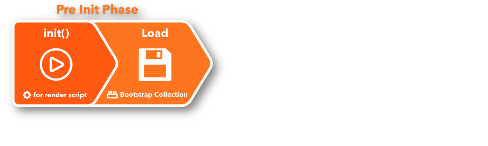

Первая подконтрольная пользователю точка входа в конце инициализации движка - это вызов функции `init()` текущего render-скрипта.

После этого загружается и инициализируется главная коллекция.

### Инициализация коллекции

Во время фазы `Collection Init` все игровые объекты в коллекции применяют свои трансформации - перемещение, вращение и масштабирование - к дочерним объектам. Затем вызываются все существующие функции `init()` компонентов.

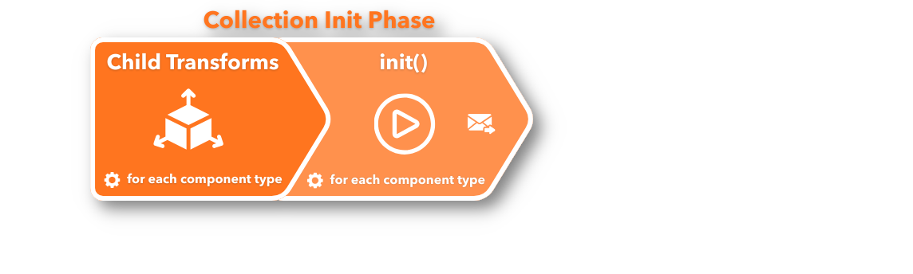

::: sidenote
Порядок, в котором вызываются функции `init()` у компонентов игровых объектов, не определен. Не стоит полагаться на то, что движок инициализирует объекты одной и той же коллекции в каком-то конкретном порядке.
:::

### Post Update во время инициализации

Затем движок выполняет полный проход `Post Update` - тот же самый проход, который позже выполняется после каждого шага `Update Loop`. Он выполняется в конце инициализации, потому что ваш код в `init()` может отправлять сообщения, давать фабрикам команду на создание объектов, помечать объекты на удаление и выполнять другие действия.

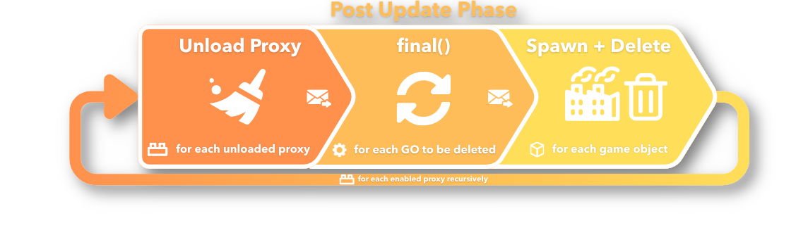

Этот проход выполняет доставку сообщений, фактическое создание игровых объектов через фабрики и удаление объектов. Обратите внимание: проход `Post Update` включает последовательность "диспетчеризации сообщений", которая не только доставляет поставленные в очередь сообщения, но и обрабатывает сообщения, отправленные collection proxy. Любые последующие обновления proxy (enable, disable, init, final, loading и mark for unloading) выполняются именно на этих шагах.

Во время `init()` вполне возможно загрузить [collection proxy](/manuals/collection-proxy), убедиться, что все содержащиеся в ней объекты инициализированы, а затем выгрузить коллекцию через proxy - и все это до первого вызова `update()`, то есть еще до того, как движок покинет стадию инициализации и перейдет в цикл обновления:

```lua
function init(self)
    print("init()")
    msg.post("#collectionproxy", "load")
end

function update(self, dt)
    -- Proxy-коллекция выгружается до того, как выполнение дойдет до этого кода.
    print("update()")
end

function on_message(self, message_id, message, sender)
    if message_id == hash("proxy_loaded") then
        print("proxy_loaded. Init, enable and then unload.")
        msg.post("#collectionproxy", "init")
        msg.post("#collectionproxy", "enable")
        msg.post("#collectionproxy", "unload")
        -- Функции init() и final() объектов proxy-коллекции
        -- вызываются до того, как дойдет очередь до update() этого объекта
    end
end
```

## Цикл обновления

Update Loop выполняет определенную последовательность действий один раз за кадр. Эту последовательность можно разделить на 5 основных фаз:

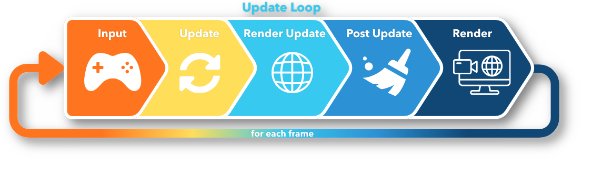

1. Input (обработка ввода)
2. Update (включая Fixed, Regular, Late и обновления компонентов движка)
3. Render Update
4. Post Update (выгрузка collection proxy, создание и удаление игровых объектов)
5. Frame Render (финальная отрисовка графики)

### Фаза Input

Ввод считывается с доступных устройств, сопоставляется с [input bindings](/manuals/input), а затем диспетчеризируется. Любой игровой объект, получивший фокус ввода, получает ввод во все функции `on_input()` своих компонентов. Игровой объект со script-компонентом и GUI-компонентом с GUI-скриптом будет получать ввод в обе функции `on_input()`, если они определены и объект получил фокус ввода.

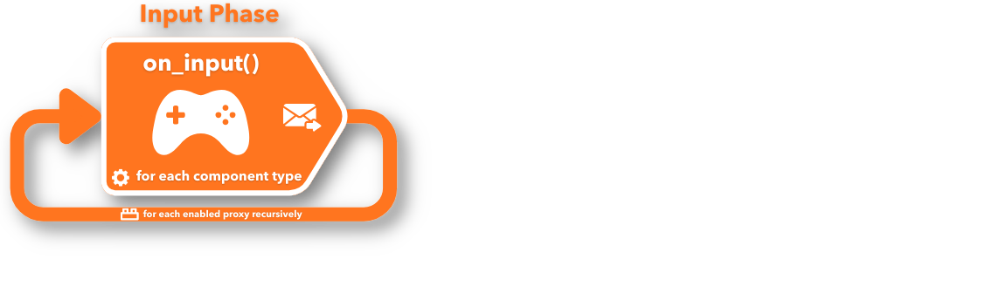

Любой игровой объект, получивший фокус ввода и содержащий collection proxy, передает ввод компонентам внутри proxy-коллекции. Этот процесс продолжается рекурсивно вниз по всем включенным collection proxy внутри других включенных collection proxy.

### Фаза Update

Фаза `Update` является частью цикла Update Loop. Она запускается один раз для корневой коллекции, а затем рекурсивно выполняется для каждой включенной collection proxy.

Внутри коллекции Defold обрабатывает колбэки по типам компонентов: движок проходит по всем экземплярам типа компонента, который реализует соответствующий этап, вызывает Lua-колбэк для каждого экземпляра, сбрасывает сообщения и затем переходит к следующему типу компонента.

Высокоуровневый порядок стадий Lua-колбэков у *script*-компонентов такой:

1. `fixed_update()` - вызывается 0..N раз за кадр (если используется fixed timestep)
2. `update()` - вызывается 1 раз за кадр
3. `late_update()` - вызывается 1 раз за кадр

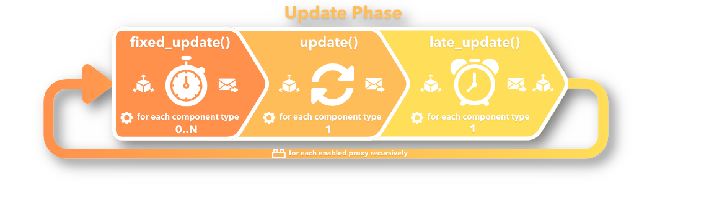

Затем движок проходит по каждому компоненту игрового объекта в главной коллекции. Если у компонента есть script с функцией `fixed_update()`/`update()`/`late_update()`, то она будет вызвана. Если компонент является collection proxy, каждый компонент внутри proxy-коллекции рекурсивно обновляется со всеми шагами фазы `Update`.

::: sidenote
Порядок вызова функций `update()` у компонентов игровых объектов не определен. Не стоит полагаться на то, что движок обновляет объекты одной и той же коллекции в каком-то конкретном порядке. То же относится и к `fixed_update()` и `late_update()` (начиная с 1.12.0).
:::

#### Физика

Для компонентов collision object физические сообщения (столкновения, триггеры, ответы ray cast и т.д.) рассылаются по всему игровому объекту всем компонентам, содержащим script с функцией `on_message()`.

Если для физической симуляции используется [fixed timestep](/manuals/physics/#physics-updates), у всех script-компонентов также может вызываться функция `fixed_update()`. Она полезна в играх с физикой, когда требуется изменять физические объекты через равные интервалы времени, чтобы добиться стабильной симуляции.

#### Трансформации

Перед **каждым** обновлением типа компонента, при необходимости и несколько раз в течение `Update Loop`, обновляются трансформации: к каждому компоненту игрового объекта и ко всем компонентам дочерних игровых объектов применяется перемещение, вращение и масштабирование объекта.

Если требуется, в конце `Update Loop` выполняется еще одно дополнительное финальное обновление трансформаций.

#### Фаза Engine Update (без fixed updates)

Таблицы ниже описывают проходы обновления на *уровне движка*. Они намеренно не показывают точный внутренний приоритет типов компонентов (это деталь реализации движка), но отражают порядок, важный для скриптов:

- `fixed_update()` выполняется до `update()`
- `late_update()` выполняется после `update()`
- поставленные в очередь сообщения сбрасываются между обновлениями типов компонентов, а также между стадиями script-колбэков

Когда `Use Fixed Timestep` равно `false` и/или Fixed Update Frequency равно `0`, в начале этой фазы подготавливается `dt`, а затем выполнение идет по следующей таблице:

::: sidenote
Обратите внимание: после обновления **каждого** типа компонента все сообщения диспетчеризируются. Чтобы не перегружать таблицу, это в ней не отмечено.
:::

| Шаг | Фаза движка | Lua-колбэк | Комментарий |
|-|-|-|-|
| 1 | **Update** | `update()` | Вызывается один раз за кадр для каждого типа компонента, реализующего Update, в соответствии с внутренним порядком приоритетов. Дополнительно здесь как отдельный тип компонента обновляются анимации свойств GO, запущенные через `go.animate()`. Здесь же обновляются **physics**-компоненты. Для каждой включенной Collection Proxy вся фаза `Update` вызывается рекурсивно, начиная с шага 1. |
| 2 | **Late Update** | `late_update()` | Вызывается один раз за кадр для каждого типа компонента, реализующего Late Update, в соответствии с внутренним порядком приоритетов. |
| 3 | **Transforms** | | При необходимости в конце выполняется еще одно дополнительное финальное обновление трансформаций для каждого компонента. |

#### Фаза Engine Update с Fixed Timestep

Когда `Use Fixed Timestep` равно `true`, а Fixed Update Frequency не равно нулю, в начале этой фазы движок подготавливает `dt` (delta time), `fixed_dt` и `num_fixed_steps` (`0..N`) - то есть сколько раз нужно вызвать fixed update, исходя из времени, прошедшего с предыдущего обновления, чтобы сохранить фиксированный шаг.

::: sidenote
Обратите внимание: после обновления **каждого** типа компонента все сообщения диспетчеризируются. Чтобы не перегружать таблицу, это в ней не отмечено.
:::

После этого выполняется следующий цикл:

| Шаг | Фаза движка | Lua-колбэк | Комментарий |
|-|-|-|-|
| 1 | **Fixed Update** | `fixed_update()` | Вызывается `0..N` раз за кадр в зависимости от тайминга для каждого типа компонента, реализующего Fixed Update, в соответствии с внутренним порядком приоритетов. Сюда входят и шаги Fixed Update для *physics*-компонентов. |
| 2 | **Update** | `update()` | Вызывается один раз за кадр для каждого типа компонента, реализующего Update, в соответствии с внутренним порядком приоритетов. Дополнительно здесь как отдельный тип компонента обновляются анимации свойств GO, запущенные через `go.animate()`. Для каждой включенной Collection Proxy фаза `Update` вызывается рекурсивно начиная с шага 1. |
| 3 | **Late Update** | `late_update()` | Вызывается один раз за кадр для каждого типа компонента, реализующего Late Update, в соответствии с внутренним порядком приоритетов. |
| 4 | **Transforms** | | При необходимости в конце выполняется еще одно дополнительное финальное обновление трансформаций для каждого компонента. |

Если вам когда-либо понадобятся более детальные сведения о том, как Defold работает внутри во время фазы Update, стоит напрямую посмотреть код [`gameobject.cpp`](https://github.com/defold/defold/blob/dev/engine/gameobject/src/gameobject/gameobject.cpp).

### Фаза Render Update

Блок render update сначала диспетчеризирует все сообщения, отправленные в сокет `@render` (например, сообщения компонента камеры `set_view_projection`, сообщения `set_clear_color` и т.д.). Затем вызывается `update()` render-скрипта.


### Фаза Post Update

После обновлений запускается последовательность post update. Она выгружает из памяти collection proxy, помеченные для выгрузки (это происходит во время последовательности "диспетчеризации сообщений"). Любой игровой объект, помеченный на удаление, вызывает функции `final()` у всех своих компонентов, если они есть. Код в `final()` часто отправляет новые сообщения в очередь, поэтому после этого снова выполняется проход "диспетчеризации сообщений".

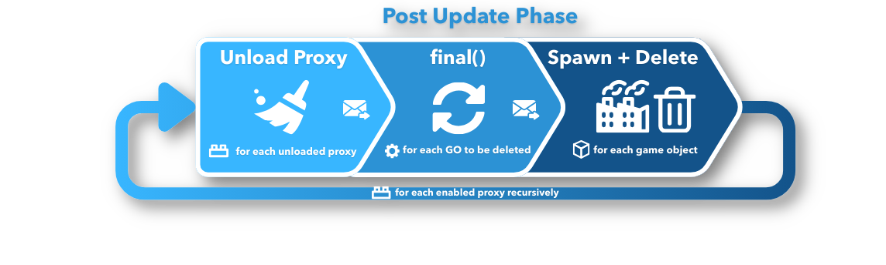

Затем любой компонент factory, получивший команду создать игровой объект, сделает это. Наконец, игровые объекты, помеченные на удаление, действительно удаляются.

### Фаза Render

Последний шаг в цикле обновления включает диспетчеризацию сообщений `@system` (`exit`, `reboot`, переключение профайлера, запуск и остановка захвата видео и т.д.).

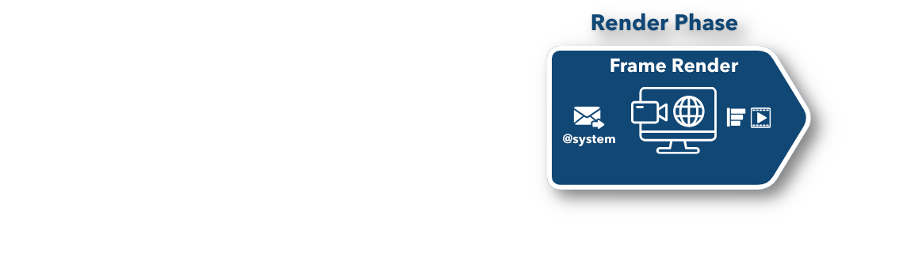

После этого отрисовывается графика, а также визуальный профайлер (см. [руководство по отладке](/manuals/debugging)). По завершении рендеринга графики выполняется захват видео.

#### Частота кадров и временной шаг коллекции

Количество обновлений кадра в секунду (то есть количество проходов цикла обновления в секунду) можно задать в настройках проекта или программно, отправив сообщение `set_update_frequency` в сокет `@system`. Кроме того, можно отдельно задать _time step_ для collection proxy, отправив ей сообщение `set_time_step`. Изменение time step коллекции не влияет на частоту кадров. Оно влияет на time step физического обновления, а также на переменную `dt`, передаваемую в `update()`. Также стоит помнить, что изменение time step не меняет количество вызовов `update()` в кадре - оно всегда ровно 1.

(Подробности см. в [руководстве по Collection Proxy](/manuals/collection-proxy) и в описании [`set_time_step`](/ref/collectionproxy#set-time-step))

#### Троттлинг движка

В Defold 1.12.0 появился API троттлинга движка, который позволяет полностью пропускать обновление движка и рендеринг, при этом все еще отслеживая ввод. Любой ввод снова "будит" движок, и после периода охлаждения движок может снова перейти в режим троттлинга.

Подробности и примеры использования см. в API `sys.set_engine_throttle()`.

## Финализация

Когда приложение завершает работу, оно сначала завершает последнюю последовательность цикла обновления, в ходе которой выгружаются все collection proxy: финализируются и удаляются все игровые объекты в каждой proxy-коллекции.

После этого движок переходит к последовательности финализации, которая обрабатывает главную коллекцию и ее объекты:

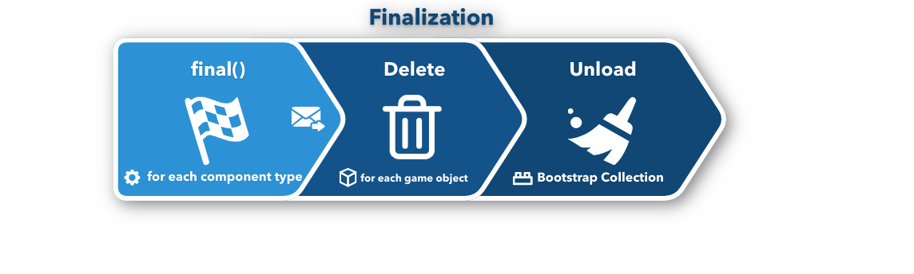

Сначала вызываются функции `final()` компонентов. Затем следует еще один проход диспетчеризации сообщений. Наконец, все игровые объекты удаляются, а главная коллекция выгружается.

После этого движок завершает работу внутренних подсистем: удаляется конфигурация проекта, отключается профилировщик памяти и так далее.

На этом приложение считается полностью завершенным.

## Диспетчеризация сообщений

**Диспетчеризация сообщений** - это специальный проход, который выполняется после обновления **каждого** типа компонента: например, после обновления sprite, script и любого другого действия, которое может отправить сообщения. Во время этого прохода все ранее отправленные сообщения, собранные в очереди, диспетчеризируются. На диаграммах эти места отмечены маленькой иконкой "конверт со стрелкой" 📩.

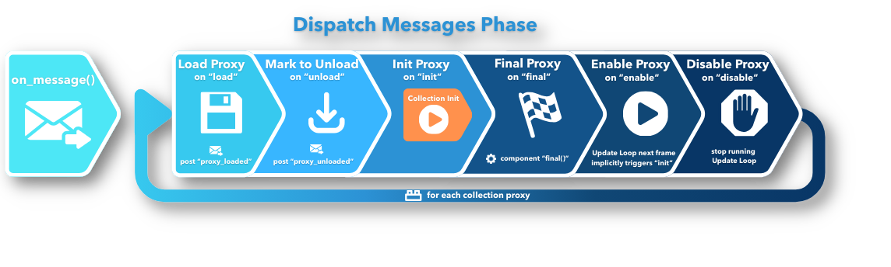

После того как все **пользовательские сообщения** доставлены через вызовы `on_message()` для каждого компонента, специальные сообщения Defold обрабатываются в следующем порядке (как и показано на диаграмме) для каждой collection proxy:

1. сообщения `load` - загружают collection proxy, помеченные на загрузку, и в ответ отправляют сообщение `proxy_loaded`
2. сообщения `unload` - выгружают collection proxy, помеченные на выгрузку, и в ответ отправляют сообщение `proxy_unloaded`
3. сообщения `init` - запускают фазу `Collection Init` для всех collection proxy, которые должны быть инициализированы
4. сообщения `final` - вызывают `final()` у всех компонентов proxy, помеченных на финализацию
5. сообщения `enable` - включают collection proxy, и в следующем кадре для нее начнет выполняться `Update Loop`; это также неявно вызывает `init()` для каждого компонента коллекции
6. сообщения `disable` - отключают collection proxy, поэтому в следующем кадре для нее **не** будет выполняться `Update Loop`; цикл обновления для нее полностью останавливается

Поскольку код `on_message()` у любого компонента-получателя может отправить дополнительные сообщения, диспетчер сообщений будет продолжать рекурсивно обрабатывать отправленные сообщения, пока очередь не опустеет. Однако существует ограничение на то, сколько раз диспетчер сообщений может пройти по очереди. Подробности см. в разделе [Цепочки сообщений](/manuals/message-passing).
