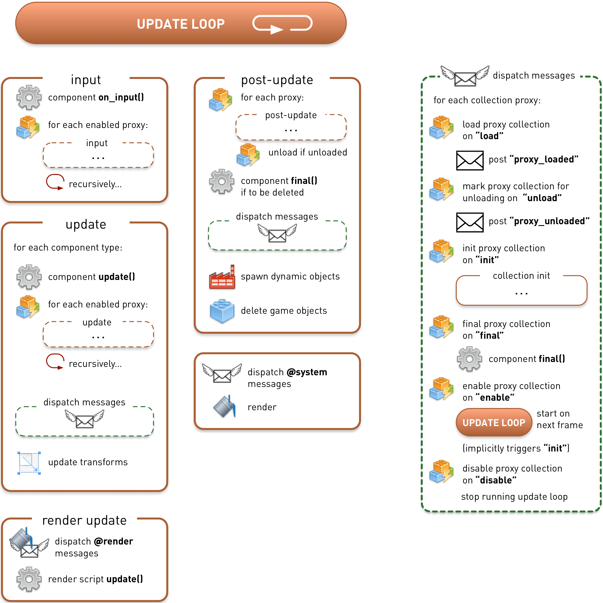

# Жизненный цикл приложения

Жизненный цикл приложения или игры, созданных в Defold, в целом прост. Движок проходит три стадии выполнения: инициализация, цикл обновления (в котором приложения и игры проводят большую часть времени) и финальная стадия.


В большинстве случаев необходимо лишь элементарное понимание внутренних рабочих процессов Defold. Однако возможны случаи, когда точный порядок исполнения задач становится критически важным. В этом документе описывается, как движок запускает приложение от начала и до конца.

Загрузка приложения начинается с инициализации всех составляющих, необходимых для запуска движка. Происходит загрузка главной коллекции и вызов [`init()`](/ref/go#init) во всех загруженных компонентах, имеющих Lua-функцию `init()` (компоненты Script и GUI с GUI-скриптами). Это дает возможность выполнять пользовательскую инициализацию.

Затем приложение входит в цикл обновления, в котором оно будет находиться большую часть времени своего жизненного цикла. В каждом кадре обновляются игровые объекты и содержащиеся в них компоненты. Вызываются любые функции [`update()`](/ref/go#update) в скриптах и GUI-скриптах. В ходе цикла обновления адресатам отправляются сообщения, воспроизводятся звуки и отрисовывается вся графическая составляющая.

В какой-то момент жизненный цикл приложения завершается. Перед завершением приложения движок выходит из цикла обновления и вступает в стадию завершения. Он подготавливает все загруженные игровые объекты к удалению. Вызываются функции [`final()`](/ref/go#final) всех компонентов объекта, что позволяет произвести пользовательскую очистку. Затем объекты удаляются, а основная коллекция выгружается.

## Инициализация

Эта диаграмма подробно иллюстрирует шаги инициализации. Этапы, связанные с передачей "посланных сообщений" (непосредственно перед "порождением динамических объектов"), для наглядности были вынесены в отдельный блок справа.


На самом деле движок выполняет гораздо больше шагов во время инициализации перед загрузкой основной коллекции. Происходит настройка профилировщика памяти, сокетов, графики, HID (устройств ввода), звука, физики и т.д. Кроме того, загружается и настраивается конфигурация приложения (*game.project*).

Первой подконтрольной пользователю точкой входа в конце инициализации движка является вызов функции `init()` актуального рендер-скрипта.

Затем загружается и инициализируется основная коллекция. Все игровые объекты в коллекции применяют свои трансформации (перемещение (изменение положения), вращение и масштабирование) к своим дочерним объектам. После этого вызываются все существующие функции `init()` компонентов.

::: sidenote
Порядок, в котором вызываются функции `init()` компонентов игровых объектов, не определен. Не следует считать, что движок инициализирует объекты, принадлежащие одной коллекции, в определенном порядке.
:::

Поскольку код функции `init()` может посылать новые сообщения, приказывать фабрикам порождать новые объекты, отмечать объекты для удаления и совершать другие действия, движок осуществляет очередной полный проход "постобновления". Этот проход выполняет доставку сообщений, фактическое порождение игровых объектов фабриками и удаление объектов. Следует иметь в виду, что проход постобновления включает последовательность "диспетчеризации сообщений", которая не только отправляет все поставленные в очередь сообщения, но и обрабатывает сообщения, отправленные прокси коллекциям. Любые последующие обновления прокси (включение и отключение, загрузка и пометка для выгрузки) выполняются во время этих шагов.

Изучение приведенной выше диаграммы показывает, что вполне возможно загрузить [прокси-коллекцию](/manuals/collection-proxy) во время `init()`, обеспечить инициализацию всех содержащихся в ней объектов, а затем выгрузить коллекцию через прокси --- и все это до вызова `update()` первого компонента, то есть до того, как движок выйдет из стадии инициализации и войдет в цикл обновления:

```lua
function init(self)
    print("init()")
    msg.post("#collectionproxy", "load")
end

function update(self, dt)
    -- Прокси-коллекция выгружается до того, как этот код будет достигнут.
    print("update()")
end

function on_message(self, message_id, message, sender)
    if message_id == hash("proxy_loaded") then
        print("proxy_loaded. Init, enable and then unload.")
        msg.post("#collectionproxy", "init")
        msg.post("#collectionproxy", "enable")
        msg.post("#collectionproxy", "unload")
        -- Функции init() и final() объектов прокси-коллекции
        -- вызываются до того, как будет достигнута функция update() этого объекта
    end
end
```

## Цикл обновления

Цикл обновления проходит через длинную последовательность один раз в каждом кадре. Последовательность обновления на диаграмме ниже разделена логически на блоки последовательности для наглядности. "Диспетчеризация сообщений" также разбита отдельно по той же причине:



## Ввод

Ввод считывается с доступных устройств, сопоставляется с [привязкой ввода](/manuals/input) и затем диспетчеризируется. Любой игровой объект, получивший фокус ввода, получает ввод, отправляемый всем функциям `on_input()` его компонентов. Игровой объект со скриптом и компонент GUI с GUI-скриптом будут получать ввод в функции `on_input()` своих компонентов, с учетом того, что они определены и что они получили фокус ввода.

Любой игровой объект, получивший фокус ввода и содержащий прокси-коллекции, направляет ввод компонентам внутри этой прокси-коллекции. Этот процесс продолжается рекурсивно вниз по включенным прокси-коллекциям внутри включенных прокси-коллекций.

## Обновление

Каждый компонент игрового объекта в основной коллекции будет обследован. Если у какого-либо из этих компонентов имеется функция `update()`, то вызывается именно она. Если компонент является прокси-коллекцией, то каждый компонент в прокси-коллекции рекурсивно обновляется с выполнением всех шагов в последовательности "обновления", представленной на диаграмме выше.

::: sidenote
Если используется [фиксированный временной шаг для физической симуляции](/manuals/physics/#physics-updates), может также вызываться функция `fixed_update()` во всех скриптовых компонентах. Эта функция полезна в играх, основанных на физике, когда требуется манипулировать физическими объектами с регулярными интервалами для достижения стабильной симуляции.
:::

::: sidenote
Порядок вызова функций `update()` компонентов игровых объектов не определен. Не следует полагать, что движок обновляет объекты, принадлежащие одной коллекции, в определенном порядке.
:::

На следующем этапе все отправленные сообщения диспетчеризируются. Поскольку код `on_message()` любого компонента-приемника может отправлять дополнительные сообщения, диспетчер сообщений будет продолжать диспетчеризацию отправленных сообщений до тех пор, пока очередь сообщений не опустеет. Однако существует ограничение на количество проходов по очереди сообщений, выполняемых диспетчером сообщений. За подробностями обращайтесь к [руководству по передачи сообщений](/manuals/message-passing) и к разделу "Дополнительные темы".

Для объектов столкновения, сообщения физики (столкновения, триггеры, ответы ray_cast и т.д.) рассылаются по всему объемлющему игровому объекту всем компонентам, которые содержат скрипт с функцией `on_message()`.

Затем осуществляются трансформации, применяя любое перемещение, вращение и масштабирование игрового объекта к каждому его компоненту и всем компонентам дочерних игровых объектов.

## Рендер обновление

Рендер обновление блокирует диспетчеризацию сообщений в сокет `@render` (сообщение камеры `set_view_projection`, сообщение `set_clear_color` и др.). Также вызывается `update()` в рендер-скрипте.

## Постобновление

После обновлений выполняется последовательность постобновления. Она выгружает из памяти прокси-коллекции, которые помечены для выгрузки (это происходит во время последовательности "диспетчеризации сообщений"). Любой игровой объект, помеченный для удаления, вызывает функции `final()` всех своих компонентов, если таковые имеются. Код в функциях `final()` часто посылает новые сообщения в очередь, поэтому после этого выполняется проход "диспетчеризации сообщений".

Далее любой компонент Factory, которому было указано породить игровой объект, выполнит это. Наконец, игровые объекты, помеченные для удаления, действительно удаляются.

Последний шаг в цикле обновления включает отправку `@system`-сообщений (сообщения `exit`, `reboot`, переключение профайлера, запуск и остановка захвата видео и т.д.). Затем происходит рендеринг графики. Во время рендеринга графики производится захват видео, а также визуальный профайлер (см. [документацию по отладке](/manuals/debugging).)

## Частота кадров и временной шаг коллекции

Количество кадров, обновляемых в секунду (что равно количеству циклов обновления в секунду), можно установить в настройках проекта или программно, отправив сообщение `set_update_frequency` в сокет `@system`. Кроме того, можно установить _шаг времени_ для прокси-коллекции индивидуально, отправив в прокси сообщение `set_time_step`. Изменение временного шага коллекции не влияет на частоту кадров. Оно влияет на шаг времени обновления физики, а также на переменную `dt`, передаваемую в `update().` Кроме того, следует отметить, что изменение шага времени не изменяет количество вызовов `update()` в каждом кадре --- оно всегда ровно 1.

(За подробностями обращайтесь к [документации по прокси-коллекциям](/manuals/collection-proxy) и [`set_time_step`](/ref/collectionproxy#set-time-step))

## Финальная стадия

При выходе из приложения сначала завершается последняя последовательность цикла обновления, которая выгружает все прокси-коллекции: завершает и удаляет все игровые объекты в каждой прокси-коллекции.

После этого движок переходит к завершающей последовательности, которая обрабатывает основную коллекцию и ее объекты:


Сначала вызываются компонентные функции `final()`. Затем следует очередная диспетчеризация сообщений. Наконец, все игровые объекты удаляются, а основная коллекция выгружается.

После этого движок выполняет закулисное отключение подсистем: конфигурация проекта удаляется, профилировщик памяти отключается и т.д.

Теперь приложение считается полностью закрытым.
