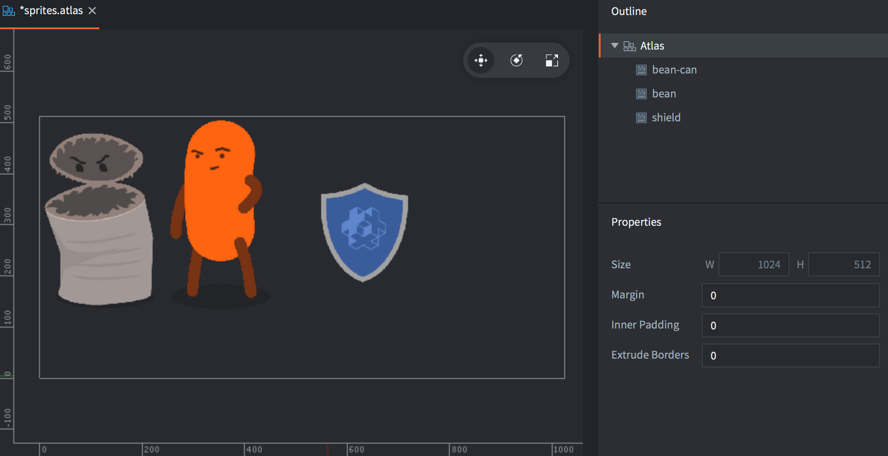
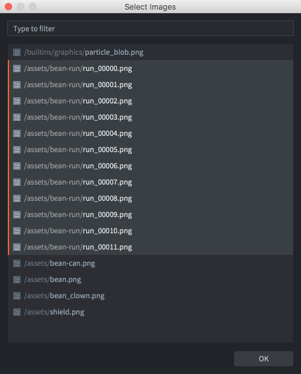
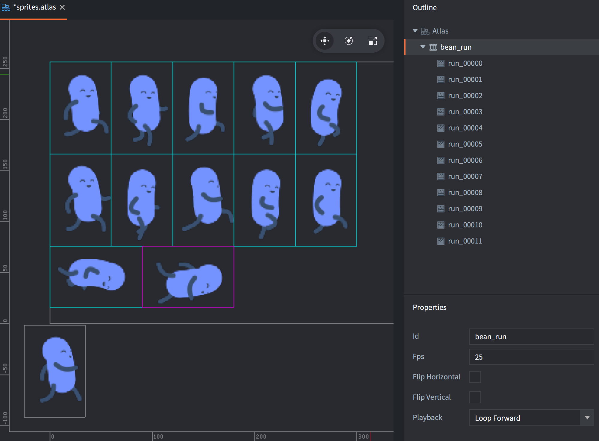
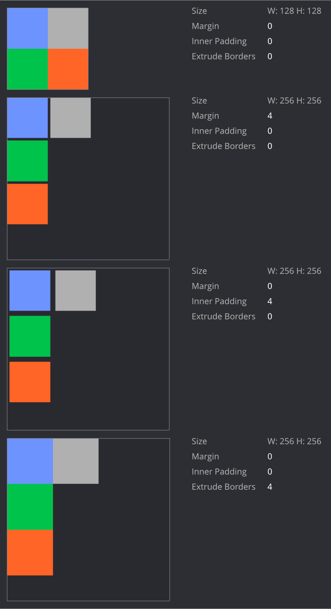
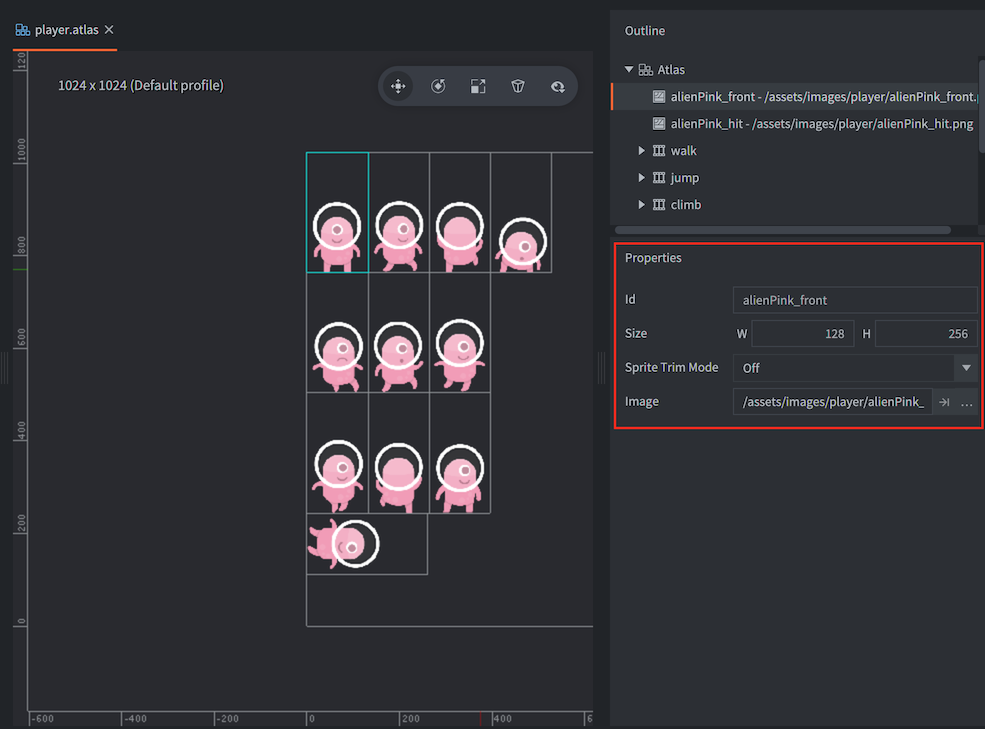

# Ресурс Atlas

Несмотря на то, что отдельные изображения часто используются в качестве источника спрайтов, по соображениям производительности изображения необходимо объединять в большие массивы, называемые атласами. Объединение множества небольших изображений в атласы особенно важно для мобильных устройств, где память и вычислительная мощность более ограничены, чем в настольных компьютерах или специализированных игровых консолях.

В Defold ресурс Atlas --- это список отдельных файлов изображений, которые автоматически объединяются в более крупное изображение.

## Создание атласа

Выберите <kbd>New... ▸ Atlas</kbd> из контекстного меню браузера *Assets*. Присвойте имя новому файлу, после чего он откроется в соответствующем редакторе. Свойства атласа отображаются в панели
*Properties*, где их можно редактировать (см. ниже).

Атлас необходимо заполнить изображениями или анимацией, прежде чем использовать его в качестве источника графики для таких компонентов объекта, как Sprite и Particle FX.

Необходимо убедиться, что изображения добавлены в проект (перетаскиванием файлов изображений в нужное расположение в браузер *Assets*).

Добавление одиночных изображений

: Перетащите изображения из панели *Assets* в окно редактора.

  Либо <kbd>клик ПКМ</kbd> по корневому элементу атласа в панели *Outline*.

  Выберите <kbd>Add Images</kbd> из контекстного меню, чтобы добавить одиночные изображения.

  Откроется диалоговое окно, в котором можно найти и выбрать изображения для добавления в атлас. Обратите внимание, что можно использовать фильтр и выбирать несколько файлов одновременно.

  

  Добавленные изображения отображаются в *Outline* в виде списка, при этом атлас в сборе можно увидеть в центральном окне редактора. Возможно, потребуется нажать <kbd>F</kbd> (<kbd>View ▸ Frame Selection</kbd> из меню) чтобы изменить масштаб отображения выделенного.

  

Добавление мултикадровой анимации
: Выполните <kbd>клик ПКМ</kbd> в корне ресурса Atlas в панели *Outline*.

  Выберите <kbd>Add Animation Group</kbd> из контекстного меню.

  Новая, пустая группа анимации с именем по умолчанию ("New Animation") будет добавлена в атлас.

  Перетащите изображения из панели *Assets* в окно редактора, чтобы добавить их в текущую выделенную группу.

  Выполните <kbd>клик ПКМ</kbd> по новой группе и выберите <kbd>Add Images</kbd> из контекстного меню.

  Откроется диалоговое окно, в котором можно найти и выбрать изображения для включения их в группу анимации.

  

  Нажмите <kbd>Space</kbd> при выделенной группе анимации для ее предварительного просмотра. Нажмите <kbd>Ctrl/Cmd+T</kbd>, чтобы закрыть предпросмотр. При необходимости настройте *Свойства* анимации (см. ниже).

  

Порядок изображений в Outline можно изменить, выделив их и нажав <kbd>Alt + Up/down</kbd>. Кроме того, можно легко создавать дубликаты, копируя и вставляя изображения в Outline (из меню <kbd>Edit</kbd>, контекстного меню по клику ПКМ или сочетаниями клавиш).

## Свойства атласа

Каждый ресурс типа Atlas имеет набор свойств. Они отображаются в панели *Properties* при выделении корневого элемента в представлении *Outline*.

Size
: Отображает общий вычисленный размер результирующей текстуры. Ширина и высота устанавливаются в ближайшую степень числа 2. Обратите внимание, что если включить сжатие текстур, некоторые форматы потребуют квадратных размеров. В этом случае размер неквадратных текстур будет изменен и заполнен пустым пространством, чтобы текстура стала квадратной. За подробностями обращайтесь к [руководству по текстурным профилям](/manuals/texture-profiles/).

Margin
: Количество пикселей, которые должны быть добавлены между каждым изображением.

Inner Padding
: Количество пустых пикселей, которые должны быть добавлены вокруг каждого изображения.

Extrude Borders
: Количество краевых пикселей, которые должны быть многократно добавлены вокруг каждого изображения. Когда фрагментный шейдер делает выборку пикселей на краю изображения, пиксели соседнего изображения (на той же текстуре атласа) могут просвечиваться (bleed over). Экструзия границы решает эту проблему.

Max Page Size
: Максимальный размер страницы в многостраничном атласе. Это может использоваться для разбиения атласа на несколько страниц одного и того же атласа, чтобы ограничить его размер, но при этом использовать только один вызов отрисовки. Эта возможность должна использоваться в сочетании с материалами, поддерживающими многостраничные атласы, из `/builtins/materials/*_paged_atlas.material`.


Шаблоны переименования
: Список шаблонов поиска и замены, разделённых запятыми (´,´), где каждый шаблон имеет форму `поиск=замена`.
Исходное имя каждого изображения (имя файла без расширения) будет преобразовано согласно этим шаблонам. (Например, шаблон `hat=cat,_normal=` переименует изображение с именем `hat_normal` в `cat`). Это полезно при сопоставлении анимаций между разными атласами.

Ниже приведены примеры различных настроек свойств с четырьмя квадратными изображениями размером 64×64, добавленными в атлас. Обратите внимание, что атлас увеличивается до 256×256, как только изображения перестают помещаться в 128×128, что приводит к значительным потерям текстурного пространства.



## Свойства изображения

Каждое изображение в атласе обладает набором свойств:

Id
: Идентификатор изображения (только для чтения).

Size
: Ширина и высота изображения (только для чтения).

Pivot
: Точка привязки изображения (в единицах). Левый верхний угол --- (0,0), правый нижний --- (1,1). По умолчанию --- (0.5, 0.5). Точка привязки может находиться за пределами диапазона 0–1. Эта точка определяет, где изображение будет центрироваться, например, при использовании в спрайте. Вы можете изменить точку привязки, перетащив манипулятор привязки в окне редактора. Манипулятор будет виден только при выборе одного изображения. Для включения привязки удерживайте <kbd>Shift</kbd> во время перетаскивания.

Sprite Trim Mode
: Способ рендеринга спрайта. По умолчанию спрайт отображается в виде прямоугольника (опция Sprite Trim Mode установлена в Off). Если спрайт содержит много прозрачных пикселей, может оказаться более эффективным рендеринг спрайта в виде непрямоугольной формы с использованием от 4 до 8 вершин. Обратите внимание, что обрезка спрайтов не работает совместно со спрайтами с девятью срезами (slice-9 sprites).

Image
: Путь к файлу самого изображения.



## Свойства анимации

Кроме списка изображений, входящих в группу анимации, доступен набор свойств:

Id
: Имя анимации.

Fps
: Скорость воспроизведения анимации, выраженная в кадрах в секунду (FPS).

Flip Horizontal
: Переворачивает анимацию по горизонтали.

Flip Vertical
: Переворачивает анимацию по вертикали.

Playback
: Указывает, как должна воспроизводиться анимация:

  - `None` --- анимация вообще не воспроизводится, отображается первое изображение.
  - `Once Forward` --- воспроизводится один раз, начиная с первого и заканчивая последним изображением.
  - `Once Backward` --- воспроизводится один раз, начиная с последнего и заканчивая первым изображением.
  - `Once Ping Pong` --- воспроизводится один раз, начиная с первого и заканчивая последним изображением, затем возврат к первому.
  - `Loop Forward` --- воспроизводится циклически, начиная с первого и заканчивая последним изображением.
  - `Loop Backward` --- воспроизводится циклически, начиная с последнего и заканчивая первым изображением.
  - `Loop Ping Pong` --- воспроизводится циклически, начиная с первого и заканчивая последним изображением, затем возврат к первому.

## Создание текстуры и атласа во время выполнения

Начиная с версии Defold 1.4.2 стало возможно создавать текстуры и атласы во время выполнения.

### Создание ресурса текстуры во время выполнения

Используйте [`resource.create_texture(path, params)`](https://defold.com/ref/stable/resource/#resource.create_texture:path-table), чтобы создать новый ресурс текстуры:

```lua
  local params = {
    width  = 128,
    height = 128,
    type   = resource.TEXTURE_TYPE_2D,
    format = resource.TEXTURE_FORMAT_RGBA,
  }
  local my_texture_id = resource.create_texture("/my_custom_texture.texturec", params)
```

После создания текстуры можно использовать [`resource.set_texture(path, params, buffer)`](https://defold.com/ref/stable/resource/#resource.set_texture:path-table-buffer), чтобы установить пиксели текстуры:

```lua
  local width = 128
  local height = 128
  local buf = buffer.create(width * height, { { name=hash("rgba"), type=buffer.VALUE_TYPE_UINT8, count=4 } } )
  local stream = buffer.get_stream(buf, hash("rgba"))

  for y=1, height do
      for x=1, width do
          local index = (y-1) * width * 4 + (x-1) * 4 + 1
          stream[index + 0] = 0xff
          stream[index + 1] = 0x80
          stream[index + 2] = 0x10
          stream[index + 3] = 0xFF
      end
  end

  local params = { width=width, height=height, x=0, y=0, type=resource.TEXTURE_TYPE_2D, format=resource.TEXTURE_FORMAT_RGBA, num_mip_maps=1 }
  resource.set_texture(my_texture_id, params, buf)
```

::: sidenote
Можно использовать `resource.set_texture()` для обновления подрегиона текстуры, указав ширину и высоту буфера меньше полного размера текстуры и изменив параметры `x` и `y` в вызове `resource.set_texture()`.
:::

Полученную текстуру можно напрямую использовать в [компоненте модели](/manuals/model/) через `go.set()`:

```lua
  go.set("#model", "texture0", my_texture_id)
```

### Создание атласа во время выполнения

Если текстура должна использоваться в [компоненте спрайта](/manuals/sprite/), её необходимо подключить к атласу. Используйте [`resource.create_atlas(path, params)`](https://defold.com/ref/stable/resource/#resource.create_atlas:path-table), чтобы создать атлас:

```lua
  local params = {
    texture = texture_id,
    animations = {
      {
        id          = "my_animation",
        width       = width,
        height      = height,
        frame_start = 1,
        frame_end   = 2,
      }
    },
    geometries = {
      {
        vertices  = {
          0,     0,
          0,     height,
          width, height,
          width, 0
        },
        uvs = {
          0,     0,
          0,     height,
          width, height,
          width, 0
        },
        indices = {0,1,2,0,2,3}
      }
    }
  }
  local my_atlas_id = resource.create_atlas("/my_atlas.texturesetc", params)

  -- назначаем атлас компоненту 'sprite' на том же игровом объекте
  go.set("#sprite", "image", my_atlas_id)

  -- запускаем "анимацию"
  sprite.play_flipbook("#sprite", "my_animation")
  
```
