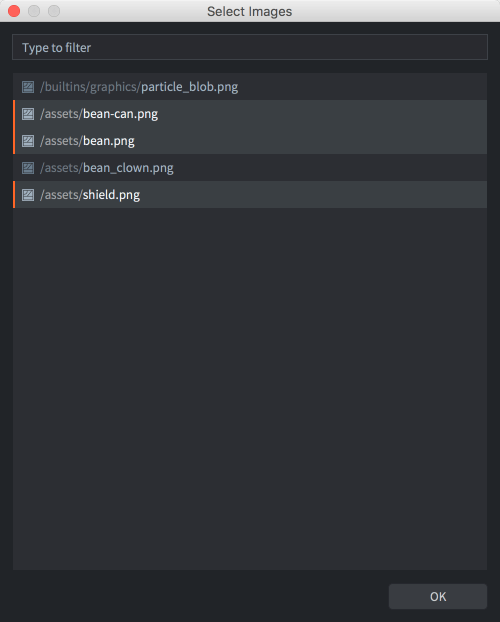

# Атлас

Несмотря на то, что отдельные изображения часто используются в качестве источника спрайтов, по соображениям производительности изображения необходимо объединять в большие массивы, называемые атласами. Объединение множества небольших изображений в атласы особенно важно для мобильных устройств, где память и вычислительная мощность более ограничены, чем в настольных компьютерах или специализированных игровых консолях.

В Defold ресурс Atlas --- это список отдельных файлов изображений, которые автоматически объединяются в более крупное изображение.

## Создание атласа

Выберите <kbd>New... ▸ Atlas</kbd> из контекстного меню браузера *Assets*. Присвойте имя новому файлу, после чего он откроется в соответствующем редакторе. Свойства атласа отображаются в панели
*Properties*, где их можно редактировать (см. ниже).

Атлас необходимо заполнить изображениями или анимацией, прежде чем использовать его в качестве источника графики для таких компонентов объекта, как Sprite и Particle FX.

Необходимо убедиться, что изображения добавлены в проект (перетаскиванием файлов изображений в нужное расположение в браузер *Assets*).

Добавление одиночных изображений
: Выполните <kbd>клик ПКМ</kbd> в корне ресурса Atlas в панели *Outline*.

  Выберите <kbd>Add Images</kbd> из контекстного меню.

  Откроется диалоговое окно, в котором можно найти и выбрать изображения для включения в атлас. Стоит отметить, что можно использовать фильтр и выбирать несколько файлов сразу.

  {srcset="images/atlas/add@2x.png 2x"}

  Добавленные изображения отображаются в *Outline* в виде списка, при этом атлас в сборе можно увидеть в центральном окне редактора. Возможно, потребуется нажать <kbd>F</kbd> (<kbd>View ▸ Frame Selection</kbd> из меню) чтобы изменить масштаб отображения выделенного.

  {srcset="images/atlas/single_images@2x.png 2x"}

Добавление мультипликаций
: Выполните <kbd>клик ПКМ</kbd> в корне ресурса Atlas в панели *Outline*.

  Выберите <kbd>Add Animation Group</kbd> из контекстного меню.

  Новая, пустая группа анимации с именем по умолчанию ("New Animation") будет добавлена в атлас.

  Выполните <kbd>клик ПКМ</kbd> по новой группе и выберите <kbd>Add Images</kbd> из контекстного меню.

  Откроется диалоговое окно, в котором можно найти и выбрать изображения для включения их в группу анимации.

  {srcset="images/atlas/add_animation@2x.png 2x"}

  Нажмите <kbd>Space</kbd> при выделенной группе анимации для ее предварительного просмотра. При необходимости настройте *Свойства* анимации (см. ниже).

  {srcset="images/atlas/animation_group@2x.png 2x"}

Порядок изображений в Outline можно изменить, выделив их и нажав <kbd>Alt + Up/down</kbd>. Кроме того, можно легко создавать дубликаты, копируя и вставляя изображения в Outline (из меню <kbd>Edit</kbd>, контекстного меню по клику ПКМ или сочетаниями клавиш).

## Свойства атласа

Каждый ресурс типа Atlas имеет набор свойств. Они отображаются в панели *Properties* при выделении корневого элемента в представлении *Outline*.

Size
: Отображает общий вычисленный размер результирующей текстуры. Ширина и высота устанавливаются в ближайшую степень числа 2. Обратите внимание, что если включить сжатие текстур, некоторые форматы потребуют квадратных размеров. В этом случае размер неквадратных текстур будет изменен и заполнен пустым пространством, чтобы текстура стала квадратной. За подробностями обращайтесь к [руководству по текстурным профилям](/manuals/texture-profiles/).

Margin
: Количество пикселей, которые должны быть добавлены между каждым изображением.

Inner Padding
: Количество пустых пикселей, которые должны быть добавлены вокруг каждого изображения.

Extrude Borders
: Количество краевых пикселей, которые должны быть многократно добавлены вокруг каждого изображения. Когда фрагментный шейдер делает выборку пикселей на краю изображения, пиксели соседнего изображения (на той же текстуре атласа) могут просвечиваться (bleed over). Экструзия границы решает эту проблему.

Вот примеры различных настроек свойств с четырьмя квадратными изображениями размером 64x64, добавленными в атлас. Обратите внимание, как атлас переходит к размеру 256x256, как только изображения не помещаются в 128x128, что приводит к бесполезному расходу текстурного пространства.

{srcset="images/atlas/atlas_properties@2x.png 2x"}

## Свойства изображения

Каждое изображение в атласе обладает набором свойств:

Id
: Идентификатор изображения (только для чтения).

Size
: Ширина и высота изображения (только для чтения).

Sprite Trim Mode
: Способ рендеринга спрайта. По умолчанию спрайт отображается в виде прямоугольника (опция Sprite Trim Mode установлена в Off). Если спрайт содержит много прозрачных пикселей, может оказаться более эффективным рендеринг спрайта в виде непрямоугольной формы с использованием от 4 до 8 вершин.

Image
: Путь к файлу самого изображения.

{srcset="images/atlas/image_properties@2x.png 2x"}

## Свойства анимации

Кроме списка изображений, входящих в группу анимации, доступен набор свойств:

Id
: Имя анимации.

Fps
: Скорость воспроизведения анимации, выраженная в кадрах в секунду (FPS).

Flip Horizontal
: Переворачивает анимацию по горизонтали.

Flip Vertical
: Переворачивает анимацию по вертикали.

Playback
: Указывает, как должна воспроизводиться анимация:

  - `None` --- анимация вообще не воспроизводится, отображается первое изображение.
  - `Once Forward` --- воспроизводится один раз, начиная с первого и заканчивая последним изображением.
  - `Once Backward` --- воспроизводится один раз, начиная с последнего и заканчивая первым изображением.
  - `Once Ping Pong` --- воспроизводится один раз, начиная с первого и заканчивая последним изображением, затем возврат к первому.
  - `Loop Forward` --- воспроизводится циклически, начиная с первого и заканчивая последним изображением.
  - `Loop Backward` --- воспроизводится циклически, начиная с последнего и заканчивая первым изображением.
  - `Loop Ping Pong` --- воспроизводится циклически, начиная с первого и заканчивая последним изображением, затем возврат к первому.
