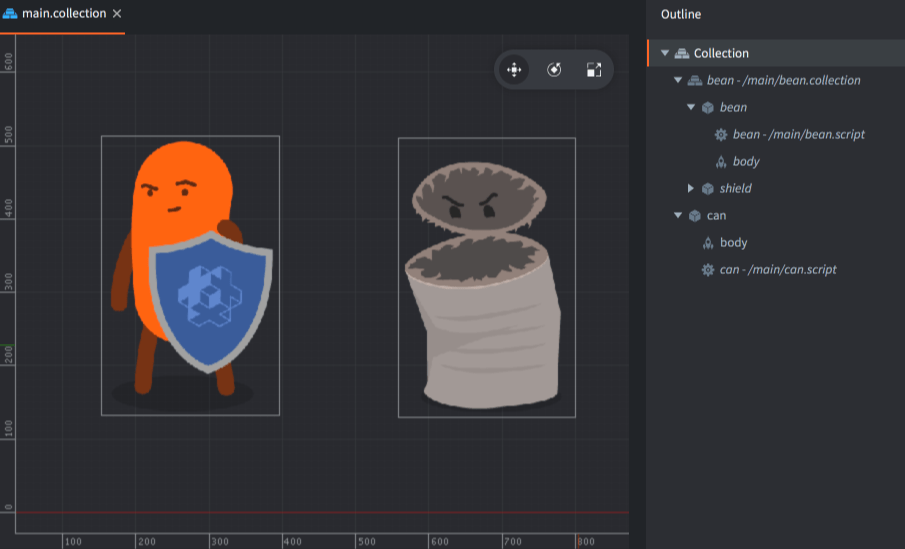
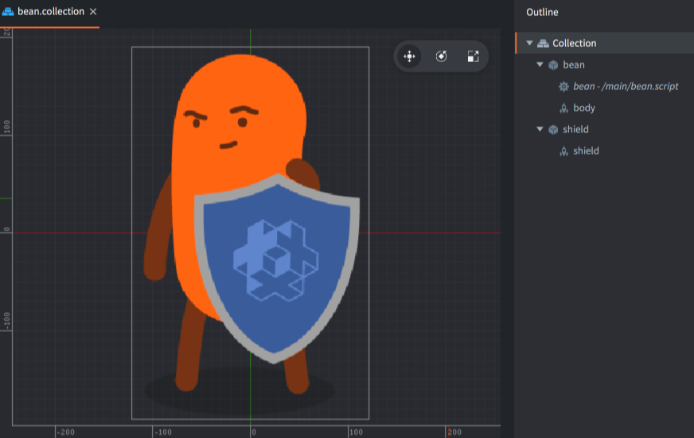
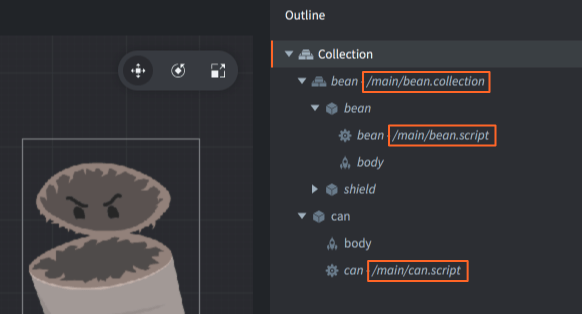
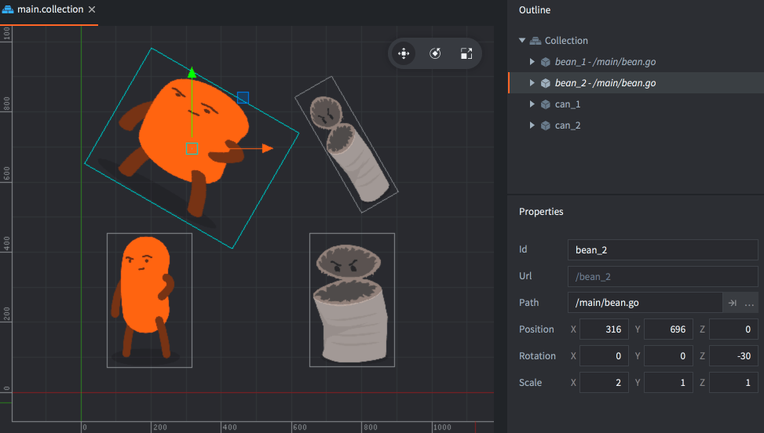
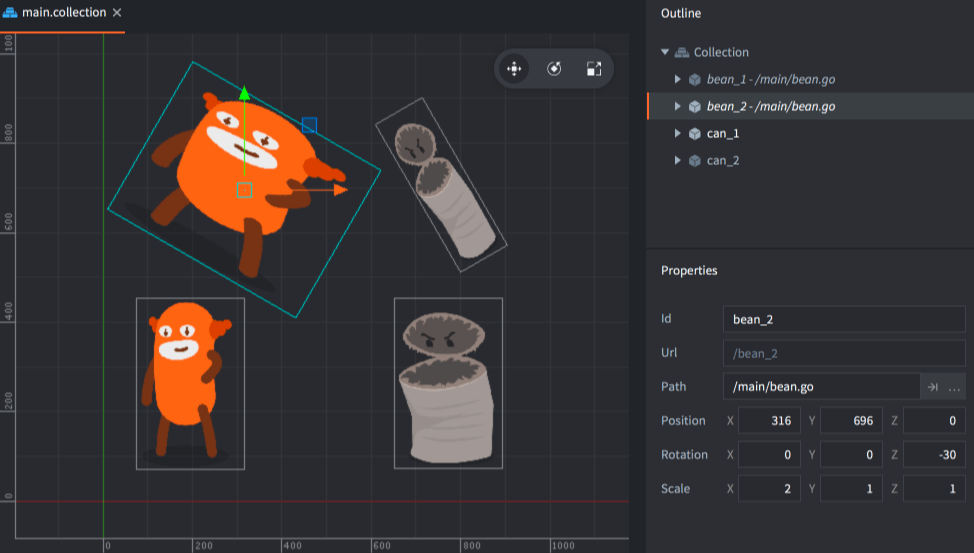
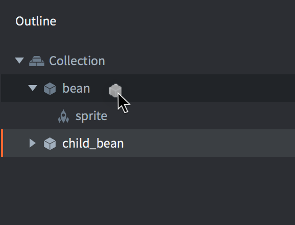
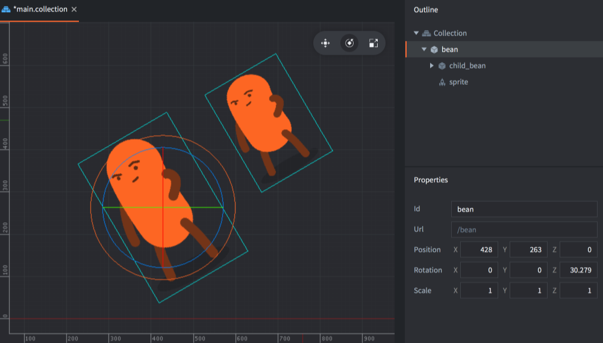

#  Структурные элементы

В основу дизайна Defold заложены несколько концепций, качественное освоение которых может потребовать временных затрат. Это руководство объясняет, как устроены структурные элементы Defold. Прочитав это руководство, стоит перейти к [руководству по адрессации](/manuals/addressing) и [передачи сообщений](/manuals/message-passing). Также имеется набор [уроков](/tutorials/getting-started), доступных в редакторе и позволяющих быстрее приступить к работе.


В Defold существуют три основных типа структурных элементов, используемых для конструирования игр:

Коллекция (collection)
: Коллекция представляет собой файл, используемый для структурирования игры. В коллекциях выстраиваются иерархии игровых объектов и других коллекций. Как правило, они используются для структурирования игровых уровней, групп врагов или персонажей, сформированных из нескольких игровых объектов.

Игровой объект (game object)
: Игровой объект --- это контейнер с идентификатором, положением, вращением и масштабом. Он используется в качестве контейнера с компонентами. Обычно они используются для создания игровых персонажей, пуль, системы правил игры или для загрузки/выгрузки уровней.

Компонент (сomponent)
: Компонентами являются сущности, которые помещаются в игровой объект, с целью придать им визуальное, звуковое и/или логическое представление в игре. Обычно используются для создания спрайтов персонажей, файлов сценариев, для добавления звуковых эффектов или эффектов частиц.

## Коллекции (Collections)

Коллекции — это древовидные структуры, содержащие игровые объекты и другие коллекции. Каждая коллекция всегда сохраняется в виде файла.

При запуске движка Defold загружается единственная _начальная коллекция_, указанная в файле настроек *game.project*. Эта коллекция часто называется "main.collection", но вы можете выбрать любое имя по своему усмотрению.

Коллекция может содержать игровые объекты и другие коллекции (по ссылке на файл субколлекции), с произвольной глубиной вложенности. Ниже приведён пример файла под названием "main.collection". Он содержит один игровой объект (с идентификатором "can") и одну субколлекцию (с идентификатором "bean"). Субколлекция, в свою очередь, содержит два игровых объекта: "bean" и "shield".



Обратите внимание, что субколлекция с идентификатором "bean" хранится в отдельном файле под названием "/main/bean.collection" и лишь ссылается в "main.collection":



Саму коллекцию адресовать нельзя, поскольку в рантайме нет объектов, соответствующих коллекциям "main" и "bean". Тем не менее, иногда требуется использовать идентификатор коллекции как часть _пути_ к игровому объекту (см. [руководство по адресации](/manuals/addressing) для подробностей):

```lua
-- file: can.script
-- get position of the "bean" game object in the "bean" collection
local pos = go.get_position("bean/bean")
```

Коллекция всегда добавляется в другую коллекцию в качестве ссылки на файл коллекции:

Выполните <kbd>правый клик</kbd> по коллекции в представлении *Outline* и выберите <kbd>Add Collection File</kbd>.

## Игровые объекты (Game objects)

Игровые объекты --- это простые объекты, каждый из которых имеет свою продолжительность жизни во время выполнения игры. Игровые объекты имеют позицию, вращение и масштаб, которыми можно манипулировать и анимировать во время выполнения.

```lua
-- animate X position of "can" game object
go.animate("can", "position.x", go.PLAYBACK_LOOP_PINGPONG, 100, go.EASING_LINEAR, 1.0)
```

Игровые объекты можно использовать пустыми (например, в качестве маркеров позиции), но обычно они оснащены различными компонентами, такими как спрайты, звуки, скрипты, модели, фабрики и др. Игровые объекты либо создаются в редакторе и помещаются в файлы коллекции, либо динамически создаются во время выполнения посредством _фабрик_.

Игровые объекты добавляются в коллекцию непосредственно (на месте), либо в качестве ссылки на файл игрового объекта:

Выполните <kbd>правый клик</kbd> по коллекции в представлении *Outline* и выберите <kbd>Add Game Object</kbd> (добавить на месте) или <kbd>Add Game Object File</kbd> (добавить в качестве ссылки на файл).


## Компоненты

:[components](../shared/components.md)

Список всех доступных типов компонентов см. в [обзоре компонентов](/manuals/components/).

## Объекты, добавленные на месте или по ссылке

При создании _файла_ коллекции, игрового объекта или компонента, создается шаблон, или прототип. При этом файл добавляется только в файловую структуру проекта, к запущенной игре ничего не добавляется. Чтобы добавить экземпляр коллекции, игрового объекта или компонента на основе файла шаблона, необходимо добавить его в один из файлов коллекции.

Не сложно понять, на каком файле основан экземпляр объекта в представлении Outline. Файл "main.collection" содержит три экземпляра, которые основаны на файлах:

1. Субколлекция "bean".
2. Скрипт "bean" в игровом объекте "bean" в субколлекции "bean".
3. Скрипт "can" в игровом объекте "can".



Преимущество создания файлов-шаблонов становится очевидным, когда имеются несколько экземпляров игрового объекта или коллекции и их все необходимо изменить:



Здесь изображено, как изображение спрайта в файле-прототипе изменяется, и все экземпляры, использующие этот файл, немедленно обновляются:


При изменении файла шаблона любой экземпляр, использующий этот файл, будет немедленно обновлен.



## Подчинение игровых объектов

В файле коллекции можно строить иерархии игровых объектов, так чтобы один или несколько игровых объектов становились дочерними по отношению к одному родительскому игровому объекту. Просто <kbd>перетащите</kbd> один игровой объект и <kbd>бросьте</kbd> его на другой, и перетаскиваемый игровой объект станет дочерним по отношении к целевому (но который бросили):



Объектная иерархия "родительский-дочерний" --- это динамическое отношение, влияющее на то, как объекты реагируют на трансформации. Любые трансформации (перемещение, вращение или масштабирование), применяемые к объекту, будут, в свою очередь, применяться к дочерним элементам объекта, как в редакторе, так и во время выполнения:



И наоборот, дочерние трансформации выполняются в локальном пространстве родителя. В редакторе можно выбрать, редактировать дочерние игровые объекты в локальном пространстве или в мировом, выполнив <kbd>Edit ▸ World Space</kbd> (по умолчанию) или <kbd>Edit ▸ Local Space</kbd>.

Также существует возможность изменить родителя объекта во время выполнения, отправив объекту сообщение `set_parent`.

```lua
local parent = go.get_id("bean")
msg.post("child_bean", "set_parent", { parent_id = parent })
```

::: important
Распространенным заблуждением является то, что расположение игрового объекта в иерархии коллекции меняется, когда он становится частью иерархии "родительский-дочерний". Однако, это две разные вещи. Иерархии "родительский-дочерний" динамически изменяют граф сцены, что позволяет визуально привязывать объекты друг к другу. При этом единственное, что определяет адрес игрового объекта, это его место в иерархии коллекции. Адрес статический на протяжении всего срока существования объекта.
:::
