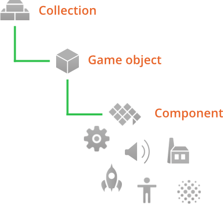

#  Блоки построения

В основе дизайна Defold лежат несколько концепций, которые могут потребовать некоторого количества времени для их качественного освоения. Это руководство объясняет, как устроены блоки построения Defold. Прочитав это руководство, перейдите к [руководству по адрессации](/manuals/addressing) и [передачи сообщений](/manuals/message-passing). Также имеется набор [уроков](/tutorials/getting-started), доступных в редакторе и позволяющих быстрее приступить к работе.

{srcset="images/building_blocks/building_blocks@2x.png 2x"}

В Defold существуют три основных типа блоков построения, которые используются для конструирования игр:

Коллекция (collection)
: Коллекция представляет собой файл, используемый для структурирования вашей игры. В коллекциях вы строите иерархии игровых объектов и других коллекций. Как правило, они используются для структурирования игровых уровней, групп врагов или персонажей, построенных из нескольких игровых объектов.

Игровой объект (game object)
: Игровой объект - это контейнер с идентификатором, положением, вращением и масштабом. Он используется в качестве контейнера с компонентами. Обычно они используются для создания игровых персонажей, пуль, системы правил игры или для загрузки/выгрузки уровней.

Компонент (сomponent)
: Компонентами являются сущности, которые помещаются в игровой объект, с целью придать им визуальное, звуковое и/или логическое представление в игре. Обычно используются для создания спрайтов персонажей, файлов сценариев, для добавления звуковых эффектов или эффектов частиц.

## Коллекции

Коллекции представляют собой древовидные структуры, в которых хранятся игровые объекты и другие коллекции. Коллекции всегда хранятся в файлах.

При запуске Defold загружает единственную _коллекцию начальной загрузки (bootstrap collection)_, как указано в файле настроек "game.project". Коллекция начальной загрузки часто называется "main.collection", но вы можете использовать любое другое имя.

Коллекция может содержать игровые объекты и другие коллекции (по ссылке на файл субколлекции), вложенные сколь угодно глубоко. Вот пример файла под названием "main.collection". Он содержит один игровой объект (с идентификатором "can") и одну субколлекцию (с идентификатором "bean"). Субколлекция, в свою очередь, содержит два игровых объекта: "bean" и "shield".

{srcset="images/building_blocks/collection@2x.png 2x"}

Обратите внимание, что субколлекция с идентификатором "bean" хранится в собственном файле, называемом "/main/bean.collection", и на нее имеются ссылки только в "main.collection":

{srcset="images/building_blocks/bean_collection@2x.png 2x"}

Вы не можете обращаться к самим коллекциям, так как не существует объектов времени выполнения, соответствующих коллекциям "main" и "bean". Тем не менее, иногда необходимо использовать идентификатор коллекции как часть _пути_ к игровому объекту (см. [руководство по адресации](/manuals/addressing) для получения более подробной информации):

```lua
-- file: can.script
-- get position of the "bean" game object in the "bean" collection
local pos = go.get_position("bean/bean")
```

Коллекция всегда добавляется в другую коллекцию в качестве ссылки на файл коллекции:

Выполните <kbd>правый клик</kbd> по коллекции в представлении *Outline* и выберите <kbd>Add Collection File</kbd>.

## Игровые объекты

Игровые объекты - это простые объекты, каждый из которых имеет отдельную продолжительность жизни во время выполнения игры. Игровые объекты имеют позицию, вращение и масштаб, которыми можно манипулировать и анимировать во время выполнения.

```lua
-- animate X position of "can" game object
go.animate("can", "position.x", go.PLAYBACK_LOOP_PINGPONG, 100, go.EASING_LINEAR, 1.0)
```

Игровые объекты можно использовать пустыми (например, в качестве маркеров позиции), но обычно они оснащены различными компонентами, такими как спрайты, звуки, скрипты, модели, фабрики и многое другое. Игровые объекты либо создаются в редакторе и помещаются в файлы коллекции, либо динамически создаются во время выполнения через компоненты _factory_.

Игровые объекты добавляются в коллекцию непосредственно, либо в качестве ссылки на файл игрового объекта:

Выполните <kbd>правый клик</kbd> по коллекции в представлении *Outline* и выберите <kbd>Add Game Object</kbd> (добавить на месте) или <kbd>Add Game Object File</kbd> (добавить в качестве ссылки на файл).


## Компоненты

:[components](../shared/components.md)

Refer to the [component overview](/manuals/components/) for a list of all available component types.

## Объекты, добавленные на месте или по ссылке

При создании _файла_ коллекции, игрового объекта или компонента, вы создаете шаблон, или прототип. При этом файл добавляется только в файловую структуру проекта, к запущенной игре ничего не добавляется. Чтобы добавить экземпляр коллекции, игрового объекта или компонента на основе файла шаблона, необходимо добавить его в один из файлов коллекции.

You can see what file an object instance is based on in the outline view. The file "main.collection" contains three instances that are based on files:

1. The "bean" sub-collection.
2. The "bean" script component in the "bean" game object in the "bean" sub-collection.
3. The "can" script component in the "can" game object.

{srcset="images/building_blocks/instance@2x.png 2x"}

The benefit of creating blueprint files becomes apparent when you have multiple instances of a game object or collection and wishes to change all of them:

{srcset="images/building_blocks/go_instance@2x.png 2x"}

By changing the blueprint file, any instance that uses that file will immediately be updated.

{srcset="images/building_blocks/go_instance2@2x.png 2x"}

## Childing game objects

In a collection file, you can build hierarchies of game objects so that one or more game objects are children to a single parent game object. By simply <kbd>dragging</kbd> one game object and <kbd>dropping</kbd> it onto another the dragged game object is childed under the target:

{srcset="images/building_blocks/childing@2x.png 2x"}

Object parent-child hierarchies is a dynamic relation affecting how objects react to transformations. Any transformation (movement, rotation or scaling) applied to an object will in turn be applied to the object’s children, both in the editor and in runtime:

{srcset="images/building_blocks/child_transform@2x.png 2x"}

Conversely, a child's translations are done in the local space of the parent. In the editor, you can choose to edit a child game object in the local space or world space by selecting <kbd>Edit ▸ World Space</kbd> (the default) or <kbd>Edit ▸ Local Space</kbd>.

It is also possible to alter an object’s parent in run-time by sending a `set_parent` message to the object.

```lua
local parent = go.get_id("bean")
msg.post("child_bean", "set_parent", { parent_id = parent })
```

::: important
A common misunderstanding is that a game object's place in the collection hierarchy changes when it becomes part of a parent-child hierarchy. However, these are two very different things. Parent-child hierarchies dynamically alters the scene graph which allows objects to be visually attached to each other. The only thing that dictates a game object's address is its place in the collection hierarchy. The address is static throughout the lifetime of the object.
:::
