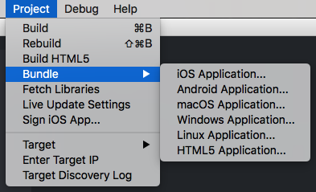

# Бандлинг приложения

При разработке приложения вы должны выработать привычку как можно чаще тестировать игру на целевых платформах. Это необходимо для того, чтобы выявлять проблемы с производительностью на ранних этапах процесса разработки, когда эти проблемы гораздо легче исправить. Также рекомендуется тестировать на всех целевых платформах, чтобы найти расхождения в таких вещах, как шейдеры. При разработке на мобильных устройствах у вас есть возможность использовать [приложение для мобильной разработки](/manuals/dev-app/) для отправки содержимого в приложение вместо того, чтобы выполнять полную пересборку и цикл удаления/установки.

Вы можете создать бандл приложения для всех платформ, которые поддерживает Defold, из самого редактора Defold без каких-либо внешних инструментов. Вы также можете сделать бандл из командной строки с помощью наших инструментов командной строки. Бандлинг приложения требует сетевое соединение, если ваш проект содержит одно или несколько [нативных расширений](/manuals/extensions).

## Бандлинг прямо из редактора

Создать бандл можно из меню Project и опции Bundle: 

Выбор любого из пунктов меню вызовет диалог Бандла для этой конкретной платформы. 

### Отчеты о сборке

При сборке вашей игры есть возможность создать отчет о сборке. Это очень полезно, чтобы получить представление о размере всех ассетов, входящих в бандл. Просто установите флажок *Generate build report* при сборке игры. 

Чтобы узнать больше об отчетах о сборке, обратитесь к [Руководству по профилированию](/manuals/profiling/#build-reports).

### Android

Создание бандла для Android (файл .apk) описано в [Руководстве по Android](/manuals/android/#creating-an-android-application-bundle).

### iOS

Создание бандла для iOS (файл .ipa) описано в [Руководстве по iOS](/manuals/ios/#creating-an-ios-application-bundle).

### macOS

Создание бандла для macOS (файл .app) описано в [Руководстве по macOS](/manuals/macos).

### Linux

Создание бандла для Linux не требует специальной настройки и дополнительной конфигурации для конкретной платформы в [файле настроек проекта][project settings file](/manuals/project-settings/#linux) *game.project*.

### Windows

Создание Windows-приложения (файл .exe) описано в [Руководстве по Windows](/manuals/windows).

### HTML5

Создание HTML5 билда, а также дополнительная настройка описаны в [руководстве по HTML5](/manuals/html5/#creating-html5-bundle).

#### Facebook Instant Games

Можно создать специальную версию HTML5 билда специально для Facebook Instant Games. Этот процесс задокументирован в [руководстве по Facebook Instant Games](/manuals/instant-games/).

## Бандлинг из командной строки

При повседневной разработке вашего приложения вполне вероятно, что вы собираете и бандлите прямо из редактора Defold. В других обстоятельствах вы можете захотеть автоматически создавать бандлы, например, пакетный бандлинг для всех платформ при выпуске новой версии или при создании ночных сборок последней версии игры, возможно, в среде CI. Сборка и бандлинг приложения могут выполняться вне обычного рабочего процесса в редакторе, с помощью [инструмента командной строки Bob](/manuals/bob/). 