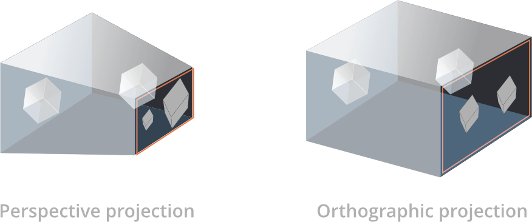
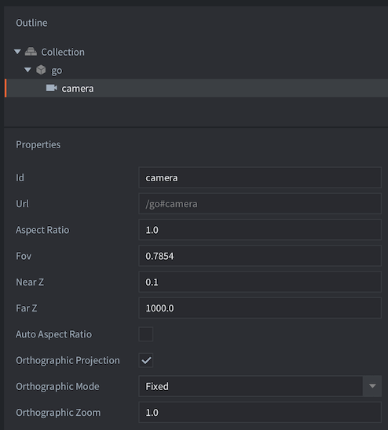
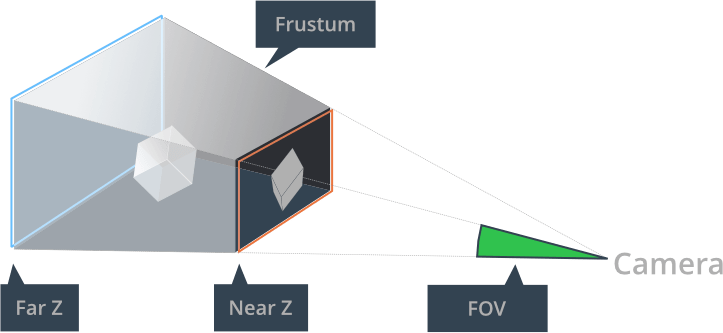

# Камеры

Камера в Defold — это компонент, который изменяет область просмотра (viewport) и проекцию игрового мира. Компонент камеры определяет базовую перспективную или ортографическую камеру, которая предоставляет матрицы вида и проекции в рендер-скрипт.

Перспективная камера обычно используется для 3D-игр, где вид камеры и размер и перспектива объектов основаны на усечённой пирамиде (view frustum) и расстоянии и угле обзора от камеры до объектов в игре.

Для 2D-игр часто предпочтительно использовать ортографическую проекцию. Это означает, что вид камеры больше не определяется усечённой пирамидой, а ограничен параллелепипедом. Ортографическая проекция нереалистична, так как не изменяет размер объектов в зависимости от расстояния. Объект на расстоянии 1000 единиц будет отображаться того же размера, что и объект прямо перед камерой.




## Создание камеры

Чтобы создать камеру, <kbd>кликните правой кнопкой мыши</kbd> по игровому объекту и выберите <kbd>Add Component ▸ Camera</kbd>. Также можно создать файл компонента камеры в иерархии проекта и добавить его к игровому объекту.



Компонент камеры имеет следующие свойства, определяющие *усечённую пирамиду* камеры:



Id
: Идентификатор компонента

Aspect Ratio
: (**Только для перспективной камеры**) — соотношение ширины и высоты усечённой пирамиды. 1.0 означает квадратный вид. 1.33 подходит для соотношения 4:3, например 1024x768. 1.78 — для 16:9. Это значение игнорируется, если включён *Auto Aspect Ratio*.

Fov
: (**Только для перспективной камеры**) — *вертикальный* угол обзора камеры в _радианах_. Чем шире угол обзора, тем больше камера видит.

Near Z
: Z-значение ближней плоскости отсечения.

Far Z
: Z-значение дальней плоскости отсечения.

Auto Aspect Ratio
: (**Только для перспективной камеры**) — если включено, камера автоматически вычисляет соотношение сторон.

Orthographic Projection
: Включите, чтобы использовать ортографическую проекцию (см. ниже).

Orthographic Zoom
: (**Только для ортографической камеры**) — управляемый пользователем множитель зума (> 1 = приближение, < 1 = отдаление). В режиме `Fixed` это эффективный зум. В режимах `Auto Fit` и `Auto Cover` он умножается на автоматически рассчитанный зум, что позволяет добавить дополнительное масштабирование, не отключая автоматическую подгонку.

Orthographic Mode
: (**Только для ортографической камеры**) — управляет тем, как ортографическая камера определяет зум относительно размера окна и ваших значений дизайна (`game.project` → `display.width/height`).
  - `Fixed` (постоянный зум): используется текущее значение `Orthographic Zoom`.
  - `Auto Fit` (вписать): автоматически рассчитывает зум так, чтобы вся дизайн-область помещалась в окно, а затем умножает его на `Orthographic Zoom`. Возможен дополнительный контент по бокам/сверху/снизу.
  - `Auto Cover` (заполнить): автоматически рассчитывает зум так, чтобы дизайн-область заполняла окно целиком, а затем умножает его на `Orthographic Zoom`. Возможна обрезка по бокам/сверху/снизу.
  Доступно только при включённой `Orthographic Projection`.


## Использование камеры

Все камеры по умолчанию включены и обновляются каждый кадр, а Lua-модуль `camera` доступен во всех скриптовых контекстах. Начиная с Defold 1.8.1, больше не нужно явно включать камеру через отправку сообщения `acquire_camera_focus` компоненту камеры. Старые сообщения acquire и release всё ещё поддерживаются, но рекомендуется использовать сообщения `enable` и `disable`, как для любого другого компонента, который нужно включать или выключать:

```lua
msg.post("#camera", "disable")
msg.post("#camera", "enable")
```

Чтобы получить список всех доступных камер, используйте функцию `camera.get_cameras()`:

```lua
-- Внимание: вызовы render доступны только в рендер-скрипте.
-- camera.get_cameras() можно использовать везде,
-- но render.set_camera — только в рендер-скрипте.

for k,v in pairs(camera.get_cameras()) do
	-- таблица camera содержит URL всех камер
	render.set_camera(v)
	-- здесь выполняется рендеринг — всё, что использует материалы с
	-- матрицами вида и проекции, будет использовать матрицы этой камеры.
end
-- чтобы отключить камеру, передайте nil (или вызовите без аргументов) в render.set_camera.
-- после этого все вызовы рендеринга будут использовать матрицы вида и проекции,
-- заданные напрямую в рендер-контексте через render.set_view и render.set_projection
render.set_camera()
```

Модуль `camera` содержит множество функций для управления камерой. Вот несколько из них, полный список доступен в [API документации](/ref/camera/):

```lua
camera.get_aspect_ratio(camera)        -- получить соотношение сторон
camera.get_far_z(camera)               -- получить дальнюю плоскость отсечения
camera.get_fov(camera)                 -- получить угол обзора
camera.get_orthographic_mode(camera)   -- получить ортографический режим (одно из camera.ORTHO_MODE_*)
camera.get_orthographic_zoom(camera)   -- получить управляемый пользователем множитель зума
camera.get_orthographic_auto_zoom(camera) -- получить автоматически рассчитанный зум
camera.set_aspect_ratio(camera, ratio) -- установить соотношение сторон
camera.set_far_z(camera, far_z)        -- установить дальнюю плоскость отсечения
camera.set_near_z(camera, near_z)      -- установить ближнюю плоскость отсечения
camera.set_orthographic_mode(camera, camera.ORTHO_MODE_AUTO_FIT) -- установить ортографический режим
... и другие
```

Камера идентифицируется URL, который представляет полный путь к компоненту в сцене, включая коллекцию, игровой объект и id компонента. В примере используйте URL `/go#camera` для доступа к компоненту камеры из той же коллекции, и `main:/go#camera` для доступа к камере из другой коллекции или рендер-скрипта.


```lua
-- Доступ к камере из скрипта в той же коллекции:
camera.get_fov("/go#camera")

-- Доступ к камере из скрипта в другой коллекции:
camera.get_fov("main:/go#camera")

-- Доступ к камере из рендер-скрипта:
render.set_camera("main:/go#camera")
```

Каждый кадр компонент камеры с текущим фокусом камеры отправляет сообщение `set_view_projection` на сокет `@render`:

```lua
-- builtins/render/default.render_script
--
function on_message(self, message_id, message)
	if message_id == hash("set_view_projection") then
		self.view = message.view                    -- [1]
		self.projection = message.projection
	end
end
```
1. Сообщение от компонента камеры содержит матрицу вида и матрицу проекции.

Компонент камеры предоставляет рендер-скрипту матрицу проекции перспективной или ортографической камеры в зависимости от свойства *Orthographic Projection*. Матрица проекции учитывает ближнюю и дальнюю плоскости отсечения, угол обзора и соотношение сторон камеры.

Матрица вида определяет позицию и ориентацию камеры. Камера с *Orthographic Projection* центрирует вид на позиции игрового объекта, к которому прикреплён компонент камеры, тогда как камера с *Perspective Projection* располагает нижний левый угол вида на позиции игрового объекта.


### Рендер-скрипт

Начиная с Defold 1.9.6, при использовании дефолтного рендер-скрипта Defold автоматически устанавливает последнюю включённую камеру для рендеринга. Ранее требовалось явно отправлять сообщение `use_camera_projection` рендереру, чтобы уведомить его об использовании матриц камеры. Сейчас это не обязательно, но для обратной совместимости можно продолжать использовать.

Также можно явно задать конкретную камеру для рендеринга в рендер-скрипте. Это полезно, например, в многопользовательских играх для точного контроля, какая камера используется.

```lua
-- render.set_camera автоматически применит матрицы вида и проекции
-- для всего рендеринга, пока не будет вызван render.set_camera() без аргументов.
render.set_camera("main:/my_go#camera")
```

Чтобы проверить, включена ли камера, используйте функцию `get_enabled` из [Camera API](https://defold.com/ref/alpha/camera/#camera.get_enabled:camera):

```lua
if camera.get_enabled("main:/my_go#camera") then
	-- камера включена, используем её для рендеринга
	render.set_camera("main:/my_go#camera")
end
```

::: sidenote
Чтобы использовать `set_camera` вместе с отсечением по усечённой пирамиде (frustum culling), передайте опцию:
`render.set_camera("main:/my_go#camera", {use_frustum = true})`
:::

### Панорамирование камеры

Перемещайте камеру по игровому миру, перемещая игровой объект, к которому прикреплён компонент камеры. Компонент автоматически отправит обновлённую матрицу вида на основе текущих координат по осям X и Y.

### Масштабирование камеры

Для перспективной камеры масштабирование происходит перемещением игрового объекта по оси Z. Компонент камеры автоматически обновит матрицу вида с учётом текущей позиции по Z.

Для ортографической камеры масштабирование выполняется изменением свойства *Orthographic Zoom* в редакторе или во время выполнения:

```lua
-- В режиме Fixed это эффективный зум.
go.set("#camera", "orthographic_zoom", 2)
```

В режимах `Auto Fit` и `Auto Cover` значение *Orthographic Zoom* применяется поверх автоматически рассчитанного зума, а не игнорируется. Например, установите в редакторе *Orthographic Mode* в `Auto Fit`, а *Orthographic Zoom* в `1.25`, чтобы вписать дизайн-область в окно, а затем дополнительно приблизить её на 25%. Эквивалентная настройка во время выполнения:

```lua
camera.set_orthographic_mode("#camera", camera.ORTHO_MODE_AUTO_FIT)
go.set("#camera", "orthographic_zoom", 1.25)

local auto_zoom = camera.get_orthographic_auto_zoom("#camera")
local zoom_multiplier = camera.get_orthographic_zoom("#camera")
local effective_zoom = auto_zoom * zoom_multiplier
```

`camera.get_orthographic_auto_zoom()` возвращает зум, рассчитанный по текущим размерам окна и проекта в режимах `Auto Fit` и `Auto Cover`. В режиме `Fixed` функция возвращает `1.0`. То же значение доступно через свойство компонента `orthographic_auto_zoom`, предназначенное только для чтения:

```lua
local auto_zoom = go.get("#camera", "orthographic_auto_zoom")
```

Также для ортографической камеры можно выбрать способ определения зума с помощью параметра `Orthographic Mode` или из кода:

```lua
-- текущий режим (одно из: camera.ORTHO_MODE_FIXED, _AUTO_FIT, _AUTO_COVER)
local mode = camera.get_orthographic_mode("#camera")

-- включить режим "вписать" (contain), чтобы дизайн-область всегда полностью помещалась в окно
camera.set_orthographic_mode("#camera", camera.ORTHO_MODE_AUTO_FIT)

-- включить режим "заполнить" (cover), чтобы окно всегда было заполнено
-- camera.set_orthographic_mode("#camera", camera.ORTHO_MODE_AUTO_COVER)

-- включить fixed, чтобы использовать orthographic_zoom без автоматической подгонки
-- camera.set_orthographic_mode("#camera", camera.ORTHO_MODE_FIXED)
```

### Адаптивный зум

Адаптивный зум — это изменение значения зума камеры при изменении разрешения экрана относительно первоначального разрешения, заданного в *game.project*.

Два распространённых подхода к адаптивному зуму:

1. Максимальный зум — вычисляется так, чтобы контент, покрываемый изначальным разрешением, заполнял и выходил за границы экрана, возможно, скрывая часть контента по бокам или сверху/снизу.
2. Минимальный зум — вычисляется так, чтобы контент изначального разрешения полностью помещался в экран, возможно, показывая дополнительный контент по бокам или сверху/снизу.

Пример:

```lua
local DISPLAY_WIDTH = sys.get_config_int("display.width")
local DISPLAY_HEIGHT = sys.get_config_int("display.height")

function init(self)
	local initial_zoom = go.get("#camera", "orthographic_zoom")
	local display_scale = window.get_display_scale()
	window.set_listener(function(self, event, data)
		if event == window.WINDOW_EVENT_RESIZED then
			local window_width = data.width
			local window_height = data.height
			local design_width = DISPLAY_WIDTH / initial_zoom
			local design_height = DISPLAY_HEIGHT / initial_zoom

			-- max zoom: контент изначального разрешения заполнит и выйдет за границы экрана
			local zoom = math.max(window_width / design_width, window_height / design_height) / display_scale

			-- min zoom: контент изначального разрешения полностью поместится в экран
			--local zoom = math.min(window_width / design_width, window_height / design_height) / display_scale
			
			go.set("#camera", "orthographic_zoom", zoom)
		end
	end)
end
```

Полный пример адаптивного зума доступен в [этом примерном проекте](https://github.com/defold/sample-adaptive-zoom).

Примечание: Для ортографической камеры типичное поведение «вписать/заполнить» можно получить без пользовательского кода, установив `Orthographic Mode` в `Auto Fit` (вписать) или `Auto Cover` (заполнить). В этих режимах зум, рассчитанный по размеру окна и разрешению дизайна, умножается на `Orthographic Zoom`.


### Следование за игровым объектом

Камера может следовать за игровым объектом, если сделать игровой объект с компонентом камеры дочерним по отношению к объекту, за которым нужно следить:


Альтернативный способ — обновлять позицию игрового объекта с компонентом камеры каждый кадр в соответствии с позицией объекта, за которым следят.

### Преобразование между экранными и мировыми координатами {#converting-mouse-to-world-coordinates}

После смещения или масштабирования камеры либо изменения её проекции координаты ввода больше не соответствуют мировым координатам напрямую. Используйте функции преобразования камеры со значениями `action.screen_x` и `action.screen_y`. Если необязательный URL камеры не указан, используется последняя включённая камера.

Для ортографической камеры функция [`camera.screen_xy_to_world()`](/ref/camera/#camera.screen_xy_to_world:x-y-[camera]) возвращает точку в мировом пространстве на ближней плоскости камеры для заданного экранного пикселя:

```lua
function on_input(self, action_id, action)
    if action_id == hash("touch") and action.pressed then
        local world_position = camera.screen_xy_to_world(
            action.screen_x, action.screen_y, "#camera")
        go.set_position(world_position, "/marker")
    end
end
```

Для перспективной камеры функция [`camera.screen_to_world()`](/ref/camera/#camera.screen_to_world:pos-[camera]) принимает `vector3`, компонент Z которого задаёт глубину вида в мировых единицах, измеряемую от плоскости камеры:

```lua
local depth = 10
local world_position = camera.screen_to_world(
    vmath.vector3(action.screen_x, action.screen_y, depth), "#camera")
```

Функция [`camera.world_to_screen()`](/ref/camera/#camera.world_to_screen:world_pos-[camera]) выполняет обратное преобразование. Она возвращает X и Y в экранных пикселях, а в Z — глубину вида по тому же соглашению, поэтому её результат можно передать обратно в `camera.screen_to_world()`:

```lua
-- Update the cached world transform first if the object moved this frame.
go.update_world_transform("/marker")
local world_position = go.get_world_position("/marker")
local screen_position = camera.world_to_screen(world_position, "#camera")
```

На странице [Примеры](https://defold.com/examples/render/screen_to_world/) показано преобразование координат в действии. В [примерном проекте](https://github.com/defold/sample-screen-to-world-coordinates/) используются те же API.

::: sidenote
[Сторонние решения для камеры](/manuals/camera/#third-party-camera-solutions) предоставляют функции для преобразования координат между экраном и миром.
:::

## Манипуляции во время выполнения
Камеры можно изменять из кода с помощью различных сообщений и свойств (подробности в [API документации](/ref/camera/)).

Компонент камеры имеет следующие свойства, которые можно читать и изменять через `go.get()` и `go.set()`:

`fov`
: Угол обзора камеры (`number`).

`near_z`
: Ближняя плоскость отсечения (`number`).

`far_z`
: Дальняя плоскость отсечения (`number`).

`orthographic_zoom`
: Управляемый пользователем множитель зума ортографической камеры. В режимах `Auto Fit` и `Auto Cover` он умножается на `orthographic_auto_zoom`. (`number`).

`orthographic_auto_zoom`
: Ортографический зум, рассчитанный для режимов `Auto Fit` и `Auto Cover`, или `1.0` в режиме `Fixed`. ТОЛЬКО ДЛЯ ЧТЕНИЯ. (`number`).

`aspect_ratio`
: Соотношение ширины и высоты усечённой пирамиды. Используется при вычислении проекции перспективной камеры. (`number`).

`view`
: Вычисленная матрица вида камеры. ТОЛЬКО ДЛЯ ЧТЕНИЯ. (`matrix4`).

`projection`
: Вычисленная матрица проекции камеры. ТОЛЬКО ДЛЯ ЧТЕНИЯ. (`matrix4`).


## Сторонние решения для камеры {#third-party-camera-solutions}

Существуют решения сообщества, которые реализуют распространённые функции, такие как тряска экрана, следование за объектами, преобразование экранных координат в мировые и многое другое. Их можно скачать с портала Defold Asset Portal:

- [Orthographic camera](https://defold.com/assets/orthographic/) (только 2D) от Бьёрна Ритцля.
- [Defold Rendy](https://defold.com/assets/defold-rendy/) (2D и 3D) от Клейтона Ковальски.
