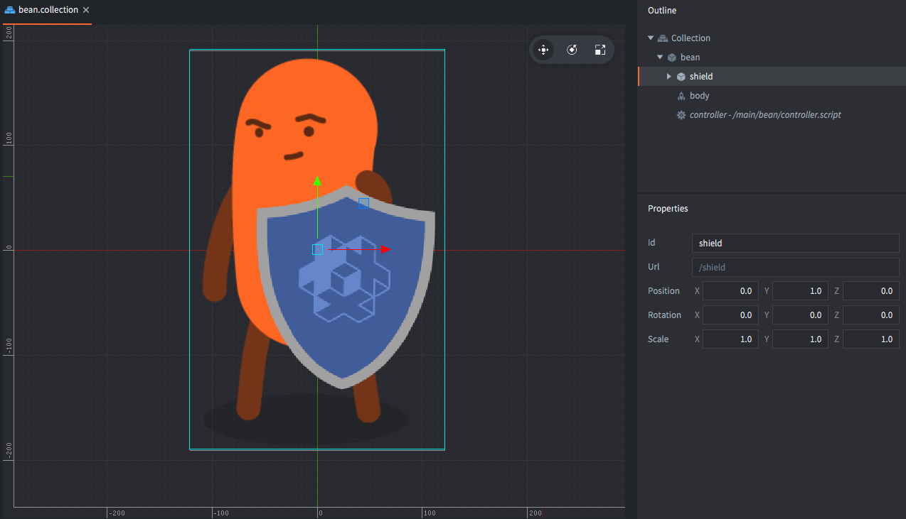
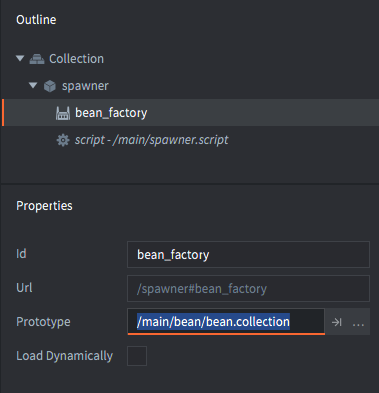

# Collection factories

The collection factory component is used to spawn groups and hierarchies of game objects stored in collection files into a running game.

Collections provide a powerful mechanism to create reusable templates, or "prefabs" in Defold. For an overview on Collections, see the [Building blocks documentation](/manuals/building-blocks#collections). Collections can be placed in the editor, or they can be dynamically inserted into your game.

With a collection factory component you can spawn the contents of a collection file into a game world. This is analogous to performing factory spawning of all game objects inside the collection and then building the parent-child hierarchy between the objects. A typical use case is to spawn enemies consisting of multiple game objects (enemy + weapon, for instance).

## Spawning a collection

Suppose we want a character game object and a separate shield game object childed to the character. We build the game object hierarchy in a collection file and save it as "bean.collection".

::: sidenote
The *collection proxy* component is used to create a new game world, including a separate physics world, based on a collection. The new world is accessed through a new socket. All assets contained in the collection are loaded through the proxy when you message the proxy to start loading. This makes them very useful to, for instance, change levels in a game. New game worlds come with quite a lot of overhead though so do not use them for dynamic loading of small stuff. For more information, see the [Collection proxy documentation](/manuals/collection-proxy).
:::



We then add a *Collection factory* to a gameobject that will take care of the spawning and set "bean.collection" as the component's *Prototype*:



Spawning a bean and shield is now just a matter of calling the `collectionfactory.create()` function:

```lua
local bean_ids = collectionfactory.create("#bean_factory")
```

The function takes 5 parameters:

`url`
: The id of the collection factory component that should spawn the new set of game objects.

`[position]`
: (optional) The world position of the spawned game objects. This should be a `vector3`. If you do not specify a position, the objects are spawned at the position of the collection factory component.

`[rotation]`
: (optional) The world rotation of the new game objects. This should be a `quat`.

`[properties]`
: (optional) A Lua table with `id`-`table` pairs used to initiate the spawned game objects. See below for how to construct this table.

`[scale]`
: (optional) The scale of the spawned game objects. The scale can be expressed as a `number` (greater than 0) which specifies uniform scaling along all axes. You can also provide a `vector3` where each component specifies scaling along the corresponding axis.

`collectionfactory.create()` returns the identities of the spawned game objects as a table. The table keys map the hash of the collection-local id of each object to the runtime id of each object:

::: sidenote
The parent-child relationship between "bean" and "shield" is *not* reflected in the returned table. This relation only exist in the runtime scene-graph, i.e. how objects are transformed together. Re-parenting an object never changes its id.
:::

```lua
local bean_ids = collectionfactory.create("#bean_factory")
go.set_scale(0.5, bean_ids[hash("/bean")])
pprint(bean_ids)
-- DEBUG:SCRIPT:
-- {
--   hash: [/shield] = hash: [/collection0/shield], -- <1>
--   hash: [/bean] = hash: [/collection0/bean],
-- }
```
1. A prefix `/collection[N]/`, where `[N]` is a counter, is added to the id to uniquely identify each instance:

## Properties

When spawning a collection, you can pass property parameters to each game object by constructing a table where the keys are object ids and the values are tables with the script properties to set.

```lua
local props = {}
props[hash("/bean")] = { shield = false }
local ids = collectionfactory.create("#bean_factory", nil, nil, props)
```

Supposing the "bean" game object in "bean.collection" defines the "shield" property. [The Script property manual](/manuals/script-properties) contains information on script properties.

```lua
-- bean/controller.script
go.property("shield", true)

function init(self)
    if not self.shield then
        go.delete("shield")
    end     
end
```

## Dynamic loading of factory resources

By checking the *Load Dynamically* checkbox in the collection factory properties, the engine postpones the loading of the resources associated with the factory.


With the box unchecked the engine loads the prototype resources when the collection factory component is loaded so they are immediately ready for spawning.

With the box checked, you have two options for usage:

Synchronous loading
: Call [`collectionfactory.create()`](/ref/collectionfactory/#collectionfactory.create:url-[position]-[rotation]-[properties]-[scale]) when you want to spawn objects. This  will load the resources synchronously, which may cause a hitch, then spawn new instances.

  ```lua
  function init(self)
      -- No factory resources are loaded when the collection factory’s
      -- parent collection is loaded. Calling create without
      -- having called load will create the resources synchronously.
      self.go_ids = collecionfactory.create("#collectionfactory")
  end

  function final(self)  
      -- Delete game objects. Will decref resources.
      -- In this case resources are deleted since the collection
      -- factory component holds no reference.
      go.delete_all(self.go_ids)

      -- Calling unload will do nothing since factory holds
      -- no references
      collectionfactory.unload("#factory")
  end
  ```

Asynchronous loading
: Call [`collectionfactory.load()`](/ref/collectionfactory/#collectionfactory.load:[url]-[complete_function]) to explicitly load the resources asynchronously. When the resources are ready for spawning, a callback is received.

  ```lua
  function load_complete(self, url, result)
      -- Loading is complete, resources are ready to spawn
      self.go_ids = collectionfactory.create(url)
  end

  function init(self)
      -- No factory resources are loaded when the collection factory’s
      -- parent collection is loaded. Calling load will load the resources.
      collectionfactory.load("#factory", load_complete)
  end

  function final(self)
      -- Delete game object. Will decref resources.
      -- In this case resources aren’t deleted since the collection factory
      -- component still holds a reference.
      go.delete_all(self.go_ids)

      -- Calling unload will decref resources held by the factory component,
      -- resulting in resources being destroyed.
      collectionfactory.unload("#factory")
  end
  ```
