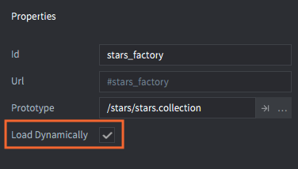

# Компонент Collection Factory

Компонент Collection Factory используется для порождения групп и иерархий игровых объектов, хранящихся в файлах коллекций, в запущенной игре.

В Defold коллекции обеспечивают эффективный способ создания многократно используемых шаблонов, или "префабов". Обзор коллекций см. в [документации по структурным элементам](/manuals/building-blocks#collections). Коллекции можно создавать в редакторе или вставлять в игру динамически.

С помощью фабрик коллекций можно порождать содержимое файла коллекции в игровой мир. Это аналогично выполнению порождения фабрикой всех игровых объектов внутри коллекции с последующим построением иерархии "родительский-дочерний" между объектами. Типичным примером является порождение врагов, состоящих из нескольких игровых объектов (например, враг + оружие).

## Порождение коллекции

Предположим, нам нужен игровой объект персонаж и отдельный игровой объект щит, дочерний по отношению к персонажу. Мы построим иерархию игровых объектов в файле коллекции и сохраним его под именем "bean.collection".

::: sidenote
Компонент *collection proxy* используется для создания нового игрового мира, включая отдельный физический мир, на основе коллекции. Доступ к новому миру осуществляется через новый сокет. Все ассеты, содержащиеся в коллекции, загружаются через прокси, когда вы сообщаете прокси о начале загрузки. Это делает их очень полезными, например, для изменения уровней в игре. Однако новые игровые миры сопровождаются довольно большими накладными расходами, поэтому не стоит использовать их для динамической загрузки мелкого контента. За подробностями обращайтесь к [документации по прокси-коллекциям](/manuals/collection-proxy).
:::


Затем добавляется *Collection factory* к игровому объекту, который будет осуществлять порождение, и устанавливается "bean.collection" в качестве *прототипа* компонента:


Теперь порождение объектов "bean" и "shield" --- это просто вызов функции `collectionfactory.create()`:

```lua
local bean_ids = collectionfactory.create("#bean_factory")
```

Функция принимает 5 параметров:

`url`
: Идентификатор фабрики коллекций, которая должна породить новый набор игровых объектов.

`[position]`
: (Опционально) Мировая позиция порожденных игровых объектов. Это должен быть `vector3`. Если не указать позицию, объекты будут порождены в позиции фабрики.

`[rotation]`
: (Опционально) Мировое вращение новых игровых объектов. Это должен быть `quat`.

`[properties]`
: (Опционально) Lua-таблица с парами `id`-`table`, используемая для инициирования порожденных игровых объектов. Как построить эту таблицу, смотрите ниже.

`[scale]`
: (Опционально) Масштаб порождаемых игровых объектов. Масштаб может быть выражен в виде `number` (больше 0), которое задает равномерное масштабирование по всем осям. Можно также указать `vector3`, где каждый компонент задает масштабирование по соответствующей оси.

`collectionfactory.create()` возвращает идентификаторы порожденных игровых объектов в виде таблицы. Ключи таблицы отображают хэш локального идентификатора коллекции каждого объекта на идентификатор каждого объекта в среде выполнения:

::: sidenote
Отношение "родительский-дочерний" между "bean" и "shield" *не* отражается в возвращаемой таблице. Это отношение существует только в графе сцены среды выполнения, то есть в том, как объекты преобразуются вместе. Повторное подчинение объекта никогда не изменяет его id.
:::

```lua
local bean_ids = collectionfactory.create("#bean_factory")
go.set_scale(0.5, bean_ids[hash("/bean")])
pprint(bean_ids)
-- DEBUG:SCRIPT:
-- {
--   hash: [/shield] = hash: [/collection0/shield], -- <1>
--   hash: [/bean] = hash: [/collection0/bean],
-- }
```
1. Префикс `/collection[N]/`, где `[N]` --- счетчик, добавляемый к id для уникальной идентификации каждого экземпляра:

## Свойства

При порождении коллекции можно передать свойства каждому игровому объекту, построив таблицу, где ключами являются идентификаторы объектов, а значениями --- таблицы со свойствами скрипта, которые нужно установить.

```lua
local props = {}
props[hash("/bean")] = { shield = false }
local ids = collectionfactory.create("#bean_factory", nil, nil, props)
```

Предположим, что игровой объект "bean" в "bean.collection" определяет свойство "shield". [Руководство по свойствам скрипта](/manuals/script-properties) содержит информацию о свойствах сценария.

```lua
-- bean/controller.script
go.property("shield", true)

function init(self)
    if not self.shield then
        go.delete("shield")
    end     
end
```

## Динамическая загрузка ресурсов фабрики

Отметив в свойствах фабрики коллекций *Load Dynamically*, движок откладывает загрузку ресурсов, связанных с фабрикой.



Если опция не отмечена, движок загружает ресурсы прототипа при загрузке компонента фабрики коллекций, так что они сразу готовы к порождению.

Если опция отмечена, есть два варианта использования:

Синхронная загрузка
: Вызовите [`collectionfactory.create()`](/ref/collectionfactory/#collectionfactory.create:url-[position]-[rotation]-[properties]-[scale]), когда нужно породить объекты. При этом ресурсы будут загружены синхронно, что может вызвать заминку, а затем будут порождены новые экземпляры.

  ```lua
  function init(self)
      -- No factory resources are loaded when the collection factory’s
      -- parent collection is loaded. Calling create without
      -- having called load will create the resources synchronously.
      self.go_ids = collecionfactory.create("#collectionfactory")
  end

  function final(self)
      -- Delete game objects. Will decref resources.
      -- In this case resources are deleted since the collection
      -- factory component holds no reference.
      go.delete(self.go_ids)

      -- Calling unload will do nothing since factory holds
      -- no references
      collectionfactory.unload("#factory")
  end
  ```

Асинхронная загрузка
: Вызовите [`collectionfactory.load()`](/ref/collectionfactory/#collectionfactory.load:[url]-[complete_function]) для явной асинхронной загрузки ресурсов. Когда ресурсы будут готовы к порождению, будет получен обратный вызов.

  ```lua
  function load_complete(self, url, result)
      -- Loading is complete, resources are ready to spawn
      self.go_ids = collectionfactory.create(url)
  end

  function init(self)
      -- No factory resources are loaded when the collection factory’s
      -- parent collection is loaded. Calling load will load the resources.
      collectionfactory.load("#factory", load_complete)
  end

  function final(self)
      -- Delete game object. Will decref resources.
      -- In this case resources aren’t deleted since the collection factory
      -- component still holds a reference.
      go.delete(self.go_ids)

      -- Calling unload will decref resources held by the factory component,
      -- resulting in resources being destroyed.
      collectionfactory.unload("#factory")
  end
  ```

  
## Динамический прототип

Можно изменить, какой *прототип* может создавать компонент фабрики коллекций, установив флажок *Dynamic Prototype* в свойствах компонента фабрики.


Когда включена опция *Dynamic Prototype*, компонент фабрики коллекций может менять прототип с помощью функции `collectionfactory.set_prototype()`. Пример:

```lua
collectionfactory.unload("#factory") -- выгрузить предыдущие ресурсы
collectionfactory.set_prototype("#factory", "/main/levels/level1.collectionc")
local ids = collectionfactory.create("#factory")
```

::: important
Когда опция *Dynamic Prototype* включена, количество компонентов коллекции не может быть оптимизировано, и владеющая коллекция будет использовать значения по умолчанию из файла *game.project*.
:::
