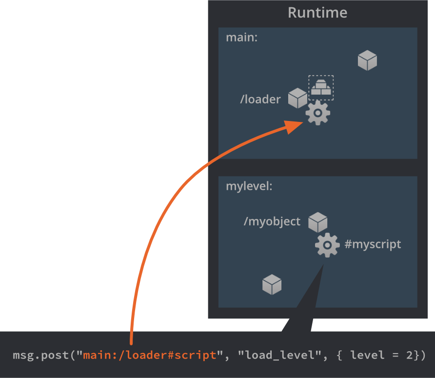

# Компонент Collection Proxy

Компонент Collection Proxy используется для динамической загрузки и выгрузки новых игровых "миров", основываясь на содержимом файла коллекции. Они могут использоваться для реализации переключения между игровыми уровнями, экранами графического интерфейса, загрузки и выгрузки повествовательных "сцен" на протяжении уровня, загрузки/выгрузки мини-игр и многого другого.

Defold организует все игровые объекты в коллекции. Коллекция может содержать игровые объекты и другие коллекции (то есть субколлекции). Прокси-коллекции позволяют разделить содержимое на отдельные коллекции и затем динамически управлять загрузкой и выгрузкой этих коллекций с помощью скриптов.

Прокси-коллекции отличаются от [фабрик коллекций](/manuals/collection-factory/). Фабрика коллекций внедряет содержимое коллекции в текущий игровой мир. Прокси-коллекции создают новый игровой мир во время выполнения и, следовательно, имеют другие сценарии использования.

## Создание компонента Collection Proxy

1. Добавьте прокси-коллекцию к игровому объекту, <kbd>кликнув ПКМ</kbd> на игровом объекте и выбрав <kbd>Add Component ▸ Collection Proxy</kbd> из контекстного меню.

2. В свойстве *Collection* укажите ссылку на коллекцию, которую необходимо динамически загрузить в среду выполнения позднее. Ссылка является статической и гарантирует, что все содержимое коллекции, на которую ссылаются, в конечном счете окажется в игре.


(Содержимое можно исключить из сборки и загрузить вместо него код, отметив опцию *Exclude* и используя [Live-обновление](/manuals/live-update/).)

## Загрузочная коллекция

Когда движок Defold запускается, он загружает и инстанцирует все игровые объекты из *загрузочной (bootstrap) коллекции* в среду выполнения. Затем он инициализирует и активирует игровые объекты и их компоненты. Какая загрузочная коллекция должна использоваться движком, указывается в [настройках проекта](/manuals/project-settings/#main-collection). По договоренности этот файл коллекции обычно называется "main.collection".


Для размещения игровых объектов и их компонентов движок выделяет память, необходимую для всего "игрового мира", в который инстанцируется содержимое загрузочной коллекции. Кроме того, создается отдельный физический мир для любых объектов столкновений и физических симуляций.

Поскольку скрипты должны иметь возможность обращаться ко всем объектам в игре, даже извне загрузочного мира, им присваивается уникальное имя: свойство *Name*, которое задается в файле коллекции:


Если загружаемая коллекция содержит прокси-коллекции, коллекции, на которые они ссылаются, автоматически *не* загружаются. Необходимо контролировать загрузку этих ресурсов с помощью скриптов.

## Загрузка коллекции

Динамическая загрузка коллекции посредством прокси осуществляется путем отправки сообщения ``load`` компоненту прокси из скрипта:

```lua
-- Сказать прокси "myproxy", чтобы он начал загрузку.
msg.post("#myproxy", "load")
```


Прокси укажет движку выделить место для нового мира. Также будет создана отдельная среда выполнения физики и инстанцируются все игровые объекты в коллекции.

Новый мир получает свое имя из свойства *Name* в файле коллекции, в данном примере оно установлено в "mylevel". Имя должно быть уникальным. Если *Name*, заданное в файле коллекции, уже используется для загруженного мира, движок сообщит об ошибке конфликта имен:

```txt
ERROR:GAMEOBJECT: The collection 'default' could not be created since there is already a socket with the same name.
WARNING:RESOURCE: Unable to create resource: build/default/mylevel.collectionc
ERROR:GAMESYS: The collection /mylevel.collectionc could not be loaded.
```

Когда движок закончит загрузку коллекции, прокси-коллекция отправит сообщение `"proxy_loaded"` обратно скрипту, который отправил сообщение `"load"`. Затем скрипт может инициализировать и активировать коллекцию в качестве реакции на это сообщение:

```lua
function on_message(self, message_id, message, sender)
    if message_id == hash("proxy_loaded") then
        -- Новый мир загружен. Инициировать и активировать его.
        msg.post(sender, "init")
        msg.post(sender, "enable")
        ...
    end
end
```

`"load"`
: Это сообщение указывает компоненту Collection Proxy начать загрузку своей коллекции в новый мир. Прокси отправит обратно сообщение `"proxy_loaded"`, когда все будет готово.

`"async_load"`
: Это сообщение указывает компоненту Collection Proxy начать фоновую загрузку своей коллекции в новый мир. Прокси отправит обратно сообщение `"proxy_loaded"`, когда все будет готово.

`"init"`
: Это сообщение указывает компоненту Collection Proxy, что все игровые объекты и компоненты, которые были инстанцированы, должны быть инициализированы. На этом этапе вызываются все функции скрипта.

`"enable"`
: Это сообщение указывает компоненту Collection Proxy, что все игровые объекты и компоненты должны быть активированы. Например, все компоненты Sprite начинают отрисовываться при активации.

## Отправка сообщений в новый игровой мир

Имя *Name*, заданное в свойствах файла коллекции, используется для обращения к игровым объектам и компонентам в загруженном мире. Если, например, создать объект-загрузчик в коллекции начальной загрузки, может понадобиться взаимодействовать с ним из любой загруженной коллекции:

```lua
-- сообщить загрузчику о необходимости загрузить следующий уровень:
msg.post("main:/loader#script", "load_level", { level_id = 2 })
```



И если необходимо взаимодействовать с игровым объектом в загруженной коллекции из загрузчика, можно отправить сообщение, используя [полный URL объекта](/manuals/addressing/#urls):

```lua
msg.post("mylevel:/myobject", "hello")
```

::: important
Невозможно напрямую обращаться к игровым объектам в загруженной коллекции извне этой коллекции:

```lua
local position = go.get_position("mylevel:/myobject")
-- loader.script:42: function called can only access instances within the same collection.
```
:::


## Выгрузка мира

Чтобы выгрузить загруженную коллекцию, необходимо отправить сообщения, соответствующие обратным этапам загрузки:

```lua
-- unload the level
msg.post("#myproxy", "disable")
msg.post("#myproxy", "final")
msg.post("#myproxy", "unload")
```

`"disable"`
: Это сообщение указывает компоненту Collection Proxy деактивировать все игровые объекты и компоненты в мире. На этом этапе прекращается отрисовка спрайтов.

`"final"`
: Это сообщение указывает компоненту Collection Proxy завершить все игровые объекты и компоненты в мире. На этом этапе вызываются функции `final()` всех скриптов.

`"unload"`
: Это сообщение указывает компоненту Collection Proxy полностью удалить мир из памяти.

Если более тонкий контроль не требуется, можно отправить сообщение `"unload"` напрямую, без предварительной деактивации и финализации коллекции. Тогда прокси автоматически отключит и завершит коллекцию перед ее выгрузкой.

Когда Collection Proxy закончит выгрузку коллекции, он отправит сообщение `"proxy_unloaded"` обратно в скрипт, который отправил сообщение `"unload"`:

```lua
function on_message(self, message_id, message, sender)
    if message_id == hash("proxy_unloaded") then
        -- Ok, мир выгружен...
        ...
    end
end
```


## Временной шаг

Обновления прокси-коллекции можно масштабировать, изменяя _временной шаг_. Это означает, что даже если игра имеет постоянную частоту 60 FPS, прокси может обновляться с большей или меньшей скоростью, влияя на такие аспекты, как:

* Скорость физических симуляций
* `dt`, переданное в `update()`
* [Анимация свойств игровых объектов и GUI](https://defold.com/manuals/animation/#property-animation-1)
* [Мултикадровая анимация](https://defold.com/manuals/animation/#flip-book-animation)
* [Симуляции эффектов частиц](https://defold.com/manuals/particlefx/)
* Частота таймера

Можно также установить режим обновления, который позволяет контролировать, должно ли масштабирование выполняться дискретно (что имеет смысл только при коэффициенте масштабирования менее 1.0) или непрерывно.

Управление коэффициентом масштабирования и режимом масштабирования осуществляется путем отправки прокси сообщения `set_time_step`:

```lua
-- обновлять загруженный мир на 1/5 скорости.
msg.post("#myproxy", "set_time_step", {factor = 0.2, mode = 1}
```

Чтобы увидеть, что происходит при изменении временного шага, мы можем создать объект со следующим кодом в скрипте и поместить его в коллекцию, временной шаг которой мы изменяем:

```lua
function update(self, dt)
    print("update() with timestep (dt) " .. dt)
end
```

При шаге по времени 0.2 мы получаем следующий результат в консоли:

```txt
INFO:DLIB: SSDP started (ssdp://192.168.0.102:54967, http://0.0.0.0:62162)
INFO:ENGINE: Defold Engine 1.2.37 (6b3ae27)
INFO:ENGINE: Loading data from: build/default
DEBUG:SCRIPT: update() with timestep (dt) 0
DEBUG:SCRIPT: update() with timestep (dt) 0
DEBUG:SCRIPT: update() with timestep (dt) 0
DEBUG:SCRIPT: update() with timestep (dt) 0
DEBUG:SCRIPT: update() with timestep (dt) 0.016666667535901
DEBUG:SCRIPT: update() with timestep (dt) 0
DEBUG:SCRIPT: update() with timestep (dt) 0
DEBUG:SCRIPT: update() with timestep (dt) 0
DEBUG:SCRIPT: update() with timestep (dt) 0
DEBUG:SCRIPT: update() with timestep (dt) 0.016666667535901
```

`update()` по-прежнему вызывается 60 раз в секунду, но значение `dt` меняется. Мы видим, что только 1/5 (0.2) вызовов `update()` будет иметь `dt` равное 1/60 (что соответствует 60 FPS) --- остальные равны нулю. Все физические симуляции также будут обновляться в соответствии с этим `dt` и продвигаться только в 1/5 кадров.

::: sidenote
Функциональность временного шага коллекции можно использовать для приостановки игры, например, при отображении всплывающего окна или когда окно потеряло фокус. Используйте `msg.post("#myproxy", "set_time_step", {factor = 0, mode = 0})` для паузы и `msg.post("#myproxy", "set_time_step", {factor = 1, mode = 1})` для возобновления.
:::

За подробностями обращайтесь к [`set_time_step`](/ref/collectionproxy#set_time_step).

## Предостережения и общие проблемы

Физика
: С помощью прокси-коллекций можно загрузить в движок более одной коллекции верхнего уровня, или *игрового мира*. При этом важно знать, что каждая коллекция верхнего уровня --- это отдельный физический мир. Физические взаимодействия (столкновения, триггеры, рэйкасты) происходят только между объектами, принадлежащими одному и тому же миру. Поэтому даже если объекты столкновения из двух миров визуально располагаются прямо друг на друге, между ними не может быть какого-либо физического взаимодействия.

Память
: Каждая загруженная коллекция создает новый игровой мир, который занимает относительно много памяти. Если одновременно загружаются десятки коллекций через прокси, возможно, стоит пересмотреть структуру игры. Для порождения множества экземпляров иерархий игровых объектов больше подходят [фабрики коллекций](/manuals/collection-factory).

Ввод
: Если в загруженной коллекции есть объекты, требующие действий ввода, необходимо убедиться, что игровой объект, содержащий прокси-коллекцию, получает данные ввода. Когда игровой объект получает сообщения ввода, они передаются компонентам этого объекта, то есть прокси коллекции. Действия ввода отправляются через прокси в загруженную коллекцию.
