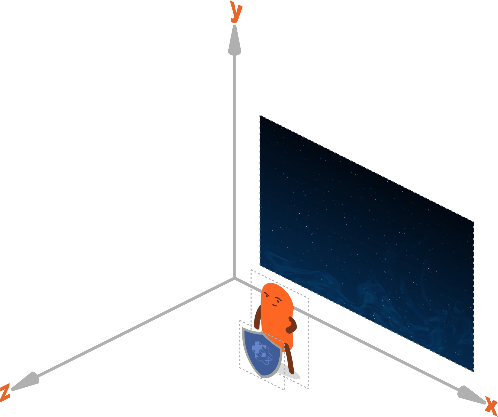
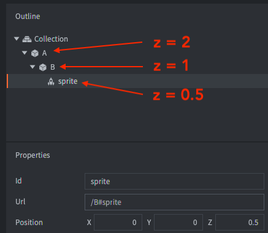

# Компоненты игрового объекта

:[components](../shared/components.md)

## Типы компонентов

Defold поддерживает следующие типы компонентов:

* [Collection Factory](/manuals/collection-factory) --- Порождает коллекции
* [Collection Proxy](/manuals/collection-proxy) --- Загружает и выгружает коллекции
* [Collision Object](/manuals/physics) --- Оснащает игровой объект физическим поведением
* [Camera](/manuals/camera) --- Отвечает за область видимости и проекцию игрового мира
* [Factory](/manuals/factory) --- Порождает игровые объекты
* [GUI](/manuals/gui) --- Визуализирует графический пользовательский интерфейс
* [Label](/manuals/label) --- Визуализирует текстовые фрагменты
* [Mesh](/manuals/mesh) --- Отображает 3D-сетку (с возможностью создания и манипулирования при выполнении)
* [Model](/manuals/model) --- Отображает 3D-модель (с возможностью анимации)
* [Particle FX](/manuals/particlefx) ---  Порождает частицы
* [Script](/manuals/script) --- Оснащает игру логикой
* [Sound](/manuals/sound) --- Воспроизводит звуки или музыку
* [Spine Model](/manuals/spinemodel) --- Визуализирует Spine-анимацию
* [Sprite](/manuals/sprite) --- Отображает 2D-изображение (с возможностью мултикадровой анимации)
* [Tile Map](/manuals/tilemap) --- Отображает сетку тайлов

Дополнительные компоненты можно добавить с помощью расширений:

* [Rive model](/extension-rive) --- Визуализирует анимацию Rive
* [Spine model](/extension-spine) --- Визуализирует анимацию Spine

## Включение и отключение компонентов

Компоненты игрового объекта активируются при создании этого игрового объекта. Если требуется отключить компонент, это делается путем отправки ему сообщения [`disable`](/ref/go/#disable):

```lua
-- отключить компонент с id 'weapon' в том же игровом объекте, что и этот скрипт
msg.post("#weapon", "disable")

-- отключить компонент с идентификатором 'shield' в игровом объекте 'enemy'
msg.post("enemy#shield", "disable")

-- отключить все компоненты в текущем игровом объекте
msg.post(".", "disable")

-- отключить все компоненты игрового объекта 'enemy'
msg.post("enemy", "disable")
```

Чтобы снова включить компонент, достаточно отправить ему сообщение [`enable`](/ref/go/#enable):

```lua
-- включить компонент с id 'weapon'
msg.post("#weapon", "enable")
```

## Свойства компонента

В Defold компоненты всех типов имеют различные свойства. Панель [Properties](/manuals/editor/#the-editor-views) в редакторе отображает свойства текущего выделенного в [Outline](/manuals/editor/#the-editor-views) компонента. За дополнительной информацией о доступных свойствах обращайтесь к руководствам по различным типам компонентов.

## Позиция, вращение и масштаб компонента

Визуальные компоненты, как правило, имеют свойства позиции и вращения, а также, чаще всего, масштаб. Эти свойства могут быть изменены в редакторе, и почти во всех случаях не могут изменятся при выполнении. Единственным исключением является масштаб компонентов Sprite и Label, который все же может быть изменен при выполнении.

Если необходимо изменять позицию, поворот или масштаб компонента во время выполнения, то вместо этого следует изменять позицию, поворот или масштаб игрового объекта, к которому этот компонент принадлежит. Такой подход имеет побочный эффект, поскольку будут затронуты все компоненты игрового объекта. Если требуется манипулировать только одним компонентом из множества, прикрепленных к игровому объекту, рекомендуется переместить данный компонент в отдельный игровой объект и добавить его в качестве дочернего игрового объекта к объекту, к которому изначально принадлежал компонент.

## Порядок отрисовки компонентов

Порядок отрисовки визуальных компонентов зависит от двух факторов.

### Предикаты рендер-скрипта
Каждому компоненту назначается [материал](/manuals/material/), и каждый материал имеет один или несколько тегов. Рендер-скрипт, в свою очередь, определяет ряд предикатов, каждый из которых соответствует одному или нескольким тегам материала. В функции *update()* рендер-скрипта [предикаты отрисовываются один за другим](/manuals/render/#render-predicates), а также отрисовываются компоненты, соответствующие тегам, определенным в каждом предикате. Рендер-скрипт по умолчанию сперва отрисовывает спрайты и тайловые карты за один проход, затем частицы за другой проход (оба в мировом пространстве). Далее рендер-скрипт переходит к отрисовке компонентов графического интерфейса в отдельном проходе в пространстве экрана.

### Значение по оси Z
Все игровые объекты и компоненты позиционируются в 3D пространстве, причем позиции выражаются в виде объектов типа vector3. Когда мы просматриваем графическое содержимое игры в 2D, значения по осям X и Y определяют позицию объекта вдоль осей "ширины" и "высоты", а значение по Z определяет позицию вдоль оси "глубины". Позиция по Z позволяет управлять видимостью перекрывающихся объектов: спрайт со значением по Z, равным 1, будет отображаться поверх спрайта в позиции по Z, равной 0. По умолчанию Defold использует систему координат, допускающую значения по оси Z от -1 до 1:



Компоненты, соответствующие [предикату рендера](/manuals/render/#render-predicates) отрисовываются совместно, и порядок их отрисовки зависит от конечного значения по оси Z компонента. Конечное значение компонента по Z --- это сумма значений по Z самого компонента, игрового объекта, к которому он принадлежит, и значений по Z всех родительских игровых объектов.

::: sidenote
Порядок отрисовки нескольких компонентов GUI значением по Z **не** определяется. Он контролируется функцией [gui.set_render_order()](/ref/gui/#gui.set_render_order:order).
:::

Пример: Есть два игровых объекта A и B. B является дочерним по отношению к A. B имеет компонент Sprite.

| What     | Z-value |
|----------|---------|
| A        | 2       |
| B        | 1       |
| B#sprite | 0.5     |



С помощью приведенной выше иерархии окончательное значение по Z спрайта в объекте B равно 2 + 1 + 0.5 = 3.5.

::: important
Если два компонента имеют одинаковое значение по оси Z, то порядок считается неопределенным, что в итоге приведет к мерцанию компонентов, или компоненты будут отображаться в одном порядке на одной платформе и в другом порядке на другой платформе.

Рендер-скрипт определяет ближнюю и дальнюю плоскости для значений по Z. Любой компонент со значением по Z, выходящим за пределы этого диапазона, рендерится не будет. По умолчанию диапазон составляет от -1 до 1, но [его можно легко изменить](/manuals/render/#default-view-projection). Числовая точность значений по оси Z с ближним и дальним пределами -1 и 1 очень высока. При работе с 3D-ассетами может возникнуть необходимость изменить ближний и дальний пределы проекции по умолчанию в пользовательском рендер-скрипте. За подробностями обращайтесь к [руководству по рендерингу](/manuals/render/).
:::


:[Оптимизация максимального количества компонентов](../shared/component-max-count-optimizations.md)
