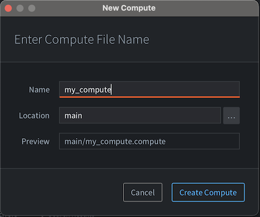
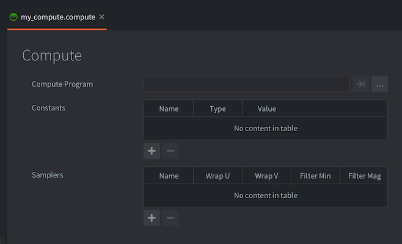
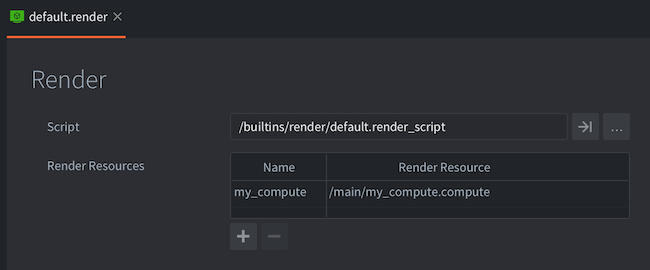

# Compute-программы

::: sidenote
Поддержка compute-шейдеров в Defold в настоящее время находится в стадии *technical preview*.
Это означает, что некоторых возможностей пока не хватает, а API потенциально может измениться в будущем.
:::

Compute-шейдеры являются мощным инструментом для выполнения вычислений общего назначения на GPU. Они позволяют задействовать возможности параллельной обработки графического процессора для таких задач, как физические симуляции, обработка изображений и многое другое. Compute-шейдер работает с данными, хранящимися в буферах или текстурах, выполняя операции параллельно во множестве GPU-потоков. Именно этот параллелизм и делает compute-шейдеры столь полезными для ресурсоемких вычислений.

* Подробнее о конвейере рендеринга см. в [документации по Render](/manuals/render).
* Подробное объяснение шейдерных программ см. в [документации по Shader](/manuals/shader).

## Что можно делать с compute-шейдерами?

Поскольку compute-шейдеры предназначены для вычислений общего назначения, фактически нет предела тому, что с их помощью можно реализовать. Вот несколько типичных примеров использования compute-шейдеров:

Обработка изображений
  - Фильтрация изображений: применение размытия, выделения границ, фильтра резкости и т.д.
  - Цветокоррекция: изменение цветового пространства изображения.

Физика
  - Системы частиц: симуляция большого количества частиц для эффектов дыма, огня, жидкости и т.д.
  - Физика мягких тел: симуляция деформируемых объектов, например ткани и желе.
  - Отсечение: occlusion culling, frustum culling.

Процедурная генерация
  - Генерация ландшафта: создание детализированного рельефа с использованием шумовых функций.
  - Растительность и листва: процедурная генерация растений и деревьев.

Эффекты рендеринга
  - Глобальное освещение: симуляция реалистичного освещения путем приближенного расчета отражений света в сцене.
  - Вокселизация: создание трехмерной воксельной сетки на основе данных меша.

## Как работают compute-шейдеры?

На высоком уровне compute-шейдеры работают, разбивая задачу на множество более мелких подзадач, которые могут выполняться одновременно. Это достигается за счет концепций `work groups` и `invocations`:

Work Groups
: Compute-шейдер работает на сетке из `work groups`. Каждая рабочая группа содержит фиксированное число invocations (или потоков). Размер рабочих групп и количество invocations определяются в коде шейдера.

Invocations
: Каждый invocation (или поток) выполняет программу compute-шейдера. Invocations внутри одной рабочей группы могут совместно использовать данные через shared memory, что позволяет эффективно обмениваться данными и синхронизироваться между собой.

GPU выполняет compute-шейдер, параллельно запуская множество invocations в нескольких рабочих группах, что обеспечивает значительную вычислительную мощность для подходящих задач.

## Создание compute-программы

Чтобы создать compute-программу, <kbd>кликните ПКМ</kbd> по целевой папке в браузере *Assets* и выберите <kbd>New... ▸ Compute</kbd>. (Также можно выбрать <kbd>File ▸ New...</kbd> в меню, а затем <kbd>Compute</kbd>). Укажите имя нового compute-файла и нажмите <kbd>Ok</kbd>.



Новый compute-файл откроется в *Compute Editor*.



Compute-файл содержит следующую информацию:

Compute Program
: Файл программы compute-шейдера (*`.cp`*), который нужно использовать. Шейдер работает с "абстрактными рабочими элементами", то есть для входных и выходных данных нет фиксированного определения типов. Программист сам определяет, какой результат должен выдавать compute-шейдер.

Constants
: Uniform-переменные, которые будут переданы программе compute-шейдера. Ниже приведен список доступных констант.

Samplers
: При желании можно настроить определенные сэмплеры в compute-файле. Добавьте сэмплер, задайте ему имя в соответствии с именем, используемым в шейдерной программе, и настройте wrap и filter-параметры по своему усмотрению.


## Использование compute-программы в Defold

В отличие от материалов, compute-программы не назначаются компонентам и не участвуют в обычном процессе рендеринга. Чтобы compute-программа выполнила какую-либо работу, ее необходимо `dispatched` из render-скрипта. Однако перед dispatch нужно убедиться, что render-скрипт имеет ссылку на compute-программу. В настоящее время единственный способ сообщить render-скрипту о compute-программе заключается в том, чтобы добавить ее в .render-файл, который хранит ссылку на ваш render-скрипт:



Чтобы использовать compute-программу, ее сначала необходимо привязать к render-контексту. Это делается так же, как и для материалов:

```lua
render.set_compute("my_compute")
-- Выполнить compute-работу здесь, вызовите render.set_compute() для отвязки
render.set_compute()
```

Хотя константы compute будут автоматически применены при dispatch программы, из редактора нельзя привязать к compute-программе входные или выходные ресурсы (текстуры, буферы и т.д.). Вместо этого это нужно делать из render-скриптов:

```lua
render.enable_texture("blur_render_target", "tex_blur")
render.enable_texture(self.storage_texture, "tex_storage")
```

Чтобы запустить программу в выбранном вами рабочем пространстве, необходимо выполнить dispatch программы:

```lua
render.dispatch_compute(128, 128, 1)
-- dispatch_compute также принимает таблицу options последним аргументом
-- эту таблицу можно использовать для передачи render-констант в вызов dispatch
local constants = render.constant_buffer()
constants.tint = vmath.vector4(1, 1, 1, 1)
render.dispatch_compute(32, 32, 32, {constants = constants})
```

### Запись данных из compute-программ

В настоящее время вывод любого типа данных из compute-программы можно реализовать только через `storage textures`. Storage texture похожа на "обычную текстуру", но поддерживает больше возможностей и настроек. Storage textures, как следует из названия, можно использовать как универсальный буфер, в который можно читать и записывать данные из compute-программы. Затем тот же буфер можно привязать к другой шейдерной программе для чтения.

Чтобы создать storage texture в Defold, это нужно сделать из обычного .script-файла. Render-скрипты такой возможности не имеют, поскольку динамические текстуры создаются через resource API, доступный только в обычных .script-файлах.

```lua
-- В .script-файле:
function init(self)
    -- Создаем texture resource как обычно, но добавляем флаг "storage",
    -- чтобы ее можно было использовать как backing storage для compute-программ
    local t_backing = resource.create_texture("/my_backing_texture.texturec", {
        type   = resource.TEXTURE_TYPE_IMAGE_2D,
        width  = 128,
        height = 128,
        format = resource.TEXTURE_FORMAT_RGBA32F,
        flags  = resource.TEXTURE_USAGE_FLAG_STORAGE + resource.TEXTURE_USAGE_FLAG_SAMPLE,
    })

    -- получаем handle текстуры из ресурса
    local t_backing_handle = resource.get_texture_info(t_backing).handle

    -- уведомляем renderer о backing texture, чтобы ее можно было привязать через render.enable_texture
    msg.post("@render:", "set_backing_texture", { handle = t_backing_handle })
end
```

## Собираем все вместе

### Программа шейдера

```glsl
// compute.cp
#version 450

layout (local_size_x = 1, local_size_y = 1, local_size_z = 1) in;

// указываем входные ресурсы
uniform vec4 color;
uniform sampler2D texture_in;

// указываем выходное изображение
layout(rgba32f) uniform image2D texture_out;

void main()
{
    // Это не самый интересный шейдер, но он демонстрирует,
    // как читать из текстуры и constant buffer и писать в storage texture

    ivec2 tex_coord   = ivec2(gl_GlobalInvocationID.xy);
    vec4 output_value = vec4(0.0, 0.0, 0.0, 1.0);
    vec2 tex_coord_uv = vec2(float(tex_coord.x)/(gl_NumWorkGroups.x), float(tex_coord.y)/(gl_NumWorkGroups.y));
    vec4 input_value = texture(texture_in, tex_coord_uv);
    output_value.rgb = input_value.rgb * color.rgb;

    // Записываем выходное значение в storage texture
    imageStore(texture_out, tex_coord, output_value);
}
```

### Script-компонент
```lua
-- В .script-файле

-- Здесь мы указываем входную текстуру, которую позже привяжем
-- к compute-программе. Эту текстуру можно назначить model-компоненту
-- или включить ее в render-контекст из render-скрипта.
go.property("texture_in", resource.texture())

function init(self)
    -- Создаем texture resource как обычно, но добавляем флаг "storage",
    -- чтобы ее можно было использовать как backing storage для compute-программ
    local t_backing = resource.create_texture("/my_backing_texture.texturec", {
        type   = resource.TEXTURE_TYPE_IMAGE_2D,
        width  = 128,
        height = 128,
        format = resource.TEXTURE_FORMAT_RGBA32F,
        flags  = resource.TEXTURE_USAGE_FLAG_STORAGE + resource.TEXTURE_USAGE_FLAG_SAMPLE,
    })

    local textures = {
        texture_in = resource.get_texture_info(self.texture_in).handle,
        texture_out = resource.get_texture_info(t_backing).handle
    }

    -- уведомляем renderer о входной и выходной текстурах
    msg.post("@render:", "set_backing_texture", textures)
end
```

### Render-скрипт
```lua
-- отвечаем на сообщение "set_backing_texture",
-- чтобы задать backing texture для compute-программы
function on_message(self, message_id, message)
    if message_id == hash("set_backing_texture") then
        self.texture_in = message.texture_in
        self.texture_out = message.texture_out
    end
end

function update(self)
    render.set_compute("compute")
    -- Мы можем привязывать текстуры к конкретным именованным константам
    render.enable_texture(self.texture_in, "texture_in")
    render.enable_texture(self.texture_out, "texture_out")
    render.set_constant("color", vmath.vector4(0.5, 0.5, 0.5, 1.0))
    -- Выполняем dispatch compute-программы столько раз, сколько у нас пикселей.
    -- Это и образует нашу "рабочую группу". Шейдер будет вызван
    -- 128 x 128 x 1 раз, то есть один раз на каждый пиксель.
    render.dispatch_compute(128, 128, 1)
    -- когда работа с compute-программой завершена, нужно отвязать ее
    render.set_compute()
end
```

## Совместимость

В настоящее время Defold поддерживает compute-шейдеры в следующих графических адаптерах:

- Vulkan
- Metal (через MoltenVK)
- OpenGL 4.3+
- OpenGL ES 3.1+

::: sidenote
В настоящее время нет способа проверить, поддерживает ли запущенный клиент compute-шейдеры.
Это означает, что нет гарантии, что клиент сможет запускать compute-шейдеры, если используется графический адаптер на основе OpenGL или OpenGL ES.
Vulkan и Metal поддерживают compute-шейдеры начиная с версии 1.0. Чтобы использовать Vulkan, необходимо создать custom manifest и выбрать Vulkan в качестве backend.
:::
