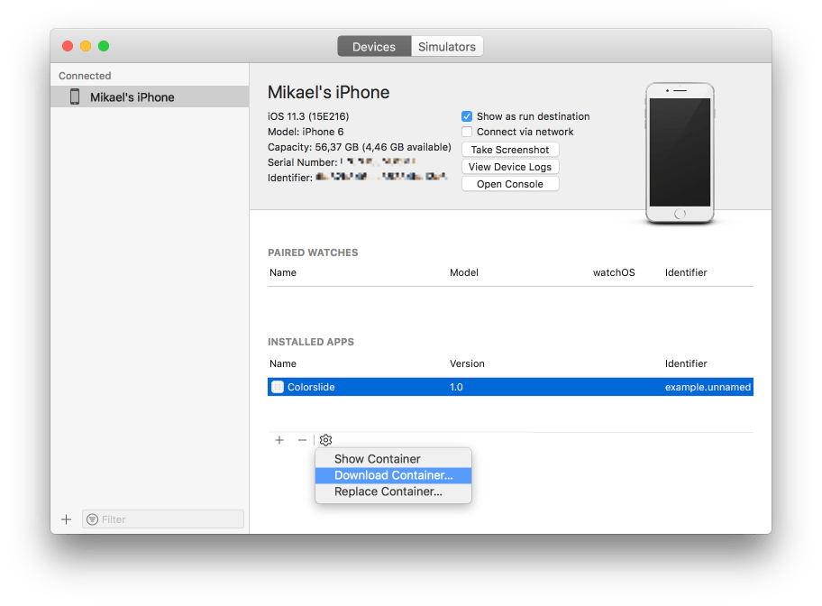

# Логи игры и системный лог

В логе игры отображаются все результаты работы движка, нативных расширений и вашей игровой логики. Команды [print()](/ref/stable/base/#print:...)  и [pprint()](/ref/stable/builtins/?q=pprint#pprint:v) можно использовать из вашего скрипты и Lua-модулей для отображения информации в логе игры. Вы можете использовать функции из [пространства имен dmLog](/ref/stable/dmLog/) для записи в лог игры из нативных расширений. Лог игры можно прочитать из редактора, из окна терминала, с помощью специальных инструментов платформы или из файла лога.

Системные логи создаются операционной системой и могут содержать дополнительную информацию, которая может помочь вам выявить проблему. Системные логи могут содержать трассировки стека для сбоев и предупреждений о нехватке памяти. 

::: important
В логе игры будет отображаться информация только в отладочных сборках. В сборках релизов лог будет полностью пустым. 
:::

## Чтение лога игры из редактора 

Когда вы запускаете игру локально из редактора или подключаетесь к [мобильному приложению для разработки](/manuals/dev-app), весь вывод будет отображаться на панели консоли редактора: 


## Чтение лога игры с терминала

Когда вы запускаете игру Defold из терминала, лог будет отображаться в самом окне терминала. В Windows и Linux вы вводите имя исполняемого файла в терминале, чтобы запустить игру. В macOS вам нужно запустить движок из файла .app:

```
$ > ./mygame.app/Contents/MacOS/mygame
```

## Чтение логов игры и системных логов с помощью инструментов, специфичных для платформы 

### HTML5

Логи можно читать с помощью инструментов разработчика, предоставляемых большинством браузеров. 

* [Chrome](https://developers.google.com/web/tools/chrome-devtools/console) - Menu > More Tools > Developer Tools
* [Firefox](https://developer.mozilla.org/en-US/docs/Tools/Browser_Console) - Tools > Web Developer > Web Console
* [Edge](https://docs.microsoft.com/en-us/microsoft-edge/devtools-guide/console)
* [Safari](https://support.apple.com/guide/safari-developer/log-messages-with-the-console-dev4e7dedc90/mac) - Develop > Show JavaScript Console

### Android

Вы можете использовать Android Debug Bridge (ADB) для просмотра логов игры и системного лога. 

:[Android ADB](../shared/android-adb.md)

  После установки и настройки подключите ваше устройство к USB, откройте терминал и выполните команды: 

  ```txt
  cd <path_to_android_sdk>/platform-tools/
  adb logcat
  ```

  После чего устройство сбрасывает весь вывод в текущий терминал вместе со всеми выводами на печать из игры.

  Если вы хотите видеть только выходные данные приложения Defold, используйте эту команду: 

  ```txt
$ cd <path_to_android_sdk>/platform-tools/
$ adb logcat -s defold
--------- beginning of /dev/log/system
--------- beginning of /dev/log/main
I/defold  ( 6210): INFO:DLIB: SSDP started (ssdp://192.168.0.97:58089, http://0.0.0.0:38637)
I/defold  ( 6210): INFO:ENGINE: Defold Engine 1.2.50 (8d1b912)
I/defold  ( 6210): INFO:ENGINE: Loading data from:
I/defold  ( 6210): INFO:ENGINE: Initialized sound device 'default'
I/defold  ( 6210):
D/defold  ( 6210): DEBUG:SCRIPT: Hello there, log!
...
  ```

### iOS

У вас есть несколько способов прочитать игровые и системные логи на iOS:

1. Вы можете использовать [Console tool](https://support.apple.com/guide/console/welcome/mac) для чтения игрового и системного логов.
2. Вы можете использовать отладчик LLDB для подключения к игре, запущенной на устройстве. Чтобы отлаживать игру, она должна быть подписана с помощью «Apple Developer Provisioning Profile», в который добавлено устройство, на котором вы хотите отлаживать. Соберите игру в редакторе и укажите provisioning profile в диалоговом окне сборки (сборка для iOS доступна только в macOS).

Чтобы запустить игру и подключить отладчик, вам понадобится инструмент под названием [ios-deploy](https://github.com/phonegap/ios-deploy). Установите и отлаживайте игру, запустив в терминале следующую команду:

```txt
$ ios-deploy --debug --bundle <path_to_game.app> # ВНИМАНИЕ: не .ipa файл
```

Эта команда установит приложение на ваше устройство, запустит его и автоматически подключит к нему отладчик LLDB. Если вы не знакомы с LLDB, прочтите руководство [Начало работы с LLDB](https://developer.apple.com/library/content/documentation/IDEs/Conceptual/gdb_to_lldb_transition_guide/document/lldb-basics.html).


## Чтение лога игры из файла лога 

Если вы включите параметр *Write Log* в *game.project*, любой вывод игры будет записываться на диск в файл с именем "log.txt". Вот как можно извлечь файл, если вы запускаете игру на устройстве: 

iOS
: Подключите ваше устройство к компьютеру с установленными macOS и Xcode.

   Откройте Xcode и перейдите в <kbd>Window ▸ Devices and Simulators</kbd>.

   Выберите свое устройство в списке, затем выберите соответствующее приложение в списке *Installed Apps*.

   Щелкните значок шестеренки под списком и выберите <kbd>Download Container...</kbd>.

  

  Как только контейнер будет извлечен, он появится в приложении *Finder*. Щелкните по контейнеру правой кнопкой мыши и выберите <kbd>Show Package Content</kbd>. Найдите файл «log.txt», который должен находиться в «`AppData/Documents/`». 

Android
: Возможность извлечения файла "log.txt" зависит от версии ОС и производителя. Вот краткое и простое пошаговое руководство: [https://stackoverflow.com/a/48077004/129360](https://stackoverflow.com/a/48077004/129360).
