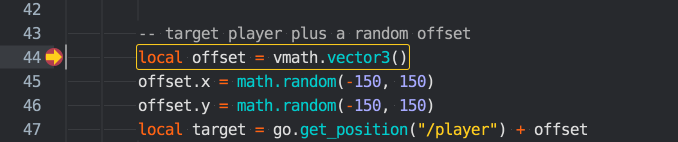
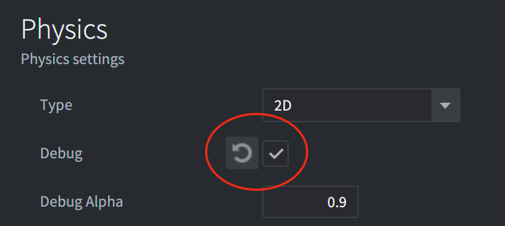

# Отладка игровой логики

Defold включает в себя встроенный отладчик Lua с возможностью инспекции. Вместе со встроенными [инструментами профилирования](/manuals/profiling) --- это мощный инструмент, который может помочь найти причину ошибок в логике игры или помочь проанализировать проблемы производительности.

## Вывод и визуальная отладка

Самый простой способ отладить игру в Defold заключается в использовании [print-отладки](http://en.wikipedia.org/wiki/Debugging#Techniques), или трассировки. Используйте операторы `print()` или [`pprint()`](/ref/builtins#pprint) для наблюдения за переменными или для индикации хода выполнения. Если игровой объект без скрипта ведет себя странно, можно просто прикрепить к нему скрипт с единственной целью отладки. Использование любой из функций печати приведет к выводу в *Console* в редакторе и в [лог](/manuals/debugging-game-and-system-logs).

Помимо печати, движок может рисовать на экране отладочный текст и прямые линии. Это делается путем отправки сообщений в сокет `@render`:

```lua
-- Нарисовать на экране значение "my_val" с отладочным текстом
msg.post("@render:", "draw_text", { text = "My value: " .. my_val, position = vmath.vector3(200, 200, 0) })

-- Нарисовать цветной текст на экране
local color_green = vmath.vector4(0, 1, 0, 1)
msg.post("@render:", "draw_debug_text", { text = "Custom color", position = vmath.vector3(200, 180, 0), color = color_green })

-- Нарисовать на экране отладочную линию между игроком и врагом
local start_p = go.get_position("player")
local end_p = go.get_position("enemy")
local color_red = vmath.vector4(1, 0, 0, 1)
msg.post("@render:", "draw_line", { start_point = start_p, end_point = end_p, color = color_red })
```

Сообщения визуальной отладки добавляют данные в пайплайн рендеринга и отрисовываются как часть обычного рендер пайплайна.

* `"draw_line"` добавляет данные, которые выводятся с помощью функции `render.draw_debug3d()` в рендер-скрипте.
* `"draw_text"` рендерится с помощью `/builtins/fonts/debug/always_on_top.font`, который использует материал `/builtins/fonts/debug/always_on_top_font.material`.
* `"draw_debug_text"` это то же самое, что и `"draw_text"`, но отображается в пользовательском цвете.

Следует отметить, что, вероятно, потребуется обновлять эти данные каждый кадр, поэтому размещение сообщений в функции `update()` является хорошей идеей.

## Запуск отладчика

Чтобы запустить отладчик, либо выберите <kbd>Debug ▸ Run with Debugger</kbd>, который запускает игру с подключенным отладчиком, либо <kbd>Debug ▸ Attach Debugger</kbd>, чтобы подключить отладчик к уже запущенной игре.


Как только отладчик подключен, можно контролировать выполнение игры через кнопки управления отладчиком в консоли или через меню <kbd>Debug</kbd>:

Break
: {width=60px .left}
  Немедленно прерывает выполнение игры. Игра прервется в текущей точке. После этого можно исследовать состояние игры, продвигать игру шаг за шагом или продолжить ее выполнение до следующей точки останова. Текущая точка выполнения отмечается в редакторе кода:

  

Continue
: {width=60px .left}
  Продолжает выполнение игры. Код игры будет выполняться до тех пор, пока не будет нажата пауза или пока выполнение не достигнет точки останова, которую вы установили. Если выполнение прерывается в установленной точке останова, точка выполнения отмечается в редакторе кода поверх маркера точки останова:

  

Stop
: {width=60px .left}
  Останавливает отладчик. Нажатие этой кнопки немедленно остановит отладчик, отсоединит его от игры и завершит запущенную игру..

Step Over
: {width=60px .left}
  Продвинуть выполнение программы на один шаг. Если выполнение включает в себя запуск другой Lua-функции, выполнение _не перейдет в функцию_, а продолжит выполнение и остановится на следующей строке ниже вызова функции. В данном примере, если пользователь нажмет "step over", отладчик выполнит код и остановится на операторе `end` ниже строки с вызовом функции `nextspawn()`:

  

::: sidenote
Строка Lua-кода не соответствует одному выражению. Шаг в отладчике перемещается вперед по одному выражению за раз, что означает, что в настоящее время для перехода к следующей строке может потребоваться нажать кнопку шага несколько раз.
:::

Step Into
: {width=60px .left}
  Продвигает выполнение программы на один шаг. Если выполнение включает в себя запуск другой Lua-функции, то выполнение _перейдет в эту функцию_. Вызов функции добавляет запись в стек вызовов. Можно кликнуть по каждой записи в списке стека вызовов, чтобы просмотреть точку входа и содержимое всех переменных в этом замыкании. Здесь пользователь перешел в функцию `nextspawn()`:

  

Step Out
: {width=60px .left}
  Продолжает выполнение до возврата из текущей функции. Если вы перешли к выполнению функции, нажатие кнопки "step out" продолжит выполнение до возвращения из функции.

Установка и очистка точек останова
: В Lua-коде можно установить произвольное количество точек останова. Когда игра запускается с подключенным отладчиком, она остановит выполнение в следующей точке останова и будет ждать дальнейших действий со стороны пользователя.

  

  Чтобы установить или убрать точку останова, кликните в колонке справа от номеров строк в редакторе кода. Также можно выбрать в меню <kbd>Edit ▸ Toggle Breakpoint</kbd>.

Условные точки останова
: Вы можете настроить точку останова с условием, которое должно быть истинным, чтобы точка сработала. Это условие может обращаться к локальным переменным, доступным на этой строке во время выполнения кода.

  

  Чтобы отредактировать условие точки останова, щёлкните правой кнопкой мыши в колонке справа от номеров строк в редакторе кода или выберите <kbd>Edit ▸ Edit Breakpoint</kbd> в меню.

Вычисление Lua-выражений
: При подключенном отладчике и остановленной на точке останова игре доступна среда выполнения Lua с текущим контекстом. Введите выражения Lua в нижней части консоли и нажмите <kbd>Enter</kbd> для их вычисления:

  

  В настоящее время нет возможности изменять переменные через функцию вычисления.

Отсоединение отладчика
: Выберите <kbd>Debug ▸ Detach Debugger</kbd>, чтобы отсоединить отладчик от игры. Она немедленно продолжит работу.

## Отладочная Lua-библиотека

Lua поставляется с библиотекой отладки, которая полезна в некоторых ситуациях, особенно если необходимо исследовать внутренности окружения Lua. За подробностями обращайтесь к веб-странице http://www.lua.org/pil/contents.html#23.

## Чеклист для отладки

Если вы столкнулись с ошибкой или если ваша игра ведет себя не так, как ожидалось, вот контрольный список для отладки:

1. Проверьте вывод консоли и убедитесь в отсутствии ошибок времени выполнения.

2. Добавьте операторы `print` в код, чтобы убедиться, что код действительно выполняется.

3. Если он не запускается, проверьте, правильно ли вы выполнили настройки в редакторе, необходимые для запуска кода. Добавлен ли скрипт к нужному игровому объекту? Приобрел ли скрипт фокус ввода? Правильны ли триггеры ввода? Добавлен ли код шейдера к материалу? И т.д.

4. Если код зависит от значений переменных (например, в выражении if), либо примените `print` к этим значениям там, где они используются или проверяются, либо проверьте их с помощью отладчика.

Иногда поиск ошибки может быть сложным и трудоемким процессом, требующим от вас пройтись по коду бит за битом, проверяя все, сужая круг неисправного кода и устраняя источники ошибок. Лучше всего для этого подходит метод под названием "разделяй и властвуй":

1. Определите, какая половина (или меньше) кода должна содержать ошибку.
2. Снова выясните, какая половина из этой половины должна содержать баг.
3. Продолжайте сужать круг кода, который должен вызывать ошибку, пока не найдете ее.

Удачной охоты!

## Отладка проблем с физикой

Если возникли проблемы с физикой и столкновения работают не так, как ожидалось, рекомендуется включить отладку физики. Отметьте опцию *Debug* в секции *Physics* файла *game.project*:



Когда эта опция включена, Defold отрисовывает все формы и контактные точки столкновений:


