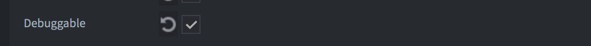
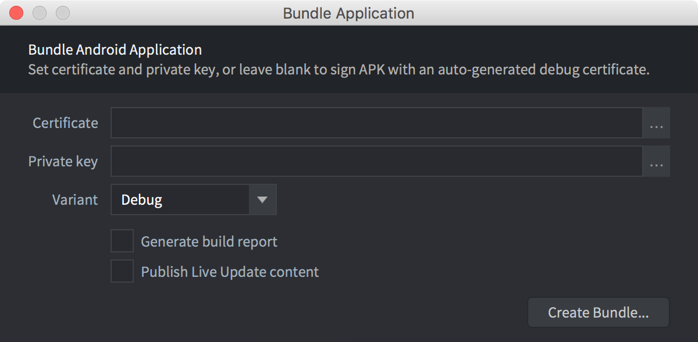
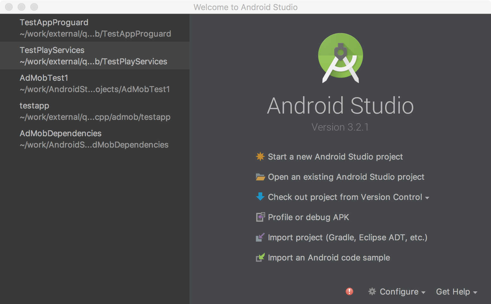
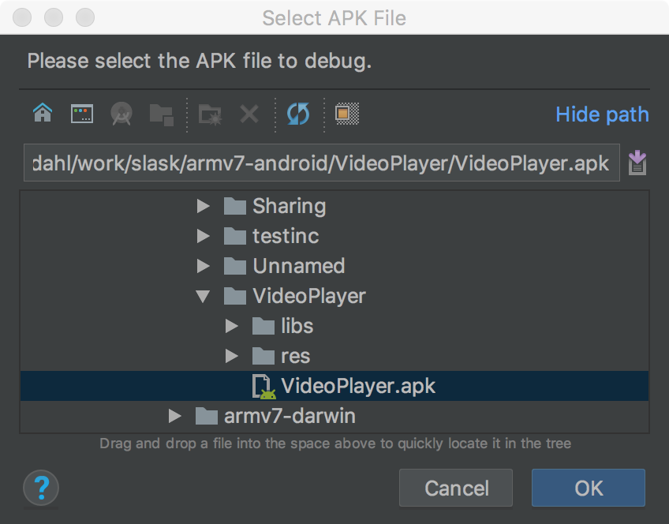
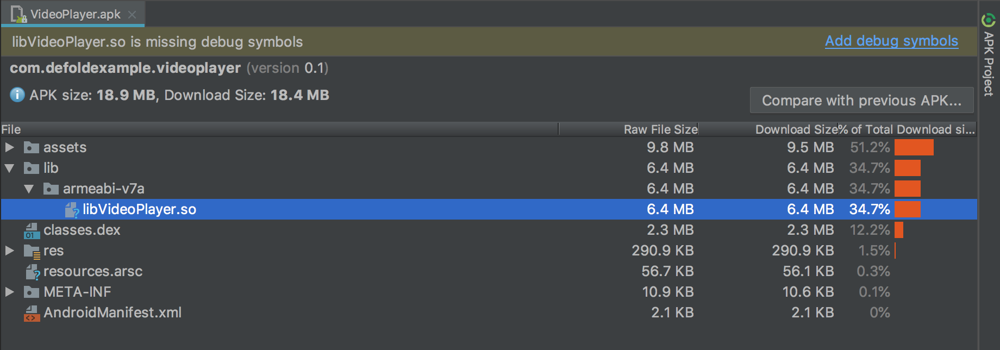
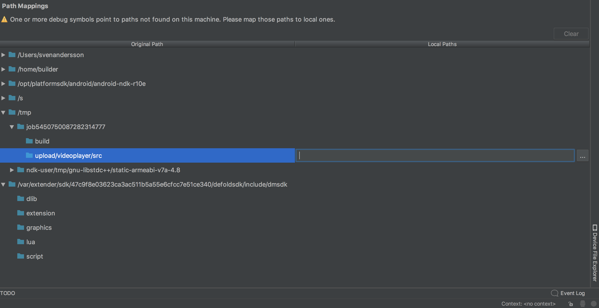
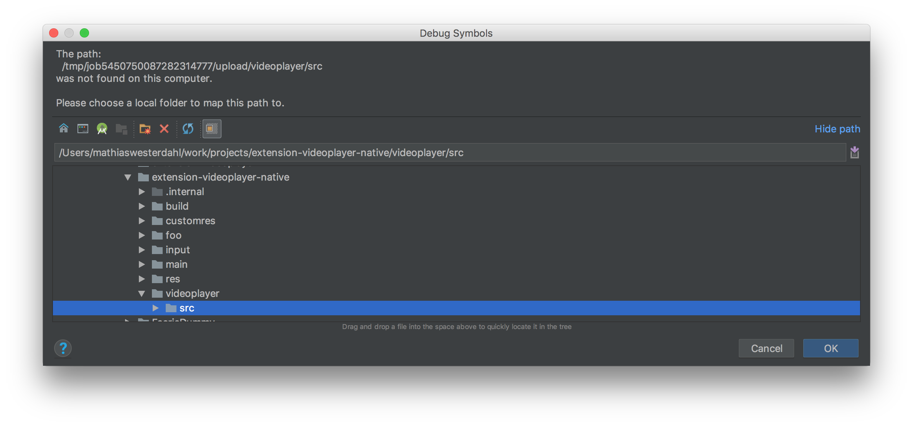
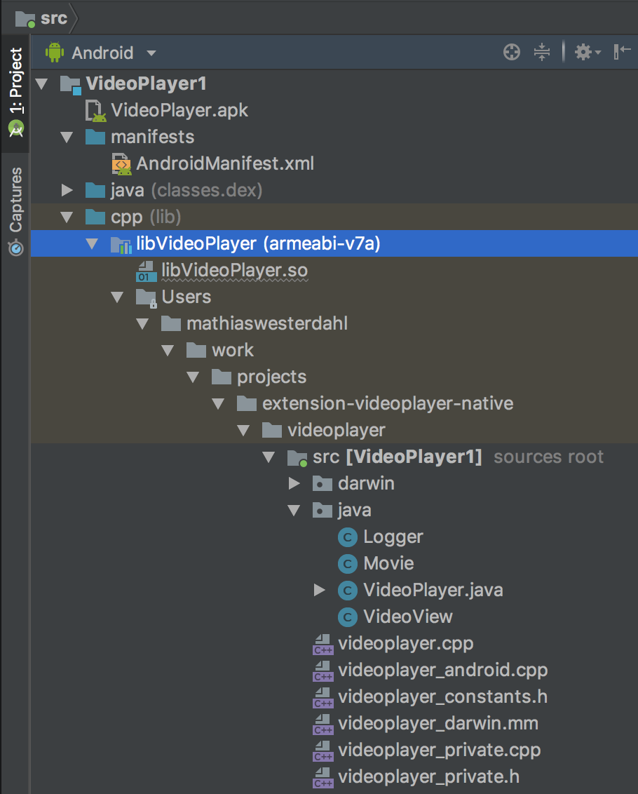
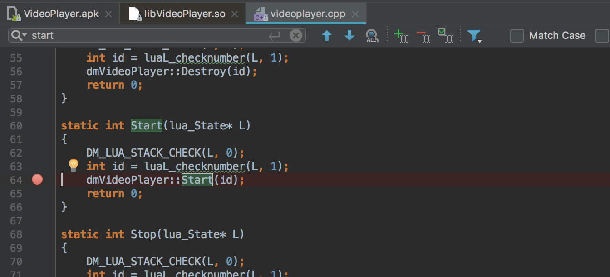
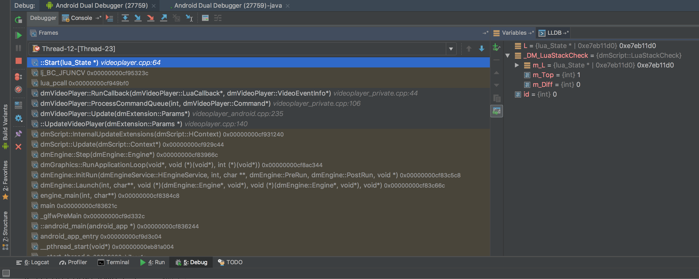

# Отладка на Android

Здесь мы перечислим ряд способов отладки вашего исполняемого файла, работающего на устройстве Android


## Android Studio

* Подготовьте бандл, установив параметр `android.debuggable` в *game.project*

	

* Поместите бандл приложения в режиме отладки в папку по выбору.

	

* Запустите [Android Studio](https://developer.android.com/studio/)

* Выберите `Profile or debug APK`

	

* Выберите только что созданный apk бандл

	

* Выберите основной файл `.so` и убедитесь, что в нем есть отладочные символы 

	

* Если их нет в файле, загрузите не урезанный файл с отладочными символами с расширением `.so`. (размер около 20 МБ)

* Сопоставления путей помогают переназначить отдельные пути, из которых был создан исполняемый файл (в облаке), в реальную папку на вашем локальном диске.

* Выберите .so файл, затем добавьте сопоставление на вашем локальном диске

	

	

* Если у вас есть доступ к исходным кодам движка, добавьте сопоставление пути и для него

		* Убедитесь, что вы используете ту же версию исходного кода, которую собираетесь отлаживать

			defold $ git checkout 1.2.148 

* Нажмите `Apply changes`

* Теперь вы должны увидеть исходный код, имеющий привязки в вашем пректе. 

	

* Добавить точку останова 

	

* Нажмите `Run` -> `Debug "Appname"` и затем вызовите код, в который вы хотели бы вклиниться

	

* Теперь вы можете пошагово войти в стек вызовов, а также отслеживать переменные 


## Примечания

### Директория задач нативного расширения 

В настоящее время рабочий процесс немного сложен для разработки. Это потому, что имя директории с задачами
является случайным для каждой сборки, что делает сопоставление пути недействительным для каждой новой сборки.

Однако он отлично работает для единичного сеанса отладки.

Сопоставления путей хранятся в файле <project>.iml в проекте Android Studio.

Можно получить директорию с задачами из исполняемого файла

```sh
$ arm-linux-androideabi-readelf --string-dump=.debug_str build/armv7-android/libdmengine.so | grep /job
```

Папка задачи называется так `job1298751322870374150`, каждый раз это название с уникальным случайным номером. 

