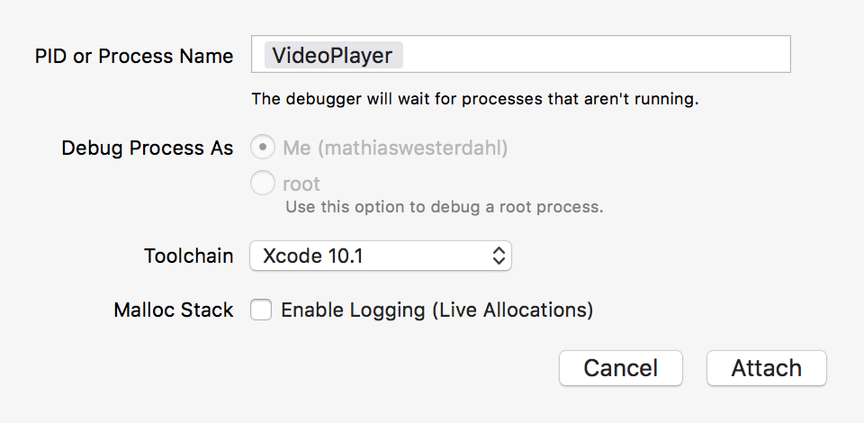

#  Отладка на iOS/macOS 

Здесь мы описываем, как отлаживать сборку с помощью [Xcode](https://developer.apple.com/xcode/), предпочитаемой компанией Apple IDE для разработки под macOS и iOS.

## Xcode

* Соберите бандл приложения с помощью утилиты bob с ключом `--with-symbols` 

```sh
$ cd myproject
$ wget http://d.defold.com/archive/<sha1>/bob/bob.jar
$ java -jar bob.jar --platform armv7-darwin build --with-symbols --variant debug --archive bundle -bo build/ios -mp <app>.mobileprovision --identity "iPhone Developer: Your Name (ID)"
```

* Установите приложение с помощью `Xcode`,` iTunes` или [ios-deploy](https://github.com/ios-control/ios-deploy) 

```sh
$ ios-deploy -b <AppName>.ipa
```

* Получите папку `.dSYM` (т.е. отладочные символы) 

	* Если приложение не использует нативные расширения, вы можете скачать файл `.dSYM` с сайта [d.defold.com](http://d.defold.com) 

	* Если вы используете нативные расширения, то папка `.dSYM` генерируется при сборке с помощью утилиты [bob.jar](https://www.defold.com/manuals/bob/). Требуется только сборка (без архивации и бандлинга): 

```sh
$ cd myproject
$ unzip .internal/cache/arm64-ios/build.zip
$ mv dmengine.dSYM <AppName>.dSYM
$ mv <AppName>.dSYM/Contents/Resources/DWARF/dmengine <AppName>.dSYM/Contents/Resources/DWARF/<AppName>
```

### Создание проекта

Для правильной отладки нам нужен проект и сопоставленный исходный код.
Мы не используем этот проект для сборки, а только для отладки.

* Создайте новый проект Xcode, выберите шаблон `Game` 

	

* Выберите имя (например, `debug`) и настройки по умолчанию

* Выберите папку для сохранения в неё проекта

* Добавьте свой код в приложение

	

* Убедитесь, что флажок «Copy items if needed» снят.

	

* Таков конечный результат

	


* Отключите шаг `Build`

	

	

* Установите версию `Deployment target`, чтобы она была больше, чем версия вашего iOS устройства.

	

* Выберите целевое устройство

	


### Запуск отладчика

У вас есть несколько вариантов отладки приложения

1. Либо выберите `Debug` -> `Attach to process...` и выберите оттуда приложение.

2. Либо выберите `Attach to process by PID or Process name`.

	

3. Запустите приложение на устройстве

4. В `Edit Scheme` добавьте папку <AppName>.app в качестве исполняемого файла 

### Отладочные символы

**Чтобы использовать lldb, выполнение должно быть приостановлено**

* Добавьте путь `.dSYM` к lldb

```
(lldb) add-dsym <PathTo.dSYM>
```

	

* Убедитесь, что `lldb` успешно прочитал символы

```
(lldb) image list <AppName>
```

### Сопоставления путей

* Добавьте исходный код движка (подправьте путь по своему усмотрению) 

```
(lldb) settings set target.source-map /Users/builder/ci/builds/engine-ios-64-master/build /Users/mathiaswesterdahl/work/defold
(lldb) settings append target.source-map /private/var/folders/m5/bcw7ykhd6vq9lwjzq1mkp8j00000gn/T/job4836347589046353012/upload/videoplayer/src /Users/mathiaswesterdahl/work/projects/extension-videoplayer-native/videoplayer/src
```

* Возможно получить папку с задачами из исполняемого файла.
	Папка задачи называется `job1298751322870374150`, каждый раз это имя со случайным номером. 
```sh
$ dsymutil -dump-debug-map <executable> 2>&1 >/dev/null | grep /job

```

* Проверьте сопоставления исходников

```
(lldb) settings show target.source-map
```

Вы можете проверить, из какого исходного файла происходит отладочный символ, используя команду

```
(lldb) image lookup -va <SymbolName>
```

### Точки останова

* Откройте файл в project view и установите точку останова 

	

## Примечания

### Проверка UUID бинарного файла

Чтобы отладчик пустил папку `.dSYM`, UUID должен совпадать с UUID отлаживаемого исполняемого файла. Вы можете проверить UUID так:

```sh
$ dwarfdump -u <PathToBinary>
```
