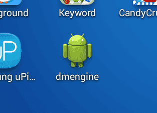

# Приложение для мобильной разработки

Приложение для разработки позволяет загружать в него контент через Wi-Fi. Это значительно сократит время итерации, поскольку вам не нужно делать бандл и устанавливать его каждый раз, когда вы хотите протестировать свои изменения. Вы устанавливаете приложение для разработки на свое устройство(а), запускаете приложение, а затем выбираете устройство в качестве цели сборки в редакторе. 

## Установка приложения для разработки

Любое приложение, собранное в режиме отладки, сможет действовать как приложение для разработки. На Android доступна автономная версия движка Defold, а на iOS вам необходимо вручную собрать бандл и подписать его, используя свой собственный идентификатор подписи и provisioning профиль. 

### Установка на iOS 

Любое iOS приложение, бандл которого был собран как отладочный вариант, сможет действовать как приложение для разработки. Рекомендуется сделать бандл отладочного варианта приложения, над которым вы сейчас работаете. Это гарантирует, что приложение для разработки имеет правильные настройки проекта и использует те же [нативные расширения](/manuals/extensions/). Следуйте [инструкциям в руководстве по iOS](/manuals/ios/#creating-an-ios-application-bundle), чтобы собрать бандл для iOS. Обязательно выберите вариант Debug!

### Установка на Android

Такая же рекомендация делать бандл отладочной версии, что и для iOS, работает и для Android. В дополнение к этой опции существует также автономная версия движка Defold, доступная в виде готового файла *.apk*, который вы можете установить на устройство и использовать для итеративной разработки по беспроводной сети. 
::: important
Автономная версия будет работать только для проектов без каких-либо [нативных расширений](/manuals/extensions/). Если ваш проект содержит native extension-ы, вы должны собрать бандл отладочного варианта вашего проекта, чтобы убедиться, что приложение для разработки содержит все native extension-ы, которые вы собираетесь использовать. 
:::
* Посетите http://d.defold.com, где можно найти скачать Defold. 
* Щелкните версию, которую хотите загрузить, чтобы развернуть список доступных сборок движка.
* Выберите *engine/armv7-android/dmengine.apk* для сборки с включенной отладкой для платформы Android (Armv7).


Скачайте файл, затем введите следующую команду `adb` из папки содержащей *.apk*: 

```sh
$ adb install dmengine.apk
4445 KB/s (8706017 bytes in 1.912s)
    pkg: /data/local/tmp/dmengine.apk
Success
```

Приложение для разработки "dmengine" теперь доступно на устройстве.



## Запуск вашей игры

Чтобы запустить игру на вашем устройстве, приложение для разработки и редактор должны иметь возможность подключаться через одну и ту же сеть Wi-Fi или через USB (см. ниже). 

1. Убедитесь, что редактор запущен.
2. Запустите приложение для разработки на устройстве.
3. Выберите свое устройство в редакторе в разделе <kbd>Project ▸ Targets</kbd>.
4. Выберите <kbd>Project ▸ Build</kbd>, чтобы запустить игру. Для запуска игры может потребоваться некоторое время, поскольку игровой контент передается на устройство по сети.
5. Пока игра запущена, вы по-прежнему можете использовать [горячую перезагрузку](/manuals/hot-reload/).


### Подключение к устройству iOS через USB в Windows

При подключении через USB в Windows к приложению для разработки, работающему на устройстве iOS, сначала необходимо [установить iTunes](https://www.apple.com/lae/itunes/download/). После установки iTunes вам также необходимо [включить персональную точку доступа](https://support.apple.com/en-us/HT204023) на вашем устройстве iOS в меню «Настройки». Если вы видите предупреждение, которое спрашивает «Доверять этому компьютеру?», тапните Доверять. Теперь устройство должно отображаться в разделе <kbd>Project ▸ Targets</kbd>, когда приложение для разработки запущено. 

### Подключение к устройству iOS через USB в Linux

В Linux вам необходимо включить Personal Hotspot на вашем устройстве в меню настроек при подключении через USB. Если вы видите предупреждение, которое спрашивает «Доверять этому компьютеру?», тапните Доверять. Теперь устройство должно отображаться в разделе <kbd>Project ▸ Targets</kbd>, когда приложение для разработки запущено. 

### Подключение к устройству iOS через USB в macOS

В более новых версиях iOS устройство автоматически откроет новый интерфейс Ethernet между устройством и компьютером при подключении через USB в macOS. Устройство должно отображаться в разделе <kbd>Project ▸ Targets</kbd>, когда приложение для разработки запущено.

В более старых версиях iOS вам необходимо включить Personal Hotspot на вашем устройстве в меню «Настройки» при подключении через USB в macOS. Если вы видите предупреждение, которое спрашивает «Доверять этому компьютеру?», тапните Доверять. Теперь устройство должно отображаться в разделе <kbd>Project ▸ Targets</kbd>, когда приложение для разработки запущено. 

### Подключение к устройству Android через USB в macOS

В macOS можно подключиться через USB к работающему приложению для разработки на устройстве Android, когда устройство находится в режиме USB-модема. В macOS необходимо установить сторонний драйвер, например [HoRNDIS](https://joshuawise.com/horndis#available_versions). Когда HoRNDIS установлен, вам также необходимо разрешить его запуск в настройках Security & Privacy. После включения USB-модема устройство будет отображаться в разделе <kbd>Project ▸ Targets</kbd> при запуске приложения для разработки. 

### Подключение к устройству Android через USB в Windows или Linux

В Windows и Linux можно подключиться через USB к работающему приложению для разработки на устройстве Android, когда устройство находится в режиме USB-модема. После включения USB-модема устройство будет отображаться в разделе <kbd>Project ▸ Targets</kbd> при запуске приложения для разработки. 

## Поиск и устранение проблем

Невозможно скачать приложение
: Убедитесь, что UDID вашего устройства включен в mobile provisioning, который использовался для подписи приложения. 

Ваше устройство не отображается в меню "Targets".
: Убедитесь, что ваше устройство подключено к той же сети Wi-Fi, что и ваш компьютер. 

Игра не запускается с сообщением о несовпадении версий
: Это происходит, когда вы обновили редактор до последней версии. Вам необходимо собрать и установить новую версию приложения.
