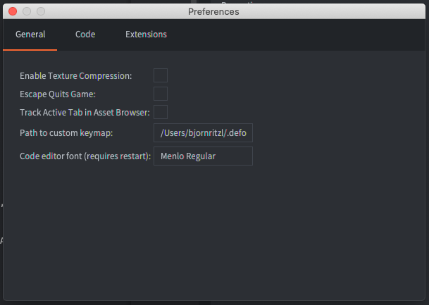
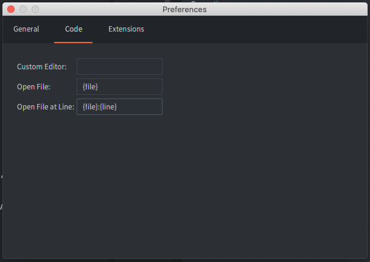
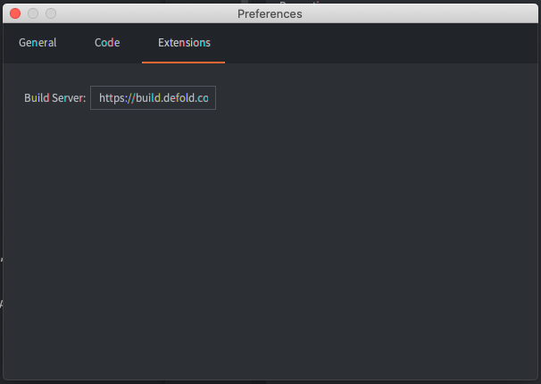

# Настройки редактора

Вы можете изменить настройки редактора из окна Preferences. Окно настроек открывается в <kbd>File -> Preferences</kbd>.

## Общие сведения



Load External Changes on App Focus
: Включает сканирование на внешние изменения при получении фокуса редактором.

Open Bundle Target Folder
: Автоматически открывает папку с итоговым бандлом после завершения процесса упаковки.

Включить Сжатие Текстур
: Включает [сжатие текстур](/manuals/texture-profiles) для всех сборок, сделанных в редакторе.

Escape Quits Game
: Завершите запущенную сборку вашей игры с помощью кнопки <kbd>Esc</kbd>.

Track Active Tab in Asset Browser
: Файл, редактированный на выбранной вкладке в панели *Editor*, будет выбран в браузере ассетов (также известном как панель *Asset*).

Lint Code on Build
: Включает [проверку кода (линтинг)](/manuals/writing-code/#linting-configuration) при сборке проекта. Эта опция включена по умолчанию, но её можно отключить, если линтинг в больших проектах занимает слишком много времени.

Engine Arguments
: Аргументы, которые будут переданы исполняемому файлу dmengine при сборке и запуске проекта из редактора.
Используйте один аргумент на строку. Например:
```
--config=bootstrap.main_collection=/my dir/1.collectionc
--verbose
--graphics-adapter=vulkan
```


## Програмный код



Custom Editor
: Полный путь к внешнему редактору. На macOS это должен быть путь к исполняемому файлу внутри .app (например: `/Applications/Atom.app/Contents/MacOS/Atom`).

Open File
: Шаблон, используемый пользовательским редактором для указания файла, который нужно открыть. Шаблон `{file}` будет заменен именем файла, который нужно открыть.

Open File at Line
: Шаблон, используемый пользовательским редактором для указания того, какой файл открыть и на какой номер строки. Шаблон `{file}` будет заменен именем открываемого файла, а `{line}` - номером строки.

Code editor font
: Имя установленного в системе шрифта, для использования в редакторе програмного кода.

Zoom on Scroll
: Изменять размер шрифта при прокрутке в редакторе кода, удерживая клавишу Cmd/Ctrl.


### Открытие скриптов в Visual Studio Code


Чтобы открыть скриптовые файлы из редактора Defold напрямую в Visual Studio Code, необходимо задать следующие параметры, указав путь к исполняемому файлу:

- macOS: `/Applications/Visual Studio Code.app/Contents/MacOS/Electron`
- Linux: `/usr/bin/code`
- Windows: `C:\Program Files\Microsoft VS Code\Code.exe`

Укажите следующие параметры для открытия конкретных файлов и строк:

- Open File: `. {file}`
- Open File at Line: `. -g {file}:{line}`

Символ `.` здесь необходим для открытия всей рабочей области, а не отдельного файла.


## Расширения



Build Server
: URL-адрес сервера сборки, используемый при сборке проекта, содержащего [собственные расширения](/manuals/extensions). Можно добавить имя пользователя и токена к URL для аутентифицированного доступа к серверу сборки. Используйте следующую нотацию для указания имени пользователя и токена: `username:token@build.defold.com`. Аутентифицированный доступ требуется для сборок Nintendo Switch и при запуске собственного экземпляра сервера сборки с включенной аутентификацией. [Оратитесь к документации по серверу сборки](https://github.com/defold/extender/blob/dev/README_SECURITY.md) для получения дополнительной информации).

Build Server Username
: имя пользователя для аутентификации.

Build Server Password
: пароль для аутентификации. Будет сохранён в зашифрованном виде в файле настроек.

Build Server Headers
: дополнительные заголовки, передаваемые серверу сборки при создании собственных расширений. Это важно при использовании сервиса CloudFlare или аналогичных с extender.

## Инструменты


Путь к ADB
: Путь к инструменту командной строки [ADB](https://developer.android.com/tools/adb), установленному в системе. Если ADB уже установлен в типичном месте, редактор Defold использует его автоматически. Укажите путь вручную, если ADB установлен в нестандартном месте.

Путь к ios-deploy
: Путь к инструменту командной строки [ios-deploy](https://github.com/ios-control/ios-deploy), установленному в системе (только для macOS). Аналогично ADB, редактор использует его для установки и запуска iOS-приложений на подключённом iPhone. Укажите путь вручную, если ios-deploy установлен нестандартно.

## Сочетания клавиш


Вы можете настроить сочетания клавиш редактора: добавить пользовательские или удалить встроенные. Используйте контекстное меню на отдельных командах в таблице сочетаний или дважды кликните / нажмите <kbd>Enter</kbd>, чтобы открыть всплывающее окно изменения сочетания.

Некоторые сочетания могут иметь предупреждения: они отображаются оранжевым цветом. Наведите курсор на сочетание, чтобы увидеть предупреждение. Типичные случаи:
- вводимые сочетания: выбранное сочетание вводимо в текстовых полях. Убедитесь, что команда отключена в контексте редактирования текста.
- конфликты: одно сочетание назначено разным командам. Убедитесь, что одновременно активна только одна команда, иначе редактор выполнит одну из них непредсказуемо.
