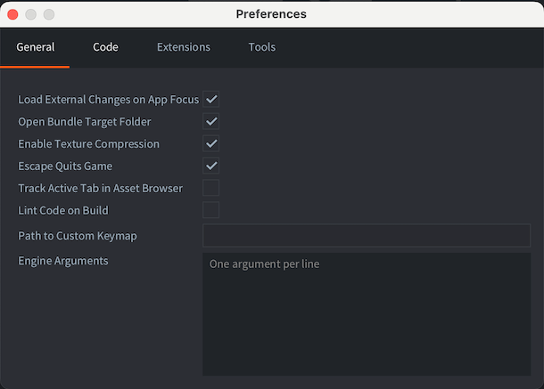
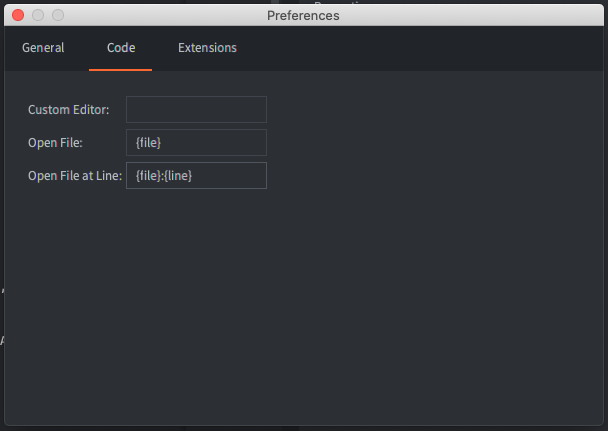
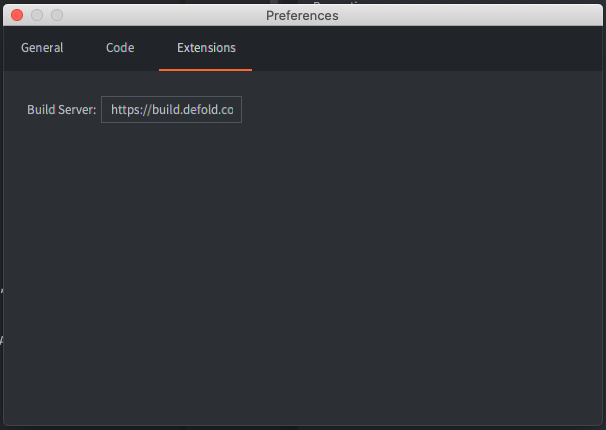

# Настройки редактора

Вы можете изменить настройки редактора из окна Preferences. Окно настроек открывается в <kbd>File -> Preferences</kbd>.

## Общие сведения



Load External Changes on App Focus
: Включает сканирование на внешние изменения при получении фокуса редактором.

Open Bundle Target Folder
: Автоматически открывает папку с итоговым бандлом после завершения процесса упаковки.

Включить Сжатие Текстур
: Включает [сжатие текстур](/manuals/texture-profiles) для всех сборок, сделанных в редакторе.

Escape Quits Game
: Завершите запущенную сборку вашей игры с помощью кнопки <kbd>Esc</kbd>.

Track Active Tab in Asset Browser
: Файл, редактированный на выбранной вкладке в панели *Editor*, будет выбран в браузере ассетов (также известном как панель *Asset*).

Lint Code on Build
: Включает [проверку кода (линтинг)](/manuals/writing-code/#linting-configuration) при сборке проекта. Эта опция включена по умолчанию, но её можно отключить, если линтинг в больших проектах занимает слишком много времени.

Engine Arguments
: Аргументы, которые будут переданы исполняемому файлу dmengine при сборке и запуске проекта из редактора.
Используйте один аргумент на строку. Например:
```
--config=bootstrap.main_collection=/my dir/1.collectionc
--verbose
--graphics-adapter=vulkan
```


## Програмный код {#code}



Custom Editor
: Полный путь к внешнему редактору. На macOS это должен быть путь к исполняемому файлу внутри .app (например: `/Applications/Atom.app/Contents/MacOS/Atom`).

Open File
: Шаблон, используемый пользовательским редактором для указания файла, который нужно открыть. Шаблон `{file}` будет заменен именем файла, который нужно открыть.

Open File at Line
: Шаблон, используемый пользовательским редактором для указания того, какой файл открыть и на какой номер строки. Шаблон `{file}` будет заменен именем открываемого файла, а `{line}` - номером строки.

Code editor font
: Имя установленного в системе шрифта, для использования в редакторе програмного кода.

Zoom on Scroll
: Изменять размер шрифта при прокрутке в редакторе кода, удерживая клавишу Cmd/Ctrl.


### Открытие скриптов в Visual Studio Code


Чтобы открыть скриптовые файлы из редактора Defold напрямую в Visual Studio Code, необходимо задать следующие параметры, указав путь к исполняемому файлу:

- macOS: `/Applications/Visual Studio Code.app/Contents/MacOS/Electron`
- Linux: `/usr/bin/code`
- Windows: `C:\Program Files\Microsoft VS Code\Code.exe`

Укажите следующие параметры для открытия конкретных файлов и строк:

- Open File: `. {file}`
- Open File at Line: `. -g {file}:{line}`

Символ `.` здесь необходим для открытия всей рабочей области, а не отдельного файла.


## Расширения {#extensions}



Build Server
: URL-адрес сервера сборки, используемый при сборке проекта, содержащего [собственные расширения](/manuals/extensions). Можно добавить имя пользователя и токен к URL для аутентифицированного доступа к серверу сборки. Используйте следующую нотацию для указания имени пользователя и токена: `username:token@build.defold.com`. Аутентифицированный доступ требуется для сборок Nintendo Switch и при запуске собственного экземпляра сервера сборки с включенной аутентификацией ([обратитесь к документации по серверу сборки](https://github.com/defold/extender/blob/dev/README_SECURITY.md) для получения дополнительной информации). Имя пользователя и пароль также можно задать через системные переменные окружения `DM_EXTENDER_USERNAME` и `DM_EXTENDER_PASSWORD`.

Build Server Username
: имя пользователя для аутентификации.

Build Server Password
: пароль для аутентификации. Будет сохранён в зашифрованном виде в файле настроек.

Build Server Headers
: дополнительные заголовки, передаваемые серверу сборки при создании собственных расширений. Это важно при использовании сервиса CloudFlare или аналогичных с extender.

## Инструменты {#tools}


Путь к ADB
: Путь к инструменту командной строки [ADB](https://developer.android.com/tools/adb), установленному в системе. Если ADB уже установлен в типичном месте, редактор Defold использует его автоматически. Укажите путь вручную, если ADB установлен в нестандартном месте.

Путь к ios-deploy
: Путь к инструменту командной строки [ios-deploy](https://github.com/ios-control/ios-deploy), установленному в системе (только для macOS). Аналогично ADB, редактор использует его для установки и запуска iOS-приложений на подключённом iPhone. Укажите путь вручную, если ios-deploy установлен нестандартно.

## Сочетания клавиш


Вы можете настроить сочетания клавиш и элементы управления мышью в редакторе на вкладке Keymap. Чтобы изменить команду, дважды кликните по ней, нажмите <kbd>Enter</kbd> или <kbd>Space</kbd>, либо используйте контекстное меню строки.

Сочетания клавиш отображаются как комбинации клавиш в колонке *Shortcuts*. Элементы управления мышью отображаются в том же списке с меткой:

- <kbd>MB</kbd> означает привязку кнопки мыши, которая может сочетаться с <kbd>Shift</kbd>, <kbd>Ctrl</kbd>/<kbd>Control</kbd> или <kbd>Alt</kbd>.
- <kbd>MM</kbd> означает клавишу-модификатор, используемую действием мыши.

Некоторые элементы управления мышью повторно используют привязки стандартной камеры Scene 2D Camera, поэтому строка может показывать привязку еще до того, как вы настроите ее самостоятельно. Обычно такие привязки отображаются более темным цветом. Если вы зададите для этой строки пользовательскую привязку, Defold будет использовать ее вместо стандартной. Используйте *Reset to Defaults*, чтобы удалить ваше изменение и вернуться к встроенному или унаследованному поведению.

Предупреждения отображаются оранжевым цветом. Наведите курсор на предупреждение, чтобы увидеть подробности. Обычно предупреждения означают:
- сочетание клавиш может вводить текст и мешать работе с текстовыми полями.
- такое же сочетание клавиш или привязка мыши уже используется другой командой.
