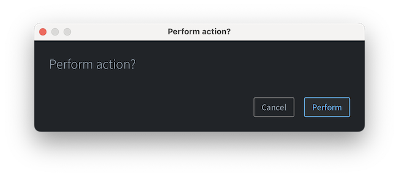
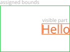
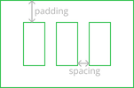
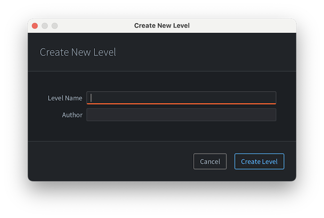
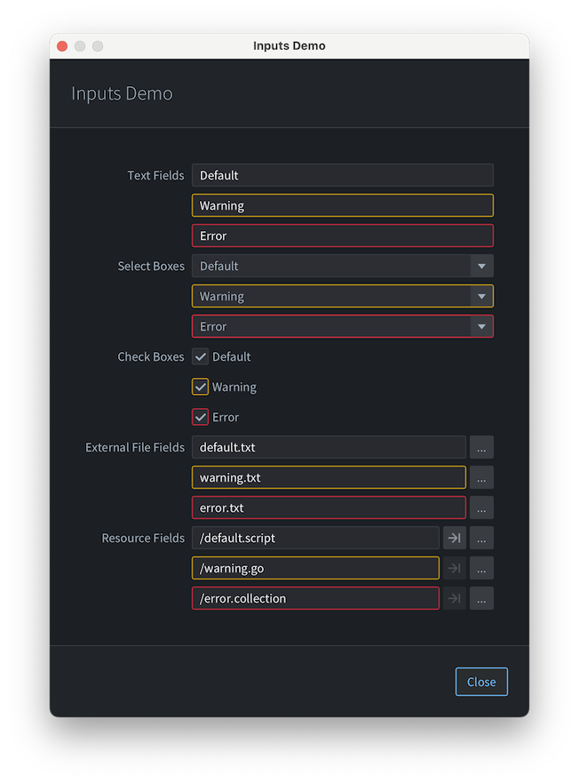
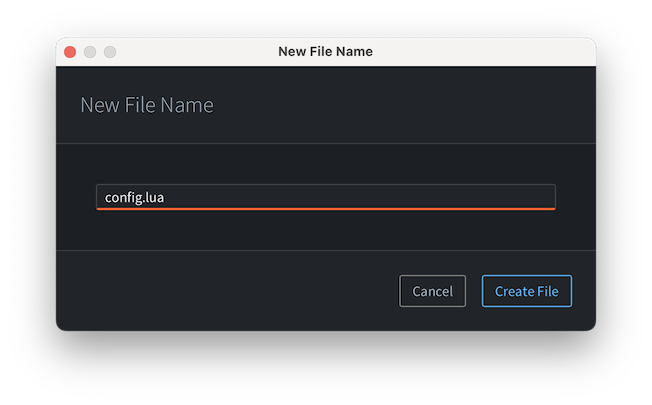

# Скрипты редактора и UI

В этом руководстве объясняется, как создавать интерактивные элементы UI в редакторе с помощью скриптов редактора на Lua. Чтобы начать работу со скриптами редактора, см. [руководство по скриптам редактора](/manuals/editor-scripts). Полный справочник по API редактора находится [здесь](/ref/stable/editor-lua/). На данный момент можно создавать только интерактивные диалоги, но в будущем мы хотим расширить поддержку UI-скриптинга и на остальные части редактора.

## Hello world

Вся функциональность, связанная с UI, находится в модуле `editor.ui`. Ниже приведен самый простой пример скрипта редактора с пользовательским UI, с которого можно начать:
```lua
local M = {}

function M.get_commands()
    return {
        {
            label = "Do with confirmation",
            locations = {"View"},
            run = function()
                local result = editor.ui.show_dialog(editor.ui.dialog({
                    title = "Perform action?",
                    buttons = {
                        editor.ui.dialog_button({
                            text = "Cancel",
                            cancel = true,
                            result = false
                        }),
                        editor.ui.dialog_button({
                            text = "Perform",
                            default = true,
                            result = true
                        })
                    }
                }))
                print('Perform action:', result)
            end
        }
    }
end

return M

```

Этот фрагмент кода определяет команду **View → Do with confirmation**. Когда вы ее выполните, появится следующий диалог:



Наконец, после нажатия <kbd>Enter</kbd> (или клика по кнопке `Perform`) в консоли редактора появится следующая строка:
```
Perform action:	true
```

## Базовые понятия

### Компоненты

Редактор предоставляет различные UI-**компоненты**, которые можно комбинировать для создания нужного интерфейса. По соглашению все компоненты настраиваются с помощью одной таблицы, называемой **props**. Сами компоненты не являются таблицами, а представляют собой **неизменяемые userdata**, которые редактор использует для создания UI.

### Props

**Props** — это таблицы, которые определяют входные данные компонентов. Props следует считать неизменяемыми: изменение таблицы props на месте не приведет к повторному рендерингу компонента, а вот передача другой таблицы приведет. UI обновляется, когда экземпляр компонента получает таблицу props, которая не является поверхностно равной предыдущей.

### Выравнивание

Когда компоненту назначаются границы в UI, он занимает все доступное пространство, но это не означает, что видимая часть компонента будет растягиваться. Вместо этого видимая часть занимает столько места, сколько ей нужно, а затем выравнивается внутри назначенных границ. Поэтому большинство встроенных компонентов определяют prop `alignment`.

Например, рассмотрим этот компонент label:
```lua
editor.ui.label({
    text = "Hello",
    alignment = editor.ui.ALIGNMENT.RIGHT
})
```
Видимая часть — это текст `Hello`, и он выровнен внутри назначенных границ компонента:



## Встроенные компоненты

Редактор определяет различные встроенные компоненты, которые можно использовать совместно для построения UI. Компоненты можно условно разделить на 3 категории: компоновка, отображение данных и ввод.

### Компоненты компоновки

Компоненты компоновки используются для размещения других компонентов рядом друг с другом. Основные компоненты компоновки — это **`horizontal`**, **`vertical`** и **`grid`**. Эти компоненты также определяют props вроде **padding** и **spacing**, где padding — это пустое пространство от края назначенных границ до содержимого, а spacing — пустое пространство между дочерними элементами:



Редактор определяет константы padding и spacing `small`, `medium` и `large`. Если говорить о spacing, `small` предназначен для расстояний между разными подэлементами одного UI-элемента, `medium` — между отдельными UI-элементами, а `large` — между группами элементов. Значение spacing по умолчанию — `medium`. Padding со значением `large` означает отступы от краев окна до содержимого, `medium` — отступы от краев значимого UI-элемента, а `small` — отступы от краев небольших UI-элементов вроде контекстных меню и тултипов (пока не реализовано).

Контейнер **`horizontal`** размещает своих дочерних элементов горизонтально друг за другом, всегда растягивая высоту каждого дочернего элемента на все доступное пространство. По умолчанию ширина каждого дочернего элемента сохраняется минимальной, но можно заставить его занять как можно больше места, установив для дочернего элемента prop `grow` в `true`.

Контейнер **`vertical`** аналогичен horizontal, но с поменянными осями.

Наконец, **`grid`** — это контейнерный компонент, который размещает дочерние элементы в двумерной сетке, как таблицу. Настройка `grow` в grid применяется к строкам или столбцам, поэтому она задается не на дочернем элементе, а в таблице конфигурации столбца. Кроме того, дочерние элементы в grid можно настроить так, чтобы они занимали несколько строк или столбцов, с помощью props `row_span` и `column_span`. Grid удобны для создания форм с несколькими полями ввода:
```lua
editor.ui.grid({
    padding = editor.ui.PADDING.LARGE, -- add padding around dialog edges
    columns = {{}, {grow = true}}, -- make 2nd column grow
    children = {
        {
            editor.ui.label({ 
                text = "Level Name",
                alignment = editor.ui.ALIGNMENT.RIGHT
            }),
            editor.ui.string_field({})
        },
        {
            editor.ui.label({ 
                text = "Author",
                alignment = editor.ui.ALIGNMENT.RIGHT
            }),
            editor.ui.string_field({})
        }
    }
})
```
Код выше создаст следующий диалог с формой:



### Компоненты отображения данных

Редактор определяет 4 компонента отображения данных:
- **`label`** — текстовая метка, предназначенная для использования вместе с полями ввода формы.
- **`icon`** — иконка; в данный момент ее можно использовать только для отображения небольшого набора предопределенных иконок, но в будущем мы хотим добавить больше иконок.
- **`heading`** — текстовый элемент, предназначенный для отображения строки заголовка, например в форме или диалоге. Перечисление `editor.ui.HEADING_STYLE` определяет различные стили заголовков, включая заголовки HTML `H1`-`H6`, а также специфичные для редактора `DIALOG` и `FORM`.
- **`paragraph`** — текстовый элемент, предназначенный для отображения абзаца текста. Его основное отличие от `label` в том, что paragraph поддерживает перенос слов: если назначенные границы слишком малы по горизонтали, текст переносится и, возможно, сокращается с помощью `"..."`, если все равно не помещается в видимой области.

### Компоненты ввода

Компоненты ввода предназначены для взаимодействия пользователя с UI. Все компоненты ввода поддерживают prop `enabled`, который управляет тем, доступно ли взаимодействие, и определяют различные callback-props, уведомляющие скрипт редактора о взаимодействии.

Если вы создаете статический UI, достаточно определить callbacks, которые просто изменяют локальные переменные. Для динамических UI и более сложных взаимодействий см. раздел [реактивность](#reactivity).

Например, можно создать простой статический диалог New File следующим образом:
```lua
-- initial file name, will be replaced by the dialog
local file_name = ""
local create_file = editor.ui.show_dialog(editor.ui.dialog({
    title = "Create New File",
    content = editor.ui.horizontal({
        padding = editor.ui.PADDING.LARGE,
        spacing = editor.ui.SPACING.MEDIUM,
        children = {
            editor.ui.label({
                text = "New File Name",
                alignment = editor.ui.ALIGNMENT.CENTER
            }),
            editor.ui.string_field({
                grow = true,
                text = file_name,
                -- Typing callback:
                on_value_changed = function(new_text)
                    file_name = new_text
                end
            })
        }
    }),
    buttons = {
        editor.ui.dialog_button({ text = "Cancel", cancel = true, result = false }),
        editor.ui.dialog_button({ text = "Create File", default = true, result = true })
    }
}))
if create_file then
    print("create", file_name)
end
```
Ниже приведен список встроенных компонентов ввода:
- **`string_field`**, **`integer_field`** и **`number_field`** — варианты однострочного текстового поля, которые позволяют редактировать строки, целые числа и числа.
- **`select_box`** используется для выбора варианта из предопределенного массива опций с помощью выпадающего списка.
- **`check_box`** — булево поле ввода с callback `on_value_changed`.
- **`button`** с callback `on_press`, который вызывается при нажатии кнопки.
- **`external_file_field`** — компонент, предназначенный для выбора пути к файлу на компьютере. Он состоит из текстового поля и кнопки, которая открывает диалог выбора файла.
- **`resource_field`** — компонент, предназначенный для выбора ресурса в проекте.

Все компоненты, кроме кнопок, позволяют задать prop `issue`, который отображает проблему, связанную с компонентом (либо `editor.ui.ISSUE_SEVERITY.ERROR`, либо `editor.ui.ISSUE_SEVERITY.WARNING`), например:
```lua
issue = {severity = editor.ui.ISSUE_SEVERITY.WARNING, message = "This value is deprecated"}
```
Когда issue задан, это меняет внешний вид компонента ввода и добавляет тултип с сообщением о проблеме.

Ниже приведена демонстрация всех полей ввода с их вариантами issue:



### Компоненты, связанные с диалогами

Чтобы показать диалог, нужно использовать функцию `editor.ui.show_dialog`. Она ожидает компонент **`dialog`**, который определяет основную структуру диалогов Defold: `title`, `header`, `content` и `buttons`. Компонент dialog немного особенный: его нельзя использовать как дочерний элемент другого компонента, потому что он представляет окно, а не элемент UI. Однако `header` и `content` — обычные компоненты.

Кнопки диалога тоже особенные: они создаются с помощью компонента **`dialog_button`**. В отличие от обычных кнопок, у кнопок диалога нет callback `on_pressed`. Вместо этого они определяют prop `result` со значением, которое будет возвращено функцией `editor.ui.show_dialog`, когда диалог закроется. Кнопки диалога также определяют булевы props `cancel` и `default`: кнопка с prop `cancel` срабатывает, когда пользователь нажимает <kbd>Escape</kbd> или закрывает диалог системной кнопкой закрытия, а кнопка `default` срабатывает, когда пользователь нажимает <kbd>Enter</kbd>. Кнопка диалога может одновременно иметь и `cancel`, и `default`, установленные в `true`.

### Вспомогательные компоненты

Кроме того, редактор определяет несколько вспомогательных компонентов:
- **`separator`** — тонкая линия, используемая для разделения блоков содержимого.
- **`scroll`** — компонент-обертка, который показывает полосы прокрутки, когда обернутый компонент не помещается в назначенное пространство.

## Реактивность

Поскольку компоненты — это **неизменяемые userdata**, изменить их после создания невозможно. Как же тогда сделать так, чтобы UI менялся со временем? Ответ: **реактивные компоненты**.

::: sidenote
UI-скриптинг редактора вдохновлен библиотекой [React](https://react.dev/), поэтому знание реактивного UI и React hooks будет полезно.
:::

Если говорить совсем просто, реактивный компонент — это компонент с Lua-функцией, которая получает данные (props) и возвращает представление (другой компонент). Функция реактивного компонента может использовать **hooks** — специальные функции в модуле `editor.ui`, которые добавляют компонентам реактивные возможности. По соглашению все hooks имеют имя, начинающееся с `use_`.

Чтобы создать реактивный компонент, используйте функцию `editor.ui.component()`.

Давайте посмотрим на пример — диалог New File, который позволяет создать файл только в том случае, если введенное имя файла не пустое:

```lua
-- 1. dialog is a reactive component
local dialog = editor.ui.component(function(props)
    -- 2. the component defines a local state (file name) that defaults to empty string
    local name, set_name = editor.ui.use_state("")

    return editor.ui.dialog({ 
        title = props.title,
        content = editor.ui.vertical({
            padding = editor.ui.PADDING.LARGE,
            children = { 
                editor.ui.string_field({ 
                    value = name,
                    -- 3. typing + Enter updates the local state
                    on_value_changed = set_name 
                }) 
            }
        }),
        buttons = {
            editor.ui.dialog_button({ 
                text = "Cancel", 
                cancel = true 
            }),
            editor.ui.dialog_button({ 
                text = "Create File",
                -- 4. creation is enabled when the name exists
                enabled = name ~= "",
                default = true,
                -- 5. result is the name
                result = name
            })
        }
    })
end)

-- 6. show_dialog will either return non-empty file name or nil on cancel
local file_name = editor.ui.show_dialog(dialog({ title = "New File Name" }))
if file_name then 
    print("create " .. file_name)
else
    print("cancelled")
end
```

Когда вы выполните команду меню, которая запускает этот код, редактор покажет диалог с изначально отключенной кнопкой `"Create File"`, но когда вы введете имя и нажмете <kbd>Enter</kbd>, она станет активной:



Как это работает? При самом первом рендере hook `use_state` создает локальное состояние, связанное с компонентом, и возвращает его вместе с setter-функцией для этого состояния. Когда вызывается setter, он планирует повторный рендер компонента. При последующих повторных рендерах функция компонента вызывается снова, а `use_state` возвращает обновленное состояние. Новый компонент представления, возвращенный функцией компонента, затем сравнивается со старым, и UI обновляется там, где были обнаружены изменения.

Такой реактивный подход сильно упрощает построение интерактивных интерфейсов и синхронизацию их состояния: вместо явного обновления всех затронутых компонентов UI по пользовательскому вводу, представление определяется как чистая функция от входных данных (props и локального состояния), а редактор сам обрабатывает все обновления.

### Правила реактивности

Редактор ожидает, что реактивные функциональные компоненты будут вести себя корректно, чтобы все работало как надо:

1. Функции компонентов должны быть чистыми. Нет гарантии, когда и как часто функция компонента будет вызвана. Все побочные эффекты должны выполняться вне рендеринга, например в callbacks.
2. Props и локальное состояние должны быть неизменяемыми. Не изменяйте props. Если ваше локальное состояние — таблица, не меняйте ее на месте, а создавайте новую и передавайте ее в setter, когда состояние должно измениться.
3. Функции компонентов должны вызывать одни и те же hooks в одном и том же порядке при каждом вызове. Не вызывайте hooks внутри циклов, внутри условных блоков, после ранних `return` и т.д. Хорошая практика — вызывать hooks в начале функции компонента, до любого другого кода.
4. Вызывайте hooks только из функций компонентов. Hooks работают в контексте реактивного компонента, поэтому их можно вызывать только внутри функции компонента (или другой функции, напрямую вызванной функцией компонента).

### Hooks

::: sidenote
Если вы знакомы с [React](https://react.dev/), то заметите, что hooks в редакторе имеют немного другую семантику, когда дело касается зависимостей hook'ов.
:::

Редактор определяет 2 hooks: **`use_memo`** и **`use_state`**.

### **`use_state`**

Локальное состояние можно создать двумя способами: с помощью значения по умолчанию или функции-инициализатора:
```lua
-- default value
local enabled, set_enabled = editor.ui.use_state(true)
-- initializer function + args
local id, set_id = editor.ui.use_state(string.lower, props.name)
```
Аналогично, setter можно вызвать либо с новым значением, либо с функцией-обновителем:
```lua
-- updater function
local function increment_by(n, by)
    return n + by
end

local counter = editor.ui.component(function(props)
    local count, set_count = editor.ui.use_state(0)
    
    return editor.ui.horizontal({
        spacing = editor.ui.SPACING.SMALL,
        children = {
            editor.ui.label({
                text = tostring(count),
                alignment = editor.ui.ALIGNMENT.LEFT,
                grow = true
            }),
            editor.ui.text_button({
                text = "+1",
                on_pressed = function() set_count(increment_by, 1) end
            }),
            editor.ui.text_button({
                text = "+5",
                on_pressed = function() set_count(increment_by, 5) end
            })
        }
    })
end)
```

Наконец, состояние можно **сбросить**. Состояние сбрасывается, когда любой из аргументов `editor.ui.use_state()` изменяется, что проверяется через `==`. Из-за этого нельзя использовать литеральные таблицы или литеральные функции-инициализаторы как аргументы для hook `use_state`: это приведет к сбросу состояния при каждом повторном рендере. Для иллюстрации:
```lua
-- ❌ BAD: literal table initializer causes state reset on every re-render
local user, set_user = editor.ui.use_state({ first_name = props.first_name, last_name = props.last_name})

-- ✅ GOOD: use initializer function outside of component function to create table state
local function create_user(first_name, last_name) 
    return { first_name = first_name, last_name = last_name}
end
-- ...later, in component function:
local user, set_user = editor.ui.use_state(create_user, props.first_name, props.last_name)


-- ❌ BAD: literal initializer function causes state reset on every re-render
local id, set_id = editor.ui.use_state(function() return string.lower(props.name) end)

-- ✅ GOOD: use referenced initializer function to create the state
local id, set_id = editor.ui.use_state(string.lower, props.name)
```

### **`use_memo`**

Hook `use_memo` можно использовать для повышения производительности. Часто в функциях рендера выполняются какие-то вычисления, например проверка валидности пользовательского ввода. Hook `use_memo` полезен в случаях, когда проверка того, изменились ли аргументы функции вычисления, обходится дешевле, чем вызов самой функции вычисления. Hook вызовет вычисляющую функцию при первом рендере и повторно использует вычисленное значение при последующих повторных рендерах, если все аргументы `use_memo` не изменились:
```lua
-- validation function outside of component function
local function validate_password(password)
    if #password < 8 then
        return false, "Password must be at least 8 characters long."
    elseif not password:match("%l") then
        return false, "Password must include at least one lowercase letter."
    elseif not password:match("%u") then
        return false, "Password must include at least one uppercase letter."
    elseif not password:match("%d") then
        return false, "Password must include at least one number."
    else
        return true, "Password is valid."
    end
end

-- ...later, in component function
local username, set_username = editor.ui.use_state('')
local password, set_password = editor.ui.use_state('')
local valid, message = editor.ui.use_memo(validate_password, password)
```
В этом примере проверка пароля будет выполняться при каждом изменении пароля (например, при наборе текста в поле пароля), но не при изменении имени пользователя.

Еще один сценарий использования `use_memo` — создание callbacks, которые затем используются в компонентах ввода, или когда локально созданная функция используется как значение prop для другого компонента: это предотвращает лишние повторные рендеры.
