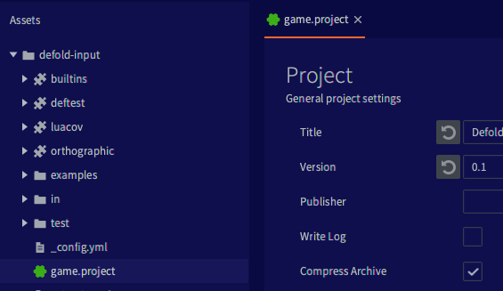
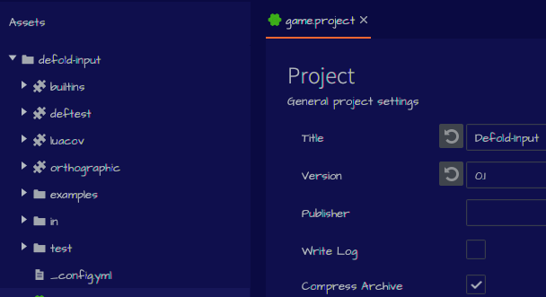

# Стилизация редактора

Вы можете изменить цвета, типографику и другие визуальные аспекты редактора с помощью пользовательской таблицы стилей:

* Создайте папку с именем `.defold` в домашнем каталоге пользователя.
  * На Windows `C:\Users\**Your Username**\.defold`
  * На macOS `/Users/**Your Username**/.defold`
  * На Linux `~/.defold`
* Создайте файл `editor.css` в папке `.defold`.

При запуске редактор загрузит вашу пользовательскую таблицу стилей и применит ее поверх стиля по умолчанию. Редактор использует JavaFX для пользовательского интерфейса, а таблицы стилей практически идентичны файлам CSS, используемым в браузере для применения атрибутов стиля к элементам веб-страницы. Таблицы стилей по умолчанию [доступны на GitHub](https://github.com/defold/defold/tree/editor-dev/editor/styling/stylesheets/base).

## Изменение цветов

Цвета по умолчанию определены в [`_palette.scss`](https://github.com/defold/defold/blob/editor-dev/editor/styling/stylesheets/base/_palette.scss) и выглядят следующим образом:

```
* {
	// Background
	-df-background-darker:    derive(#212428, -10%);
	-df-background-dark:      derive(#212428, -5%);
	-df-background:           #212428;
	-df-background-light:     derive(#212428, 10%);
	-df-background-lighter:   derive(#212428, 20%);

	// Component
	-df-component-darker:     derive(#464c55, -20%);
	-df-component-dark:       derive(#464c55, -10%);
	-df-component:            #464c55;
	-df-component-light:      derive(#464c55, 10%);
	-df-component-lighter:    derive(#464c55, 20%);

	// Text & icons
	-df-text-dark:            derive(#b4bac1, -10%);
	-df-text:                 #b4bac1;
	-df-text-selected:        derive(#b4bac1, 20%);

  и так далее...
```

Основная тема разделена на три группы цветов (с более темными и более светлыми вариантами):

* Цвет фона - цвет фона в панелях, окнах, диалогах
* Цвет компонентов - кнопки, ручки полосы прокрутки, контуры текстовых полей
* Цвет текста - текст и значки

Например, если вы добавите это в вашу пользовательскую таблицу стилей `editor.css` в папке `.defold` в домашней папке пользователя:

```
* {
	-df-background-darker:    derive(#0a0a42, -10%);
	-df-background-dark:      derive(#0a0a42, -5%);
	-df-background:           #0a0a42;
	-df-background-light:     derive(#0a0a42, 10%);
	-df-background-lighter:   derive(#0a0a42, 20%);
}
```

В редакторе вы получите следующий вид:




## Изменение шрифтов

Редактор использует два шрифта: `Dejavu Sans Mono` для кода и однострочного текста (ошибки) и `Source Sans Pro` для остальной части пользовательского интерфейса. Значения шрифтов находятся в основном в [`_typography.scss`](https://github.com/defold/defold/blob/editor-dev/editor/styling/stylesheets/base/_typography.scss) и выглядят следующим образом:

```
@font-face {
  src: url("SourceSansPro-Light.ttf");
}

@font-face {
  src: url("DejaVuSansMono.ttf");
}

$default-font-mono: 'Dejavu Sans Mono';
$default-font: 'Source Sans Pro';
$default-font-bold: 'Source Sans Pro Semibold';
$default-font-italic: 'Source Sans Pro Italic';
$default-font-light: 'Source Sans Pro Light';

.root {
    -fx-font-size: 13px;
    -fx-font-family: $default-font;
}

Text.strong {
  -fx-font-family: $default-font-bold;
}

and so on...
```

Основной шрифт определяется в корневом элементе, что позволяет легко заменить шрифт в большинстве мест. Добавьте это в ваш `editor.css`:

```
@import url('https://fonts.googleapis.com/css2?family=Architects+Daughter&display=swap');

.root {
    -fx-font-family: "Architects Daughter";
}
```

В редакторе вы получите следующий вид:



Также можно использовать локальный шрифт вместо веб-шрифта:

```
@font-face {
  font-family: 'Comic Sans MS';
  src: local("cs.ttf");
}

.root {
  -fx-font-family: 'Comic Sans MS';
}
```

::: sidenote
Шрифт редактора кода определяется отдельно в настройках редактора!
:::
