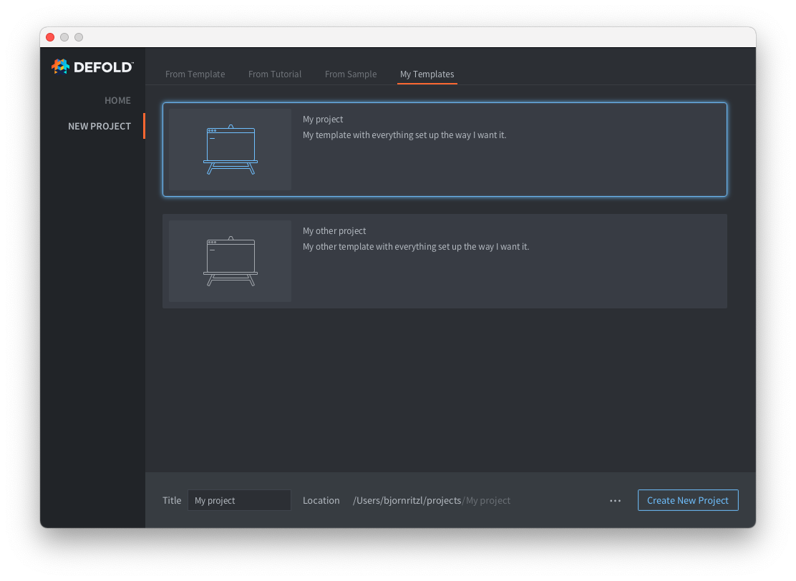

# Шаблоны редактора

Вы можете добавить собственные пользовательские шаблоны проектов в окне New Project:



Для того чтобы добавить одну или несколько новых вкладок с пользовательскими шаблонами проекта, необходимо добавить файл `welcome.edn` в папку `.defold` в домашнем каталоге пользователя:

* Создайте папку с именем `.defold` в домашнем каталоге пользователя.
  * На Windows `C:\Users\**Your Username**\.defold`
  * На macOS `/Users/**Your Username**/.defold`
  * На Linux `~/.defold`
* Создайте файл `welcome.edn` в папке `.defold`.

В файле `welcome.edn` используется формат расширяемой нотации данных. Пример:

```
{:new-project
  {:categories [
    {:label "My Templates"
     :templates [
          {:name "My project"
           :description "My template with everything set up the way I want it."
           :image "empty.svg"
           :zip-url "https://github.com/britzl/template-project/archive/master.zip"
           :skip-root? true},
          {:name "My other project"
           :description "My other template with everything set up the way I want it."
           :image "empty.svg"
           :zip-url "https://github.com/britzl/template-other-project/archive/master.zip"
           :skip-root? true}]
    }]
  }
}
```

В результате будет создан список шаблонов, показанный на скриншоте выше.

::: sidenote
Вы можете использовать только изображения шаблонов [поставляемые вместе с редактором](https://github.com/defold/defold/tree/dev/editor/resources/welcome/images).
:::
