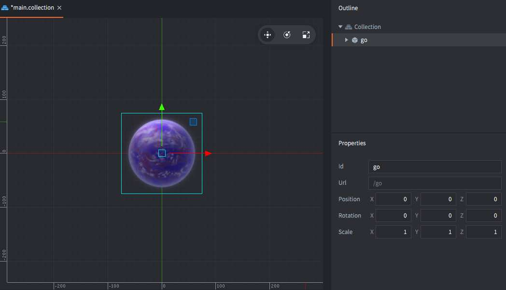
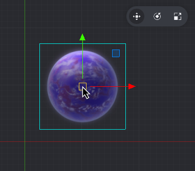
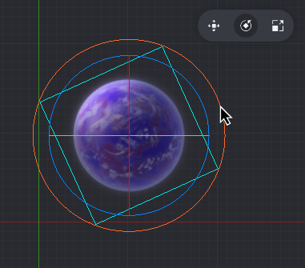

# Обзор редактора

Назначение редактора --- просмотр и эффективное управление файлами игрового проекта. При открытии файла на редактирование, запускается соответствующий редактор, при этом вся необходимая информация о файле отображается в отдельных представлениях.

## Запуск редактора

При запуске редактора Defold, появляется экран выбора и создания проекта. Кликните мышью, в соответствии с желаемым действием:

Home
: Отображает недавно открывавшиеся проекты, предоставляя к ним быстрый доступ. Это представление открывается по умолчанию.

New Project
: Позволяет создать новый проект Defold. Здесь вам необходимо выбрать, хотите ли вы использовать базовый шаблон (из вкладки *From Template*), следовать учебнику (вкладка *From Tutorial*) или попробовать один из проектов-примеров (вкладка *From Sample*).

  {srcset="images/editor/new_project@2x.png 2x"}

  При создании новый проект сохраняется на локальном диске, и все сделанные изменения сохраняются локально.

Подробнее о различных опциях можно узнать в [руководстве по настройке проекта](https://www.defold.com/manuals/project-setup/).

## Панели редактора

Редактор Defold разделен на несколько панелей, или представлений, которые отображают определенную информацию.


Панель *Assets*
: Содержит список всех файлов, являющихся частью проекта. Навигация по списку осуществляется посредством прокрутки мыши. В этом представлении могут быть выполнены любые файловые операции:

   - Выполните <kbd>двойной клик</kbd> по файлу, чтобы открыть его в редакторе, соответствующем этому типу файлов.
   - <kbd>Перетащите и бросьте</kbd>, чтобы добавить в проект файлы из других расположений на диске или переместить файлы и папки в новые расположения в пределах проекта.
   - Выполните <kbd>клик ПКМ</kbd>, чтобы открыть _контекстное меню_, с помощью которого можно создавать новые файлы или папки, переименовывать, удалять, отслеживать файловые зависимости и многое другое.

Панель *Editor*

: Представление по центру отображает текущий открытый файл в редакторе соответствующего типа. Все визуальные редакторы позволяют управлять видом камеры:

- Панорамирование: <kbd>Alt + ЛКМ</kbd>.
- Зумирование: <kbd>Alt + ПКМ</kbd> (трехкнопочная мышь) или <kbd>Ctrl + Mouse button</kbd> (однокнопочная мышь). Если мышь оснащена колесом прокрутки, его можно использовать для зумирования.
- Вращение в 3D: <kbd>Ctrl + ЛКМ</kbd>.

В правом верхнем углу представления сцены расположен тулбар, на котором можно найти инструменты манипулирования объектами: *Move*, *Rotate* и *Scale*.

{srcset="images/editor/toolbar@2x.png 2x"}

Панель *Outline*
: Это представление отображает содержимое редактируемого в данный момент файла в виде иерархической древовидной структуры. Outline отражает представление редактора, позволяя выполнять операции с элементами:
   - <kbd>Кликните</kbd> по элементу, чтобы выделить его. Удерживайте <kbd>Shift</kbd> или <kbd>Option</kbd>, чтобы расширить выделение.
   - <kbd>Перетащите и бросьте</kbd> элемент для перемещения. Бросьте какой-либо игровой объект на другой игровой объект в коллекции, чтобы сделать его дочерним.
   - <kbd>Кликните ПКМ</kbd> чтобы открыть _контекстное меню_, с помощью которого можно добавлять, удалять выделенные элементы и т.д.

Панель *Properties*
: Это представление отображает свойства (такие как Position, Rotation, Animation и т.д.), ассоциированные с текущим выбранным элементом.

Панель *Tools*
: В этом представлении есть несколько вкладок. Вкладка *Console* отображает вывод какой-либо ошибки или целенаправленный вывод, осуществляемый вами во время выполнения игры. Рядом с консолью находятся вкладки *Build Errors*, *Search Results*, а также *Curve Editor*, используемый при редактировании кривых в редакторе частиц. Панель Tools также используется для взаимодействия со встроенным отладчиком.

Панель *Changed Files*
: Если проект использует распределённую систему контроля версий Git, это представление отображает список файлов проекта, которые были изменены, добавлены или удалены. Регулярно выполняя синхронизацию проекта, вы можете синхронизировать свою локальную копию с тем, что хранится в Git-репозитории проекта, что позволяет сотрудничать с командой без риска потери своей работы в случае сбоя. Подробнее о Git можно узнать в нашем [руководстве по контролю версий](/manuals/version-control/). В этом представлении можно выполнять некоторые файловые операции:

   - Выполните <kbd>двойной клик</kbd> по файлу чтобы открыть представление отличий. Defold открывает файл в подходящем редакторе, так же, как и в представлении ассетов.
   - Выполните <kbd>клик ПКМ</kbd> по файлу, чтобы открыть всплывающее меню, с помощью которого можно открыть представление отличий, отменить все изменения, сделанные в файле, найти файл в файловой системе и многое другое.

## Двухпанельное редактирование

Когда открыто несколько файлов, для каждого из них в верхней части окна редактора отображается отдельная вкладка. Рядом друг с другом можно открыть 2 представления редактора. Выполните <kbd>клик ПКМ</kbd> по вкладке редактора, который хотите переместить, и выберите <kbd>Move to Other Tab Pane</kbd>.

{srcset="images/editor/2-panes@2x.png 2x"}

С помощью меню вкладок можно также поменять местами две панели или объединить их в одну.

## Редактор сцен

Двойной клик по файлу коллекции или игрового объекта приводит к открытию *редактора сцены*:



Выделение объектов
: Клик по объектам в главном окне выделяет их. Прямоугольник, окружающий объект в представлении редактора, будет подсвечен зеленым цветом, указывая на то, какой элемент выделен. Выделенный объект также подсвечивается в представлении *Outline*.

  Объекты можно выделять и другим способом:

  - <kbd>Кликните и перетащите</kbd>, чтобы выделить все объекты, попавшие внутрь области выделения.
  - <kbd>Кликните</kbd> по объекту в представлении Outline.

  Для добавления к выделению зажмите и удерживайте <kbd>Shift</kbd> или <kbd>⌘</kbd> (Mac) / <kbd>Ctrl</kbd> (Win/Linux) при клике по объектам.

Инструмент перемещения
: {.left}
  Для перемещения объектов используется инструмент *Move*. Активировать его можно на тулбаре в правом верхнем углу редактора сцены, или нажав клавишу <kbd>W</kbd>.

  

  На выделенном объекте отображается набор манипуляторов (квадратики и стрелки). Перетаскивание центрального маркера, в виде зеленого квадратика, приводит к свободному перемещению объекта в пространстве экрана, перетаскивание стрелок позволяет перемещать объект по осям X, Y и Z. Здесь же имеются маркеры-квадратики для перемещения объекта в плоскости X-Y, а также (видно при повороте камеры в 3D) в плоскостях X-Z и Y-Z.

Инструмент вращения
: {.left}
  Для вращения объектов используется инструмент *Rotate*, который можно активировать на тулбаре и нажатием клавиши <kbd>E</kbd>.

  

  Данный инструмент состоит из четырех круговых манипуляторов: один оранжевый, вращающий объект в пространстве экрана, и по одному для вращения вокруг каждой из осей X, Y и Z. Поскольку вид является параллельным по отношению к осям X и Y, круги отображаются только как две прямые, пересекающие объект.

Инструмент масштабирования
: {.left}
  Для масштабирования объектов используется инструмент *Scale*, который можно активировать на тулбаре и нажатием клавиши <kbd>R</kbd>.

  

  Этот инструмент состоит из набора квадратных маркеров. Из них центральный равномерно масштабирует объект по всем осям (включая Z). Также имеется по одному маркеру для масштабирования вдоль каждой из осей X, Y и Z и по одному --- для масштабирования в плоскостях X-Y, X-Z и Y-Z.

## Создание новых файлов проекта

Создавать новые файлы ресурсов можно двумя способами: выполнив <kbd>File ▸ New...</kbd> и выбрав тип файла из меню, либо используя контекстное меню:

Выполните <kbd>клик ПКМ</kbd> в целевом расположении в браузере *ассетов*, затем выберите <kbd>New... ▸ [тип файла]</kbd>:

{srcset="images/editor/create_file@2x.png 2x"}

Введите подходящее имя для нового файла. Полное имя файла, включая суффикс типа файла, отображается в диалоге в строке *Path*:

{srcset="images/editor/create_file_name@2x.png 2x"}

## Импортирование файлов в проект

Добавление в проект файлов ассетов (изображений, звуков, моделей и т.д.) осуществляется простым перетаскиванием их в нужную позицию в браузер *ассетов*. При этом создаются _копии_ файлов в выбранном расположении файловой структуры проекта. За подробностями обращайтесь к [нашему руководству по импортированию ассетов](/manuals/importing-assets/).

{srcset="images/editor/import@2x.png 2x"}

## Обновление редактора

Редактор будет автоматически проверять наличие обновлений. При обнаружении обновление будет отображаться в правом нижнем углу окна редактора и на экране выбора проекта. При клике по ссылке Update Available будет произведена загрузка и обновление редактора.

{srcset="images/editor/update-project-selection@2x.png 2x"}

{srcset="images/editor/update-main@2x.png 2x"}

## Клавиатурные сокращения

### Сокращения по умолчанию

| Команда | Windows | macOS | Linux |
|---------|---------|-------|-------|
| Add | <kbd>A</kbd> | <kbd>A</kbd> | <kbd>A</kbd> |
| Add secondary | <kbd>Shift</kbd>+<kbd>A</kbd> | <kbd>Shift</kbd>+<kbd>A</kbd> | <kbd>Shift</kbd>+<kbd>A</kbd> |
| Backwards tab trigger | <kbd>Shift</kbd>+<kbd>Tab</kbd> | <kbd>Shift</kbd>+<kbd>Tab</kbd> | <kbd>Shift</kbd>+<kbd>Tab</kbd> |
| Beginning of file | <kbd>Ctrl</kbd>+<kbd>Home</kbd> | <kbd>Cmd</kbd>+<kbd>Up</kbd> | <kbd>Ctrl</kbd>+<kbd>Home</kbd> |
| Beginning of line |  | <kbd>Ctrl</kbd>+<kbd>A</kbd> |  |
| Beginning of line text | <kbd>Home</kbd> | <kbd>Home</kbd> | <kbd>Home</kbd> |
| Build | <kbd>Ctrl</kbd>+<kbd>B</kbd> | <kbd>Cmd</kbd>+<kbd>B</kbd> | <kbd>Ctrl</kbd>+<kbd>B</kbd> |
| Close | <kbd>Ctrl</kbd>+<kbd>W</kbd> | <kbd>Cmd</kbd>+<kbd>W</kbd> | <kbd>Ctrl</kbd>+<kbd>W</kbd> |
| Close all | <kbd>Shift</kbd>+<kbd>Ctrl</kbd>+<kbd>W</kbd> | <kbd>Shift</kbd>+<kbd>Cmd</kbd>+<kbd>W</kbd> | <kbd>Shift</kbd>+<kbd>Ctrl</kbd>+<kbd>W</kbd> |
| Continue | <kbd>F5</kbd> | <kbd>F5</kbd> | <kbd>F5</kbd> |
| Copy | <kbd>Ctrl</kbd>+<kbd>C</kbd> | <kbd>Cmd</kbd>+<kbd>C</kbd> | <kbd>Ctrl</kbd>+<kbd>C</kbd> |
| Cut | <kbd>Ctrl</kbd>+<kbd>X</kbd> | <kbd>Cmd</kbd>+<kbd>X</kbd> | <kbd>Ctrl</kbd>+<kbd>X</kbd> |
| Delete | <kbd>Delete</kbd> | <kbd>Delete</kbd> | <kbd>Delete</kbd> |
| Delete backward | <kbd>Backspace</kbd> | <kbd>Backspace</kbd> | <kbd>Backspace</kbd> |
| Delete line |  | <kbd>Ctrl</kbd>+<kbd>D</kbd> |  |
| Delete next word | <kbd>Ctrl</kbd>+<kbd>Delete</kbd> | <kbd>Alt</kbd>+<kbd>Delete</kbd> | <kbd>Ctrl</kbd>+<kbd>Delete</kbd> |
| Delete prev word | <kbd>Ctrl</kbd>+<kbd>Backspace</kbd> | <kbd>Alt</kbd>+<kbd>Backspace</kbd> | <kbd>Ctrl</kbd>+<kbd>Backspace</kbd> |
| Delete to end of line | <kbd>Shift</kbd>+<kbd>Ctrl</kbd>+<kbd>Delete</kbd> | <kbd>Cmd</kbd>+<kbd>Delete</kbd> | <kbd>Shift</kbd>+<kbd>Ctrl</kbd>+<kbd>Delete</kbd> |
| Documentation | <kbd>F1</kbd> | <kbd>F1</kbd> | <kbd>F1</kbd> |
| Down | <kbd>Down</kbd> | <kbd>Down</kbd> | <kbd>Down</kbd> |
| End of file | <kbd>Ctrl</kbd>+<kbd>End</kbd> | <kbd>Cmd</kbd>+<kbd>Down</kbd> | <kbd>Ctrl</kbd>+<kbd>End</kbd> |
| End of line | <kbd>End</kbd> | <kbd>Ctrl</kbd>+<kbd>E</kbd> | <kbd>End</kbd> |
| Enter | <kbd>Enter</kbd> | <kbd>Enter</kbd> | <kbd>Enter</kbd> |
| Erase tool | <kbd>Shift</kbd>+<kbd>E</kbd> | <kbd>Shift</kbd>+<kbd>E</kbd> | <kbd>Shift</kbd>+<kbd>E</kbd> |
| Escape | <kbd>Esc</kbd> | <kbd>Esc</kbd> | <kbd>Esc</kbd> |
| Find next | <kbd>Ctrl</kbd>+<kbd>G</kbd> | <kbd>Cmd</kbd>+<kbd>G</kbd> | <kbd>Ctrl</kbd>+<kbd>G</kbd> |
| Find prev | <kbd>Shift</kbd>+<kbd>Ctrl</kbd>+<kbd>G</kbd> | <kbd>Shift</kbd>+<kbd>Cmd</kbd>+<kbd>G</kbd> | <kbd>Shift</kbd>+<kbd>Ctrl</kbd>+<kbd>G</kbd> |
| Find text | <kbd>Ctrl</kbd>+<kbd>F</kbd> | <kbd>Cmd</kbd>+<kbd>F</kbd> | <kbd>Ctrl</kbd>+<kbd>F</kbd> |
| Frame selection | <kbd>F</kbd> | <kbd>F</kbd> | <kbd>F</kbd> |
| Goto line | <kbd>Ctrl</kbd>+<kbd>L</kbd> | <kbd>Cmd</kbd>+<kbd>L</kbd> | <kbd>Ctrl</kbd>+<kbd>L</kbd> |
| Hide selected | <kbd>Ctrl</kbd>+<kbd>E</kbd> | <kbd>Cmd</kbd>+<kbd>E</kbd> | <kbd>Ctrl</kbd>+<kbd>E</kbd> |
| Hot reload | <kbd>Ctrl</kbd>+<kbd>R</kbd> | <kbd>Cmd</kbd>+<kbd>R</kbd> | <kbd>Ctrl</kbd>+<kbd>R</kbd> |
| Left | <kbd>Left</kbd> | <kbd>Left</kbd> | <kbd>Left</kbd> |
| Move down | <kbd>Alt</kbd>+<kbd>Down</kbd> | <kbd>Alt</kbd>+<kbd>Down</kbd> | <kbd>Alt</kbd>+<kbd>Down</kbd> |
| Move tool | <kbd>W</kbd> | <kbd>W</kbd> | <kbd>W</kbd> |
| Move up | <kbd>Alt</kbd>+<kbd>Up</kbd> | <kbd>Alt</kbd>+<kbd>Up</kbd> | <kbd>Alt</kbd>+<kbd>Up</kbd> |
| New file | <kbd>Ctrl</kbd>+<kbd>N</kbd> | <kbd>Cmd</kbd>+<kbd>N</kbd> | <kbd>Ctrl</kbd>+<kbd>N</kbd> |
| Next word | <kbd>Ctrl</kbd>+<kbd>Right</kbd> | <kbd>Alt</kbd>+<kbd>Right</kbd> | <kbd>Ctrl</kbd>+<kbd>Right</kbd> |
| Open | <kbd>Ctrl</kbd>+<kbd>O</kbd> | <kbd>Cmd</kbd>+<kbd>O</kbd> | <kbd>Ctrl</kbd>+<kbd>O</kbd> |
| Open asset | <kbd>Shift</kbd>+<kbd>Ctrl</kbd>+<kbd>R</kbd> | <kbd>Cmd</kbd>+<kbd>P</kbd> | <kbd>Shift</kbd>+<kbd>Ctrl</kbd>+<kbd>R</kbd> |
| Page down | <kbd>Page Down</kbd> | <kbd>Page Down</kbd> | <kbd>Page Down</kbd> |
| Page up | <kbd>Page Up</kbd> | <kbd>Page Up</kbd> | <kbd>Page Up</kbd> |
| Paste | <kbd>Ctrl</kbd>+<kbd>V</kbd> | <kbd>Cmd</kbd>+<kbd>V</kbd> | <kbd>Ctrl</kbd>+<kbd>V</kbd> |
| Preferences | <kbd>Ctrl</kbd>+<kbd>Comma</kbd> | <kbd>Cmd</kbd>+<kbd>Comma</kbd> | <kbd>Ctrl</kbd>+<kbd>Comma</kbd> |
| Prev word | <kbd>Ctrl</kbd>+<kbd>Left</kbd> | <kbd>Alt</kbd>+<kbd>Left</kbd> | <kbd>Ctrl</kbd>+<kbd>Left</kbd> |
| Proposals | <kbd>Ctrl</kbd>+<kbd>Space</kbd> | <kbd>Ctrl</kbd>+<kbd>Space</kbd> | <kbd>Ctrl</kbd>+<kbd>Space</kbd> |
| Quit | <kbd>Ctrl</kbd>+<kbd>Q</kbd> | <kbd>Cmd</kbd>+<kbd>Q</kbd> | <kbd>Ctrl</kbd>+<kbd>Q</kbd> |
| Realign camera | <kbd>Period</kbd> | <kbd>Period</kbd> | <kbd>Period</kbd> |
| Rebuild | <kbd>Shift</kbd>+<kbd>Ctrl</kbd>+<kbd>B</kbd> | <kbd>Shift</kbd>+<kbd>Cmd</kbd>+<kbd>B</kbd> | <kbd>Shift</kbd>+<kbd>Ctrl</kbd>+<kbd>B</kbd> |
| Rebundle | <kbd>Ctrl</kbd>+<kbd>U</kbd> | <kbd>Cmd</kbd>+<kbd>U</kbd> | <kbd>Ctrl</kbd>+<kbd>U</kbd> |
| Redo | <kbd>Shift</kbd>+<kbd>Ctrl</kbd>+<kbd>Z</kbd> | <kbd>Shift</kbd>+<kbd>Cmd</kbd>+<kbd>Z</kbd> | <kbd>Shift</kbd>+<kbd>Ctrl</kbd>+<kbd>Z</kbd> |
| Reindent | <kbd>Ctrl</kbd>+<kbd>I</kbd> | <kbd>Ctrl</kbd>+<kbd>I</kbd> | <kbd>Ctrl</kbd>+<kbd>I</kbd> |
| Reload stylesheet |  | <kbd>Ctrl</kbd>+<kbd>R</kbd> |  |
| Rename | <kbd>F2</kbd> | <kbd>F2</kbd> | <kbd>F2</kbd> |
| Replace next | <kbd>Shift</kbd>+<kbd>Ctrl</kbd>+<kbd>H</kbd> | <kbd>Alt</kbd>+<kbd>Cmd</kbd>+<kbd>G</kbd> | <kbd>Shift</kbd>+<kbd>Ctrl</kbd>+<kbd>H</kbd> |
| Replace text |  | <kbd>Alt</kbd>+<kbd>Cmd</kbd>+<kbd>F</kbd> |  |
| Right | <kbd>Right</kbd> | <kbd>Right</kbd> | <kbd>Right</kbd> |
| Rotate tool | <kbd>E</kbd> | <kbd>E</kbd> | <kbd>E</kbd> |
| Save all | <kbd>Ctrl</kbd>+<kbd>S</kbd> | <kbd>Cmd</kbd>+<kbd>S</kbd> | <kbd>Ctrl</kbd>+<kbd>S</kbd> |
| Scale tool | <kbd>R</kbd> | <kbd>R</kbd> | <kbd>R</kbd> |
| Scene stop | <kbd>Ctrl</kbd>+<kbd>T</kbd> | <kbd>Cmd</kbd>+<kbd>T</kbd> | <kbd>Ctrl</kbd>+<kbd>T</kbd> |
| Search in files | <kbd>Shift</kbd>+<kbd>Ctrl</kbd>+<kbd>F</kbd> | <kbd>Shift</kbd>+<kbd>Cmd</kbd>+<kbd>F</kbd> | <kbd>Shift</kbd>+<kbd>Ctrl</kbd>+<kbd>F</kbd> |
| Select all | <kbd>Ctrl</kbd>+<kbd>A</kbd> | <kbd>Cmd</kbd>+<kbd>A</kbd> | <kbd>Ctrl</kbd>+<kbd>A</kbd> |
| Select beginning of file | <kbd>Shift</kbd>+<kbd>Ctrl</kbd>+<kbd>Home</kbd> | <kbd>Shift</kbd>+<kbd>Cmd</kbd>+<kbd>Up</kbd> | <kbd>Shift</kbd>+<kbd>Ctrl</kbd>+<kbd>Home</kbd> |
| Select beginning of line |  | <kbd>Shift</kbd>+<kbd>Ctrl</kbd>+<kbd>A</kbd> |  |
| Select beginning of line text | <kbd>Shift</kbd>+<kbd>Home</kbd> | <kbd>Shift</kbd>+<kbd>Home</kbd> | <kbd>Shift</kbd>+<kbd>Home</kbd> |
| Select down | <kbd>Shift</kbd>+<kbd>Down</kbd> | <kbd>Shift</kbd>+<kbd>Down</kbd> | <kbd>Shift</kbd>+<kbd>Down</kbd> |
| Select end of file | <kbd>Shift</kbd>+<kbd>Ctrl</kbd>+<kbd>End</kbd> | <kbd>Shift</kbd>+<kbd>Cmd</kbd>+<kbd>Down</kbd> | <kbd>Shift</kbd>+<kbd>Ctrl</kbd>+<kbd>End</kbd> |
| Select end of line | <kbd>Shift</kbd>+<kbd>End</kbd> | <kbd>Shift</kbd>+<kbd>Alt</kbd>+<kbd>Down</kbd> | <kbd>Shift</kbd>+<kbd>End</kbd> |
| Select left | <kbd>Shift</kbd>+<kbd>Left</kbd> | <kbd>Shift</kbd>+<kbd>Left</kbd> | <kbd>Shift</kbd>+<kbd>Left</kbd> |
| Select next occurrence | <kbd>Ctrl</kbd>+<kbd>D</kbd> | <kbd>Cmd</kbd>+<kbd>D</kbd> | <kbd>Ctrl</kbd>+<kbd>D</kbd> |
| Select next word | <kbd>Shift</kbd>+<kbd>Ctrl</kbd>+<kbd>Right</kbd> | <kbd>Shift</kbd>+<kbd>Alt</kbd>+<kbd>Right</kbd> | <kbd>Shift</kbd>+<kbd>Ctrl</kbd>+<kbd>Right</kbd> |
| Select page down | <kbd>Shift</kbd>+<kbd>Page Down</kbd> | <kbd>Shift</kbd>+<kbd>Page Down</kbd> | <kbd>Shift</kbd>+<kbd>Page Down</kbd> |
| Select page up | <kbd>Shift</kbd>+<kbd>Page Up</kbd> | <kbd>Shift</kbd>+<kbd>Page Up</kbd> | <kbd>Shift</kbd>+<kbd>Page Up</kbd> |
| Select prev word | <kbd>Shift</kbd>+<kbd>Ctrl</kbd>+<kbd>Left</kbd> | <kbd>Shift</kbd>+<kbd>Ctrl</kbd>+<kbd>Left</kbd> | <kbd>Shift</kbd>+<kbd>Ctrl</kbd>+<kbd>Left</kbd> |
| Select right | <kbd>Shift</kbd>+<kbd>Right</kbd> | <kbd>Shift</kbd>+<kbd>Right</kbd> | <kbd>Shift</kbd>+<kbd>Right</kbd> |
| Show last hidden | <kbd>Shift</kbd>+<kbd>Ctrl</kbd>+<kbd>E</kbd> | <kbd>Shift</kbd>+<kbd>Cmd</kbd>+<kbd>E</kbd> | <kbd>Shift</kbd>+<kbd>Ctrl</kbd>+<kbd>E</kbd> |
| Show palette | <kbd>Space</kbd> | <kbd>Space</kbd> | <kbd>Space</kbd> |
| Split selection into lines | <kbd>Shift</kbd>+<kbd>Ctrl</kbd>+<kbd>L</kbd> | <kbd>Shift</kbd>+<kbd>Cmd</kbd>+<kbd>L</kbd> | <kbd>Shift</kbd>+<kbd>Ctrl</kbd>+<kbd>L</kbd> |
| Step into | <kbd>F11</kbd> | <kbd>F11</kbd> | <kbd>F11</kbd> |
| Step out | <kbd>Shift</kbd>+<kbd>F11</kbd> | <kbd>Shift</kbd>+<kbd>F11</kbd> | <kbd>Shift</kbd>+<kbd>F11</kbd> |
| Step over | <kbd>F10</kbd> | <kbd>F10</kbd> | <kbd>F10</kbd> |
| Stop debugger | <kbd>Shift</kbd>+<kbd>F5</kbd> |  | <kbd>Shift</kbd>+<kbd>F5</kbd> |
| Tab | <kbd>Tab</kbd> | <kbd>Tab</kbd> | <kbd>Tab</kbd> |
| Toggle breakpoint | <kbd>F9</kbd> | <kbd>F9</kbd> | <kbd>F9</kbd> |
| Toggle comment | <kbd>Ctrl</kbd>+<kbd>Slash</kbd> | <kbd>Cmd</kbd>+<kbd>Slash</kbd> | <kbd>Ctrl</kbd>+<kbd>Slash</kbd> |
| Toggle component guides | <kbd>Ctrl</kbd>+<kbd>H</kbd> | <kbd>Ctrl</kbd>+<kbd>Cmd</kbd>+<kbd>H</kbd> | <kbd>Ctrl</kbd>+<kbd>H</kbd> |
| Toggle pane bottom | <kbd>F7</kbd> | <kbd>F7</kbd> | <kbd>F7</kbd> |
| Toggle pane left | <kbd>F6</kbd> | <kbd>F6</kbd> | <kbd>F6</kbd> |
| Toggle pane right | <kbd>F8</kbd> | <kbd>F8</kbd> | <kbd>F8</kbd> |
| Toggle visibility filters | <kbd>Shift</kbd>+<kbd>Ctrl</kbd>+<kbd>I</kbd> | <kbd>Shift</kbd>+<kbd>Cmd</kbd>+<kbd>I</kbd> | <kbd>Shift</kbd>+<kbd>Ctrl</kbd>+<kbd>I</kbd> |
| Undo | <kbd>Ctrl</kbd>+<kbd>Z</kbd> | <kbd>Cmd</kbd>+<kbd>Z</kbd> | <kbd>Ctrl</kbd>+<kbd>Z</kbd> |
| Up | <kbd>Up</kbd> | <kbd>Up</kbd> | <kbd>Up</kbd> |
| Up major | <kbd>Shift</kbd>+<kbd>Up</kbd> | <kbd>Shift</kbd>+<kbd>Up</kbd> | <kbd>Shift</kbd>+<kbd>Up</kbd> |
| Zoom in | <kbd>Ctrl</kbd>+<kbd>'</kbd>+<kbd>'</kbd> | <kbd>Cmd</kbd>+<kbd>'</kbd>+<kbd>'</kbd> | <kbd>Ctrl</kbd>+<kbd>'</kbd>+<kbd>'</kbd> |
| Zoom out | <kbd>Ctrl</kbd>+<kbd>'-'</kbd> | <kbd>Cmd</kbd>+<kbd>'-'</kbd> | <kbd>Ctrl</kbd>+<kbd>'-'</kbd> |


### Кастомизация сокращений

Клавиатурные сокращения можно настроить, если создать конфигурационный файл (например, `keymap.edn` в домашней директории). Затем необходимо выполнить <kbd>File ▸ Preferences</kbd> и в строку <kbd>Path to custom keymap</kbd> прописать путь к созданному файлу. Необходимо перезапустить Defold после изменения этой настройки, а также каждый раз при редактировании файла keymap.

Просмотреть и скачать файлы конфигурации клавиш можно здесь: [Windows](examples/keymap_win.edn), [MacOS](examples/keymap_macos.edn), [Linux](examples/keymap_linux.edn)

## Журнал событий редактора
При возникновении проблем с редактором и при необходимости [сообщить о проблеме](/manuals/getting-help/#getting-help), лучше всего предоставить лог-файлы из самого редактора. Лог-файлы редактора можно найти в следующих расположениях:

  * Windows: `C:\Users\ **Your Username** \AppData\Local\Defold`
  * macOS: `/Users/ **Your Username** /Library/Application Support/` или `~/Library/Application Support/Defold`
  * Linux: `~/.Defold`

Получить доступ к журналу редактора можно также во время его работы, если он запущен из терминала/командной строки. Для запуска редактора из терминала на macOS:

```
$ > ./path/to/Defold.app/Contents/MacOS/Defold
```


## FAQ
:[Editor FAQ](../shared/editor-faq.md)