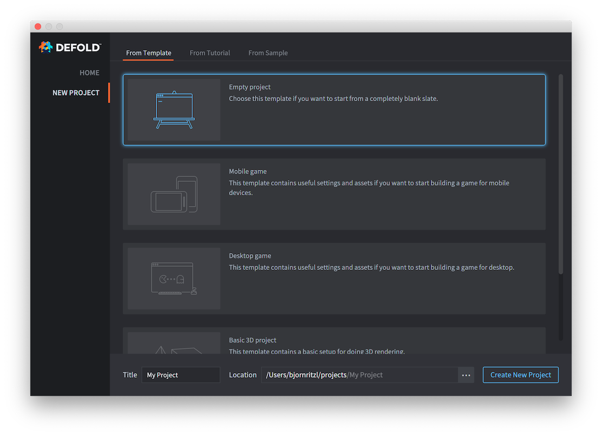
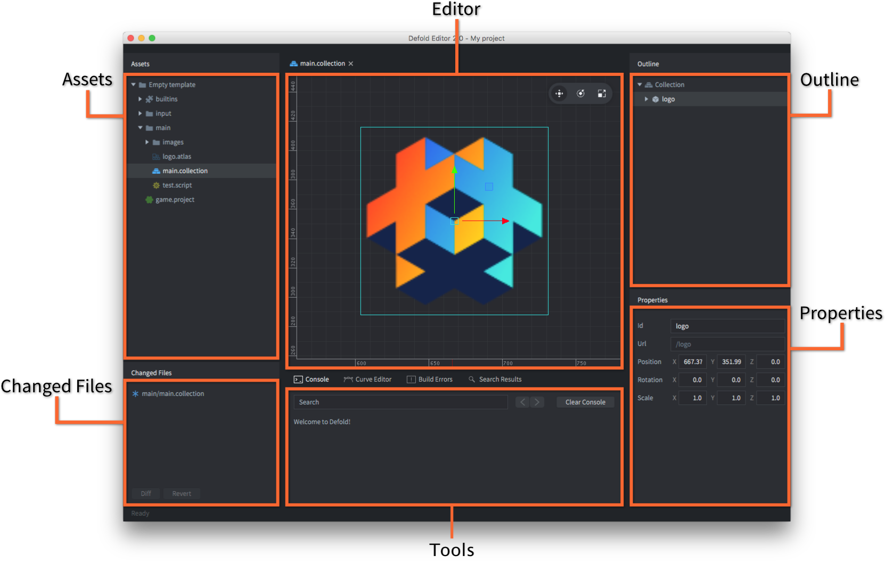
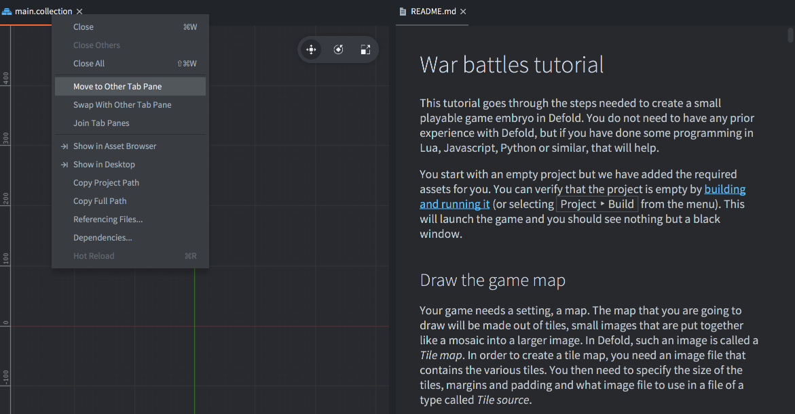
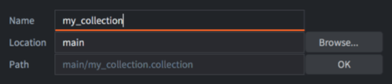
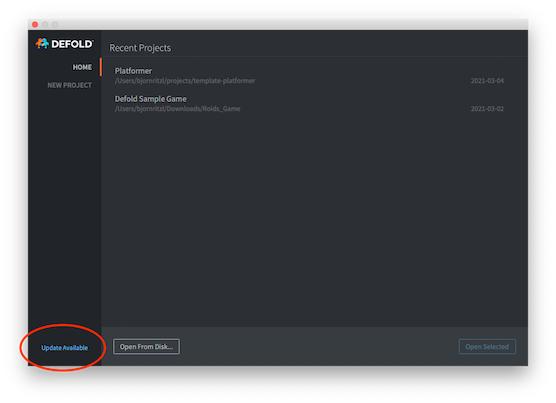
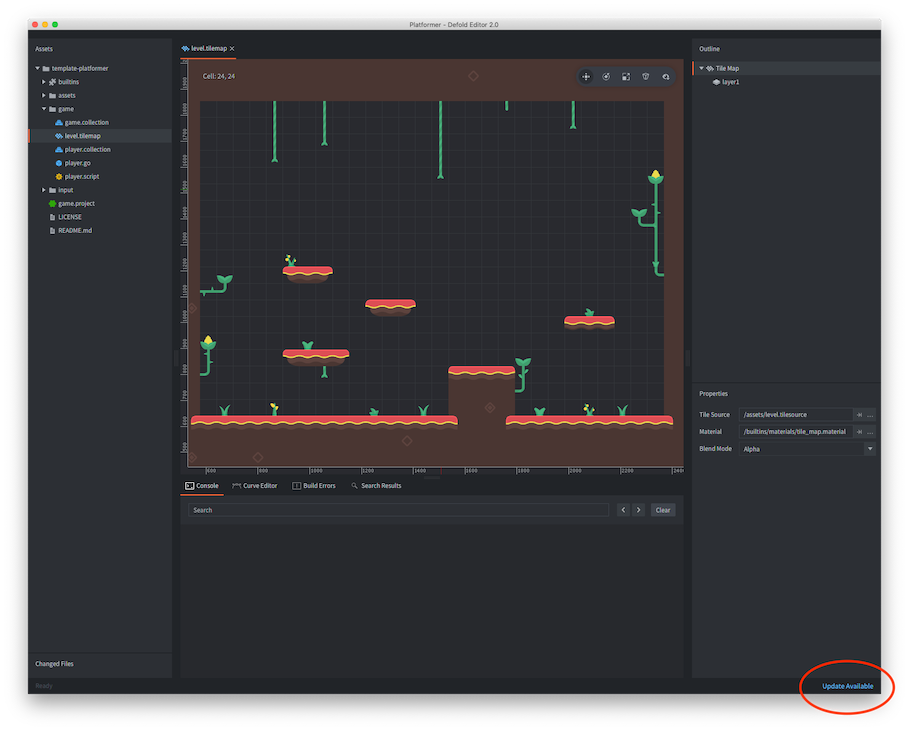

# Обзор редактора

Редактор позволяет эффективно просматривать и управлять всеми файлами вашего игрового проекта. При редактировании файлов открывается соответствующий редактор, отображающий всю релевантную информацию о файле в отдельных панелях.

## Запуск редактора

При запуске редактора Defold вы увидите экран выбора и создания проекта. Выберите, что хотите сделать:

Домашняя страница
: Показывает список недавно открытых проектов для быстрого доступа. Это представление используется по умолчанию.

Новый проект
: Нажмите, если хотите создать новый проект Defold. Затем выберите, хотите ли вы использовать базовый шаблон (вкладка *From Template*), следовать пошаговому руководству (вкладка *From Tutorial*) или попробовать один из демонстрационных проектов (вкладка *From Sample*).

  

  Созданный проект сохраняется на вашем локальном диске, а все изменения записываются локально.

Подробнее о доступных вариантах читайте в [руководстве по настройке проекта](https://www.defold.com/manuals/project-setup/).

## Панели редактора

Редактор Defold разделён на несколько панелей (views), отображающих определённую информацию.



Панель *Assets*
: Показывает все файлы проекта. Щёлкайте и прокручивайте список для навигации. Здесь можно выполнять все операции с файлами:

   - <kbd>Двойной клик</kbd> — открыть файл в соответствующем редакторе.
   - <kbd>Перетаскивание</kbd> — добавить файлы с диска или переместить существующие по структуре проекта.
   - <kbd>Правый клик</kbd> — открыть контекстное меню для создания, переименования, удаления, отслеживания зависимостей и т.д.

### Панель *Editor*
Центральная панель отображает текущий открытый файл в подходящем редакторе. Все визуальные редакторы позволяют изменять вид камеры:

- Панорамирование: <kbd>Alt + левая кнопка мыши</kbd>.
- Масштабирование: <kbd>Alt + правая кнопка</kbd> (трёхкнопочная мышь) или <kbd>Ctrl + кнопка мыши</kbd> (однокнопочная). Колесо прокрутки тоже работает.
- Вращение в 3D: <kbd>Ctrl + левая кнопка мыши</kbd>.

На панели инструментов в правом верхнем углу редактора сцены находятся инструменты: *Move*, *Rotate*, *Scale*, а также *2D Mode*, *Camera Perspective* и *Visibility Filters*.


### Панель *Outline*

Отображает содержимое редактируемого файла в виде иерархического дерева. Позволяет выполнять действия с элементами:
   - <kbd>Клик</kbd> — выбрать элемент. Удерживайте <kbd>Shift</kbd> или <kbd>Option</kbd> для множественного выбора.
   - <kbd>Перетаскивание</kbd> — переместить элементы. Объекты можно делать дочерними.
   - <kbd>Правый клик</kbd> — открыть контекстное меню для добавления или удаления элементов и других операций.

Можно переключать видимость игровых объектов и компонентов, щёлкнув по значку глаза справа от элемента (начиная с Defold 1.9.8).


### Панель *Properties*

Отображает свойства выбранного объекта, такие как позиция, вращение, анимация и т.д.

### Панель *Tools*

Содержит несколько вкладок: *Console* (вывод ошибок и логов во время выполнения), *Build Errors*, *Search Results*, *Curve Editor* (редактирование кривых в редакторе частиц) и средства отладки.

### Панель *Changed Files*

Если проект использует систему контроля версий Git, здесь отображаются изменённые, добавленные или удалённые файлы. Регулярная синхронизация позволяет держать проект в актуальном состоянии. Подробнее читайте в [руководстве по контролю версий](/manuals/version-control/). Доступны действия:

   - <kbd>Двойной клик</kbd> — открыть дифф-файл в редакторе.
   - <kbd>Правый клик</kbd> — открыть меню с действиями: просмотр различий, откат, показать в файловой системе и др.


## Редактирование в двух окнах

Если открыто несколько файлов, вверху отображаются вкладки. Чтобы открыть 2 редактора рядом, <kbd>правый клик</kbd> по вкладке и выберите <kbd>Move to Other Tab Pane</kbd>.



Можно также поменять панели местами или объединить их обратно.

## Редактор сцены

Двойной клик по файлу коллекции или игрового объекта открывает *Редактор сцены*:


### Выбор объектов
Кликните по объекту в главном окне, и он выделится зелёной рамкой. Также он подсветится в панели *Outline*.

Можно также:

  - <kbd>Клик и перетаскивание</kbd> — выделить область объектов.
  - <kbd>Клик</kbd> по элементу в Outline.

Удерживайте <kbd>Shift</kbd>, <kbd>⌘</kbd> (Mac) или <kbd>Ctrl</kbd> (Win/Linux) для множественного выбора.

### Инструмент перемещения
{.left}
Используйте *Move Tool* (клавиша <kbd>W</kbd>) или панель инструментов в правом верхнем углу.


Выбранный объект отображает набор манипуляторов (квадратов и стрелок). Щёлкните и перетащите зелёный центральный квадратный маркер, чтобы свободно переместить объект в экранном пространстве. Щёлкните и перетащите стрелки, чтобы переместить объект вдоль осей X, Y или Z. Также имеются квадратные маркеры для перемещения объекта в плоскости X-Y и (если камера повёрнута в 3D) в плоскостях X-Z и Y-Z.

### Инструмент вращения
{.left}
Используйте *Rotate Tool* (клавиша <kbd>E</kbd>) или панель инструментов.


Инструмент состоит из четырёх круговых манипуляторов: оранжевого, который вращает объект в экранной плоскости, и по одному для вращения вокруг каждой из осей X, Y и Z. Поскольку вид перпендикулярен осям X и Y, круги отображаются как две пересекающиеся линии.


### Инструмент масштабирования
{.left}
Используйте *Scale Tool* (клавиша <kbd>R</kbd>) или панель инструментов.


Инструмент состоит из набора квадратных манипуляторов. Центральный маркер масштабирует объект равномерно по всем осям (включая Z). Также есть отдельные маркеры для масштабирования вдоль осей X, Y и Z, а также для масштабирования в плоскостях X-Y, X-Z и Y-Z.


### Фильтры видимости
Позволяют включать/отключать отображение компонентов, ограничивающих рамок и направляющих.


## Создание новых файлов проекта

Выберите <kbd>File ▸ New...</kbd> и нужный тип файла или используйте контекстное меню:

<kbd>Правый клик</kbd> в панели *Assets* → <kbd>New... ▸ [file type]</kbd>:


Введите имя нового файла. Полное имя с расширением отображается под строкой *Path*:



Можно задать собственные шаблоны файлов для каждого проекта. Для этого создайте новую папку с именем `templates` в корневом каталоге проекта и добавьте файлы с именем `default.*` с нужными расширениями, например, `/templates/default.gui` или `/templates/default.script`. Если в этих файлах используется маркер `{{NAME}}`, он будет заменён на имя файла, указанное в окне создания файла.

## Импорт файлов в проект

Для добавления ассетов (изображений, звуков, моделей и т.д.) перетащите их в нужное место панели *Assets*. Это создаст копии файлов в структуре проекта. Подробнее — [в этом руководстве](/manuals/importing-assets/).


## Обновление редактора

Редактор автоматически проверяет наличие обновлений. Если они доступны, появится уведомление в нижнем правом углу и на экране выбора проекта. Нажмите «Update Available» для загрузки и установки.





## Настройки

Настройки редактора можно изменить в [окне настроек](/manuals/editor-preferences).

## Журналы редактора
При возникновении проблем вы можете [сообщить об ошибке](/manuals/getting-help/#getting-help), приложив лог-файлы редактора:

  * Windows: `C:\Users\ **Ваше имя пользователя** \AppData\Local\Defold`
  * macOS: `/Users/ **Ваше имя пользователя** /Library/Application Support/` или `~/Library/Application Support/Defold`
  * Linux: `$XDG_STATE_HOME/Defold` или `~/.local/state/Defold`

Вы также можете получить доступ к журналам редактора во время его работы, если запустите редактор из терминала или командной строки. Чтобы запустить редактор из терминала на macOS:

```
$ > ./path/to/Defold.app/Contents/MacOS/Defold
```


## FAQ
:[Editor FAQ](../shared/editor-faq.md)
