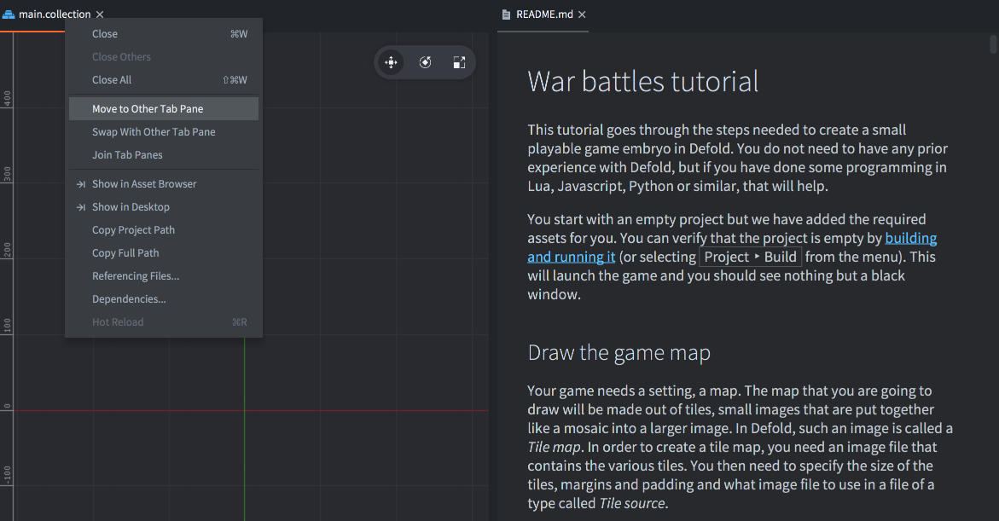

# Обзор редактора

Редактор (Editor) позволяет эффективно просматривать и управлять всеми файлами вашего игрового проекта. При редактировании файлов открывается соответствующий редактор, отображающий всю релевантную информацию о файле в отдельных панелях.

## Запуск редактора

При запуске редактора Defold вы увидите экран выбора и создания проекта. Выберите, что хотите сделать:

МОИ ПРОЕКТЫ (MY PROJECTS)
: Здесь отображаются недавно открытые проекты, к которым вы можете быстро получить доступ. Это представление по умолчанию для стартового экрана.

Если вы ещё не открывали проекты (или удалили все из списка), будет показано два варианта: вы можете нажать кнопку Открыть с диска (`Open From Disk…`), чтобы найти и открыть существующий проект через системный файловый менеджер, или нажать кнопку Создать Проект (`Create New Project`), после чего произойдёт переключение на вкладку ИЗ ШАБЛОНОВ (`TEMPLATES`).

  


  Если вы ранее открывали проекты, будет показан список ваших проектов, как на рисунке ниже:

  

ИЗ ШАБЛОНОВ (TEMPLATES)
: Содержит пустые или почти пустые базовые проекты, подготовленные для быстрого старта нового проекта Defold под конкретные платформы или с использованием определённых расширений.

ИЗ ТУТОРИАЛОВ (TUTORIALS)
: Содержит проекты с пошаговыми обучающими материалами (tutorials), которые можно запускать, изучать и изменять, если вы хотите пройти обучение по руководству.

ИЗ ПРИМЕРОВ (SAMPLES)
: Содержит проекты-примеры, подготовленные для демонстрации конкретных сценариев использования и возможностей движка.

  

Созданный проект сохраняется на вашем локальном диске, а все изменения записываются локально.

Подробнее о доступных вариантах читайте в [руководстве по настройке проекта](https://www.defold.com/manuals/project-setup/).

## Язык редактора

В левом нижнем углу стартового экрана находится выбор языка (Language). Здесь можно выбрать одну из доступных локализаций редактора. Тот же самый выбор доступен и уже внутри редактора через меню `File ▸ Preferences ▸ General ▸ Editor Language` (<kbd>Файл ▸ Настройки ▸ Общие ▸ Язык редактора</kbd>).


## Панели редактора {#the-editor-views}

Редактор Defold разделён на несколько панелей (views), отображающих определённую информацию.


### 1. Панель ресурсы (Assets)
Панель отображает все файлы и папки проекта в виде древовидного списка, соответствующего структуре на диске. Щёлкайте и прокручивайте список для навигации. Здесь можно выполнять все операции с файлами:

   - <kbd>Левый клик мыши</kbd> — выбрать любой файл или папку; при удержании <kbd>⇧ Shift</kbd> можно расширять выделение, а при удержании <kbd>Ctrl</kbd>/<kbd>⌘ Cmd</kbd> — добавлять или снимать выделение с элементов.
   - <kbd>Двойной клик</kbd> — открыть файл в соответствующем редакторе для данного типа файла.
   - <kbd>Перетаскивание</kbd> — добавить файлы с диска в проект или переместить существующие файлы и папки в новое место внутри структуры проекта.
   - <kbd>Правый клик</kbd> — открыть _контекстное меню_, из которого можно создавать новые файлы и папки, переименовывать, удалять, отслеживать зависимости файлов и выполнять другие действия.

Файлы и папки, удалённые через панель *Assets*, перемещаются в системную Корзину, если платформа это поддерживает. Если перемещение в Корзину не поддерживается или завершается ошибкой, редактор удаляет элемент безвозвратно.

### 2. Панель редактора сцены (Scene Editor) {#the-scene-editor}

Двойной клик по файлу коллекции, игрового объекта или визуального компонента открывает *Редактор сцены* — визуальный редактор для создания и редактирования сцен. Файлы скриптов и другие невизуальные ресурсы открываются в собственных специализированных редакторах.


Основные возможности редактора сцены:

- [2D- и 3D-навигация по сцене](/manuals/scene-editing/) с ортографической и перспективной камерами.
- [Инструменты трансформации](/manuals/scene-editing/) для перемещения, вращения и масштабирования объектов.
- [Режим свободной камеры](/manuals/scene-editing/) для навигации в 3D от первого лица.
- [Настройки сетки](/manuals/scene-editing/) с настраиваемым размером, плоскостью и внешним видом.
- [Фильтры видимости](/manuals/scene-editing/) для включения и выключения типов компонентов и направляющих.

Подробнее см. в [руководстве по редактору сцены](/manuals/scene-editing/).

### 3. Панель структура (Outline)

Отображает содержимое редактируемого файла в виде иерархического дерева. Позволяет выполнять действия с элементами:
   - <kbd>Левый клик мыши</kbd> — выбрать элемент; при удержании <kbd>⇧ Shift</kbd> можно расширять выделение, а при удержании <kbd>Ctrl</kbd>/<kbd>⌘ Cmd</kbd> — добавлять или снимать выделение с элементов.
   - <kbd>Перетаскивание</kbd> — переместить элементы. Перетащите игровой объект (game object) на другой игровой объект в коллекции, чтобы создать связь родитель–потомок (parent-child).
   - <kbd>Правый клик</kbd> — открыть _контекстное меню_ для добавления или удаления элементов и других операций.

Можно переключать видимость игровых объектов и компонентов, щёлкнув по значку глаза `👁` справа от элемента.


### 4. Панель свойства (Properties)

Отображает свойства выбранного объекта, такие как позиция, вращение, анимация и другие свойства, зависящие от типа компонента, а также пользовательские свойства для скриптов.

Вы также можете <kbd>Перетащить</kbd> вертикальный маркер `↕` рядом с числовым значением и перемещать мышь, чтобы изменять значение числового свойства.


### 5. Панель инструменты (Tools)

Содержит несколько вкладок:

*Консоль* (Console)
: Показывает ошибки, предупреждения, информационный вывод движка, а также сообщения, которые вы выводите сами во время выполнения игры.

*Ошибки Сборки* (Build Errors)
: Показывает ошибки, возникшие в процессе сборки проекта.

*Результаты Поиска* (Search Results)
: Отображает результаты поиска по всему проекту (<kbd>Ctrl</kbd>/<kbd>⌘ Cmd</kbd> + <kbd>Shift</kbd> + <kbd>F</kbd>), если нажата кнопка Сохранить результаты (`Keep Results`).

*Редактор Кривых* (Curve Editor)
: Используется при редактировании кривых в [редакторе частиц (Particle Editor)](/manuals/particlefx/).

Панель Инструменты (Tools) также используется для работы с интегрированным отладчиком (debugger). Подробнее об этом можно прочитать в [Pуководстве по отладке](/manuals/debugging/).

### 6. Панель изменённые файлы (Changed Files)

Если проект использует Git, здесь отображаются файлы, которые были изменены, добавлены, переименованы или удалены локально по сравнению с текущим коммитом (`HEAD`). Для синхронизации с удалённым репозиторием используйте внешний Git-клиент или командную строку. Подробнее читайте в [руководстве по контролю версий](/manuals/version-control/). Доступны действия:

   - <kbd>Левая клик мыши</kbd> — выбрать элемент; при удержании <kbd>⇧ Shift</kbd> можно расширять выделение, а при удержании <kbd>Ctrl</kbd>/<kbd>⌘ Cmd</kbd> — добавлять или снимать выделение с элементов. Если выбран один изменённый файл, можно нажать кнопку `Сравнение` (Diff), чтобы просмотреть отличие. Кнопка `Откатить` (Revert) позволяет отменить изменения во всех выбранных файлах.
   - <kbd>Двойной клик</kbd> — открыть файл в редакторе, как и при открытии из панели Pесурсы.
   - <kbd>Правый клик</kbd> — открыть меню с действиями: просмотр различий, откат, показать в файловой системе и др.

### Строка меню (Menu Bar)

В верхней части окна редактора (или в системной строке меню на macOS) находится строка меню (Menu Bar) с шестью пунктами: Файл (`File`), Правка (`Edit`), Вид (`View`), Проект (`Project`), Отладка (`Debug`), Справка (`Help`). Их функции подробно описаны в отдельных руководствах.

### Строка состояния (Status Bar)

В нижней части окна редактора находится узкая область, где отображается строка состояния (Status Bar), например:
- когда доступно новое обновление, появляется кликабельная кнопка `Доступно Обновление` (`Update Available`) — подробнее см. раздел "Обновление редактора" ниже;
- при сборке (Build) или упаковке (Bundle) проекта здесь отображается ход выполнения операции.

## Размер и видимость панелей

Размер панелей можно изменять прямо в редакторе, <kbd>Перетаскивание</kbd> границы между описанными выше шестью основными панелями.

Видимость панелей можно переключать через меню Вид (`View`) или с помощью горячих клавиш:
- `Переключить панель ресурсов` (Toggle Assets Pane) (<kbd>F6</kbd>) — показать или скрыть панели *Pесурсы* (Assets) и *Изменённые Файлы* (Changed Files);
- `Переключить изменённые файлы` (Toggle Changed Files) — показ или скрытие только панели *Изменённые Файлы* (Changed Files);
- `Переключить панель инструментов` (Toggle Tools Pane) (<kbd>F7</kbd>) — показать или скрыть панель *Инструменты* (Tools);
- `Переключить панель свойств` (Toggle Properties Pane) (<kbd>F8</kbd>) — показать или скрыть панели *Структура* (Outline) и *Cвойства* (Properties).


В меню Вид (`View`) вы также можете включать/выключать различные элементы отображения, такие как сетка (Grid), направляющие (Guides), камера (Camera), а также подгонять вид под выделение (Вписать выделение в кадр (`Frame Selection`), клавиша <kbd>F</kbd>) или переключаться между стандартным 2D и 3D видом (Выровнять камеру (`Realign Camera`), клавиша <kbd>.</kbd>). Многие из этих функций также доступны с панели инструментов или через сочетания клавиш.

## Вкладки (Tabs)

Если у вас открыто несколько файлов, в верхней части панели редактора отображается отдельная вкладка (tab) для каждого файла. Вкладки внутри одной панели можно переставлять — используйте <kbd>Drag and Drop</kbd>, чтобы менять их порядок в строке вкладок. Можно также:

- <kbd>Правый клик</kbd> по вкладке — открыть _контекстное меню_;
- выбрать `Закрыть` (Close) (<kbd>Ctrl</kbd>/<kbd>⌘ Cmd</kbd> + <kbd>W</kbd>) — закрыть текущую вкладку;
- выбрать `Закрыть остальные` (Close Others) — закрыть все вкладки, кроме выбранной;
- выбрать `Закрыть все` (Close All) (<kbd>Ctrl</kbd>/<kbd>⌘ Cmd</kbd> + <kbd>Shift</kbd> + <kbd>W</kbd>) — закрыть все вкладки в активной панели;
- выбрать `➝| Открыть как` (Open As) — открыть файл в другом, отличном от стандартного, редакторе или во внешнем инструменте, указанном в настройках `Файл ▸ Настройки ▸ Код ▸ Пользовательский редактор` (`File ▸ Preferences ▸ Code ▸ Custom Editor`). Подробнее см. [руководство по настройкам редактора](/manuals/editor-preferences).


## Редактирование в двух окнах

Редактор поддерживает одновременное открытие двух панелей редактора рядом друг с другом.

- <kbd>Правый клик</kbd> по вкладке нужного файла и выберите `Переместить в другую панель вкладок` (`Move to Other Tab Pane`), чтобы переместить текущую вкладку во вторую панель.



Также в меню вкладки можно выбрать Поменять с другой панелью вкладок (`Swap with Other Tab Pane`), чтобы поменять местами активную вкладку и содержимое другой панели, или Объединить панели вкладок (`Join Tab Panes`), чтобы объединить две панели редактора обратно в одну.

## Создание новых файлов проекта {#creating-new-project-files}

Выберите `Файл ▸ Создать...` (`File ▸ New...`) и нужный тип файла или используйте _контекстное меню_:

<kbd>Правый клик</kbd> в панели Pесурсы (Assets) → Создать... ▸ [тип файла] (`New... ▸ [file type]`):


Введите подходящее Имя (*Name*) для нового файла и при необходимости измените Путь (*Location*). Полное имя файла вместе с расширением отображается в поле Просмотр (*Preview*) в диалоговом окне:


## Шаблоны (Templates)


Можно задать собственные шаблоны файлов для каждого проекта. Для этого создайте новую папку с именем `templates` в корневом каталоге проекта и добавьте файлы с именем `default.*` с нужными расширениями, например, `/templates/default.gui` или `/templates/default.script`. Если в этих файлах используется маркер `{{NAME}}`, он будет заменён на имя файла, указанное в окне создания файла.

Если шаблон для данного типа файла существует, то при создании нового файла этого типа он будет инициализирован содержимым соответствующего файла из папки `templates`.


## Импорт файлов в проект

Для добавления ассетов (изображений, звуков, моделей и т.д.) перетащите их в нужное место панели *Assets*. Это создаст копии файлов в структуре проекта. Подробнее — [в этом руководстве](/manuals/importing-assets/).


## Обновление редактора

Редактор автоматически проверяет наличие обновлений. Если они доступны, появится уведомление в нижнем правом углу и на экране выбора проекта. Нажмите Доступно Обновление (`Update Available`) для загрузки и установки.


Нажмите на ссылку Доступно Обновление (`Update Available`), чтобы загрузить и установить обновление. Появится диалоговое окно с информацией — нажмите Загрузить Обновление (`Download Update`), чтобы продолжить.


Ход загрузки отображается в нижней строке состояния:


После завершения загрузки ссылка изменится на Перезапустить (`Restart to Update`). Нажмите её, чтобы перезапустить редактор и открыть обновлённую версию.


## Настройки (Preferences)

Настройки редактора можно изменить в окне Настройки (`Preferences`). Чтобы открыть его, выберите в меню Файл ▸ Настройки… (`File ▸ Preferences…`) или используйте сочетание клавиш <kbd>Ctrl</kbd>/<kbd>⌘ Cmd</kbd> + <kbd>,</kbd>.

Настройки редактора можно изменить в [окне настроек](/manuals/editor-preferences).


## Логи редактора (Editor Logs) {#editor-logs}

Если у вас возникла проблема с редактором и вы хотите сообщить об ошибке через Справка ▸ Сообщить о проблеме (`Help ▸ Report Issue`), полезно приложить лог‑файлы самого редактора. Чтобы открыть папку с логами в системном файловом менеджере, выберите пункт меню Справка ▸ Показать логи (`Help ▸ Show Logs`).

Подробнее читайте в [руководстве по получению помощи](/manuals/getting-help/#getting-help).


Файлы логов редактора по умолчанию находятся по следующим путям:

  * Windows: `C:\Users\ **Ваше имя пользователя** \AppData\Local\Defold`
  * macOS: `/Users/ **Ваше имя пользователя** /Library/Application Support/` или `~/Library/Application Support/Defold`
  * Linux: `$XDG_STATE_HOME/Defold` или `~/.local/state/Defold`

Вы также можете получить доступ к логам редактора во время его работы, если запустите редактор из терминала или командной строки. Чтобы запустить редактор из терминала:

```shell
# Linux:
$ ./path/to/Defold/Defold

# macOS:
$ > ./path/to/Defold.app/Contents/MacOS/Defold
```

## Сервер редакторa (Editor Server)

Когда редактор открывает проект, он запускает веб‑сервер на случайном порту. Этот сервер можно использовать для взаимодействия с редактором из других приложений. Номер порта записывается в файл `.internal/editor.port`.

Сервер предоставляет спецификацию OpenAPI по адресу `http://localhost:$(cat .internal/editor.port)/openapi.json`. Это полезная минимальная отправная точка для агентных рабочих процессов.

Кроме того, исполняемый файл редактора поддерживает параметр командной строки `--port` (или кратко `-p`), позволяющий задать порт при запуске, например:

```shell
# Windows
.\path\to\Defold\Defold.exe --port 8181

# Linux:
./path/to/Defold/Defold --port 8181

# macOS:
./path/to/Defold.app/Contents/MacOS/Defold --port 8181
```

## Метаданные установки редактора (Editor Installation Metadata)

При запуске редактор записывает информацию о launcher и путях установки в известное расположение. Интеграции со сторонними IDE и другие инструменты могут использовать это, чтобы находить установленные редакторы Defold:

| ОС      | Расположение |
|---------|--------------|
| macOS   | `~/Library/Application Support/Defold/installations.json` |
| Linux   | `${XDG_STATE_HOME:-~/.local/state}/Defold/installations.json` |
| Windows | `%LOCALAPPDATA%\Defold\installations.json` |

Файл содержит JSON‑массив с одним объектом для каждой известной установки:

```json
[
  {
    "launcherPath": "/Applications/Defold.app/Contents/MacOS/Defold",
    "installPath": "/Applications/Defold.app",
    "lastLaunchedAt": "2026-07-06T12:34:56.789Z"
  }
]
```

## Оформление редактора (Editor Styling)

Внешний вид редактора можно изменять с помощью пользовательских тем и стилей. Подробнее см. [руководство по оформлению редактора](/manuals/editor-styling).

## FAQ
:[Editor FAQ](../shared/editor-faq.md)
