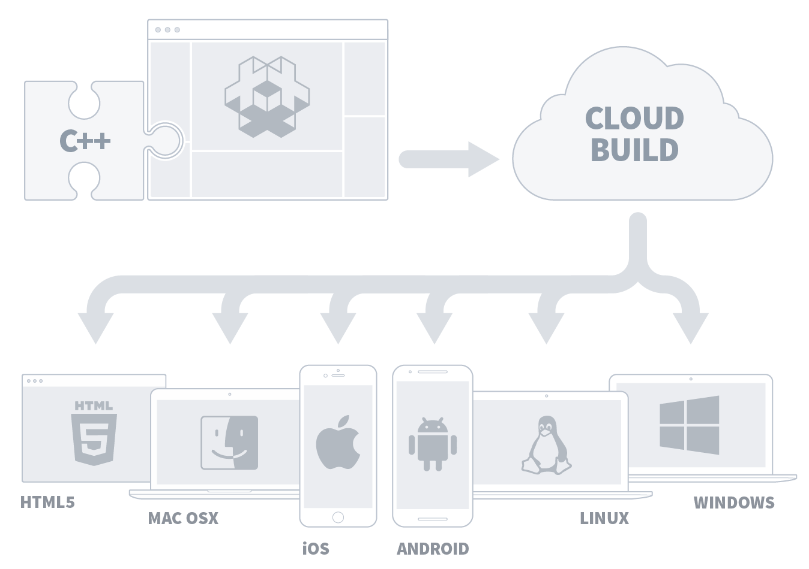
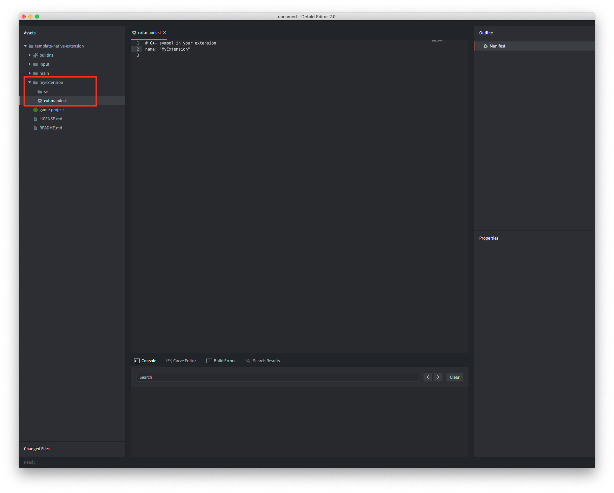
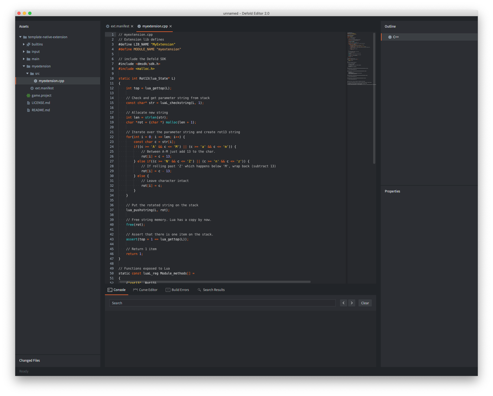

# Нативные расширения

Если вам необходимо пользовательское взаимодействие с внешним программным или аппаратным обеспечением на низком уровне, где Lua недостаточно, Defold SDK позволяет писать расширения для движка на C, C++, Objective C, Java или Javascript, в зависимости от целевой платформы. Типичными случаями использования нативных расширений являются:

- Взаимодействие с конкретным оборудованием, например, с камерой на мобильных телефонах.
- Взаимодействие с внешними API низкого уровня, например, API рекламной сети, которые не позволяют взаимодействовать через сетевые API, где можно было бы использовать Luasocket.
- Высокопроизводительные вычисления и обработка данных.

## Платформа для сборки

Defold предоставляет точку входа для нативных расширений с нулевой настройкой и облачным решением для сборки. Любое нативное расширение, разработанное и добавленное в игровой проект, либо напрямую, либо через [Library Project](/manuals/libraries/), становится частью содержимого проекта. Нет необходимости создавать специальные версии движка и распространять их среди членов команды, это происходит автоматически - любой член команды, который собирает и запускает проект, получит исполняемый файл движка для конкретного проекта со всеми встроенными расширениями.



Сервер сборки предоставляется бесплатно и без каких-либо ограничений на использование. Сервер размещён в Европе, а URL, на который отправляется нативный код, настраивается в [настройках редактора](/manuals/editor-preferences/#extensions) или через опцию командной строки `--build-server` инструмента [bob](/manuals/bob/#usage). Если вы хотите развернуть собственный сервер, пожалуйста, [следуйте этим инструкциям](/manuals/extender-local-setup).

## Планировка проекта

Чтобы создать новое расширение, создайте папку в корне проекта. Эта папка будет содержать все настройки, исходный код, библиотеки и ресурсы, связанные с расширением. Конструктор расширений распознает структуру папок и соберет все исходные файлы и библиотеки.

```
 myextension/
 │
 ├── ext.manifest
 │
 ├── src/
 │
 ├── include/
 │
 ├── lib/
 │   └──[platforms]
 │
 ├── manifests/
 │   └──[platforms]
 │
 └── res/
     └──[platforms]

```
*ext.manifest*
: Папка расширения _должна_ содержать файл *ext.manifest*. Этот файл представляет собой конфигурационный файл с флагами и директивами, используемыми при сборке одного расширения. Определение формата файла можно найти в [руководстве по манифесту расширения](https://defold.com/manuals/extensions-ext-manifests/). Минимальный файл манифеста должен содержать название расширения.

*src*
: Эта папка должна содержать все файлы исходного кода.

*include*
: Эта опциональная папка содержит все включаемые файлы.

*lib*
: Эта опциональная папка содержит все скомпилированные библиотеки, от которых зависит расширение. Файлы библиотек должны быть помещены в подпапки с именем `platform`, или `architecure-platform`, в зависимости от того, какие архитектуры поддерживаются вашими библиотеками.

  :[platforms](../shared/platforms.md)

*manifests*
: Эта опциональная папка содержит дополнительные файлы, используемые в процессе сборки или комплектации. Подробнее см. ниже.

*res*
: Эта опциональная папка содержит любые дополнительные ресурсы, от которых зависит расширение. Файлы ресурсов должны быть помещены в подпапки, названные по `platform`, или `architecure-platform`, как и подпапки "lib". Также допускается подпапка `common`, содержащая файлы ресурсов, общие для всех платформ.

### Файлы манифеста

Опциональная папка *manifests* расширения содержит дополнительные файлы, используемые в процессе сборки и комплектации. Файлы должны быть помещены во вложенные папки, названные по `платформе`:

* `android` - В эту папку помещается файл-заглушка манифеста, который будет объединен с основным приложением ([как описано здесь](/manuals/extensions-manifest-merge-tool)).
  * Папка также может содержать файл `build.gradle` с зависимостями, которые должны быть [разрешены Gradle](/manuals/extensions-gradle) ([пример](https://github.com/defold/extension-facebook/blob/master/facebook/manifests/android/build.gradle)).
  * Наконец, папка может также содержать ноль или более файлов ProGuard (экспериментально).
* `ios` - Эта папка принимает файл-заглушку манифеста, который должен быть объединен с основным приложением ([как описано здесь](/manuals/extensions-manifest-merge-tool)).
  Папка также может содержать файл `Podfile` с зависимостями, которые должны быть [разрешены через Cocoapods](/manuals/extensions-cocoapods).
* `osx` - Эта папка принимает файл-заглушку манифеста, который должен быть объединен с основным приложением ([как описано здесь](/manuals/extensions-manifest-merge-tool)).
* `web` - Эта папка принимает файл-заглушку манифеста, который должен быть объединен с основным приложением ([как описано здесь](/manuals/extensions-manifest-merge-tool)).


## Совместное использование расширения

Расширения рассматриваются так же, как и любые другие ассеты в вашем проекте, и ими можно делиться таким же образом. Если папка нативного расширения добавлена в качестве папки библиотеки, она может быть совместно использована другими пользователями как зависимость. Для получения дополнительной информации обратитесь к руководству [Library project manual](/manuals/libraries/).


## Простой пример расширения

Давайте создадим очень простое расширение. Сначала создадим новую корневую папку *myextension* и добавим в нее файл *ext.manifest*, содержащий имя расширения "MyExtension". Обратите внимание, что имя является символом C++ и должно совпадать с первым аргументом `DM_DECLARE_EXTENSION` (см. ниже).



```yaml
# C++ symbol in your extension
name: "MyExtension"
```

Расширение состоит из одного файла C++, *myextension.cpp*, который создается в папке "src".



Исходный файл расширения содержит следующий код:

```cpp
// myextension.cpp
// Определения расширения lib
#define LIB_NAME "MyExtension"
#define MODULE_NAME "myextension"

// включаем Defold SDK
#include <dmsdk/sdk.h>

static int Reverse(lua_State* L)
{
    // Количество ожидаемых элементов в стеке Lua после того, 
    // как эта структура выйдет из области видимости
    DM_LUA_STACK_CHECK(L, 1);

    // Проверка и получение строки параметра из стека
    char* str = (char*)luaL_checkstring(L, 1);

    // Развернем строку
    int len = strlen(str);
    for(int i = 0; i < len / 2; i++) {
        const char a = str[i];
        const char b = str[len - i - 1];
        str[i] = b;
        str[len - i - 1] = a;
    }

    // Поместим развернутую строку в стек
    lua_pushstring(L, str);

    // Вернем значение 1
    return 1;
}

// Функции, открытые для Lua
static const luaL_reg Module_methods[] =
{
    {"reverse", Reverse},
    {0, 0}
};

static void LuaInit(lua_State* L)
{
    int top = lua_gettop(L);

    // Регистрация имен Lua
    luaL_register(L, MODULE_NAME, Module_methods);

    lua_pop(L, 1);
    assert(top == lua_gettop(L));
}

dmExtension::Result AppInitializeMyExtension(dmExtension::AppParams* params)
{
    return dmExtension::RESULT_OK;
}

dmExtension::Result InitializeMyExtension(dmExtension::Params* params)
{
    // Инициализация Lua
    LuaInit(params->m_L);
    printf("Registered %s Extension\n", MODULE_NAME);
    return dmExtension::RESULT_OK;
}

dmExtension::Result AppFinalizeMyExtension(dmExtension::AppParams* params)
{
    return dmExtension::RESULT_OK;
}

dmExtension::Result FinalizeMyExtension(dmExtension::Params* params)
{
    return dmExtension::RESULT_OK;
}


// Defold SDK использует макрос для установки точек входа расширения:
//
// DM_DECLARE_EXTENSION(symbol, name, app_init, app_final, init, update, on_event, final)

// MyExtension это символ C++, который содержит все соответствующие данные расширения.
// Он должно совпадать с полем имени в `ext.manifest`
DM_DECLARE_EXTENSION(MyExtension, LIB_NAME, AppInitializeMyExtension, AppFinalizeMyExtension, InitializeMyExtension, 0, 0, FinalizeMyExtension)
```

Обратите внимание на макрос `DM_DECLARE_EXTENSION`, который используется для объявления различных точек входа в код расширения. Первый аргумент `символ` должен соответствовать имени, указанному в *ext.manifest*. Для этого простого примера нет необходимости в точках входа "update" или "on_event", поэтому в этих местах макросу присваивается `0`.

Теперь осталось только создать проект (<kbd>Project ▸ Build</kbd>). Это загрузит расширение в конструктор расширений, который запустит движок с включенным в него новым расширением. Если сборщик столкнется с какими-либо ошибками, появится диалог с ошибками сборки.

Чтобы протестировать расширение, создайте игровой объект и добавьте компонент скрипта с некоторым тестовым кодом:

```lua
local s = "abcdefghijklmnopqrstuvwxyzABCDEFGHIJKLMNOPQRSTUVWXYZ"
local reverse_s = myextension.reverse(s)
print(reverse_s) --> ZYXWVUTSRQPONMLKJIHGFEDCBAzyxwvutsrqponmlkjihgfedcba
```

Вот и все! Мы создали полностью работающее нативное расширение.


## Жизненный цикл расширения

Как мы видели выше, макрос `DM_DECLARE_EXTENSION` используется для объявления различных точек входа в код расширения:

`DM_DECLARE_EXTENSION(symbol, name, app_init, app_final, init, update, on_event, final)`

Точки входа позволят вам запускать код в различных точках жизненного цикла расширения:

* Запуск движка
  * Запуск систем движка
  * Расширение `app_init`
  * Расширение `init` - Все API Defold были инициализированы. Это рекомендуемый момент жизненного цикла расширения, когда создаются привязки Lua к коду расширения.
  * Запуск скрипта - Вызываются функции `init()` файлов скриптов.
* Цикл движка
  * Обновление движка
    * Расширение `update`
    * Обновление скрипта - Вызывается функция `update()` файлов скриптов.
  * События движка (window minimize/maximize etc)
    * Расширение `on_event`
* Выключение движка (или перезагрузка)
  * Завершения скрипта - Вызывается функция `final()` файлов скриптов.
  * Расширение `final`
  * Расширение `app_final`

## Определенные идентификаторы платформы

Следующие идентификаторы определяются разработчиком на каждой соответствующей платформе:

* DM_PLATFORM_WINDOWS
* DM_PLATFORM_OSX
* DM_PLATFORM_IOS
* DM_PLATFORM_ANDROID
* DM_PLATFORM_LINUX
* DM_PLATFORM_HTML5

## Построение журналов сервера

Журналы сервера сборки доступны, если проект использует нативные расширения. Журнал сервера сборки (`log.txt`) загружается вместе с движком при сборке проекта и хранится в файле `.internal/%platform%/build.zip`, а также распаковывается в папку сборки вашего проекта.

## Примеры расширений

* [Базовый пример расширения](https://github.com/defold/template-native-extension) (the extension from this manual)
* [Пример расширения для Android](https://github.com/defold/extension-android)
* [Пример расширения для HTML5](https://github.com/defold/extension-html5)
* [Расширение видеоплеера для macOS, iOS и Android](https://github.com/defold/extension-videoplayer)
* [Расширение камеры для macOS и iOS](https://github.com/defold/extension-camera)
* [Расширение покупок внутри приложения для iOS и Android](https://github.com/defold/extension-iap)
* [Расширение Firebase Analytics для iOS и Android](https://github.com/defold/extension-firebase-analytics)

[Портал ассетов в Defold](https://www.defold.com/assets/), также содержит много нативных расширений.
