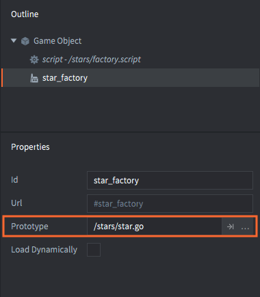
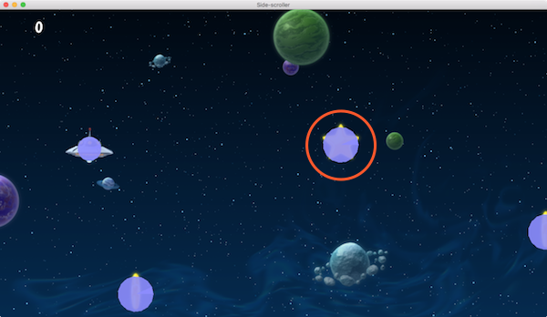

# Компонент Factory

Компонент Factory используется для динамического порождения игровых объектов из пула объектов в запущенной игре.

При добавлении фабрики к игровому объекту в свойстве *Prototype* указывается, какой файл игрового объекта должна использовать фабрика в качестве прототипа для всех новых создаваемых ею игровых объектов.




Чтобы инициировать создание игрового объекта, вызовите `factory.create()`:

```lua
-- factory.script
local p = go.get_position()
p.y = vmath.lerp(math.random(), min_y, max_y)
local component = "#star_factory"
factory.create(component, p)
```


`factory.create()` принимает 5 параметров:

`url`
: Идентификатор фабрики, которая должна породить новый игровой объект.

`[position]`
: (Опционально) Мировая позиция нового игрового объекта. Это должен быть `vector3`. Если позицию не указать, игровой объект будет порожден в позиции фабрики.

`[rotation]`
: (optional) Мировое значение вращения нового игрового объекта. Это должно быть `quat`.

`[properties]`
: (Опционально) Lua-таблица с любыми значениями свойств скрипта для инициирования игрового объекта. За подробностями обращайтесь к [руководству по свойствам скрипта](/manuals/script-properties).

`[scale]`
: (Опционально) Масштаб порожденного игрового объекта. Масштаб может быть выражен в виде `number` (больше 0), задающего равномерное масштабирование по всем осям. Кроме того, можно указать `vector3`, где каждый компонент задает масштабирование по соответствующей оси.

Например:

```lua
-- factory.script
local p = go.get_position()
p.y = vmath.lerp(math.random(), min_y, max_y)
local component = "#star_factory"
-- Порождение без вращения, но с двукратным масштабом.
-- Установите стоимость звезды в 10.
factory.create(component, p, nil, { score = 10 }, 2.0) -- <1>
```
1. Устанавливает свойство "score" игрового объекта-звезды.

```lua
-- star.script
go.property("score", 1) -- <1>

local speed = -240

function update(self, dt)
    local p = go.get_position()
    p.x = p.x + speed * dt
    if p.x < -32 then
        go.delete()
    end
    go.set_position(p)
end

function on_message(self, message_id, message, sender)
    if message_id == hash("collision_response") then
        msg.post("main#gui", "add_score", {amount = self.score}) -- <2>
        go.delete()
    end
end
```
1. Свойства скрипта "score" определено со значением по умолчанию.
2. Ссылается на свойство скрипта "score" как на значение, хранящееся в "self".



::: sidenote
В настоящее время Defold не поддерживает неравномерное масштабирование форм столкновений. Если задать неравномерное значение масштаба, например, `vmath.vector3(1.0, 2.0, 1.0)`, спрайт будет масштабироваться правильно, но формы столкновений --- нет.
:::


## Адресация объектов, созданных фабрикой

Механизм адресации Defold позволяет получить доступ к каждому объекту и компоненту в запущенной игре. В [руководстве по адрессации](/manuals/addressing/) подробно описано, как работает эта система. Можно использовать тот же механизм адресации для порожденных игровых объектов и их компонентов. Зачастую достаточно использовать идентификатор порожденного объекта, например, при отправке сообщения:

```lua
local function create_hunter(target_id)
    local id = factory.create("#hunterfactory")
    msg.post(id, "hunt", { target = target_id })
    return id
end
```

::: sidenote
Передача сообщения самому игровому объекту вместо конкретного компонента фактически отправит сообщение всем компонентам. Обычно это не является проблемой, но об этом следует помнить, если объект имеет много компонентов.
:::

Но что, если необходимо получить доступ к определенному компоненту в порожденном игровом объекте, например, чтобы отключить объект столкновения или изменить изображение спрайта? Решение заключается в построении URL из идентификатора игрового объекта и идентификатора компонента.

```lua
local function create_guard(unarmed)
    local id = factory.create("#guardfactory")
    if unarmed then
        local weapon_sprite_url = msg.url(nil, id, "weapon")
        msg.post(weapon_sprite_url, "disable")

        local body_sprite_url = msg.url(nil, id, "body")
        sprite.play_flipbook(body_sprite_url, hash("red_guard"))
    end
end
```


## Отслеживание порожденных и родительских объектов

При вызове `factory.create()` возвращается id нового игрового объекта, что позволяет сохранить его для дальнейшего использования. Одно из распространенных применений --- порождать объекты и добавлять их идентификаторы в таблицу, чтобы потом удалить их все, например, при сбросе компоновки уровня:

```lua
-- spawner.script
self.spawned_coins = {}

...

-- Spawn a coin and store it in the "coins" table.
local id = factory.create("#coinfactory", coin_position)
table.insert(self.spawned_coins, id)
```

А затем:

```lua
-- coin.script
-- Удалить все порожденные монеты.
for _, coin_id in ipairs(self.spawned_coins) do
    go.delete(coin_id)
end

-- или, как вариант
go.delete(self.spawned_coins)
```

Также часто бывает необходимо, чтобы порожденный объект знал об объекте, породившем его. В качестве примера можно привести какой-нибудь автономный объект, который может быть порожден только по одному за раз. Тогда порожденный объект должен сообщить породителю, когда он будет удален или деактивирован, чтобы можно было породить другой:

```lua
-- spawner.script
-- Spawn a drone and set its parent to the url of this script component
self.spawned_drone = factory.create("#dronefactory", drone_position, nil, { parent = msg.url() })

...

function on_message(self, message_id, message, sender)
    if message_id == hash("drone_dead") then
        self.spawed_drone = nil
    end
end
```

Логика порожденного объекта:

```lua
-- drone.script
go.property("parent", msg.url())

...

function final(self)
    -- I'm dead.
    msg.post(self.parent, "drone_dead")
end
```

## Динамическая загрузка ресурсов фабрики

Отметив в свойствах фабрики *Load Dynamically*, движок откладывает загрузку ресурсов, связанных с фабрикой.


Если эта опция не отмечена, движок загружает ресурсы прототипа при загрузке компонента Factory, чтобы они были сразу готовы к порождению.

Если опция отмечена, есть два варианта использования:

Синхронная загрузка
: Вызовите [`factory.create()`](/ref/factory/#factory.create), когда нужно породить объекты. При этом ресурсы будут загружены синхронно, что может вызвать заминку, а затем будут порождены новые экземпляры.

  ```lua
  function init(self)
      -- No factory resources are loaded when the factory’s parent
      -- collection is loaded. Calling create without having called
      -- load will create the resources synchronously.
      self.go_id = factory.create("#factory")
  end

  function final(self)
      -- Delete game objects. Will decref resources.
      -- In this case resources are deleted since the factory component
      -- holds no reference.
      go.delete(self.go_id)

      -- Calling unload will do nothing since factory holds no references
      factory.unload("#factory")
  end
  ```

Асинхронная загрузка
: Вызовите [`factory.load()`](/ref/factory/#factory.load) для явной асинхронной загрузки ресурсов. Когда ресурсы будут готовы к порождению, будет получен обратный вызов.

  ```lua
  function load_complete(self, url, result)
      -- Loading is complete, resources are ready to spawn
      self.go_id = factory.create(url)
  end

  function init(self)
      -- No factory resources are loaded when the factory’s parent
      -- collection is loaded. Calling load will load the resources.
      factory.load("#factory", load_complete)
  end

  function final(self)
      -- Delete game object. Will decref resources.
      -- In this case resources aren’t deleted since the factory component
      -- still holds a reference.
      go.delete(self.go_id)

      -- Calling unload will decref resources held by the factory component,
      -- resulting in resources being destroyed.
      factory.unload("#factory")
  end
  ```

## Динамический прототип

Можно изменить, какой *Prototype* может создавать фабрика, установив флажок *Dynamic Prototype* в свойствах компонента фабрики.


При установленной опции *Dynamic Prototype* можно изменить прототип с помощью функции `factory.set_prototype()`. Пример:

```lua
factory.unload("#factory") -- выгружаем предыдущие ресурсы
factory.set_prototype("#factory", "/main/levels/enemyA.goc")
local enemy_id = factory.create("#factory")
```

::: important
При включённой опции *Dynamic Prototype* количество компонентов коллекции не может быть оптимизировано, и родительская коллекция будет использовать значения по умолчанию из файла *game.project*.
:::


## Ограничения инстанцирования

Настройка проекта *Max Instances* в разделе *настроек, связанных с коллекциями* ограничивает общее количество экземпляров игровых объектов, которые могут существовать в игровом пространстве (main.collection, загружаемая при запуске, или любое пространство, загруженное через прокси-коллекцию). Все игровые объекты, существующие в пространстве, подсчитываются с учетом этого ограничения, и не имеет значения, размещены ли они вручную в редакторе или порождены во время выполнения скрипта.


Так, если значение *Max Instances* равно 1024 и в основной коллекции имеется 24 вручную размещенных игровых объекта, можно породить еще 1000 игровых объектов. Как только игровой объект удаляется, можно породить еще один экземпляр.

## Объединение игровых объектов в пул

Может показаться хорошей идеей сохранять порожденные игровые объекты в пуле и использовать их повторно. Однако движок уже выполняет объединение объектов в пул под капотом, поэтому дополнительные операции лишь замедлят работу. Быстрее и чище удалять игровые объекты и порождать новые.
