# Defold для пользователей Flash

Это руководство представляет Defold как альтернативу для разработчиков игр на Flash. В нем рассматриваются некоторые ключевые концепции разработки игр во Flash и объясняются соответствующие инструменты и методы в Defold.

## Введение

Одними из ключевых преимуществ Flash были доступность и низкий порог входа. Новые пользователи могли быстро освоить программу и создавать базовые игры с небольшими затратами времени. Defold предлагает схожее преимущество, предоставляя набор инструментов, ориентированных на разработку игр, и при этом давая продвинутым разработчикам возможность создавать более сложные решения для более изощренных задач, например за счет редактирования стандартного render script.

Игры на Flash программируются на ActionScript (при этом 3.0 является наиболее новой версией), тогда как скриптинг в Defold выполняется на Lua. В этом руководстве не будет подробного сравнения Lua и ActionScript 3.0. [Руководство Defold](/manuals/lua) дает хорошее введение в программирование на Lua в Defold и ссылается на чрезвычайно полезную книгу [Programming in Lua](https://www.lua.org/pil/) (первое издание), которая бесплатно доступна онлайн.

Статья Джесси Уордена содержит [базовое сравнение Actionscript и Lua](http://jessewarden.com/2011/01/lua-for-actionscript-developers.html), которое может стать хорошей отправной точкой. Однако следует помнить, что различия между тем, как устроены Defold и Flash, глубже, чем видно на уровне языка. Actionscript и Flash в классическом смысле объектно-ориентированы, с классами и наследованием. В Defold нет классов и наследования. Вместо этого в нем есть понятие *игрового объекта*, который может содержать аудиовизуальное представление, поведение и данные. Операции над игровыми объектами выполняются с помощью *функций*, доступных в API Defold. Кроме того, Defold поощряет использование *сообщений* для общения между объектами. Сообщения являются конструкцией более высокого уровня, чем вызовы методов, и не предназначены для использования в качестве их прямой замены. Эти различия важны, и к ним нужно привыкнуть, но они не будут подробно рассматриваться в данном руководстве.

Вместо этого руководство исследует некоторые ключевые концепции разработки игр во Flash и показывает наиболее близкие эквиваленты в Defold. Обсуждаются сходства, различия и распространенные подводные камни, чтобы помочь вам быстро перейти от Flash к Defold.

## Movie clips и game objects

Movie clips являются ключевым компонентом разработки игр во Flash. Это символы, каждый из которых содержит собственную уникальную timeline. Наиболее близкий эквивалент этой концепции в Defold — игровой объект.


В отличие от movie clips во Flash, игровые объекты Defold не имеют timeline. Вместо этого игровой объект состоит из нескольких компонентов. Компоненты включают sprites, sounds и scripts — среди многих других (подробнее о доступных компонентах см. в [документации по building blocks](/manuals/building-blocks) и связанных статьях). Игровой объект на скриншоте ниже состоит из sprite и script. Компонент script используется для управления поведением и внешним видом игровых объектов на протяжении всего жизненного цикла объекта:


Хотя movie clips могут содержать другие movie clips, игровые объекты не могут *содержать* другие игровые объекты. Однако игровые объекты можно делать *дочерними* по отношению к другим игровым объектам, создавая иерархии, которые можно перемещать, масштабировать или вращать совместно.

## Flash — ручное создание movie clips

Во Flash экземпляры movie clips можно вручную добавлять на сцену, перетаскивая их из библиотеки на timeline. Это показано на скриншоте ниже, где каждый логотип Flash является экземпляром movieclip "logo":

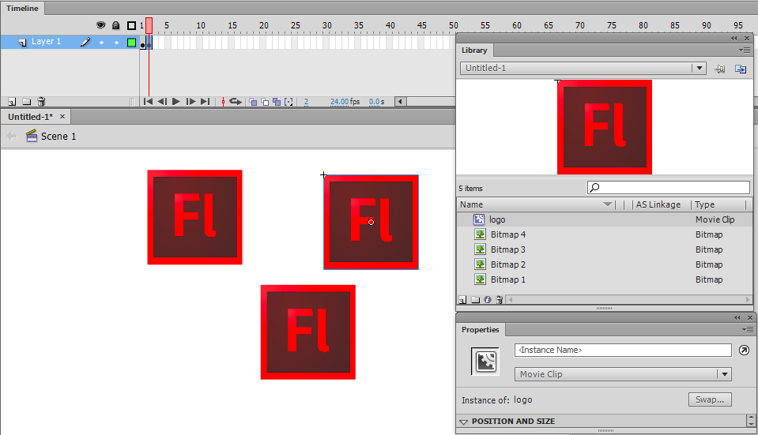

## Defold — ручное создание game objects

Как уже упоминалось ранее, в Defold нет концепции timeline. Вместо этого игровые объекты организуются в collections. Collections — это контейнеры (или prefabs), содержащие игровые объекты и другие collections. На самом базовом уровне игра может состоять всего из одной collection. Чаще Defold-игры используют несколько collections, которые либо вручную добавляются в bootstrap-collection "main", либо динамически загружаются через [collection proxies](/manuals/collection-proxy). Эта концепция загрузки "уровней" или "экранов" не имеет прямого эквивалента во Flash.

В примере ниже collection "main" содержит три экземпляра (перечислены справа, в окне *Outline*) игрового объекта "logo" (виден слева, в окне *Assets* browser):


## Flash — ссылки на вручную созданные movie clips

Обращение к вручную созданным movie clips во Flash требует использования вручную заданного имени экземпляра:


## Defold — id игрового объекта

В Defold ко всем игровым объектам и компонентам обращаются через адрес. В большинстве случаев достаточно простого имени или shorthand. Например:

- `"."` адресует текущий игровой объект.
- `"#"` адресует текущий компонент (script).
- `"logo"` адресует игровой объект с id `"logo"`.
- `"#script"` адресует компонент с id `"script"` в текущем игровом объекте.
- `"logo#script"` адресует компонент с id `"script"` в игровом объекте с id `"logo"`.

Адрес вручную размещенных игровых объектов определяется свойством *Id* (см. нижний правый угол скриншота). Id должен быть уникальным в пределах текущего collection file, с которым вы работаете. Редактор автоматически задает id, но вы можете изменить его для каждого создаваемого экземпляра игрового объекта.

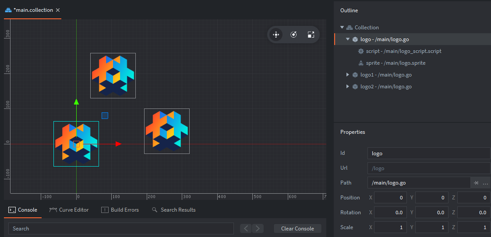

::: sidenote
Вы можете узнать id игрового объекта, выполнив следующий код в его script component: `print(go.get_id())`. Это выведет id текущего игрового объекта в консоль.
:::

Модель адресации и передача сообщений — ключевые концепции разработки в Defold. [Руководство по addressing](/manuals/addressing) и [руководство по message passing](/manuals/message-passing) объясняют их очень подробно.

## Flash — динамическое создание movie clips

Чтобы динамически создавать movie clips во Flash, сначала необходимо настроить ActionScript Linkage:


Это создает класс (в данном случае Logo), который затем позволяет создавать новые экземпляры этого класса. Добавление экземпляра класса Logo на Stage могло бы выглядеть так:

```as
var logo:Logo = new Logo();
addChild(logo);
```

## Defold — создание game objects с помощью factories

В Defold динамическое создание игровых объектов достигается с помощью *factories*. Factories — это компоненты, используемые для порождения копий определенного игрового объекта. В данном примере создана factory, у которой игровой объект "logo" используется как prototype:


Важно отметить, что factories, как и все компоненты, должны быть добавлены к игровому объекту, прежде чем их можно будет использовать. В данном примере мы создали игровой объект с именем "factories", чтобы хранить в нем factory component:


Функция, вызываемая для создания экземпляра игрового объекта logo:

```lua
local logo_id = factory.create("factories#logo_factory")
```

URL является обязательным параметром для `factory.create()`. Кроме того, можно передать необязательные параметры для задания позиции, вращения, свойств и масштаба. Подробнее о factory component см. в [руководстве по factory](/manuals/factory). Стоит отметить, что вызов `factory.create()` возвращает id созданного игрового объекта. Этот id можно сохранить для последующего использования в таблице (что в Lua является эквивалентом массива).

## Flash — stage

Во Flash мы привыкли к Timeline (верхняя часть скриншота ниже) и Stage (видима под Timeline):


Как обсуждалось выше в разделе о movie clips, Stage по сути является верхнеуровневым контейнером игры во Flash и создается каждый раз при экспорте проекта. По умолчанию Stage будет иметь одного дочернего элемента — *`MainTimeline`*. Каждый movie clip, созданный в проекте, будет иметь собственную timeline и может служить контейнером для других symbols (включая movie clips).

## Defold — collections

Эквивалентом Flash Stage в Defold является collection. Когда движок запускается, он создает новый игровой мир на основе содержимого collection file. По умолчанию этот файл называется "main.collection", но вы можете изменить collection, загружаемую при старте, открыв файл настроек *game.project*, который находится в корне каждого проекта Defold:


Collections — это контейнеры, используемые в редакторе для организации игровых объектов и других collections. Содержимое collection также может быть порождено в рантайме с помощью [collection factory](/manuals/collection-factory/#spawning-a-collection), который работает так же, как обычная factory игровых объектов. Это полезно, например, для порождения групп врагов или шаблона монет для сбора. На скриншоте ниже мы вручную разместили два экземпляра collection "logos" в collection "main".


В некоторых случаях вам нужно загрузить полностью новый игровой мир. Компонент [collection proxy](/manuals/collection-proxy/) позволяет создать новый игровой мир на основе содержимого collection file. Это полезно в сценариях вроде загрузки новых уровней, мини-игр или катсцен.

## Flash — timeline

Flash timeline в первую очередь используется для анимации различными покадровыми техниками или shape/motion tweens. Общая настройка FPS (frames per second) проекта определяет время показа каждого кадра. Продвинутые пользователи могут изменять общий FPS игры или даже FPS отдельных movie clips.

Shape tweens позволяют интерполировать векторную графику между двумя состояниями. В основном это полезно только для простых форм и задач, что демонстрирует пример shape tweening квадрата в треугольник ниже:

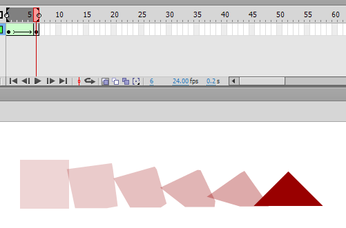

Motion tweens позволяют анимировать различные свойства объекта, включая размер, позицию и вращение. В примере ниже были изменены все перечисленные свойства.

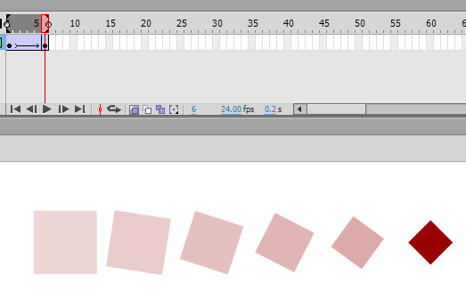

## Defold — property animation

Defold работает с пиксельными изображениями, а не с векторной графикой, поэтому у него нет эквивалента для shape tweening. Однако motion tweening имеет мощный эквивалент в виде [property animation](/ref/go/#go.animate). Это делается через script с помощью функции `go.animate()`. Функция go.animate() tween-анимирует свойство (например, цвет, масштаб, вращение или позицию) от начального значения к желаемому конечному, используя одну из множества доступных easing functions (включая пользовательские). Там, где во Flash требовалось самостоятельно реализовывать более сложные easing functions, Defold включает [множество easing functions](/manuals/animation/#easing), встроенных в движок.

Там, где Flash использует keyframes графики на timeline для анимации, одним из основных методов графической анимации в Defold является flipbook animation импортированных последовательностей изображений. Анимации организуются в компоненте игрового объекта, называемом atlas. В данном случае у нас есть atlas для персонажа игры с последовательностью анимации под названием run. Она состоит из набора png-файлов:

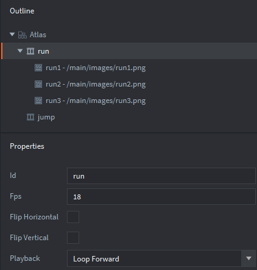

## Flash — depth index

Во Flash display list определяет, что отображается и в каком порядке. Порядок объектов в контейнере (например, Stage) задается индексом. Объекты, добавленные в контейнер с помощью метода `addChild()`, автоматически занимают верхнюю позицию в индексе, начиная с 0 и увеличиваясь с каждым новым объектом. На скриншоте ниже мы создали три экземпляра movie clip "logo":


Позиции в display list показаны цифрами рядом с каждым экземпляром logo. Если не учитывать код для обработки x/y-позиции movie clips, приведенный выше результат можно было бы получить так:

```as
var logo1:Logo = new Logo();
var logo2:Logo = new Logo();
var logo3:Logo = new Logo();

addChild(logo1);
addChild(logo2);
addChild(logo3);
```

Будет ли объект отображаться поверх другого объекта или под ним, определяется их относительными позициями в индексе display list. Это хорошо видно при обмене индексами двух объектов, например:

```as
swapChildren(logo2,logo3);
```

Результат будет выглядеть так, как показано ниже (с обновленным положением в индексе):

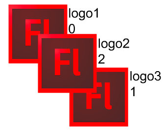

## Defold — z position

Позиции игровых объектов в Defold представлены векторами, состоящими из трех переменных: x, y и z. Положение z определяет глубину игрового объекта. В стандартном [render script](/manuals/render) доступные значения z находятся в диапазоне от -1 до 1.

::: sidenote
Игровые объекты с z-позицией вне диапазона от -1 до 1 не будут отрисованы и, следовательно, не будут видны. Это распространенный подводный камень для разработчиков, только начинающих работать с Defold, и об этом стоит помнить, если игровой объект не виден, когда вы ожидаете обратного.
:::

В отличие от Flash, где редактор только подразумевает индексацию по глубине (и позволяет изменять ее командами вроде *Bring Forward* и *Send Backward*), Defold позволяет задавать z-позицию объектов напрямую в редакторе. На скриншоте ниже видно, что "logo3" отображается сверху и имеет z-позицию 0.2. Остальные игровые объекты имеют z-позиции 0.0 и 0.1.


Обратите внимание, что z-позиция игрового объекта, вложенного в одну или несколько collections, определяется его собственной z-позицией вместе с позициями всех его родителей. Например, представьте, что показанные выше игровые объекты logo были помещены в collection "logos", которая, в свою очередь, была помещена в "main" (см. скриншот ниже). Если бы collection "logos" имела z-позицию 0.9, z-позиции содержащихся в ней игровых объектов были бы 0.9, 1.0 и 1.1. Следовательно, "logo3" не был бы отрисован, так как его z-позиция больше 1.

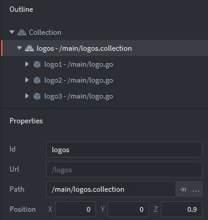

Разумеется, z-позицию игрового объекта можно изменить и через script. Предположим, следующий код находится в script component игрового объекта:

```lua
local pos = go.get_position()
pos.z  = 0.5
go.set_position(pos)
```

## Flash `hitTestObject` и `hitTestPoint` для обнаружения столкновений

Базовое обнаружение столкновений во Flash достигается с помощью метода `hitTestObject()`. В этом примере у нас есть два movie clip: "bullet" и "bullseye". Они показаны на скриншоте ниже. Синяя рамка становится видимой при выборе symbols в редакторе Flash, и именно эти рамки определяют результат метода `hitTestObject()`.


Проверка столкновения с помощью `hitTestObject()` выполняется так:

```as
bullet.hitTestObject(bullseye);
```

Использование рамок в данном случае не подходит, так как попадание будет зарегистрировано даже в такой ситуации:

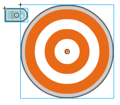

Альтернативой `hitTestObject()` является метод `hitTestPoint()`. У него есть параметр `shapeFlag`, который позволяет выполнять hit test по фактическим пикселям объекта, а не по его bounding box. Проверка столкновения с помощью `hitTestPoint()` могла бы выглядеть так:

```as
bullseye.hitTestPoint(bullet.x, bullet.y, true);
```

Эта строка проверила бы координаты x и y пули (в данном случае верхний левый угол) относительно формы цели. Поскольку `hitTestPoint()` проверяет точку против формы, важно продумать, какую точку (или точки!) проверять.

## Defold — collision objects

Defold включает physics engine, который может обнаруживать столкновения и позволять script реагировать на них. Обнаружение столкновений в Defold начинается с назначения collision object components игровым объектам. На скриншоте ниже мы добавили collision object к игровому объекту "bullet". Collision object обозначен красной полупрозрачной рамкой (видимой только в редакторе):

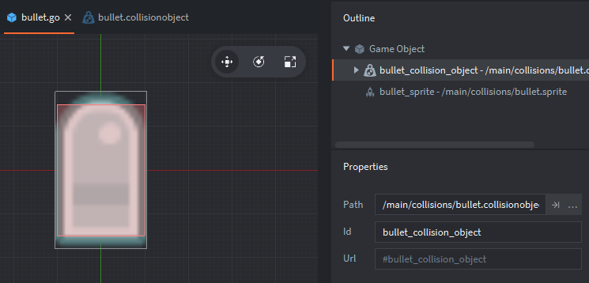

Defold включает модифицированную версию physics engine Box2D, которая может автоматически моделировать реалистичные столкновения. Это руководство предполагает использование kinematic collision objects, так как они наиболее близки к обнаружению столкновений во Flash. Подробнее о dynamic collision objects читайте в [руководстве по physics](/manuals/physics).

Collision object включает следующие свойства:

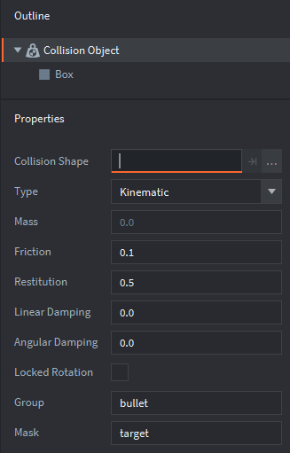

Была использована box shape, так как она лучше всего подходила для графики пули. Другая shape, используемая для 2D-столкновений, sphere, будет использована для цели. Установка типа в Kinematic означает, что разрешение столкновений выполняется вашим script, а не встроенным physics engine (подробнее о других типах см. [руководство по physics](/manuals/physics)). Свойства group и mask определяют, к какой collision group относится объект и с какой collision group его следует проверять соответственно. Текущая настройка означает, что "bullet" может сталкиваться только с "target". Представим, что настройка была изменена следующим образом:

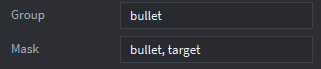

Теперь пули могут сталкиваться с целями и с другими пулями. Для справки, мы настроили collision object для цели следующим образом:


Обратите внимание, что свойство *Group* установлено в "target", а *Mask* — в "bullet".

Во Flash обнаружение столкновений происходит только при явном вызове из script. В Defold обнаружение столкновений происходит непрерывно в фоновом режиме, пока collision object остается включенным. Когда происходит столкновение, сообщения отправляются всем компонентам игрового объекта (в особенности script components). Это сообщения [collision_response and contact_point_response](/manuals/physics-messages), которые содержат всю информацию, необходимую для разрешения столкновения нужным образом.

Преимущество обнаружения столкновений в Defold в том, что оно более продвинутое, чем во Flash, и позволяет обнаруживать столкновения между относительно сложными формами с очень небольшими затратами на настройку. Обнаружение столкновений автоматическое, то есть не требуется проходить циклом по различным объектам из разных collision groups и явно выполнять hit tests. Основной недостаток заключается в отсутствии эквивалента Flash `shapeFlag`. Однако для большинства задач достаточно комбинаций базовых box и sphere shapes. Для более сложных случаев [возможны пользовательские формы](//forum.defold.com/t/does-defold-support-only-three-shapes-for-collision-solved/1985).

## Flash — обработка событий

Объекты событий и связанные с ними listeners используются для обнаружения различных событий (например, mouse clicks, нажатий кнопок, загрузки clips) и запуска действий в ответ. Существует множество событий, с которыми можно работать.

## Defold — callback-functions и messaging

Эквивалент системы обработки событий Flash в Defold состоит из нескольких аспектов. Во-первых, каждый script component имеет набор callback-functions, которые обнаруживают определенные события. Это:

init
:   Вызывается при инициализации script component. Эквивалент constructor function во Flash.

final
:   Вызывается при уничтожении script component (например, когда созданный game object удаляется).

update
:   Вызывается каждый кадр. Эквивалент `enterFrame` во Flash.

on_message
:   Вызывается, когда script component получает сообщение.

on_input
:   Вызывается, когда пользовательский ввод (например, мышь или клавиатура) отправляется игровому объекту с [input focus](/ref/go/#acquire_input_focus), то есть объект получает весь ввод и может на него реагировать.

on_reload
:   Вызывается при перезагрузке script component.

Все перечисленные выше callback-functions являются необязательными и могут быть удалены, если не используются. Подробности по настройке ввода см. в [руководстве по input](/manuals/input). Распространенный подводный камень возникает при работе с collection proxies — подробнее см. [этот раздел](/manuals/input/#input-dispatch-and-on_input) руководства по input.

Как обсуждалось в разделе об обнаружении столкновений, события столкновений обрабатываются посредством отправки сообщений игровым объектам, участвующим в столкновении. Их соответствующие script components получают сообщение в своих callback-functions on_message.

## Flash — symbols типа button

Flash использует отдельный тип symbols для кнопок. Buttons используют специальные event handler methods (например, `click` и `buttonDown`) для выполнения действий при обнаружении взаимодействия пользователя. Графическая форма кнопки в секции "Hit" button symbol определяет область попадания кнопки.

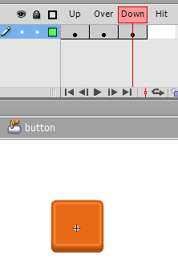

## Defold — GUI scenes и scripts

Defold не включает встроенный button component, и клики нельзя так же просто определять по форме конкретного game object, как это делается с buttons во Flash. Наиболее распространенное решение — использование [GUI](/manuals/gui) component, отчасти потому, что позиции GUI-компонентов Defold не зависят от внутриигровой камеры (если она используется). GUI API также содержит функции для определения того, находится ли пользовательский ввод, например клики и touch events, внутри границ GUI-элемента.

## Отладка

Во Flash команда `trace()` — ваш лучший друг при отладке. Эквивалент в Defold — `print()`, и используется он так же, как `trace()`:

```lua
print("Hello world!"")
```

С помощью одной функции `print()` можно вывести несколько переменных:

```lua
print(score, health, ammo)
```

Также существует функция `pprint()` (pretty print), полезная при работе с таблицами. Эта функция печатает содержимое таблиц, включая вложенные таблицы. Рассмотрим script ниже:

```lua
factions = {"red", "green", "blue"}
world = {name = "Terra", teams = factions}
pprint(world)
```

Здесь есть таблица (`factions`), вложенная в таблицу (`world`). Использование обычной команды `print()` выведет уникальный id таблицы, но не ее содержимое:

```
DEBUG:SCRIPT: table: 0x7ff95de63ce0
```

Использование `pprint()`, как показано выше, дает более осмысленный результат:

```
DEBUG:SCRIPT:
{
  name = Terra,
  teams = {
    1 = red,
    2 = green,
    3 = blue,
  }
}
```

Если в вашей игре используется обнаружение столкновений, вы можете включать и выключать physics debugging, отправляя сообщение ниже:

```lua
msg.post("@system:", "toggle_physics_debug")
```

Physics debug также можно включить в настройках проекта. До включения physics debug наш проект выглядел бы так:


Включение physics debug отображает collision objects, добавленные к нашим игровым объектам:


Когда происходят столкновения, соответствующие collision objects подсвечиваются. Кроме того, отображается вектор столкновения:

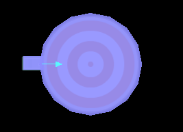

Наконец, см. [документацию по profiler](/ref/profiler/) для информации о мониторинге использования CPU и памяти. Дополнительную информацию о продвинутых техниках отладки см. в [разделе debugging](/manuals/debugging) руководства Defold.

## Куда двигаться дальше

- [Defold examples](/examples)
- [Tutorials](/tutorials)
- [Manuals](/manuals)
- [Reference](/ref/go)
- [FAQ](/faq/faq)

Если у вас есть вопросы или вы застряли, [форумы Defold](//forum.defold.com) — отличное место, чтобы обратиться за помощью.
