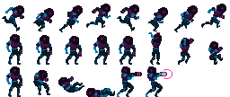

# Мультикадровая анимация

Мультикадровая анимация состоит из серии неподвижных изображений, которые отображаются одно за другим. Данная техника весьма схожа с традиционной рисованной мультипликацией (см. [Рисованная_мультипликация](https://ru.wikipedia.org/wiki/Рисованная_мультипликация)). Эта техника предлагает безграничные возможности, поскольку каждым кадром можно управлять отдельно. Однако, так как каждый кадр хранится в отдельном изображении, расходование памяти может быть ощутимым. Плавность анимации также зависит от числа изображений в секунду, но увеличение числа изображений, как правило, увеличивает и объем работы. Мультикадровая анимация в Defold хранится либо как отдельные изображения, добавленные в [атлас](/manuals/atlas) либо как [тайловый источник](/manuals/tilesource) в виде кадров, выстроенных в горизонтальную последовательность.

  {.inline}
  {.inline}

## Воспроизведение мультикадровой анимации

Спрайты и GUI-ноды Box могут отображать мультикадровую анимацию, при этом можно достаточно гибко управлять ими напрямую во время выполнения игры.

Спрайты
: Чтобы запустить анимацию во время выполнения игры используйте функцию [`sprite.play_flipbook()`](/ref/sprite/?q=play_flipbook#sprite.play_flipbook:url-id-[complete_function]-[play_properties]). См. пример ниже.

GUI-ноды Box
: Чтобы запустить анимацию во время выполнения игры используйте функцию [`gui.play_flipbook()`](/ref/gui/?q=play_flipbook#gui.play_flipbook:node-animation-[complete_function]-[play_properties]). См. пример ниже.

::: sidenote
Режим воспроизведения Once Ping Pong проиграет анимацию до последнего кадра, затем в обратном порядке до **второго** кадра анимации, а не до первого. Это сделано, чтобы облегчить процесс склеивания цепочек анимаций.
:::

### Примеры со спрайтами

Предположим, что в вашей игре есть механика "уклониться", которая позволяет игроку уклоняться по нажатию специальной кнопки. Для визуального отклика такой механики, реализуются 4 анимации:

"idle"
: Зацикленная анимация игрового персонажа в состоянии покоя.

"dodge_idle"
: Зацикленная анимация игрового персонажа в состоянии покоя, находясь в позиции уклонения.

"start_dodge"
: Однократная анимация-переход, переводящая игрового персонажа из обычной стойки в уклонение.

"stop_dodge"
: Однократная анимация-переход, переводящая игрового персонажа из уклонения в обычную стойку.

Следующий скрипт реализует такую логику:

```lua

local function play_idle_animation(self)
    if self.dodge then
        sprite.play_flipbook("#sprite", hash("dodge_idle"))
    else
        sprite.play_flipbook("#sprite", hash("idle"))
    end
end

function on_input(self, action_id, action)
    -- "dodge" - это наше приходящее на вход действие
    if action_id == hash("dodge") then
        if action.pressed then
            sprite.play_flipbook("#sprite", hash("start_dodge"), play_idle_animation)
            -- запоминаем, что мы уклоняемся
            self.dodge = true
        elseif action.released then
            sprite.play_flipbook("#sprite", hash("stop_dodge"), play_idle_animation)
            -- больше не уклоняемся
            self.dodge = false
        end
    end
end
```

### Примеры с GUI-нодами Box

Выбирая анимацию или изображение для ноды, вы фактически назначаете источник изображения (атлас или тайловый источник) и анимацию по-умолчанию. Источник изображения статически устанавливается для ноды, но текущая анимация для проигрывания может быть изменена во время работы игры. Обычные изображения трактуются движком как однокадровые анимации, так что, изменение изображения во время работы игры является эквивалентом мультикадровой анимации для ноды:

```lua
function init(self)
    local character_node = gui.get_node("character")
    -- Требуется, чтобы нода имела анимацию по-умолчанию из того же атласа
    -- или источника тайлов что и новая анимация/изображение, которые мы проигрываем. 
    gui.play_flipbook(character_node, "jump_left")
end
```


## Завершающие функции обратного вызова

Функции `sprite.play_flipbook()` и `gui.play_flipbook()` поддерживают опциональные функции обратного вызова в качестве последнего переданного аргумента. Такие переданные функции будут вызваны когда анимация проиграется до конца. Функции никогда не будут вызваны для зацикленных анимаций. Функция обратного вызова может быть использована для активации других событий по завершению анимации или для склеивания нескольких анимаций в одну цепочку. Примеры:

```lua
local function flipbook_done(self)
    msg.post("#", "jump_completed")
end

function init(self)
    sprite.play_flipbook("#character", "jump_left", flipbook_done)
end
```

```lua
local function flipbook_done(self)
    msg.post("#", "jump_completed")
end

function init(self)
    gui.play_flipbook(gui.get_node("character"), "jump_left", flipbook_done)
end
```
