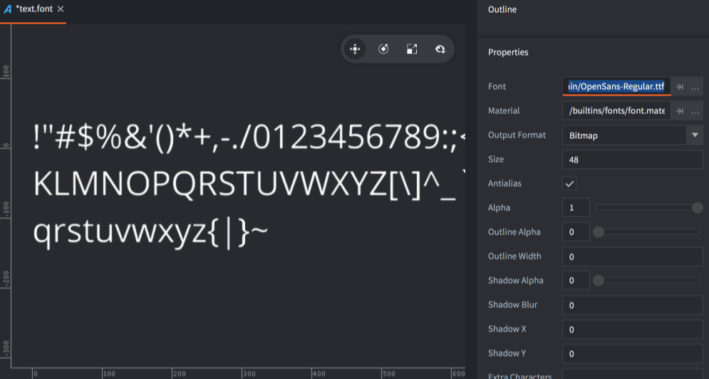
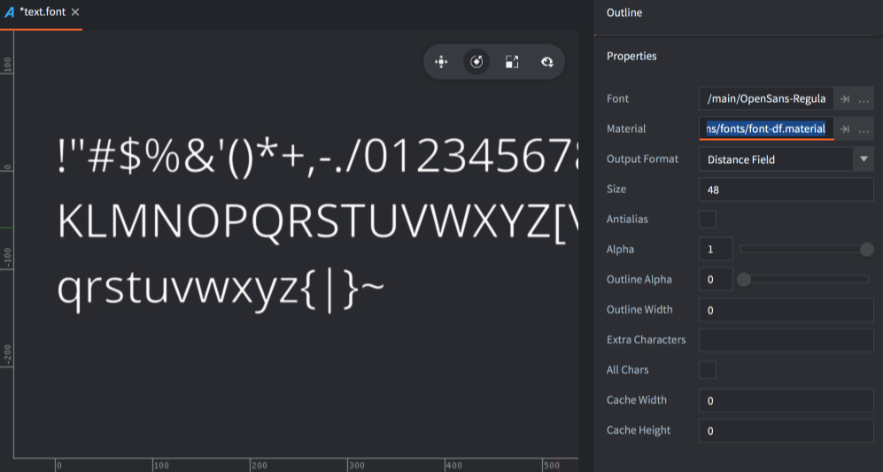
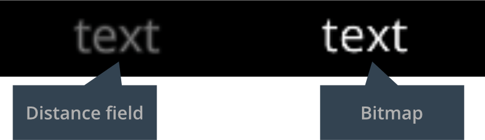

# Ресурс Font

Шрифты используются для визуализации текста в компонентах Label и GUI-нодах Text. Defold поддерживает несколько форматов файлов шрифтов:

- TrueType
- OpenType
- BMFont

Шрифты, добавленные в проект, автоматически конвертируются в текстуру, которую Defold может визуализировать. Доступны два метода визуализации шрифтов, каждый из которых имеет свои преимущества и недостатки:

- Bitmap
- Distance field

## Создание шрифта

Чтобы создать шрифт для использования в Defold, создайте новый файл Font, выбрав в меню <kbd>File ▸ New...</kbd>, затем <kbd>Font</kbd>. Можно также <kbd>кликнуть ПКМ</kbd> в нужном расположении в браузере ассетов и выбрать <kbd>New... ▸ Font</kbd>.


Присвойте новому файлу шрифта имя и кликните <kbd>Ok</kbd>. Новый файл шрифта откроется в редакторе.



Перетащите необходимый шрифт в браузер *Assets* в подходящее для него расположение.

В свойстве *Font* укажите файл шрифта и, при необходимости, настройте остальные свойства.

## Свойства

*Font*
: Файл TTF, OTF или *.fnt*, используемый для генерирования данных о шрифте.

*Material*
: Материал, используемый при рендеринге этого шрифта. Обязательно измените этот параметр в соответствии с выбранным типом шрифта --- Distance Field или Bitmap (подробнее см. ниже).

*Output Format*
: Тип генерируемых данных о шрифте.

  - `TYPE_BITMAP` --- конвертирует импортированный файл OTF или TTF в текстуру, представляющую собой изображение шрифта, растровые данные которой используются для визуализации текстовых нод. Цветовые каналы используются для кодирования формы граней, контура и отбрасываемой тени. Для файлов *.fnt* исходная растровая текстура используется как есть.
  - `TYPE_DISTANCE_FIELD` --- импортированный шрифт конвертируется в текстуру, данные о пикселях которой представляют не экранные пиксели, а расстояния до границы шрифта. Подробности см. ниже.

*Render Mode*
: Режим рендеринга глифов.

  - `MODE_SINGLE_LAYER` --- создает по одному четырехугольнику для каждого символа.
  - `MODE_MULTI_LAYER` --- создает отдельные четырехугольные формы для глифа, контура и теней соответственно. Слои отображаются в обратном порядке (back-to-front), что исключает вероятность загораживания одного символа другим, ранее отображенным, в случае когда контур шире, чем расстояние между глифами. Этот режим рендеринга также обеспечивает правильное смещение теней, задаваемое свойствами Shadow X/Y в ресурсе шрифта.

*Size*
: Целевой размер глифов в пикселях.

*Antialias*
: Сглаживание шрифта при запекании в целевое растровое изображение. Установите значение 0, если хотите получить чисто пиксельный (pixel perfect) рендеринг шрифта.

*Alpha*
: Прозрачность глифа. 0.0--1.0, где 0.0 означает прозрачность, а 1.0 --- непрозрачность.

*Outline Alpha*
: Прозрачность сгенерированного контура. 0.0--1.0.

*Outline Width*
: Ширина сгенерированного контура в пикселях. Установите значение 0 чтобы убрать контур.

*Shadow Alpha*
: Прозрачность сгенерированной тени. 0.0--1.0.

::: sidenote
Поддержка теней обеспечивается встроенными шейдерами материала шрифта и работает как в однослойном, так и в многослойном режиме рендеринга. Если многослойный рендеринг шрифта или поддержка теней не нужны, лучше использовать более простой шейдер, такой как *`builtins/font-singlelayer.fp`*.
:::

*Shadow Blur*
: Для растровых шрифтов эта настройка указывает на то, сколько раз небольшое зерно размытия будет применено к каждому глифу шрифта. Для шрифтов типа Distance Field эта настройка эквивалентна фактической ширине размытия в пикселях.

*Shadow X/Y*
: Горизонтальное и вертикальное смещение сгенерированной тени в пикселях. Этот параметр влияет на тень глифа, только если свойство Render Mode установлено в значение `MODE_MULTI_LAYER`.

*Characters*
: Какие символы включать в шрифт. По умолчанию это поле содержит печатные ASCII символы (коды символов 32–126). Вы можете добавить или удалить символы из этого поля, чтобы включить больше или меньше символов в шрифт.

::: sidenote
Печатные ASCII символы:
space ! " # $ % & ' ( ) * + , - . / 0 1 2 3 4 5 6 7 8 9 : ; < = > ? @ A B C D E F G H I J K L M N O P Q R S T U V W X Y Z [ \ ] ^ _ \` a b c d e f g h i j k l m n o p q r s t u v w x y z { | } ~
:::

*All Chars*
: Если отметить это свойство, все глифы, имеющиеся в исходном файле, будут включены в вывод.

*Cache Width/Height*
: Ограничивает размер кэша растра глифов. Когда движок рендерит текст, он ищет глиф в кэше растра. Если его там нет, он будет добавлен в кэш перед рендерингом. Если кэш растра слишком мал, чтобы вместить все глифы, которые движок пытается отрендерить, возникает ошибка (`ERROR:RENDER: Out of available cache cells! Consider increasing cache_width or cache_height for the font.`).

  При значении 0 размер кэша устанавливается автоматически.

## Шрифты Distance Field

Шрифты Distance Field (карта расстояний) вместо растровых данных хранят расстояние до границы глифа в текстуре. Когда движок рендерит шрифт, требуется специальный шейдер, чтобы интерпретировать данные о расстоянии и использовать их для отрисовки глифа. Шрифты Distance Field более ресурсоемки, чем растровые, но обеспечивают большую гибкость в выборе размера.



Обязательно измените свойство *Material* шрифта на *builtins/fonts/font-df.material* (или любой другой материал, который может обрабатывать данные карты расстояния) при создании шрифта, иначе при выводе шрифта на экран будет использоваться неподходящий шейдер.

## Растровые шрифты BMFont

В дополнение к генерируемым растровым картам Defold поддерживает предварительно запеченные растровые шрифты формата "BMFont". Эти шрифты представляют собой PNG-изображение в виде страницы с глифами. Кроме того, файл *.fnt* содержит информацию о том, где на странице находится каждый глиф, а также информацию о размере и кернинге. (Следует учесть, что Defold не поддерживает XML-версию формата *.fnt*, который используется в Phaser и в некоторых других инструментах).

Эти типы шрифтов не обеспечивают повышения производительности по сравнению с растровыми шрифтами, генерируемыми из файлов TrueType или OpenType, но могут включать произвольную графику, расцветку и тени непосредственно в изображении.

Добавьте сгенерированные файлы *.fnt* и *.png* в проект Defold. Эти файлы должны находиться в одной папке. Создайте новый файл шрифта и задайте свойству Font файл типа *.fnt*. Убедитесь, что Output Format установлен в значение `TYPE_BITMAP`. Defold не будет генерировать растровое изображение, а будет использовать то, которое содержится в PNG.

::: sidenote
Для создания BMFont следует воспользоваться инструментом для генерирования соответствующих файлов. Существует несколько вариантов:

* [Bitmap Font Generator](http://www.angelcode.com/products/bmfont/) --- только для Windows, предоставляется AngelCode.
* [Shoebox](http://renderhjs.net/shoebox/) --- бесплатное приложение на базе Adobe Air для Windows и macOS.
* [Hiero](https://github.com/libgdx/libgdx/wiki/Hiero) --- инструмент с открытым исходным кодом на языке Java.
* [Glyph Designer](https://71squared.com/glyphdesigner) --- коммерческий инструмент для macOS от 71 Squared.
* [bmGlyph](https://www.bmglyph.com) --- коммерческий инструмент для macOS от Sovapps.
:::


Чтобы шрифт отображался корректно, не забудьте установить его свойство Material в *builtins/fonts/font-fnt.material*.

## Артефакты и рекомендации

Как правило, растровые шрифты лучше всего подходят для рендеринга без масштабирования. Они быстрее выводятся на экран, чем шрифты с картой расстояний.

Шрифты Distance Field очень хорошо реагируют на масштабирование. С другой стороны, растровые шрифты, будучи просто пиксельными изображениями, будут увеличиваться в размере, поэтому пиксели будут расти при масштабировании шрифта, что приведет к появлению блочных артефактов, то есть угловатости. Ниже приведен образец шрифта размером 48 пикселей, увеличенный в 4 раза.


При уменьшении масштаба растровые текстуры могут качественно и эффективно масштабироваться и сглаживаться средствами GPU. Растровый шрифт лучше сохраняет свой цвет, чем шрифт с картой расстояний. Вот масштаб того же образца шрифта размером 48 пикселей, уменьшенный до 1/5 размера:



Шрифты Distance Field должны быть отрендерены до целевого размера, достаточно большого для хранения информации о расстояниях и возможности описать кривые глифов шрифта. Это тот же шрифт, что и выше, но размером 18 пикселей и увеличенный в 10 раз. Разумеется, этого слишком мало для кодирования форм этого шрифта:


Если поддержка теней и контуров не требуется, установите соответствующие им значения альфа в 0. В противном случае данные о тенях и контурах все равно будут генерироваться, что приведет к излишнему потреблению памяти. Если вы не хотите использовать поддержку теней или контуров, установите соответствующие значения альфа в ноль. В противном случае данные о тенях и контурах всё равно будут генерироваться, занимая лишнюю память.

## Кэш шрифта
Ресурс шрифта в Defold приводит к появлению двух вещей во время выполнения: текстуры и данных шрифта.

* Данные о шрифте состоят из списка вхождений глифов, каждое из которых содержит некоторую базовую информацию о кернинге и растровые данные для этого глифа.
* Текстура --- это внутреннее название "кэша текстуры глифа", используемого при рендеринге текста для определенного шрифта.

Во время выполнения, при рендеринге текста, движок сначала обходит глифы подлежащие рендерингу, чтобы проверить, какие глифы доступны в кэше текстур. Для каждого глифа, отсутствующего в кэше текстур глифов, будет произведена загрузка текстуры из растровых данных, хранящихся в данных шрифта.

Каждый глиф размещается внутри кэша в соответствии с базовой линией шрифта, что позволяет шейдеру вычислять локальные текстурные координаты глифа в соответствующей ячейке кэша. Это означает, что вы можете добиться определенных текстовых эффектов, таких как градиенты или наложение текстуры, динамически. Движок передает показатели кэша шейдеру через специальную шейдерную константу `texture_size_recip`, которая содержит следующую информацию как векторные компоненты:

* `texture_size_recip.x` --- обратная ширина кэша
* `texture_size_recip.y` --- обратная высота кэша
* `texture_size_recip.z` --- отношение ширины ячейки кэша к ширине кэша
* `texture_size_recip.w` --- отношение высоты ячейки кэша к высоте кэша

Например, чтобы сгенерировать градиент в фрагментном шейдере, достаточно написать:

`float horizontal_gradient = fract(var_texcoord0.y / texture_size_recip.w);`

Подробнее об унифицированных шейдерных переменных см. В [руководстве по шейдерам](/manuals/shader).

## Генерация во время выполнения

Возможно использовать генерацию шрифтов типа SDF (Distance Field) во время выполнения при использовании шрифтов TrueType (.ttf).  
Этот подход позволяет значительно уменьшить размер загрузки и потребление памяти во время выполнения в игре на Defold.  
Небольшой недостаток — небольшая задержка при генерации каждого глифа во время выполнения.

Активируйте эту возможность, установив параметр `font.runtime_generation` в файле game.project.

::: sidenote
Эта функция на данный момент является экспериментальной, но планируется использовать её в качестве основного рабочего процесса в будущем.
:::

::: important
Этот параметр влияет на все .ttf шрифты в проекте.
:::

### Предварительная генерация кэша глифов

Чтобы упростить использование шрифтов, генерируемых во время выполнения, поддерживается предварительная генерация кэша глифов.  
Это означает, что шрифт сгенерирует глифы, указанные в поле *Characters* ресурса шрифта.

::: sidenote
Если установлено свойство `All Chars`, предварительная генерация не будет выполняться, так как это противоречит цели — не генерировать все глифы сразу.
:::

### Скриптование шрифтов

Для шрифтов, генерируемых во время выполнения, можно добавлять и удалять подшрифты.  
Это полезно, если один большой шрифт был разделён на несколько файлов по наборам символов (например, для CJK).

::: important
Добавление подшрифта не приводит к автоматической загрузке или отображению всех глифов.
:::

```lua
-- Добавить диапазон A-Z в .fontc
local font_hash = hash("/assets/fonts/roboto.fontc")
local ttf_hash = hash("/assets/fonts/Roboto/Roboto-Bold.ttf")
local codepoint_min = 0x00000041 -- A
local codepoint_max = 0x0000005A -- Z
font.add_source(font_hash, ttf_hash, codepoint_min, codepoint_max)
```

```lua
-- Удалить связанный ttf-ресурс
local font_hash = hash("/assets/fonts/roboto.fontc")
local ttf_hash = hash("/assets/fonts/Roboto/Roboto-Bold.ttf")
font.remove_source(font_hash, ttf_hash)
```

Чтобы загрузить глифы в шрифт, необходимо вызвать `font.add_glyphs()`.
Это асинхронная операция, и после её завершения можно безопасно отображать сообщения, содержащие эти глифы.

```lua
local function add_glyph_callback(self, id, result, errmsg)
  if not result then
    print("Запрос " .. id .. " завершился с ошибкой:", errmsg)
  else
    msg.post(some_url, "show_dialog")
  end
end

-- Загрузить глифы в шрифт
local font_hash = hash("/assets/fonts/roboto.fontc")
local glyphs = "Some text to be shown!" -- для наилучшей производительности используйте список уникальных глифов
local request_id = font.add_glyphs(font_hash, ttf_hash, add_glyph_callback)
```

И, когда символы больше не нужны, можно освободить память:
```lua
-- Удалить глифы из памяти
local font_hash = hash("/assets/fonts/roboto.fontc")
font.remove_glyphs(font_hash, "Все символы из набора")
```

