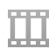
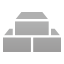
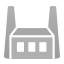
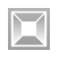
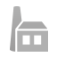
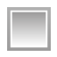
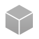
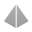
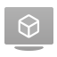
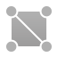

# Глоссарий Defold

В этом глоссарии дается краткое описание всех элементов и понятий, с которыми сталкиваются пользователи Defold. В большинстве случаев будет дана ссылка на более подробную документацию.

## Набор анимации (Animation Set)

{.left} Набор анимации --- это ресурс, содержащий список ``.dae``-файлов или других ``.animationset``-файлов, из которых можно считывать анимацию. Вложение одного ``.animationset``-файла в другой удобно при использовании частичных наборов анимации совместно между несколькими моделями. За подробностями обращайтесь к [Анимация 3D-моделей](/manuals/model-animation/).

## Атлас (Atlas)

{.left} Атлас --- это ресурс, представляющий собой набор отдельных изображений, которые по причинам производительности и эффективности использования памяти формируются на одном большом холсте. Может содержать неподвижные изображения или мултикадровую анимацию. В качестве общих графических ресурсов атласы используются компонентами GUI, спрайтами, Spine-моделями и частицами. За подробностями обращайтесь к [руководству по атласам](/manuals/atlas).

## Встроенные ресурсы (папка ``builtins``)

{.left} Проектная папка ``builtins`` --- это папка с атрибутом "только для чтения", содержащая полезные ресурсы, доступные по умолчанию. Здесь можно найти стандартный рендер, рендер-скрипт, материалы и многое другое. Если требуются пользовательские изменения в любом из этих ресурсов, просто скопируйте их в свой проект и отредактируйте на свое усмотрение.

## Камера (Camera)

{.left} Камера --- это компонент, помогающий определить, какая часть игрового пространства должна быть видимой и как она должна быть спроецирована. Обычно используется для прикрепления камеры к объекту игрового персонажа или для создания отдельного игрового объекта с камерой, который следует за игроком с каким-либо алгоритмом стабилизации движения. За подробностями обращайтесь к [руководству по камерам](/manuals/camera).

## Объект столкновения (Collision Object)

{.left} Объекты столкновения --- это компоненты, расширяющие игровые объекты физическими свойствами (такими как пространственная форма, вес, трение и реституция). Эти свойства определяют, как объект столкновения должен сталкиваться с другими объектами столкновения. Наиболее распространенными типами объектов столкновения являются кинематические объекты, динамические объекты и триггеры. Кинематический объект предоставляет подробную информацию о столкновении, на которое необходимо ответить вручную. Динамический объект автоматически моделируется физическим движком, подчиняясь ньютоновским законам физики. Триггеры --- это простые формы, которые определяют, вошли ли другие формы в триггер или вышли из него. За подробностями обращайтесь к [руководству по физике](/manuals/physics).

## Компоненты

Компоненты используются для придания игровым объектам определенной выразительности и/или функциональности, таких как графика, анимация, программируемое поведение и звук. Они не существуют сами по себе, они должны содержаться внутри игровых объектов. В Defold существует множество доступных компонентов, описание которых см. в [руководстве по структурным элементам](/manuals/building-blocks).

## Коллекция (Collection)

{.left} Коллекция --- это механизм Defold для создания шаблонов (что в других движках называется "префабами"), в которых иерархии игровых объектов могут быть использованы повторно. Коллекции --- это древовидные структуры, в которых хранятся игровые объекты и другие коллекции. Коллекция всегда хранится в файле и вносится в игру либо статически, вручную средствами редактора, либо динамически, посредством порождения. Описание коллекций см. в  [руководстве по структурным элементам](/manuals/building-blocks).

## Фабрика коллекций (Collection Factory)

{.left} Фабрика коллекций используется для динамического порождения иерархий игровых объектов в запущенной игре. За подробностями обращайтесь к [руководству по фабрикам коллекций](/manuals/collection-factory).

## Прокси-коллекция (Collection Proxy)

{.left} Прокси-коллекция --- это компонент, используемый для загрузки и включения коллекций на лету во время работы приложения или игры. Наиболее распространенным вариантом использования прокси-коллекции является загрузка уровней по мере их воспроизведения. За подробностями обращайтесь к [руководству по прокси-коллекциям](/manuals/collection-proxy).

## Кубическая карта (Cubemap)

{.left} Кубическая карта --- это ресурс, представляющий собой особый тип текстуры, состоящий из 6 отдельных частей, отображаемых по аналогии со сторонами куба. Часто используется при рендеринге скайбоксов и различных видов карт отражения и освещения.

## Отладка (Debugging)

В какой-то момент ваша игра будет вести себя непредсказуемо, и придется выяснять, в чем заключается проблема. Научиться отлаживать --- это искусство, и, к счастью, Defold поставляется со встроенным отладчиком, который поможет вам в этом. За подробностями обращайтесь к [руководству по отладке](/manuals/debugging).

## Профили отображения (Display Profiles)

{.left} Профили отображения --- это ресурс, используемый для определения компоновки графического интерфейса в зависимости от ориентации, соотношения сторон или модели устройства. Он помогает адаптировать пользовательский интерфейс для любого типа устройств. За подробностями обращайтесь к [руководству по компоновкам](/manuals/gui-layouts).

## Фабрика (Factory)

{.left} В некоторых ситуациях не удастся вручную разместить все необходимые игровые объекты в коллекции, и придется создавать игровые объекты динамически, на лету. Например, игрок может стрелять пулями, и каждый выстрел должен быть динамически порожден и отправлен при нажатии игроком на спусковой механизм. Для динамического создания игровых объектов (из предварительно распределенного пула объектов) используется компонент Factory. За подробностями обращайтесь к [руководству по фабрикам](/manuals/factory).

## Шрифт (Font)

{.left} Шрифт --- это ресурс, который создается из файла шрифтов TrueType или OpenType. Шрифт определяет, какой размер и какой тип оформления (контур и тень) должен быть у визуализируемого шрифта. Шрифт используется компонентами GUI и Label. За подробностями обращайтесь к [руководству по файлам шрифтов](/manuals/font/).

## Фрагментный шейдер (Fragment Program)

{.left} Это программа, которая запускается на графическом процессоре для каждого пикселя (фрагмента) в полигоне, при отрисовке его на экране. Целью фрагментного шейдера является определение цвета каждого полученного фрагмента. Это делается путем вычисления, выборки текстур (по одной или несколько) или комбинации выборки и вычислений. За подробностями обращайтесь к [руководству по шейдерам](/manuals/shader).

## Геймпады (Gamepads)

{.left} Геймпады --- это файл ресурса, определяющий, как конкретный ввод устройства геймпада соотносится с триггерами ввода геймпада на определенной платформе. За подробностями обращайтесь к [руководству по вводу](/manuals/input).

## Игровой объект (Game Object)

{.left} Игровые объекты --- это простые объекты, которые имеют свою отдельную продолжительность жизни во время выполнения игры. Игровые объекты --- это контейнеры, которые обычно оснащены визуальными или звуковыми компонентами, такими как звук или спрайт. Они также могут быть оснащены поведением через компоненты Script. Игровые объекты создаются и помещаются в коллекции средствами редактора, либо динамически порождаются во время выполнения приложения посредством фабрик. Описание игровых объектов см. в [руководстве по блокам построения](/manuals/building-blocks).

## Графический пользовательский интерфейс (GUI)

{.left} GUI --- это компонент, содержащий элементы, используемые для построения пользовательских интерфейсов: текстовые и закрашенные и/или текстурированные блоки. Элементы могут быть организованы в иерархические структуры, заскриптованы и анимированны. Компоненты GUI обычно используются для создания HUD, систем меню и экранных уведомлений. Управляются с помощью GUI-скриптов, которые определяют поведение графического интерфейса и контролируют взаимодействие с пользователем. За подробностями обращайтесь к [руководству по GUI](/manuals/gui).

## GUI-скрипт (GUI Script)

{.left} Для управления поведением компонентов графического интерфейса используются GUI-скрипты. Они управляют анимацией GUI и взаимодействием пользователя с GUI-элементами. Подробнее о том, как скрипты Lua используются в Defold, см. в [руководстве Lua в Defold](/manuals/lua).

## Горячая перезагрузка (Hot Reload)

Редактор Defold позволяет обновлять контент в уже запущенной игре на рабочем столе и устройстве. Такая возможность является чрезвычайно мощной и может повысить эффективность процесса разработки. За подробностями обращайтесь к [руководству по горячей перезагрузке ресурсов](/manuals/hot-reload).

## Привязка ввода (Input Binding)

{.left} Файлы привязки ввода определяют, как игра должна интерпретировать аппаратный ввод (мышь, клавиатура, сенсорный экран и геймпад). Файл связывает аппаратный ввод с вводом _действий_ высокого уровня вида "jump" и "move_forward". В скриптовых компонентах, которые прослушивают ввод, можно написать сценарий действий, которые игра или приложение должны принять с учетом определенного ввода. За подробностями обращайтесь к [руководству по вводу](/manuals/input).

## Текстовая метка (Label)

{.left} Текстовая метка --- это компонент, позволяющий прикрепить текстовое содержимое к любому игровому объекту. Он отображает фрагмент текста с определенным шрифтом на экране в пространстве игры. За подробностями обращайтесь к [руководству по меткам](/manuals/label).

## Библиотека

{.left} Defold позволяет обмениваться данными между проектами с помощью мощного механизма библиотек. Это может использоваться для настройки общих библиотек, которые доступны из всех ваших проектов, как для себя, так и для всей команды. За подробностями о механизме работы библиотек обращайтесь к [руководству по библиотекам](/manuals/libraries).

## Язык Lua

Язык программирования Lua используется в Defold для создания логики игры. Lua --- это мощный, эффективный и компактный скриптовый язык. Он поддерживает процедурное, объектно-ориентированное, функциональное программирование, программирование на основе данных и описание данных. Подробнее о языке можно прочитать на официальной домашней странице Lua по адресу https://www.lua.org/ и в [руководстве Lua в Defold](/manuals/lua).

## Lua-модуль

{.left} Lua-модули позволяют структурировать проект и создавать библиотечный код многоразового использования. За подробностями обращайтесь к [руководству по Lua-модулям](/manuals/modules/).

## Материал (Material)

{.left} Материалы определяют, как должны быть визуализированы различные объекты посредством определения шейдеров и их свойств. За подробностями обращайтесь к [руководству по материалам](/manuals/material).

## Сообщение

Компоненты общаются друг с другом и с другими системами посредством передачи сообщений. Компоненты также реагируют на набор предопределенных сообщений, которые влияют на них или вызывают определенные действия. Сообщения отправляются, например, с целью скрыть графику или подтолкнуть физические объекты. Движок также использует сообщения для уведомления компонентов о событиях, например, при столкновении физических форм. Механизму передачи сообщений необходим получатель для каждого отправленного сообщения. Поэтому все в игре адресовано уникально. Чтобы обеспечить связь между объектами, Defold расширяет Lua возможностью передачи сообщений. Defold также предоставляет библиотеку полезных функций.

Например, Lua-код, необходимый для того, чтобы скрыть компонент спрайта в игровом объекте, выглядит следующим образом:

```lua
msg.post("#weapon", "disable")
```

Здесь `"#weapon"` --- это адрес компонента спрайта текущего объекта. `"disable"` --- это сообщение, на которое реагируют компоненты спрайта. См. [руководство по передачи сообщений](/manuals/message-passing) чтобы подробнее узнать как это работает.

## Модель (Model)

{.left} С помощью компонента 3D-модели можно импортировать в игру Collada-сетку, скелет и анимационные ассеты. За подробностями обращайтесь к [руководству по моделям](/manuals/model/).

## Эффект частиц (ParticleFX)

{.left} Частицы очень полезны для создания приятных визуальных эффектов, особенно в играх. Вы можете использовать их для создания тумана, дыма, огня, дождя или падающих листьев. Defold содержит мощный редактор эффектов частиц, позволяющий создавать и корректировать эффекты во время выполнения игра. Подробнее о том, как это работает см. в [руководстве по эффектам частиц](/manuals/particlefx).

## Профилирование

Хорошая производительность является ключевым фактором в играх, и очень важно, чтобы была возможность выполнять профилирование производительности и памяти, с целью оценки игры и определения узких мест в производительности и проблем с памятью, подлежащих устранению. Подробнее об инструментах профилирования, доступных в Defold, см. в [руководстве по профилированию](/manuals/profiling).

## Рендер (Render)

{.left} Файлы ``.render`` содержат настройки, используемые при рендеринге игры на экран. Файлы ``.render`` определяют, какой рендер-скрипт и какие материалы использовать для рендеринга. За подробностями обращайтесь к [руководству по рендеру](/manuals/render/).

## Рендер-скрипт (Render Script)

{.left} Рендер-скрипт --- это Lua-скрипт, который управляет выводом игры или приложения на экран. Существует рендер-скрипт по умолчанию, который охватывает большинство распространенных случаев, но также можно написать свой собственный, если требуются пользовательские модели освещения и других эффектов. За подробностями о процессе рендеринга обращайтесь к [руководству по рендеру](/manuals/render/), о том, как Lua-скрипты используются в Defold --- к [руководству Lua в Defold](/manuals/lua).

## Скрипт (Script)

{.left} Скрипт --- это компонент, который содержит программу, определяющую поведение игрового объекта. С помощью скриптов можно указать правила игры, реакцию объекта на различные взаимодействия (как с игроком, так и с другими объектами). Все сценарии написаны на языке программирования Lua. Чтобы иметь возможность работать с Defold, вы или кто-то из вашей команды должны научиться программировать на Lua. Для обзора Lua и подробностей о том, как Lua-скрипты используются в Defold обращайтесь к [руководству Lua в Defold](/manuals/lua).

## Звук (Sound)

{.left} Звук --- это компонент, отвечающий за воспроизведение определенного звука. В настоящее время Defold поддерживает звуковые файлы в форматах WAV и Ogg Vorbis. За подробностями обращайтесь к [руководству по звукам](/manuals/sound).

## Spine-модель (Spine Model)

{.left} Spine-модель --- это компонент, используемый для оживления скелетной Spine-анимации в Defold. За информацией о том, как его использовать, обращайтесь к [руководству по Spine-моделям](/manuals/spinemodel).

## Spine-сцена (Spine Scene)

{.left} Spine-сцена --- это ресурс, связывающий файл данных Spine JSON и файл атласа изображения Defold, используемого для заполнения графикой слотов костей. [Руководство по Spine-анимации](/manuals/spine) содержит более подробную информацию.

## Спрайт (Sprite)

{.left} Спрайт --- это компонент, расширяющий игровые объекты графикой. Он отображает изображение либо из тайлового источника, либо из атласа. Спрайты имеют встроенную поддержку мултикадровой и скелетной анимации. Обычно используются для персонажей и предметов.

## Текстурные профили (Texture Profiles)

{.left} Текстурные профили --- это ресурс, используемый в процессе пакетирования для автоматической обработки и сжатия данных изображения (в атласах, тайловых источниках, кубических картах и автономных текстурах, используемых для моделей, GUI и т.д.). За подробностями обращайтесь к [руководству по текстурным профилям](/manuals/texture-profiles).

## Тайловая карта (Tile Map)

{.left} Тайловые карты --- это компоненты, отображающие изображения из тайловых источников на одной или нескольких перекрывающихся сетках. Они чаще всего используются для создания игровых сред: земли, стен, зданий и препятствий. Тайловая карта может отображать несколько слоев, выровненных друг над другом с заданным режимом смешивания. Это полезно, например, для нанесения листьев поверх травяных фоновых тайлов. Также можно динамически изменять отображаемое изображение в тайле. Это позволяет, например, разрушить мост и сделать его непроходимым, просто заменив один тайл на другой, изображающий разрушенный мост и содержащий соответствующую физическую форму. За подробностями обращайтесь к [руководству по тайловым картам](/manuals/tilemap).

## Тайловый источник (Tile Source)

{.left} Тайловый источник описывает текстуру, состоящую из нескольких уменьшенных изображений, каждое из которых имеет одинаковый размер. Можно определить мултикадровую анимацию из последовательности изображений в тайловом источнике. Тайловые источники также могут автоматически вычислять формы столкновений из данных изображений. Это очень полезно при создания плиточных уровней, с которыми могут сталкиваться и взаимодействовать объекты. Тайловые источники используются тайловыми картами (а также спрайтами и частицами) для совместного использования графических ресурсов. Стоит заметить, что атлас часто подходит лучше, чем тайловый источник. За подробностями обращайтесь к [руководству по тайловым источникам](/manuals/tilemap).

## Вертексный шейдер (Vertex Program или Vertex shader)

{.left} Вертексный шейдер вычисляет экранную геометрию примитивных полигональных форм компонента. Для любого типа визуального компонента, будь то спрайт, Spine-модель или модель, форма представлена набором позиций полигональных вершин. Вертексный шейдер обрабатывает каждую вершину (в мировом пространстве) и вычисляет результирующую координату, которую должна иметь каждая вершина примитива. За подробностями обращайтесь к [руководству по шейдерам](/manuals/shader).
