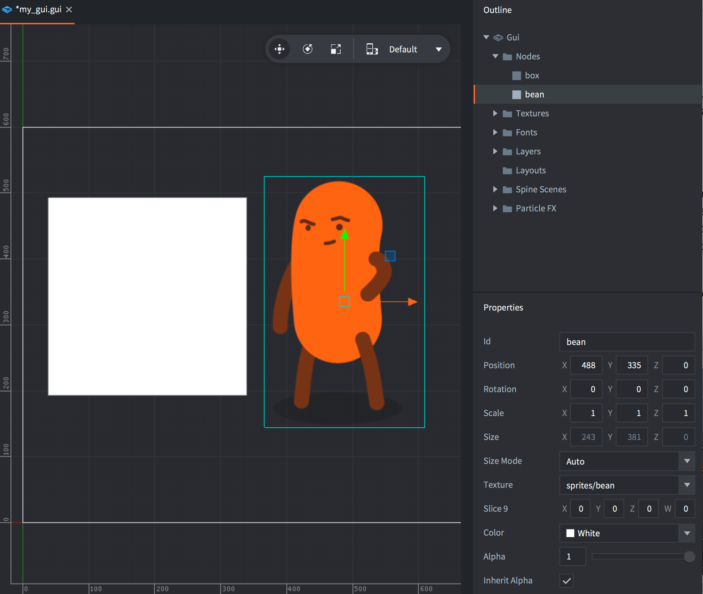

# GUI-нода Box

Нода Box --- это прямоугольник, заполненный цветом, текстурой или анимацией.

## Добавление ноды Box

Добавьте новую ноду Box, либо <kbd>кликнув ПКМ</kbd> в *Outline* и выбрав <kbd>Add ▸ Box</kbd>, либо нажав <kbd>A</kbd> и выбрав <kbd>Box</kbd>.

Можно использовать изображения и анимацию из атласов или тайловых источников, добавленных в GUI. Добавьте текстуры, <kbd>кликнув ПКМ</kbd> по иконке папки *Textures* в *Outline* и выбрав <kbd>Add ▸ Textures...</kbd>. Затем задайте свойство *Texture* для ноды Box:

Важно отметить, что ноды Box будет оттенять графику. Цвет оттенка умножается на данные изображения, то есть если установить белый цвет (по умолчанию), то оттенок применяться не будет.

Ноды Box всегда рендерятся, даже если им не назначена текстура, или их альфа установлена в `0`, или они имеют размер `0, 0, 0`. Ноды Box всегда должны иметь назначенную им текстуру, чтобы рендерер мог правильно их сортировать и уменьшить количество вызовов отрисовки.

## Воспроизведение анимации

Ноды Box могут воспроизводить анимацию из атласов или тайловых источников. За подробностями обращайтесь к [руководству по мультикадровой анимации](/manuals/flipbook-animation).

:[Slice-9](../shared/slice-9-texturing.md)