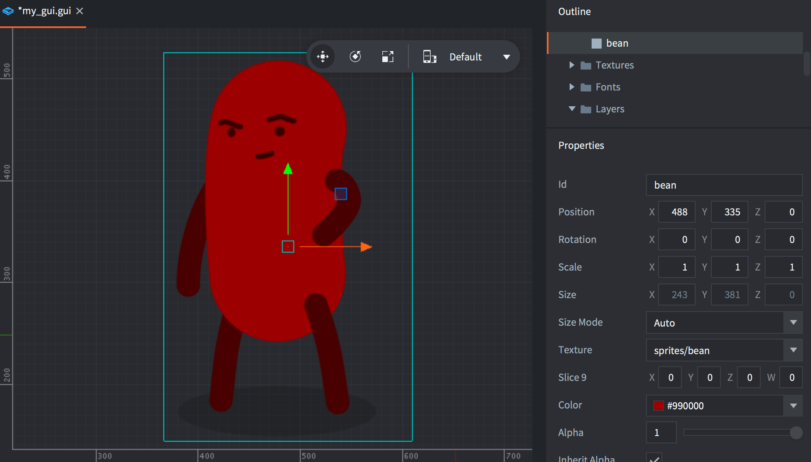
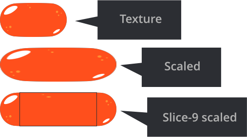
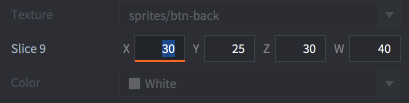
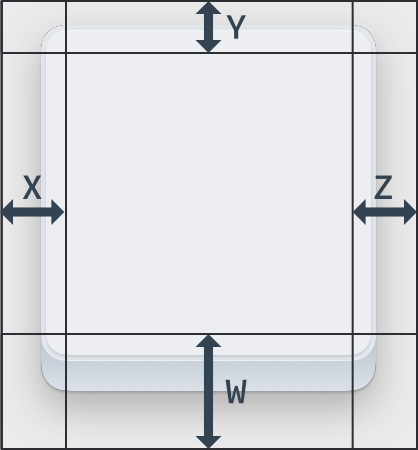
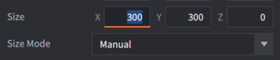
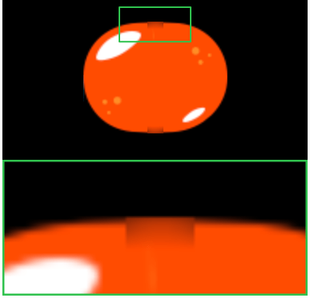

# GUI-нода Box

Нода Box --- это прямоугольник, заполненный цветом, текстурой или анимацией.

## Добавление ноды Box

Добавьте новую ноду Box, либо <kbd>кликнув ПКМ</kbd> в *Outline* и выбрав <kbd>Add ▸ Box</kbd>, либо нажав <kbd>A</kbd> и выбрав <kbd>Box</kbd>.

Можно использовать изображения и анимацию из атласов или тайловых источников, добавленных в GUI. Добавьте текстуры, <kbd>кликнув ПКМ</kbd> по иконке папки *Textures* в *Outline* и выбрав <kbd>Add ▸ Textures...</kbd>. Затем задайте свойство *Texture* для ноды Box:

{srcset="images/gui-box/create@2x.png 2x"}

Важно отметить, что ноды Box будет оттенять графику. Цвет оттенка умножается на данные изображения, то есть если установить белый цвет (по умолчанию), то оттенок применяться не будет.

{srcset="images/gui-box/tinted@2x.png 2x"}

Ноды Box всегда рендерятся, даже если им не назначена текстура, или их альфа установлена в `0`, или они имеют размер `0, 0, 0`. Ноды Box всегда должны иметь назначенную им текстуру, чтобы рендерер мог правильно их сортировать и уменьшить количество вызовов отрисовки.

## Воспроизведение анимации

Ноды Box могут воспроизводить анимацию из атласов или тайловых источников. За подробностями обращайтесь к [руководству по мультикадровой анимации](/manuals/flipbook-animation).

## Текстурирование Slice9

В графических интерфейсах часто встречаются элементы, чувствительные к контексту в отношении их размера: панели и диалоговые окна, размер которых необходимо изменять, чтобы вместить содержащееся в них содержимое. Это может вызвать визуальные проблемы, если применять текстурирование к изменяемой в размерах ноде.

Обычно движок масштабирует текстуру, чтобы она соответствовала границам ноды Box, но, определив краевые области Slice9, можно определить границы того, какие части текстуры должны масштабироваться:

{srcset="images/gui-box/scaling@2x.png 2x"}

Нода Box *Slice9* включает в себя 4 числа, которые определяют количество пикселей для левого, верхнего, правого и нижнего полей, которые не должны подвергаться регулярному масштабированию:

{srcset="images/gui-box/slice9_properties@2x.png 2x"}

Поля устанавливаются по часовой стрелке, начиная с левого края:

{srcset="images/gui-box/slice9@2x.png 2x"}

- Угловые сегменты никогда не масштабируются.
- Краевые сегменты масштабируются вдоль одной оси. Левый и правый краевые сегменты масштабируются по вертикали. Верхний и нижний краевые сегменты масштабируются по горизонтали.
- Центральная область текстуры масштабируется по горизонтали и вертикали по мере необходимости.

Описанное выше масштабирование текстуры *Slice9* применяется только при изменении размера ноды Box:

{srcset="images/gui-box/slice9_size@2x.png 2x"}

Если изменить параметр Scale ноды Box --- нода и текстура будут масштабироваться без применения параметров *Slice9*.

Из-за того, как работает мипмаппинг в рендере, при масштабировании сегментов текстуры иногда могут возникать артефакты. Это происходит при _масштабировании_ сегментов ниже исходного размера текстуры. Затем рендерер выбирает для сегмента мипмап с более низким разрешением, что приводит к появлению визуальных артефактов.

{srcset="images/gui-box/mipmap@2x.png 2x"}

Чтобы избежать этой проблемы, убедитесь, что сегменты текстуры, которые будут масштабироваться, достаточно малы, чтобы никогда не масштабироваться в меньшую сторону, а только в большую.
