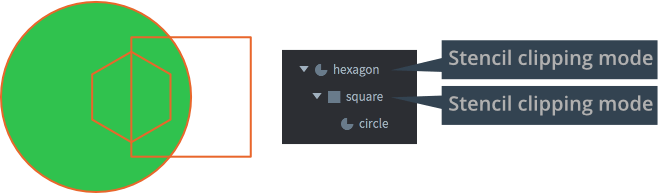
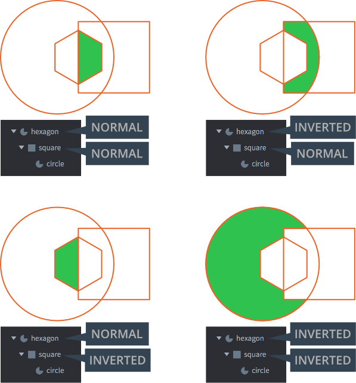

# GUI-клипирование

GUI-ноды могут использоваться с целью *клипирования* других нод, то есть в качестве масок, влияющих на отображение других нод. В этом руководстве объясняется, как работает эта возможность.

## Создание ноды клипирования

Ноды Box, Text и Pie могут быть использованы для клипирования. Чтобы создать ноду клипирования, добавьте ноду в GUI, а затем задайте ее свойства соответствующим образом:

Clipping Mode
: Режим, используемый для клипирования.
  - `None` --- рендерит ноду без какого-либо клипирования.
  - `Stencil` --- заставляет ноду вписаться в текущую трафаретную маску.

Clipping Visible
: Отметьте, чтобы рендерить содержимое ноды.

Clipping Inverted
: Отметьте, чтобы вписать инверсию формы ноды в маску.

Затем добавьте ноду(ы), которую нужно клипировать, в качестве дочерней к ноде клипирования.

## Трафаретная маска

Клипирование работает за счет того, что ноды записывают данные в *трафаретный буфер*. Этот буфер содержит маски клипирования: информацию, которая сообщает видеокарте, должен ли пиксель быть отрендерен или нет.

- Нода без родителя-клиппера, но с режимом клипирования, установленным в `Stencil`, запишет свою форму (или ее инверсную форму) в новую маску клипирования, хранящуюся в трафаретном буфере.
- Если у клипирующей ноды есть клипирующий родитель, то вместо этого она будет клипировать клипирующую маску родителя. Клипирующая дочерняя нода никогда не будет _расширять_ текущую маску клипирования, только клипировать ее дальш.
- Ноды без клипирования, которые являются дочерними для клипируемых нод, будут рендериться с маской клипирования, созданной родительской иерархией.

Здесь три ноды расположены в иерархической структуре:

- Шестигранная и квадратная формы --- это трафаретные ножницы.
- Шестиугольник создает новую маску клипирования, квадрат обрезает ее дальше.
- Нода окружности --- это обычная нода Pie, поэтому она будет отображаться с маской клипирования, созданной ее родительскими клипперами.

Для этой иерархии возможны четыре комбинации нормальных и инвертированных клиперов. Зеленая область отмечает часть окружности, которая рендерится. Остальная часть маскируется:

## Ограничения по использованию трафарета

- Общее количество трафаретных ножниц не может превышать 256.
- Максимальная глубина вложенности дочерних _трафаретных_ нод составляет 8 уровней. (Only nodes with stencil clipping count.)
- Максимальное число смежников ноды трафарета --- 127. Для каждого уровня иерархии трафаретов максимальное ограничение уменьшается вдвое.
- Инвертированные ноды имеют более высокую оценку. Существует ограничение на 8 инвертированных нод клипирования, и каждая из них уменьшает максимальное количество неинвертированных нод клипирования вдвое.
- Трафареты рендерят трафаретную маску из _геометрии_ ноды (не текстуры). Можно инвертировать маску, установив свойство *Inverted clipper*.

## Слои

Слои можно использовать для управления порядком рендеринга (и пакетирования) нод. При использовании слоев и нод клипирования обычный порядок наслоения отменяется. Порядок слоев всегда имеет приоритет над порядком клипирования — если назначения слоев сочетаются с нодами клипирования, клипирование может происходить вне порядка, если родительская нода с включённым клипированием принадлежит к более высокому слою, чем её дочерние. Дочерние ноды без назначенного слоя по-прежнему будут соблюдать иерархию и, соответственно, отрисовываться и клипироваться после родителя.

::: sidenote
Нода клипирования и её иерархия будут отрисованы первыми, если ей назначен слой, и в обычном порядке, если слой не назначен.
:::

В этом примере обе клипирующие ноды "`Donut BG`" и "`BG`" используют один и тот же слой 1. Порядок рендера между ними будет соответствовать порядку в иерархии, где "`Donut BG`" рендерится перед "`BG`". Однако дочерняя нода "`Donut Shadow`" назначена на слой 2, который имеет более высокий порядок, и поэтому будет отрисована после обеих клипирующих нод. В этом случае порядок рендера будет следующим:

- `Donut BG`
- `BG`
- `BG Frame`
- `Donut Shadow`

Здесь вы можете видеть, что объект "`Donut Shadow`" будет клипироваться обеими клипирующими нодами из-за наслоения, несмотря на то, что он является дочерним только одной из них.
