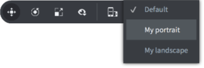
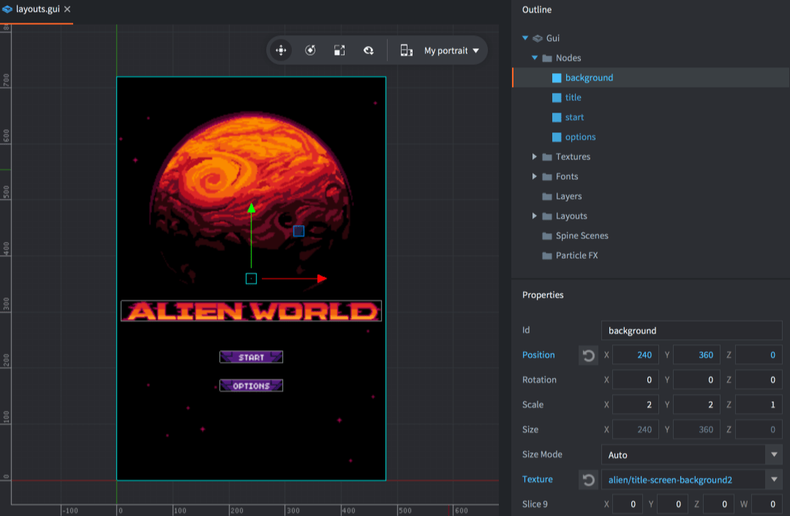

# GUI-компоновки

Defold поддерживает графические интерфейсы, которые автоматически адаптируются к изменениям ориентации экрана на мобильных устройствах. Используя эту возможность, можно создавать графические интерфейсы, которые адаптируются к ориентации и соотношению сторон экранов различных размеров. Также можно создавать компоновки, соответствующие определенным моделям устройств.

## Создание профилей отображения

По умолчанию в настройках *game.project* указано, что используется встроенный файл настроек профилей отображения ("builtins/render/default.display_profiles"). По умолчанию используются профили "Landscape" (ширина 1280 пикселей и высота 720 пикселей) и "Portrait" (ширина 720 пикселей и высота 1280 пикселей). Для профилей не задаются модели устройств, поэтому они будут соответствовать любому устройству.

Чтобы создать новый файл настроек профилей, либо скопируйте его из папки "builtins", либо <kbd>кликните ПКМ</kbd> подходящее место в представлении *Assets* и выберите <kbd>New... ▸ Display Profiles</kbd>. Дайте новому файлу подходящее имя и кликните <kbd>Ok</kbd>.

Редактор откроет новый файл для редактирования. Добавьте новые профили, кликнув <kbd>+</kbd> в списке *Profiles*. Для каждого профиля добавьте набор *квалификаторов*:

Width
: Ширина пикселя классификатора.

Height
: Высота пикселя классификатора.

Device Models
: Список моделей устройств, разделенных запятой. Модель устройства соответствует началу названия модели устройства, например, `iPhone10` будет соответствовать моделям "iPhone10,\*". Имена моделей с запятыми должны быть заключены в кавычки, то есть `"iPhone10,3", "iPhone10,6"` соответствует моделям iPhone X (см. https://www.theiphonewiki.com/wiki/Models). Следует отметить, что единственными платформами, сообщающими модель устройства при вызове `sys.get_sys_info()`, являются Android и iOS. Другие платформы возвращают пустую строку и, следовательно, никогда не выберут профиль дисплея, содержащий квалификатор модели устройства.


Кроме того, необходимо указать, что движок должен использовать новые профили. Откройте *game.project* и выберите файл профилей отображения в настройках *Display Profiles* в разделе *Display*:


Если вы хотите, чтобы движок автоматически переключался между книжной и альбомной раскладками при повороте устройства, установите флажок *Dynamic Orientation*. Движок будет динамически выбирать подходящую компоновку, а также менять ее при смене ориентации устройства.

## GUI-компоновки

Текущий набор профилей отображения может быть использован для создания вариантов компоновки конфигурации GUI-нод. Чтобы добавить новую компоновку в GUI-сцену, кликните ПКМ по иконке *Layouts* в представлении *Outline* и выберите <kbd>Add ▸ Layout ▸ ...</kbd>:


При редактировании GUI-сцены все ноды редактируются в определенной компоновке. Текущая выбранная компоновка указывается в выпадающем списке компоновок GUI-сцены на тулбаре. Если компоновка не выбрана, ноды редактируются в компоновке *Default*.





Каждое изменение свойства ноды, которое выполняется при выбранной компоновке, _переопределяет_ свойство по отношению к компоновке *Default*. Свойства, которые переопределяются, отмечены синим цветом. Ноды с переопределенными свойствами также отмечены синим цветом. Можно нажать на кнопку сброса рядом с любым переопределенным свойством, чтобы вернуть его к исходному значению.


Компоновка не может удалять или создавать новые ноды, она может только переопределять свойства. Если необходимо удалить ноду из компоновки, можно либо переместить ноду за пределы экрана, либо удалить ее с помощью логики скрипта. Также следует обратить внимание на текущую выбранную компоновку. Если добавлять компоновку в проект, то новая компоновка будет настроена в соответствии с текущей выбранной компоновкой. Также копирование и вставка нод учитывает текущую выбранную компоновку, при копировании *и* при вставке.

## Динамический выбор профиля

Динамический компоновщик оценивает каждый квалификатор профиля отображения в соответствии со следующими правилами:

1. Если набор моделей устройств отсутствует, или модель устройства совпадает, для квалификатора вычисляется оценка (S).

2. Оценка (S) рассчитывается с учетом площади дисплея (A), площади из квалификатора (A_Q), соотношения сторон дисплея (R) и соотношения сторон квалификатора (R_Q):


3. Выбирается профиль с квалификатором с наименьшей оценкой, если ориентация (альбомная или книжная) квалификатора соответствует дисплею.

4. Если профиль с квалификатором той же ориентации не найден, выбирается профиль с лучшим квалификатором другой ориентации.

5. Если ни один профиль не может быть выбран, используется запасной профиль *Default*.

Поскольку компоновка *Default* используется в качестве запасного варианта в runtime, если нет более подходящей компоновки, это означает, что если добавить компоновку "Landscape", она будет лучшей для *всех* ориентаций, пока также не будет добавлена компоновка "Portrait".

## Сообщения о смене компоновки

Когда движок переключает раскладку в результате поворота устройства, сообщение `layout_changed` отправляется в скрипты компонентов GUI, на которые влияет изменение. Сообщение содержит хэшированный идентификатор компоновки, чтобы скрипт мог выполнять логику в зависимости от того, какая компоновка выбрана:

```lua
function on_message(self, message_id, message, sender)
  if message_id == hash("layout_changed") and message.id == hash("My Landscape") then
    -- переключить компоновку на альбомную
  elseif message_id == hash("layout_changed") and message.id == hash("My Portrait") then
    -- переключить компоновку на портретную
  end
end
```

Кроме того, текущий рендер-скрипт получает сообщение каждый раз, когда окно (игровое представление) меняется, и это включает изменение ориентации.

```lua
function on_message(self, message_id, message)
  if message_id == hash("window_resized") then
    -- Размер окна был изменен. message.width и
    -- message.height содержат новые размеры окна.
  end
end
```

При смене ориентации менеджер GUI-компоновок автоматически изменяет масштаб и расположение GUI-нод в соответствии с компоновкой и свойствами нод. Однако внутриигровое содержимое отображается в отдельном проходе (по умолчанию) с проекцией в текущее окно. Чтобы изменить это поведение, либо предоставьте свой собственный модифицированный рендер-скрипт, либо используйте [библиотеку камеры](/assets/).
