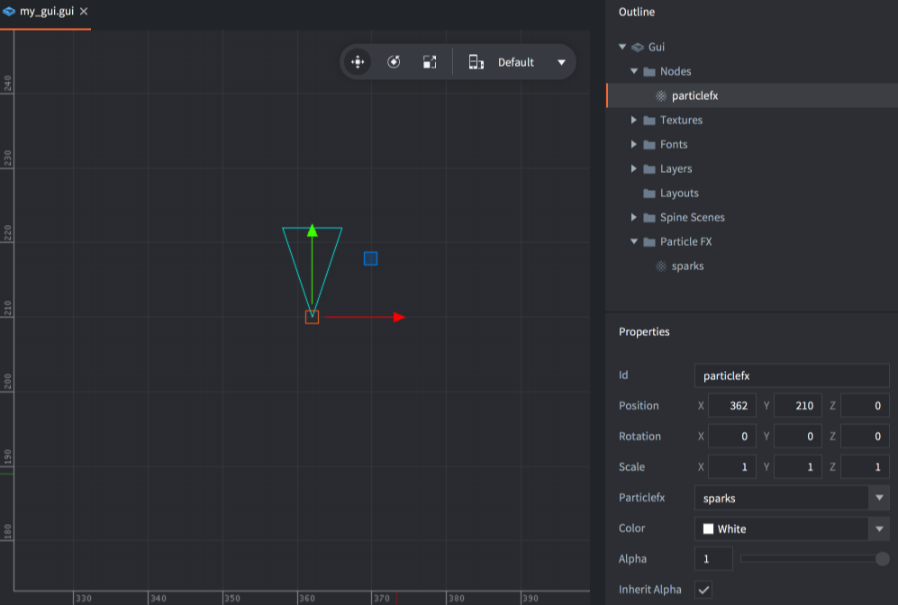

# GUI-нода Particle FX

Нода Particle FX используется для воспроизведения систем эффектов частиц в пространстве экрана GUI.

## Добавление ноды Particle FX

Добавьте ноду Particle FX <kbd>кликнув ПКМ</kbd> в *Outline* и выбрав <kbd>Add ▸ ParticleFX</kbd>, или нажав <kbd>A</kbd> и выбрав <kbd>ParticleFX</kbd>.

Можно использовать эффекты частиц, добавленные в GUI, в качестве источника для эффекта. Добавьте эффекты частиц <kbd>кликнув ПКМ</kbd> на папке *Particle FX* в *Outline* и выберите <kbd>Add ▸ Particle FX...</kbd>. Затем задайте свойство *Particlefx* для ноды:



## Управление эффектом

Можно запускать и останавливать эффект, управляя нодой из скрипта:

```lua
-- запустить эффект частиц
local particles_node = gui.get_node("particlefx")
gui.play_particlefx(particles_node)
```

```lua
-- остановить эффект частиц
local particles_node = gui.get_node("particlefx")
gui.stop_particlefx(particles_node)
```

За подробностями о работе эффектов частиц обращайтесь к [руководству по Particle FX](/manuals/particlefx).
