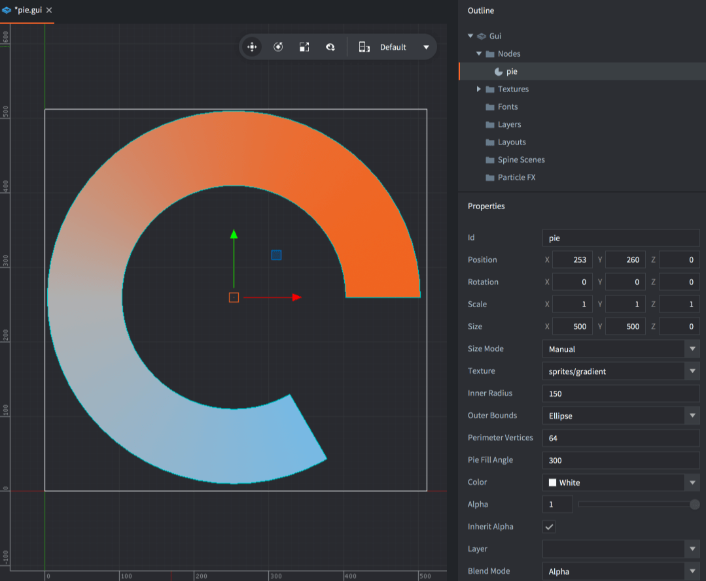
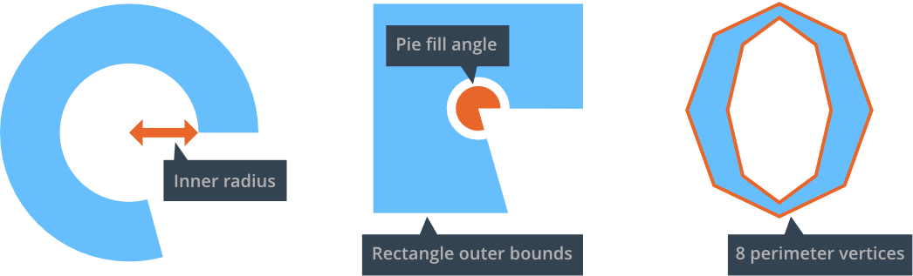

# GUI-нода Pie

Pie nodes are used to create circular or ellipsoid objects ranging from plain circles to pies and square donut shapes.

## Создание ноды Pie

<kbd>Кликните ПКМ</kbd> на папке *Nodes* в *Outline* и выберите <kbd>Add ▸ Pie</kbd>. Новая нода Pie будет выделена, и теперь можно изменять ее свойства.



Следующие свойства уникальны для ноды Pie:

Inner Radius
: Внутренний радиус ноды, выраженный вдоль оси X.

Outer Bounds
: Форма внешних границ ноды.

  - `Ellipse` --- расширит ноду до внешнего радиуса.
  - `Rectangle` --- расширит ноду до ограничивающей рамки ноды.

Perimeter Vertices
: Количество сегментов, которые будут использоваться для построения формы, выраженное как количество вершин, необходимых для полного обхода периметра ноды на 360 градусов.

Pie Fill Angle
: Доля заполнения. Выражается как угол против часовой стрелки, начиная справа.



Если для ноды задана текстура, изображение текстуры накладывается плоско, при этом углы текстуры коррелируются с углами ограничивающей рамки ноды.

## Воздействие на ноду Pie в рантайме

реагирует на любые общие функции манипуляции нодами по настройке размера, пивота, цвета и так далее. Существует несколько функций, предназначенных только для ноды Pie:

```lua
local pienode = gui.get_node("my_pie_node")

-- получить внешние границы
local fill_angle = gui.get_fill_angle(pienode)

-- увеличить количество периметральных вершин
local vertices = gui.get_perimeter_vertices(pienode)
gui.set_perimeter_vertices(pienode, vertices + 1)

-- изменить внешние границы
gui.set_outer_bounds(pienode, gui.PIEBOUNDS_RECTANGLE)

-- анимировать внутренний радиус
gui.animate(pienode, "inner_radius", 100, gui.EASING_INOUTSINE, 2, 0, nil, gui.PLAYBACK_LOOP_PINGPONG)
```
