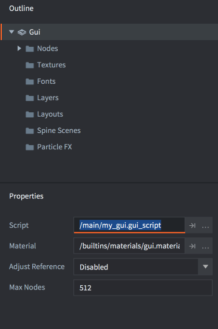

# GUI scripts

To control the logic of your GUI and animate nodes you use Lua scripts. GUI scripts work the same as regular game object scripts, but are saved as a different file type and have access to a different set of functions: the `gui` module functions.

## Adding a script to a GUI

To add a script to a GUI, first create a GUI script file by <kbd>right clicking</kbd> a location in the *Assets* browser and selecting <kbd>New ▸ Gui Script</kbd> from the popup context menu.

The editor automatically opens the new script file. It is based on a template and comes equipped with empty lifetime functions, just like game object scripts:

```lua
function init(self)
   -- Add initialization code here
   -- Remove this function if not needed
end

function final(self)
   -- Add finalization code here
   -- Remove this function if not needed
end

function update(self, dt)
   -- Add update code here
   -- Remove this function if not needed
end

function on_message(self, message_id, message, sender)
   -- Add message-handling code here
   -- Remove this function if not needed
end

function on_input(self, action_id, action)
   -- Add input-handling code here
   -- Remove this function if not needed
end

function on_reload(self)
   -- Add input-handling code here
   -- Remove this function if not needed
end
```

To attach the script to a GUI component, open the GUI component blueprint file and select the root in the *Outline* to bring up GUI *Properties*. Set the *Script* property to the script file

{srcset="images/gui-script/set_script@2x.png 2x"}

If the GUI component has been added to a game object somewhere in your game, the script will now run.

## The "gui" namespace

GUI scripts have access to the `gui` name space and [all the gui functions](/ref/gui). The `go` namespace is not available so you will need to separate game object logic into script components and communicate between the GUI and game object scripts. Any attempt to use the `go` functions will cause an error:

```lua
function init(self)
   local id = go.get_id()
end
```

```txt
ERROR:SCRIPT: /main/my_gui.gui_script:2: You can only access go.* functions and values from a script instance (.script file)
stack traceback:
   [C]: in function 'get_id'
   /main/my_gui.gui_script:2: in function </main/my_gui.gui_script:1>
```

## Message passing

Any GUI component with a script attached is able to communicate with other objects in your game runtime environment through message passing, it will behave like any other script component.

You address the GUI component like you would any other script component:

```lua
local stats = { score = 4711, stars = 3, health = 6 }
msg.post("hud#gui", "set_stats", stats)
```

{srcset="images/gui-script/message_passing@2x.png 2x"}

## Addressing nodes

GUI nodes can be manipulated by a GUI script attached to the component. Each node must have a unique *Id* that is set in the editor:

{srcset="images/gui-script/node_id@2x.png 2x"}

The *Id* allows a script to get hold of a reference to the node and manipulate it with the [gui namespace functions](/ref/gui):

```lua
-- extend the health bar by 10 units
local healthbar_node = gui.get_node("healthbar")
local size = gui.get_size(healthbar_node)
size.x = size.x + 10
gui.set_size(healthbar_node, size)
```

## Dynamically created nodes

To create a new node with script in runtime you have two options. The first option is to create nodes from scratch by calling the `gui.new_[type]_node()` functions. Those return a reference to the new node that you can use to manipulate the node:

```lua
-- Create a new box node
local new_position = vmath.vector3(400, 300, 0)
local new_size = vmath.vector3(450, 400, 0)
local new_boxnode = gui.new_box_node(new_position, new_size)
gui.set_color(new_boxnode, vmath.vector4(0.2, 0.26, 0.32, 1))

-- Create a new text node
local new_textnode = gui.new_text_node(new_position, "Hello!")
gui.set_font(new_textnode, "sourcesans")
gui.set_color(new_textnode, vmath.vector4(0.69, 0.6, 0.8, 1.0))
```

{srcset="images/gui-script/dynamic_nodes@2x.png 2x"}

The alternative way to create new nodes is to clone an existing node with the `gui.clone()` function or a tree of nodes with the `gui.clone_tree()` function:

```lua
-- clone the healthbar
local healthbar_node = gui.get_node("healthbar")
local healthbar_node_2 = gui.clone(healthbar_node)

-- clone button node-tree
local button = gui.get_node("my_button")
local new_button_nodes = gui.clone_tree(button)

-- get the new tree root
local new_root = new_button_nodes["my_button"]

-- move the root (and children) 300 to the right
local root_position = gui.get_position(new_root)
root_position.x = root_position.x + 300
gui.set_position(new_root, root_position)
```

## Dynamic node Ids

Dynamically created nodes do not have an id assigned to them. This is by design. The references that are returned from `gui.new_[type]_node()`, `gui.clone()` and `gui.clone_tree()` are the only thing necessary to be able to access the nodes and you should keep track of that reference.

```lua
-- Add a text node
local new_textnode = gui.new_text_node(vmath.vector3(100, 100, 0), "Hello!")
-- "new_textnode" contains the reference to the node.
-- The node has no id, and that is fine. There's no reason why we want
-- to do gui.get_node() when we already have the reference.
```
