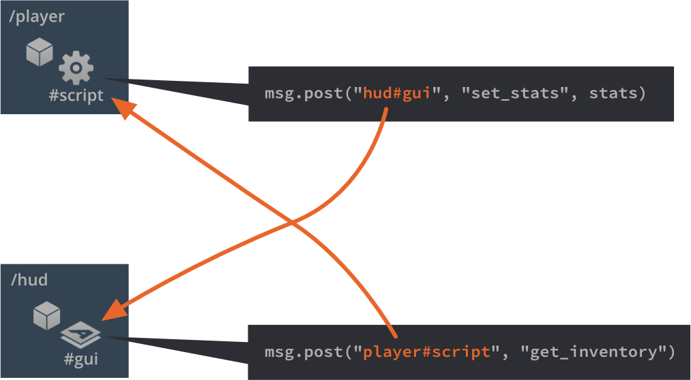
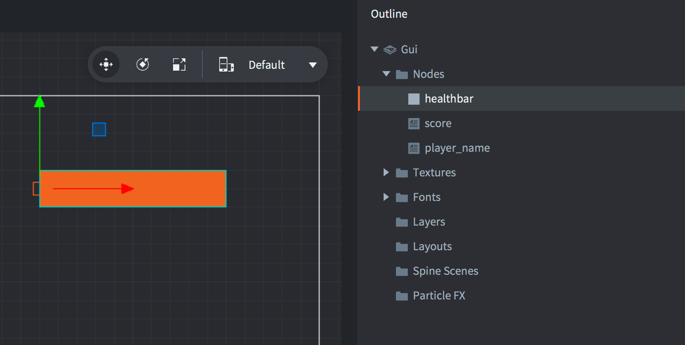

# GUI-скриптинг

Для управления логикой GUI и анимацией нод используются Lua-скрипты. GUI-скрипты работают так же, как и обычные скрипты игровых объектов, но сохраняются как файл другого типа и имеют доступ к другому набору функций: функциям модуля `gui`.

## Добавление скрипта в GUI

Чтобы добавить скрипт в GUI, сперва создайте файл GUI-скрипта, <kbd>кликнув ПКМ</kbd> в каком-либо расположении в браузере *Assets* и выбрав <kbd>New ▸ Gui Script</kbd> и выпадающего контекстного меню.

Редактор автоматически открывает новый файл скрипта. Он основан на шаблоне и оснащен пустыми функциями времени жизни, как и скрипты игровых объектов:

```lua
function init(self)
   -- Добавьте здесь код инициализации
   -- Удалите эту функцию, если она не нужна
end

function final(self)
   -- Добавьте здесь код инициализации
   -- Удалите эту функцию, если она не нужна
end

function update(self, dt)
   -- Добавьте здесь код обновления
   -- Удалите эту функцию, если она не нужна
end

function on_message(self, message_id, message, sender)
   -- Добавьте сюда код обработки сообщений
   -- Удалите эту функцию, если она не нужна
end

function on_input(self, action_id, action)
   -- Добавьте сюда код обработки ввода
   -- Удалите эту функцию, если она не нужна
end

function on_reload(self)
   -- Добавьте сюда код обработки ввода
   -- Удалите эту функцию, если она не нужна
end
```

Чтобы прикрепить скрипт к компоненту GUI, откройте файл компонента GUI и выделите его корень в *Outline*, чтобы вызвать *свойства* GUI. Задайте свойству *Script* требуемый файл скрипта.


Если компонент GUI был добавлен к игровому объекту где-либо в игре, скрипт будет запущен.

## Пространство имен в "gui"

GUI-скрипты имеют доступ к пространству имен `gui` и [всем gui-функциям](/ref/gui). Пространство имен `go` недоступно, поэтому необходимо отделить логику игрового объекта в компоненты Script и осуществлять связь между GUI и скриптами игрового объекта. Любая попытка использовать функции `go` приведет к ошибке:

```lua
function init(self)
   local id = go.get_id()
end
```

```txt
ERROR:SCRIPT: /main/my_gui.gui_script:2: You can only access go.* functions and values from a script instance (.script file)
stack traceback:
   [C]: in function 'get_id'
   /main/my_gui.gui_script:2: in function </main/my_gui.gui_script:1>
```

## Передача сообщений

Любой компонент GUI с подключенным скриптом может взаимодействовать с другими объектами в рантайме игры посредством передачи сообщений, он будет вести себя как любой другой скриптовый компонент.

Обращение к компоненту GUI происходит так же, как и к любому другому компоненту скрипта:

```lua
local stats = { score = 4711, stars = 3, health = 6 }
msg.post("hud#gui", "set_stats", stats)
```



## Обращение к нодам

GUI-нодами можно манипулировать с помощью GUI-скрипта, прикрепленного к компоненту. Каждая нода должна иметь уникальный *Id*, который задается в редакторе:



*Id* позволяет скрипту получить ссылку на ноду и манипулировать ею с помощью функций [пространства имен gui](/ref/gui):

```lua
-- расширить полосу здоровья на 10 единиц
local healthbar_node = gui.get_node("healthbar")
local size = gui.get_size(healthbar_node)
size.x = size.x + 10
gui.set_size(healthbar_node, size)
```

## Динамически создаваемые ноды

Чтобы создать новую ноду со скриптом в рантайме, есть два варианта. Первый вариант --- создавать ноды с нуля, вызвав функции `gui.new_[type]_node()`. Они вернут ссылку на новую ноду, которую можно использовать для манипуляций с нодой:

```lua
-- Создать новую ноду Box
local new_position = vmath.vector3(400, 300, 0)
local new_size = vmath.vector3(450, 400, 0)
local new_boxnode = gui.new_box_node(new_position, new_size)
gui.set_color(new_boxnode, vmath.vector4(0.2, 0.26, 0.32, 1))

-- Создать новую ноду Text
local new_textnode = gui.new_text_node(new_position, "Hello!")
gui.set_font(new_textnode, "sourcesans")
gui.set_color(new_textnode, vmath.vector4(0.69, 0.6, 0.8, 1.0))
```


Альтернативным способом создания новых нод является клонирование существующей ноды с помощью функции `gui.clone()` или дерева нод с помощью функции `gui.clone_tree()`:

```lua
-- клонировать полосу здоровья
local healthbar_node = gui.get_node("healthbar")
local healthbar_node_2 = gui.clone(healthbar_node)

-- кнопка клонирования дерева нод
local button = gui.get_node("my_button")
local new_button_nodes = gui.clone_tree(button)

-- получить новый корень дерева
local new_root = new_button_nodes["my_button"]

-- переместить корень (и дочерние элементы) на 300 вправо
local root_position = gui.get_position(new_root)
root_position.x = root_position.x + 300
gui.set_position(new_root, root_position)
```

## Id динамических узлов

Динамически созданные ноды не имеют присвоенного им идентификатора. Это сделано специально. Ссылки, возвращаемые из `gui.new_[type]_node()`, `gui.clone()` и `gui.clone_tree()` --- это единственное, что необходимо для доступа к нодам, поэтому необходимо отслеживать эти ссылки.

```lua
-- Добавить ноду Text
local new_textnode = gui.new_text_node(vmath.vector3(100, 100, 0), "Hello!")
-- "new_textnode" содержит ссылку на ноду.
-- Нода не имеет идентификатора, и это нормально.
-- Нет причин выполнять gui.get_node(), когда у нас уже есть ссылка.
```
